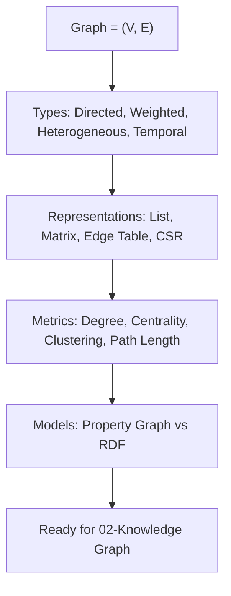

# 🧱 01. Foundations — The Groundwork of Graph Engineering

> ## 📑 Table of Contents
>
> - [Opening Story](#opening-story)
> - [Why Foundations Matter?](#why-foundations-matter)
> - [Overview](#overview)
> - [Contents](#contents)
> - [1. What Is a Graph? Definitions & Terminology](#1-what-is-a-graph-definitions--terminology)
> - [2. The Kinds of Graphs](#2-the-kinds-of-graphs)
> - [3. Graph Representations](#3-graph-representations)
> - [4. Metrics & Graph Characteristics](#4-metrics--graph-characteristics)
> - [5. Property Graph vs RDF Triple Store](#5-property-graph-vs-rdf-triple-store)
> - [6. Hands-On Labs](#6-hands-on-labs)
> - [References](#references)

---

### Opening Story

In 1736, Euler solved the **Seven Bridges of Königsberg** problem: can you cross every bridge exactly once and return to where you started? He drew the land areas as **nodes** and the bridges as **edges** — and **Graph Theory** was born.

Three hundred years later, that same abstraction describes:
- Social networks (person —[follows]→ person)
- Codebases (function —[calls]→ function)
- Enterprise knowledge (contract —[approved_by]→ person —[reports_to]→ manager)

**A graph is not a new data structure. It is a way of seeing the world as a network of relationships.**

### Why Foundations Matter?

> *"If you don't understand graph types and representations, you'll pick the wrong DB, write wrong queries, and measure with the wrong metrics."*

#### 3 Pieces of Evidence

| # | Source | Finding |
|---|-------|-----------|
| 1 | **Stanford CS224W** | Picking the wrong representation (adjacency matrix vs list) is **100× slower** on sparse graphs |
| 2 | **Neo4j Benchmark (2024)** | Property graphs are **3–5× faster** than RDF triple stores for 2–3 hop traversal queries |
| 3 | **Microsoft GraphRAG** | Understanding community structure (modularity) helps pick the right Leiden resolution → 15% better answer quality |

---

## Overview

This module provides the **theoretical and hands-on groundwork** that every subsequent module builds on:



---

## Contents

| # | Topic | Description |
|---|--------|-------|
| 1 | [What Is a Graph?](#1-what-is-a-graph-definitions--terminology) | Definitions, terminology, visual examples |
| 2 | [The Kinds of Graphs](#2-the-kinds-of-graphs) | Directed, weighted, heterogeneous, temporal, hypergraph |
| 3 | [Representations](#3-graph-representations) | Adjacency list/matrix, edge list, CSR, comparisons |
| 4 | [Metrics](#4-metrics--graph-characteristics) | Degree, centrality, clustering, path, modularity |
| 5 | [Property Graph vs RDF](#5-property-graph-vs-rdf-triple-store) | Comparing models, when to use which |
| 6 | [Labs](#6-hands-on-labs) | Hands-on with NetworkX |

---

## 1. What Is a Graph? Definitions & Terminology

### 1.1 The Mathematical Definition

```
G = (V, E)

V = the set of vertices (Vertices / Nodes) — entities
E = the set of edges (Edges / Relations) — relationships

Example:
V = {Alice, Bob, Project Phoenix, Contract C-2024}
E = { (Alice, APPROVES, Contract C-2024),
      (Bob, REPORTS_TO, Alice),
      (Contract C-2024, BELONGS_TO, Project Phoenix) }
```

**A triple (Subject, Predicate, Object)** is exactly a directed edge:

```
(S) Alice  —[REPORTS_TO]→ (O) Bob
 ▲           ▲                ▲
 │           │                │
Subject   Predicate         Object
```

### 1.2 Core Terminology

> **📌 Explanation:** A graph is a data structure made of **nodes** (points) and **edges** (connections). Every real-world relationship can be represented as a graph.

| Term | Meaning | Concrete example |
|-----------|---------|-----------------|
| **Node / Vertex** | An entity — anything you want to describe | A person (Alice), a project (Phoenix), a document (Contract C-2024) |
| **Edge / Relation** | A relationship between two nodes — **directed** or **undirected** | Alice **→ MANAGES →** Bob (directed: Alice manages Bob, not the other way around) |
| **Label** | A classification "label" — like a data type in programming | `Person` (a node type), `MANAGES` (an edge type) |
| **Property** | Attached attributes (key-value) on a node or edge | `Person{name: "Alice", role: "CTO", age: 35}` |
| **Degree** | How many edges connect to a node — higher degree = more connections | Alice has 3 edges → degree = 3 |
| **Path** | A chain of nodes connected consecutively by edges — like a "route" from A to B | `Alice → Bob → Carol` is a path of length 2 (2 hops) |
| **Neighbor** | Directly adjacent (1-hop) nodes — the "neighbors" | Alice's neighbors = {Bob, Contract} |
| **Subgraph** | A part of a graph — take one node and everything around it | The 1-hop subgraph of Phoenix = Phoenix + all directly connected nodes |
| **Community** | A group of nodes that are tightly interconnected, loosely connected to the outside | The AI team in an org chart — they work together and report to the same place |

### 1.3 A Visual Example

```
     ┌──────────┐
     │  Alice   │ (Person)
     │ CTO      │
     └────┬─────┘
          │ MANAGES
          ▼
     ┌──────────┐     APPROVES     ┌──────────────┐
     │  Bob     │─────────────────►│ Contract     │
     │ Engineer │                  │ C-2024       │
     └────┬─────┘                  └──────┬───────┘
          │ BELONGS_TO                    │ BELONGS_TO
          ▼                               ▼
     ┌──────────┐                  ┌──────────────┐
     │ Project  │                  │ Project      │
     │ Phoenix  │◄─────────────────│ Phoenix      │
     └──────────┘                  └──────────────┘
```

---

## 2. The Kinds of Graphs

### 2.1 A Detailed Classification

> **📌 Quick understanding:** "Graph type" = the answer to the question *"What characteristics do your relationships have?"* Are they directed? Weighted? Are there many kinds of entities? Every time you pick the wrong type, you'll write code that's wrong or run the wrong queries.

```
┌─────────────────┬─────────────────────────────────────────┬──────────────────┐
│ Type            | Characteristics                         | Example          │
├─────────────────┼─────────────────────────────────────────┼──────────────────┤
│ Directed        | Edges have direction (A→B ≠ B→A)        | REPORTS_TO       │
│ Undirected      | Edges have no direction (A—B = B—A)     | COLLABORATES_WITH│
│ Weighted        | Edges carry a weight (confidence, strength)│ KNOWS {weight:0.9}│
│ Heterogeneous   | Many different node/edge types          | Person, Project  │
│ Homogeneous     | A single node/edge type                 | Social network   │
│ Bipartite       | 2 sets of nodes, only cross-connections | User—Item        │
│ Temporal        | Edges have time (valid_from/until)      | WORKS_AT (2020→) │
│ Hypergraph      | An edge connects more than 2 nodes      | Meeting {3 people}│
│ Knowledge Graph | Directed + Heterogeneous + Labeled      | Enterprise KG    │
└─────────────────┴─────────────────────────────────────────┴──────────────────┘
```

#### Each type explained — the simplest way to get it:

| Type | "In plain language" | When do you run into it? | Concrete example |
|------|----------------------|-------------------|--------------|
| **Directed** | The relationship only goes **one way**, like a one-way street | Org charts, access control | "Alice `REPORTS_TO` Bob" — Bob does *not* report to Alice |
| **Undirected** | The relationship is **identical in both directions**, like a friendship | Social networks, collaboration | "Alice `COLLABORATES` Bob" — the same property from both sides |
| **Weighted** | The edge carries a **"strength"** to the relationship, like a friendship level | Recommendation systems, scoring | `KNOWS {weight: 0.92}` — knows each other well, vs `weight: 0.3` — barely acquainted |
| **Heterogeneous** | The graph contains **many different kinds of entities**, like an organization with People, Projects, Documents | Most Knowledge Graphs | Person → Project → Document (different node types) |
| **Homogeneous** | Only **a single kind of entity** | Pure social networks (only people) | Facebook friends: everyone is a Person |
| **Bipartite** | Split into **2 groups that only connect across** groups | Shopping, movies | User—Movie (users connect to movies, movies to users, users don't connect to each other) |
| **Temporal** | Relationships **have an active period**, like a contract with an expiry date | HR, product lifecycles, history | "Alice `WORKS_AT` Company X from 2020→2024" — once expired, it's no longer true |
| **Hypergraph** | One edge connects **more than 2 nodes** at once, like a meeting with many people | Meetings, teamwork | Meeting: {Alice, Bob, Carol} all attend → one edge connecting all three |
| **Knowledge Graph** | The **"knowledge map"** — combines all the above: directed, multiple types, labeled | Enterprise KGs, GraphRAG | `Person -[MANAGES]→ Person -[BELONGS_TO]→ Project` |

#### Why you need to know the type well (if you pick the wrong one)

```
❌ Picking Undirected when it's actually Directed:
   Alice—Bob (undirected) → query "who reports to whom?" ✅ runs
                          but the result is WRONG — the direction of the relationship is lost

✅ Picking Directed correctly:
   Alice→Bob → correctly answers "Alice reports to Bob"; "Bob manages Alice" is WRONG

❌ Ignoring Temporal:
   "Alice manages Team B" (expired 2024) → still answers with the stale information
       
✅ Picking Temporal:
   Add valid_until → only relationships still in effect get answered
```

### 2.2 When to Use Which Type?

> **📌 Bonus Concept: Homophily vs Heterophily**
>
> **Homophily** = nodes of **the same type/with similar properties tend to connect to each other** ("birds of a feather flock together"). Example: friends often share interests, teammates in the same team exchange with each other, websites on the same topic tend to link to each other.
>
> **Heterophily** = the opposite — nodes of **different types connect to each other**. Example: **fraud detection** (a fraudster reaches out to legitimate users), virus transmission networks (healthy people come into contact with sick people), cyber attacks (an attacker seeks out victims).
>
> **Why should you know this?** Because **standard GNNs (GCN/GraphSAGE) assume homophily by default** — being close in the graph means sharing a label. On heterophilic graphs, standard GNNs perform poorly and you need specialized variants (the `link prediction` module, 07). This is one of those decisions few people think about, yet it determines model quality.

```python
# Directed: relationships have direction
# REPORTS_TO: Alice reports to Bob ≠ Bob reports to Alice
G_directed = nx.DiGraph()
G_directed.add_edge("Alice", "Bob", relation="REPORTS_TO")

# Weighted: different levels of confidence
# KNOWS with confidence from extraction
G_weighted = nx.Graph()
G_weighted.add_edge("Alice", "Bob", weight=0.92, source="email_123")

# Temporal: relationships change over time
# Alice WORKS_AT Company X from 2020, moved to Y in 2024
G_temporal_data = {
    "nodes": ["Alice", "CompanyX", "CompanyY"],
    "edges": [
        {"from": "Alice", "to": "CompanyX", "type": "WORKS_AT", "valid": "[2020, 2024)"},
        {"from": "Alice", "to": "CompanyY", "type": "WORKS_AT", "valid": "[2024, now)"},
    ]
}

# Heterogeneous: many types
# Codebase graph: File, Function, Class are different node types
hetero_schema = {
    "node_types": ["File", "Function", "Class", "Test"],
    "edge_types": ["DEFINES", "CALLS", "INHERITS", "TESTED_BY"]
}
```

---

## 3. Graph Representations

> **📌 Quick understanding:** "Graph representation" = **how you store the graph in memory / a file**. The same graph can be stored in many different ways — each has its own "strong points" and "weak points". It's like how you can store the same contact list on paper, in Excel, or in the cloud — same content, but a very different way of looking things up.

**The most concrete example** — the same graph "Alice knows Bob, Bob knows Carol":

```
Actual graph:          Alice ──── Bob ──── Carol

Option 1 — Adjacency List:      like "who is friends with whom"
  Alice → [Bob]
  Bob   → [Alice, Carol]
  Carol → [Bob]

Option 2 — Matrix:             like a "✓/✗ check table"
          Alice  Bob  Carol
  Alice    0     1     0
  Bob      1     0     1
  Carol    0     1     0

Option 3 — Edge List:          like "a list of pairs"
  (Alice, Bob)
  (Bob, Carol)
```

### 3.1 Detailed Comparison

| Representation | Memory | Traversal | Easy to think of as | Best For |
|----------------|------------------|----------------------|-------------|----------|
| **Adjacency List** | O(V + E) — compact | O(degree) — fast | A contact book of "who knows whom" | Sparse graphs (most KGs) |
| **Adjacency Matrix** | O(V²) — heavy on sparse graphs | O(1) lookup — extremely fast | A full ✓/✗ table | Dense graphs, matrix operations |
| **Edge List** | O(E) — lightest | O(E) scan — must scan everything | An invoice listing the relationships | Storage, streaming, ETL |
| **CSR (Compressed)** | O(V + E) — as compact as a list | O(degree) — fast | A maximally optimized contact book | Large-scale, GNN training |
| **Property Table** | O(V + E) — like a DB | O(index) — very fast | A spreadsheet with property columns | Neo4j, Kuzu (DB native) |

#### Each option explained — "when to pick what":

| Storage style | Pros | Cons | Use it when |
|----------|---------|------------|-----------------|
| **Adjacency List** | Compact, easy to code, fast neighbor lookup | To know "is A connected to B?" you have to search the list | Best for **learning, prototyping** — NetworkX is exactly this |
| **Adjacency Matrix** | Checking whether two nodes are connected = look at one cell (O(1)) | A graph of 100K nodes → a matrix of 10 billion cells, too much memory | Only when the graph is **dense** or you need matrix math |
| **Edge List** | Simplest to **write to a file / send over the network** | Finding neighbors requires scanning everything — slow | ETL, exporting parquet/csv, streaming ingest |
| **CSR** | Compact and fast traversal at the same time | Hard to read, hard to modify | Graphs of a million nodes, training GNNs on the GPU |
| **Property Table** | Has indexes, transactions, supports complex queries | You have to run a database server | Production, when you need flexible querying |

### 3.2 Code Walkthrough

<details>
<summary>Python Code — 4 Representations (Click to view)</summary>

```python
import networkx as nx
import numpy as np

# Create a sample graph
edges = [("Alice", "Bob"), ("Bob", "Carol"), ("Alice", "Carol"), ("Carol", "Dave")]
G = nx.Graph()
G.add_edges_from(edges)

# 1. Adjacency List (dict of sets) — the most common
adj_list = {n: list(G.neighbors(n)) for n in G.nodes()}
print("Adjacency List:", adj_list)
# {'Alice': ['Bob', 'Carol'], 'Bob': ['Alice', 'Carol'], ...}

# 2. Adjacency Matrix (V x V)
nodes = sorted(G.nodes())
matrix = nx.adjacency_matrix(G, nodelist=nodes).todense()
print("Adjacency Matrix:\n", matrix)
# [[0 1 1 0]
#  [1 0 1 0]
#  [1 1 0 1]
#  [0 0 1 0]]

# 3. Edge List (simplest, easy to serialize)
edge_list = list(G.edges(data=True))
print("Edge List:", edge_list)
# [('Alice', 'Bob', {}), ('Bob', 'Carol', {}), ...]

# 4. CSR — used for large-scale / GNN
# (scipy sparse matrix)
from scipy.sparse import csr_matrix
csr = csr_matrix(matrix)
print("CSR:", csr.data, csr.indices, csr.indptr)

# 5. Property Graph (Neo4j-style) — nodes/edges carry properties
G_prop = nx.DiGraph()
G_prop.add_node("Alice", label="Person", age=35, role="CTO")
G_prop.add_node("Phoenix", label="Project", budget=500000)
G_prop.add_edge("Alice", "Phoenix", type="MANAGES", since="2024-01-01", confidence=0.95)
print("Properties:", dict(G_prop.nodes(data=True)))
```

</details>

### 3.3 Picking a Representation — A Step-by-Step Decision

```
How many nodes do you have?
├── Unknown yet, requirements unclear   → Adjacency List (NetworkX) — simplest, most flexible
├── <10K nodes, need fast traversal      → Adjacency List (NetworkX)
├── >1M nodes, need to train GNNs        → CSR (PyG / DGL)
├── Need long-term storage + complex queries → Property Table (Neo4j / Kuzu)
├── Dense graph, at least 30% filled     → Adjacency Matrix + GPU
└── Need ETL, export, streaming          → Edge List (parquet / csv)
```

**Golden rule for beginners:** Start with an **Adjacency List** (NetworkX). Only switch to another representation when you've *measured* a problem (too slow, too much memory). Don't optimize early before you know the real problem.

---

## 4. Metrics & Graph Characteristics

> **📌 Quick understanding:** Metrics = **measuring tools** that help you answer the question *"What are the characteristics of this graph?"* A few examples: Which node matters most? Which group is most tightly connected? Is the graph "dense" or "sparse"?

### 4.1 The Important Metrics

> **Start with the 3 basic metrics first:** `Degree` (who has many connections), `Path Length` (how far apart nodes are), `Clustering` (are friends friends with each other). Once you understand these three, learn `Centrality` and `Modularity` (harder).

| Metric | "Plain language" meaning | Example |
|--------|------------------------|----------------|
| **Degree** | How many **relationships** does the node have? | Alice manages 2 people + 1 contract → degree = 3 |
| **In/Out-degree** | (Directed) Degree going **in** vs going **out** | Bob "receives" 1 order (in=1), "issues" 2 orders (out=2) |
| **Centrality (Degree)** | Is this node **important because it has many connections**? | Someone with 50 contacts vs someone with 2 |
| **Centrality (Betweenness)** | The **bridge** — how many shortest paths between others does it sit on? | A middleman: remove him and two teams can't communicate |
| **Centrality (PageRank)** | The node gets **"voted for" by important nodes** → the more votes, the more important | Google: an important webpage → finds the next important page |
| **Clustering Coeff.** | Are this node's friends **friends with each other**? | A group of 5 who often meet → high clustering; scattered acquaintances → low |
| **Path Length** | How far apart are two nodes? | "Alice is 3 relationships away from Customer X" |
| **Diameter** | The **maximum** distance between any two nodes | "At most six degrees of separation" |
| **Modularity** | Are the groups **clearly separated**? | High Q = distinct communities (Team A separate from Team B) |
| **Density** | Is the graph **dense** (many connections) or **sparse**? | A complete social network (dense) vs personal email (sparse) |

### 4.2 Code — Computing Metrics

<details>
<summary>Python Code — Graph Metrics with NetworkX (Click to view)</summary>

```python
import networkx as nx

G = nx.karate_club_graph()  # Sample graph, 34 nodes

# Degree
degrees = dict(G.degree())
print(f"Avg degree: {sum(degrees.values())/len(degrees):.1f}")

# Centrality
betweenness = nx.betweenness_centrality(G)
pagerank = nx.pagerank(G)
print(f"Top betweenness: {sorted(betweenness, key=betweenness.get, reverse=True)[:3]}")
print(f"Top PageRank: {sorted(pagerank, key=pagerank.get, reverse=True)[:3]}")

# Clustering
clustering = nx.average_clustering(G)
print(f"Average clustering: {clustering:.3f}")

# Path
print(f"Diameter: {nx.diameter(G)}")
print(f"Avg shortest path: {nx.average_shortest_path_length(G):.2f}")

# Community (modularity)
import community as community_louvain  # python-louvain
partition = community_louvain.best_partition(G)
modularity = community_louvain.modularity(partition, G)
print(f"Modularity: {modularity:.3f}, Communities: {len(set(partition.values()))}")
```

</details>

### 4.3 When to Use Which Metric?

> **Rule of thumb:** Pick the metric based on **the question you want to answer**, not on "which metric is cool".

| Purpose | Metric | Example question |
|----------|--------|---------------|
| Find the most important person (many connections) | Degree Centrality | "Who is the hub of the internal network?" |
| Find the **bridge** / bottleneck | Betweenness | "Who blocks every approval process → removing this role slows the process?" |
| Find the respected person (voted for by important people) | PageRank | "Who actually has influence even without many interactions?" |
| Find tightly linked groups (for GraphRAG) | Clustering + Modularity | "Split 1000 entities into topics so each group can be summarized?" |
| Measure codebase complexity | Density + avg degree | "Which file has the most dependencies, most likely to break on change?" |
| Set `max_hops` for traversal | Diameter + avg path length | "How many hops do I need to traverse so I don't miss information?" |

---

## 5. Property Graph vs RDF Triple Store

```
┌─────────────────────────┬──────────────────────────────────┬──────────────────────────────────┐
│ Aspect                  │ Property Graph (Neo4j, Kuzu)     │ RDF Triple Store (Jena, Virtuoso)│
├─────────────────────────┼──────────────────────────────────┼──────────────────────────────────┤
│ Unit                    │ Node + Edge with properties      │ Triple (S, P, O) + URI          │
│ Schema                  │ Flexible, label-based            │ Strict, ontology (OWL/RDFS)      │
│ Query language          │ Cypher / GQL                     │ SPARQL                           │
│ Properties on edges     │ Native (edge["weight"]=0.9)      │ Reification (complex)            │
│ Reasoning               │ Manual (code)                    │ Built-in (OWL inference)         │
│ Ecosystem               │ Large, production-ready          │ Academic, semantic web           │
│ Best for                │ Enterprise KGs, GraphRAG, coding │ Linked data, ontology-heavy      │
└─────────────────────────┴──────────────────────────────────┴──────────────────────────────────┘
```

**Recommendation for the AI Coding Skills Framework:** use **Property Graphs** (Neo4j/Kuzu/NetworkX). RDF only when working with linked open data or when OWL reasoning is required.

Property Graph example (Cypher):

```cypher
// Create nodes + edges with properties
CREATE (a:Person {name: 'Alice', role: 'CTO'})
CREATE (b:Person {name: 'Bob', role: 'Engineer'})
CREATE (p:Project {name: 'Phoenix', budget: 500000})
CREATE (a)-[:MANAGES {since: '2024-01-01'}]->(b)
CREATE (b)-[:WORKS_ON {role: 'Lead'}]->(p)

// Query: who manages project Phoenix?
MATCH (person:Person)-[:MANAGES*1..2]->(proj:Project {name: 'Phoenix'})
RETURN person.name
```

RDF example (SPARQL):

```sparql
# Create triples
# <Alice> <manages> <Bob> .
# <Bob> <worksOn> <Phoenix> .
# Query
SELECT ?person WHERE {
  ?person <manages> ?someone .
  ?someone <worksOn> <Phoenix> .
}
```

---

## 6. Hands-On Labs

### Lab 1: Build Your First Graph with NetworkX

```python
import networkx as nx
import matplotlib.pyplot as plt

G = nx.DiGraph()
G.add_node("Alice", type="Person", role="CTO")
G.add_node("Bob", type="Person", role="Engineer")
G.add_node("Phoenix", type="Project", budget=500000)
G.add_edges_from([
    ("Alice", "Bob", {"type": "MANAGES"}),
    ("Bob", "Phoenix", {"type": "WORKS_ON"}),
])

print(f"Nodes: {list(G.nodes(data=True))}")
print(f"Edges: {list(G.edges(data=True))}")
print(f"Is DAG? {nx.is_directed_acyclic_graph(G)}")

# Draw it
nx.draw(G, with_labels=True, node_color="lightblue", arrows=True)
plt.show()
```

### Lab 2: Compare Traversal Performance

```python
import time

# Create a large graph with 10K nodes
G_large = nx.erdos_renyi_graph(10000, 0.001)

start = time.time()
path = nx.shortest_path(G_large, source=0, target=100)
print(f"Shortest path length: {len(path)}, time: {(time.time()-start)*1000:.1f}ms")

start = time.time()
centrality = nx.degree_centrality(G_large)
print(f"Degree centrality time: {(time.time()-start)*1000:.1f}ms")
```

### Lab 3: Build a Mini Codebase Graph

```python
# A graph of a codebase: File → Function → Calls
G_code = nx.DiGraph()
G_code.add_node("main.py", type="File")
G_code.add_node("handlePayment", type="Function", file="main.py")
G_code.add_node("validateCard", type="Function", file="utils.py")
G_code.add_edges_from([
    ("main.py", "handlePayment", {"type": "DEFINES"}),
    ("handlePayment", "validateCard", {"type": "CALLS"}),
])

# Query: which function calls validateCard?
callers = list(G_code.predecessors("validateCard"))
print(f"Callers of validateCard: {callers}")
```

---

## References

- Stanford CS224W — *Machine Learning with Graphs* (Lecture 1: Graph Theory Basics)
- Neo4j GraphAcademy — *Graph Data Modeling Fundamentals*
- NetworkX Documentation — *Algorithms & Metrics* (https://networkx.org)
- *Graph Theory* — Diestel (textbook, free online)

---

*Next: [02 — Knowledge Graph Construction](../02-knowledge-graph/)*
