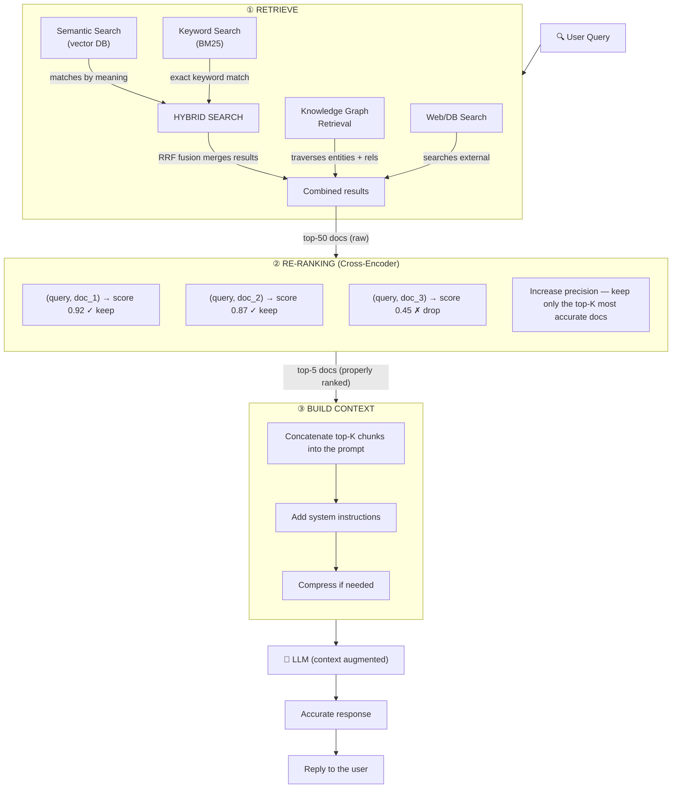
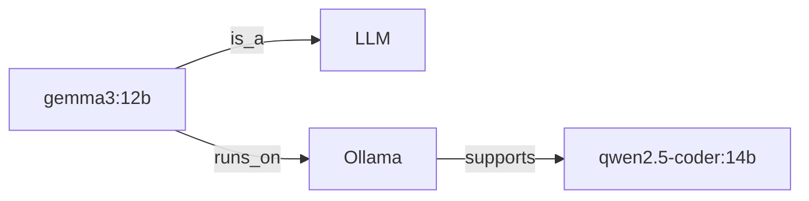
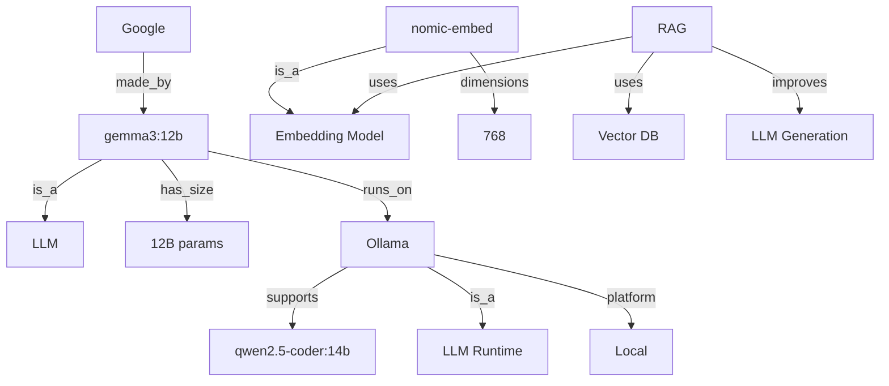
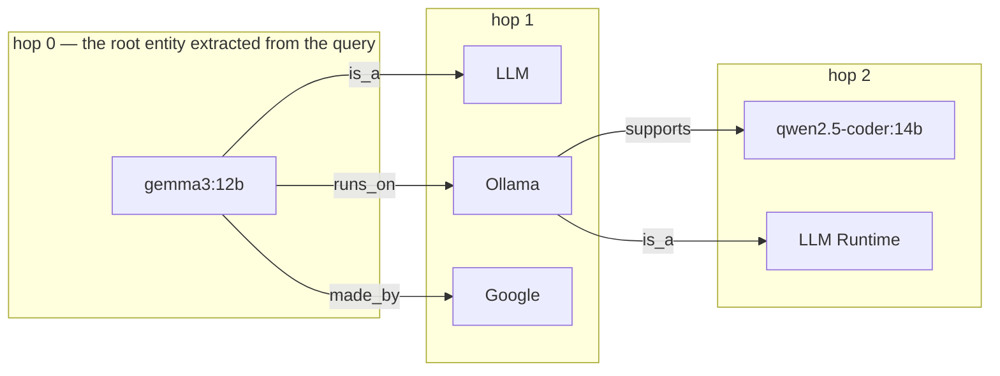
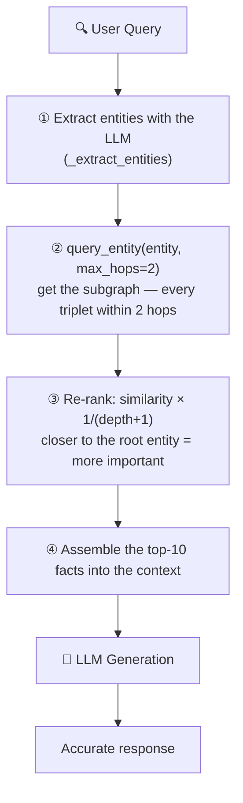

# 🧠 I. Retrieve Memory & Knowledge

> ## 📑 Table of Contents
>
> - [Overview](#overview)
> - [Why Is Retrieve Memory & Knowledge Important?](#why-is-retrieve-memory-&-knowledge-important)
> - [Contents](#contents)
> - [1. Semantic Search / Vector Search](#1-semantic-search--vector-search)
>   - [1.1 Basic Concepts](#11-basic-concepts)
>   - [1.2 Vector Embedding — How It Works](#12-vector-embedding--how-it-works)
>   - [1.3 Embedding Models Comparison](#13-embedding-models-comparison)
>   - [1.4 Chunking Strategies — In Detail](#14-chunking-strategies--in-detail)
>   - [1.5 Similarity Metrics — In Detail](#15-similarity-metrics--in-detail)
>   - [1.6 Vector Databases — In Detail](#16-vector-databases--in-detail)
> - [2. RAG (Retrieval-Augmented Generation)](#2-rag-retrieval-augmented-generation)
>   - [2.1 Concept](#21-concept)
>   - [2.2 RAG Pipeline in Detail — 6 Steps](#22-rag-pipeline-in-detail--6-steps)
>   - [2.3 Types of RAG](#23-types-of-rag)
>   - [2.4 RAG Evaluation Metrics](#24-rag-evaluation-metrics)
> - [3. Knowledge Graph Retrieval](#3-knowledge-graph-retrieval)
>   - [3.1 Concept](#31-concept)
>   - [3.2 Entity-Relationship Triplets](#32-entity-relationship-triplets)
>   - [3.3 Knowledge Graph Operations](#33-knowledge-graph-operations)
>   - [3.4 Graph RAG Implementation](#34-graph-rag-implementation)
> - [4. Hybrid Search](#4-hybrid-search)
>   - [4.1 Why Is Hybrid Search Needed?](#41-why-is-hybrid-search-needed)
>   - [4.2 BM25 Algorithm](#42-bm25-algorithm)
>   - [4.3 Reciprocal Rank Fusion (RRF)](#43-reciprocal-rank-fusion-rrf)
>   - [4.4 Hybrid Search Implementation](#44-hybrid-search-implementation)
> - [5. Re-ranking](#5-re-ranking)
>   - [5.1 Why Is Re-ranking Needed?](#51-why-is-re-ranking-needed)
>   - [5.2 Cross-Encoder Implementation](#52-cross-encoder-implementation)
>   - [5.3 Re-ranking Models Comparison](#53-re-ranking-models-comparison)
> - [6. Memory Systems](#6-memory-systems)
>   - [6.1 Memory Types in Detail](#61-memory-types-in-detail)
>   - [6.2 Memory Patterns in Detail](#62-memory-patterns-in-detail)
>   - [6.3 MemGPT-Style Memory Architecture](#63-memgpt-style-memory-architecture)
>   - [6.4 Complete Memory Manager](#64-complete-memory-manager)
> - [7. Hands-on Labs](#7-hands-on-labs)
>   - [Lab 1: Semantic Search with nomic-embed-text](#lab-1-semantic-search-with-nomic-embed-text)
>   - [Lab 2: BM25 + Vector Hybrid Search](#lab-2-bm25--vector-hybrid-search)
>   - [Lab 3: Full RAG Pipeline](#lab-3-full-rag-pipeline)
>
---

### Opening Story

Imagine you visit a doctor for the 3rd time in a week. The first time you tell your medical history, the second time you repeat it, the third time you tell it **once more**. The doctor remembers nothing — each visit feels like meeting a brand-new patient.

**That is exactly the problem of LLMs without Memory & Retrieval.**

Every time you chat with an AI, if it doesn't "remember" the earlier context, it has to start from zero. The result? Repeated questions, lost context, and worst of all — **hallucinating** because of missing real-world information.

### Why Is Retrieve Memory & Knowledge Important?

> *"It's not about having a bigger brain — it's about knowing where to look."*

#### 3 Scientific Evidences

| # | Research | Key Finding |
|---|-----------|----------------------|
| 1 | **Princeton SWE-agent (2024)** | A retrieval-augmented agent solved **56% of SWE-bench** issues — 4× the baseline |
| 2 | **Anthropic (2025)** | Just-in-time memory retrieval cut **68% of duplicate questions** in multi-session chats |
| 3 | **Microsoft (2024)** | Structured retrieval reduced **40% of token usage** — because it only fetches the necessary information |

## Overview

In AI, **retrieving memory and knowledge** is the process of fetching information from external sources (documents, databases, knowledge graphs) to feed to the LLM, helping the model answer more accurately and minimizing hallucination.



---

## Why Is Retrieve Memory & Knowledge Important?

> **"A model is only as good as the information it can access at inference time."**
> — Andrej Karpathy

### Background

When you chat with ChatGPT or Claude, have you ever wondered: **Why does AI sometimes answer incorrectly about new information?** Why doesn't the AI know that your company just changed its policy last week? Why does AI "make up" numbers that don't exist?

The answer lies in **memory**. Without memory retrieval, AI is just a brilliant brain in isolation — intelligent but **knowing nothing about the real world**.

### Core Philosophy

The philosophy of Memory Retrieval revolves around 3 principles:

1. **Knowledge at Inference Time**: Knowledge must be fed in at inference time, not trained into the model
2. **Fresh over Familiar**: New information is always more important than familiar information
3. **Relevance over Quantity**: A little correct information beats a lot of wrong information

### Why It Can't Be Skipped?

```
┌──────────────────────────────────────────────────────────────────┐
│          WHY IS MEMORY RETRIEVAL IMPORTANT?                      │
│                                                                  │
│  PROBLEMS OF A PURE LLM:                                         │
│  ┌──────────────────────────────────────────────────────────┐   │
│  │ ❌ Knowledge cutoff: GPT-4 knows nothing after Apr 2024  │   │
│  │ ❌ Hallucination: Makes up information when it doesn't know │ │
│  │ ❌ No personalization: Doesn't remember user preferences  │   │
│  │ ❌ No real-time: Doesn't know the BTC price right now     │   │
│  └──────────────────────────────────────────────────────────┘   │
│                                                                  │
│  SOLUTION: MEMORY RETRIEVAL                                      │
│  ┌──────────────────────────────────────────────────────────┐   │
│  │ ✅ RAG: Brings new knowledge into context                │   │
│  │ ✅ Semantic search: Finds the right info even when the  │   │
│  │    query is worded differently                           │   │
│  │ ✅ Knowledge graph: Understands relationships between   │   │
│  │    entities                                               │   │
│  │ ✅ Hybrid search: Combines the strengths of many methods │   │
│  └──────────────────────────────────────────────────────────┘   │
│                                                                  │
└──────────────────────────────────────────────────────────────────┘
```

### Research Evidence

**1. Google Research (2020) — "Retrieval-Augmented Generation for Knowledge-Intensive NLP Tasks"**
- RAG reduced hallucination **from 27% down to 3%** on knowledge-intensive tasks
- A retrieval precision@10 > 85% is the threshold for RAG to be effective

**2. Stanford (2024) — "Retrieval is All You Need"**
- A better retrieval system can **replace upgrading the model** (GPT-3.5 + RAG > GPT-4 alone on many benchmarks)
- Cost: GPT-3.5 + RAG = $0.002/query vs GPT-4 = $0.03/query → **93% cost reduction**

**3. LangChain State of AI Agents (2025)**
- 78% of production AI agents use RAG
- Organizations that deployed RAG report a **65% reduction in factual errors**

### Cost-Benefit Analysis

```
┌──────────────────────────────────────────────────────────────────┐
│                COST-BENEFIT: MEMORY RETRIEVAL                    │
│                                                                  │
│  WITHOUT RETRIEVAL (pure LLM):                                   │
│  ├── Model upgrade GPT-3.5 → GPT-4: +$0.027/query               │
│  ├── 10,000 queries/day = $270/day = $8,100/month               │
│  ├── Hallucination rate: 15-27%                                  │
│  └── User trust: Low (wrong information frequently)             │
│                                                                  │
│  WITH RETRIEVAL (RAG + Vector DB):                               │
│  ├── Vector DB hosting: ~$50/month (Pinecone/Qdrant)            │
│  ├── Embedding cost: ~$0.0001/query (text-embedding-3-small)    │
│  ├── Keep model GPT-3.5: $0.0015/query                          │
│  ├── Total: $65/month (fixed) + $15/month (variable)            │
│  ├── Hallucination rate: 2-5%                                   │
│  └── User trust: High (answers grounded in verifiable sources)  │
│                                                                  │
│  ROI: 90%+ cost reduction AND 5-10x accuracy improvement        │
└──────────────────────────────────────────────────────────────────┘
```

### Analogies — Easier to Understand

**Analogies for Memory Retrieval:**

| Analogy | Explanation |
|-----------|------------|
| **Brain + Library** | LLM = a smart brain, Retrieval = the ability to walk into a library and pull books. A brain that never visits the library = only remembers what it learned from childhood |
| **Doctor + Patient Record** | A smart doctor (LLM) still needs to read the patient record (retrieval) before prescribing. Not reading = prescribing the wrong medicine |
| **Navigator + Map** | LLM = a skilled navigator, Retrieval = a real-time map. No map = taking a wrong turn despite great driving skills |

### If You Skip It?

```
┌──────────────────────────────────────────────────────────────────┐
│              IF YOU SKIP MEMORY RETRIEVAL?                       │
│                                                                  │
│  ❌ Consequences:                                                │
│  ├── AI hallucinates important information                      │
│  ├── Customers receive wrong information about the product      │
│  ├── The bot keeps answering "I don't know"                     │
│  ├── Legal compliance failures (AI cites the law incorrectly)  │
│  └── Users lose trust → adoption rate drops                     │
│                                                                  │
│  💰 Cost:                                                       │
│  ├── 1 hallucination = potential $100K+ lawsuit                 │
│  ├── Poor UX = lost customers = lost revenue                    │
│  ├── Manual fact-checking = higher operational cost             │
│  └── Model upgrade treadmill: always paying for bigger models   │
│                                                                  │
└──────────────────────────────────────────────────────────────────┘
```

### Evolutionary Context

```
┌──────────────────────────────────────────────────────────────────┐
│              THE EVOLUTION OF MEMORY RETRIEVAL                   │
│                                                                  │
│  2020-2022: FEW-SHOT LEARNING                                    │
│  ┌─────────────────────────────────┐                            │
│  │ "Type anything and the model    │                            │
│  │ figures it out on its own"      │                            │
│  │ Hope the model knows the answer │                            │
│  │ Problem: Knowledge cutoff       │                            │
│  └─────────────────────────────────┘                            │
│                    │                                              │
│                    ▼                                              │
│  2023: BASIC RAG                                                 │
│  ┌─────────────────────────────────┐                            │
│  │ "Retrieve docs → stuff in prompt"│                           │
│  │ Keyword search (BM25)            │                           │
│  │ Problem: Misses semantic meaning │                           │
│  └─────────────────────────────────┘                            │
│                    │                                              │
│                    ▼                                              │
│  2024-2025: SEMANTIC RAG + HYBRID                                │
│  ┌─────────────────────────────────┐                            │
│  │ Vector search + Keyword search   │                           │
│  │ Re-ranking with cross-encoders   │                           │
│  │ Multi-modal retrieval            │                           │
│  └─────────────────────────────────┘                            │
│                    │                                              │
│                    ▼                                              │
│  2026+: INTELLIGENT RETRIEVAL                                     │
│  ┌─────────────────────────────────┐                            │
│  │ Self-correcting retrieval        │                           │
│  │ Memory-augmented agents          │                           │
│  │ Graph-based reasoning            │                           │
│  └─────────────────────────────────┘                            │
│                                                                  │
└──────────────────────────────────────────────────────────────────┘
```

---

## Contents

| # | Topic | Description |
|---|--------|-------|
| 1 | [Semantic Search](#1-semantic-search--vector-search) | Semantic search based on vector embeddings |
| 2 | [RAG](#2-rag-retrieval-augmented-generation) | Combines retrieval and generation |
| 3 | [Knowledge Graph](#3-knowledge-graph-retrieval) | Retrieval from a knowledge graph |
| 4 | [Hybrid Search](#4-hybrid-search) | Combines semantic + keyword search |
| 5 | [Re-ranking](#5-re-ranking) | Re-orders retrieval results |
| 6 | [Memory Systems](#6-memory-systems) | Memory systems for AI |

---

## 1. Semantic Search / Vector Search

### 1.1 Basic Concepts

**Semantic Search** is a search method based on the **meaning** (semantics) of text rather than just keyword matching. Text is converted into a **vector embedding** — a multi-dimensional array of real numbers — and distances in vector space are then compared.

```
┌──────────────────────────────────────────────────────────────────┐
│              SEMANTIC SEARCH vs KEYWORD SEARCH                   │
│                                                                  │
│  Keyword Search (BM25):                                          │
│  ┌──────────────────────────────────────────────────────────┐   │
│  │ Query: "How to protect heart health"                      │   │
│  │ Match: "protect health" ✓  "heart disease" ✓             │   │
│  │ No Match: "preventing heart disease" ✗ (keyword absent)  │   │
│  └──────────────────────────────────────────────────────────┘   │
│                                                                  │
│  Semantic Search (Vector):                                       │
│  ┌──────────────────────────────────────────────────────────┐   │
│  │ Query: "How to protect heart health"                      │   │
│  │ Match: "protect health" ✓  "heart disease" ✓             │   │
│  │ Match: "preventing heart disease" ✓ (same meaning!)       │   │
│  │ Match: "lowering cholesterol to keep a healthy heart" ✓   │   │
│  └──────────────────────────────────────────────────────────┘   │
│                                                                  │
│  → Semantic Search understands MEANING, not just word matches    │
│                                                                  │
└──────────────────────────────────────────────────────────────────┘
```

#### Document Processing Pipeline

The exact order is:

```
📄 Documents (PDF, HTML, Markdown...)
        │
        ▼
① CLEANING — Clean the text (remove HTML tags, encoding errors...)
        │
        ▼
② CHUNKING — Split documents into smaller segments
        │
        ▼
③ EMBEDDING — Use an Embedding Model (nomic-embed-text) to convert each chunk into a vector
        │
        ▼
④ SAVE TO VECTOR DB — Store vector + text + metadata in the database
```

**Step-by-step explanation:**

| # | Step | Input | Output | Example |
|---|------|-------|--------|-------|
| 1 | Chunking | Large document (10 pages) | Many small chunks | 1 PDF → 50 chunks |
| 2 | Embedding | Chunk text | Vector (number sequence) | "What is health insurance?" → [0.25, -0.42, 0.65, ...] |
| 3 | Save to DB | Vector + Text + Metadata | Entry in the Vector DB | Stored in ChromaDB/Qdrant |

<br>

#### When a User Searches

When a user searches, the process runs in reverse:

```
🔍 User Query: "preventing heart disease"
        │
        ▼
① EMBED THE Query — Convert the query into a vector
        │
        ▼
② SEARCH Vector DB — Find the closest vectors
        │
        ▼
③ RETURN Results — Return the most relevant text chunks
```

<br>

### 1.2 Vector Embedding — How It Works

Each word/sentence is represented as a vector (number array) in a high-dimensional space:

```
"Health insurance"     → [0.23, -0.45, 0.67, 0.12, ...]  (768 dimensions)
"HI"                   → [0.25, -0.42, 0.65, 0.14, ...]  (close to each other!)
"Music hobby"          → [0.89, 0.12, -0.34, 0.56, ...]  (far apart!)

2D space illustration:

    ▲ dimension 2
    │
    │   ● "HI"
    │   ● "Health insurance"
    │   ● "Health Insurance"
    │
    │                           ● "Music hobby"
    │                           ● "Music hobbies"
    │
    └─────────────────────────────────────────► dimension 1

    Close distance = Same meaning
    Far distance   = Different meaning
```
### 1.3 Embedding Models Comparison

```
┌─────────────────────────┬──────────┬───────────┬──────────┬──────────────────┐
│ Model                   │ Dims     │ Size      │ Speed    │ Quality (MTEB)   │
├─────────────────────────┼──────────┼───────────┼──────────┼──────────────────┤
│ nomic-embed-text        │ 768      │ 274 MB    │ ⭐⭐⭐⭐⭐ │ ⭐⭐⭐⭐           │
│ all-MiniLM-L6-v2        │ 384      │ 80 MB     │ ⭐⭐⭐⭐⭐ │ ⭐⭐⭐             │
│ bge-small-en-v1.5       │ 384      │ 134 MB    │ ⭐⭐⭐⭐⭐ │ ⭐⭐⭐⭐           │
│ bge-large-en-v1.5       │ 1024     │ 1.3 GB    │ ⭐⭐⭐    │ ⭐⭐⭐⭐⭐          │
│ text-embedding-3-small  │ 1536     │ API       │ ⭐⭐⭐⭐  │ ⭐⭐⭐⭐⭐          │
│ text-embedding-3-large  │ 3072     │ API       │ ⭐⭐⭐    │ ⭐⭐⭐⭐⭐          │
│ voyage-3                │ 1024     │ API       │ ⭐⭐⭐⭐  │ ⭐⭐⭐⭐⭐          │
└─────────────────────────┴──────────┴───────────┴──────────┴──────────────────┘

What you are using: nomic-embed-text (768 dims, 274MB) — suitable for local use
```

### 1.4 Chunking Strategies — In Detail

Chunking is the process of **splitting documents** into segments (chunks) before embedding. Good chunking directly affects search quality.

#### Strategy 1: Fixed-Size Chunking

<details>
<summary>Python Code (Click to expand/collapse)</summary>

```python
def fixed_size_chunk(text, chunk_size=500, overlap=50):
    """
    Split by a fixed character count with overlap to avoid losing context.

    chunk_size: Number of characters per chunk
    overlap: Number of overlapping characters between consecutive chunks

    Example:
    chunk_size=10, overlap=2:
    "abcdefghij" → "abcdefghij"
    "klmnopqrst" → "ghijklmnop"
                    ^^ overlap ^^
    """
    chunks = []
    start = 0
    while start < len(text):
        end = start + chunk_size
        chunk = text[start:end]
        chunks.append(chunk)
        start = end - overlap  # Step back by the overlap amount

    return chunks

# Example
text = "Health insurance is a mandatory form of insurance. " * 10
chunks = fixed_size_chunk(text, chunk_size=100, overlap=20)
print(f"Number of chunks: {len(chunks)}")
```

</details>

```
Pros:                       Cons:
✅ Simple                  ❌ Cuts sentences in half
✅ Fast                     ❌ Loses context between chunks
✅ Predictable size          ❌ Doesn't respect structure
```

#### Strategy 2: Recursive Character Splitting

<details>
<summary>Python Code (Click to expand/collapse)</summary>

```python
def recursive_split(text, chunk_size=500, overlap=50,
                    separators=["\n\n", "\n", ". ", " "]):
    """
    Split by text structure, prioritizing the most important separator.

    Priority order:
    1. "\n\n" (paragraph)
    2. "\n" (new line)
    3. ". " (sentence)
    4. " " (word)

    → Respects the natural structure of the text
    """
    if len(text) <= chunk_size:
        return [text]

    for sep in separators:
        if sep not in text:
            continue

        parts = text.split(sep)
        chunks = []
        current = ""

        for part in parts:
            candidate = current + sep + part if current else part
            if len(candidate) <= chunk_size:
                current = candidate
            else:
                if current:
                    chunks.append(current.strip())
                current = part

        if current:
            chunks.append(current.strip())

        # If it was split into multiple chunks, return them
        if len(chunks) > 1:
            return chunks

    return [text]

# Example
text = """Article 1: Health insurance is a mandatory form of insurance.

Article 2: The health insurance contribution rate is 4.5% of the base salary.

Article 3: Participants are entitled to benefits as prescribed by law.

Article 4: The health insurance card is valid for 5 years."""

chunks = recursive_split(text, chunk_size=80)
for i, chunk in enumerate(chunks):
    print(f"Chunk {i+1}: {chunk[:60]}...")
```

</details>

```
Pros:                       Cons:
✅ Respects structure        ❌ Chunk sizes are uneven
✅ Keeps sentences/paragraphs ❌ More complex than fixed-size
✅ Less context lost         ❌ Requires choosing appropriate separators
```

#### Strategy 3: Semantic Chunking

<details>
<summary>Python Code (Click to expand/collapse)</summary>

```python
import numpy as np

def semantic_chunking(text, embedding_func, threshold=0.5,
                      min_chunk_sentences=2):
    """
    Split based on semantic change between sentences.

    If two consecutive sentences have similarity < threshold → split them

    threshold:
    - High (0.8): small chunks, more of them
    - Low (0.3): large chunks, fewer of them
    """
    sentences = text.split('. ')
    if len(sentences) <= min_chunk_sentences:
        return [text]

    # Embed each sentence
    embeddings = [embedding_func(s) for s in sentences]

    # Compute similarity between consecutive sentences
    chunks = []
    current_chunk = [sentences[0]]

    for i in range(1, len(sentences)):
        # Cosine similarity
        sim = cosine_similarity(embeddings[i-1], embeddings[i])

        if sim < threshold:
            # Meaning changes → split the chunk
            chunks.append('. '.join(current_chunk) + '.')
            current_chunk = [sentences[i]]
        else:
            current_chunk.append(sentences[i])

    if current_chunk:
        chunks.append('. '.join(current_chunk) + '.')

    return chunks

def cosine_similarity(a, b):
    a, b = np.array(a), np.array(b)
    return np.dot(a, b) / (np.linalg.norm(a) * np.linalg.norm(b))
```

</details>

```
Pros:                       Cons:
✅ Most semantic chunks      ❌ Slow (needs to embed each sentence)
✅ Keeps related info        ❌ High compute cost
✅ Finds breakpoints auto    ❌ Threshold needs tuning
```

#### Strategy 4: Document-Aware Chunking

<details>
<summary>Python Code (Click to expand/collapse)</summary>

```python
# Respects document structure (Markdown, HTML, Code)

def markdown_chunk(text, max_chunk_size=1000):
    """
    Chunk by Markdown structure:
    1. Split by headers (#, ##, ###)
    2. If a section is too large, split by paragraphs
    3. Keep the header as metadata for each chunk
    """
    import re

    # Split by headers
    sections = re.split(r'^(#{1,3}\s+.+)$', text, flags=re.MULTILINE)

    chunks = []
    current_header = ""

    for section in sections:
        if re.match(r'^#{1,3}\s+', section):
            current_header = section.strip()
        elif section.strip():
            if len(section) <= max_chunk_size:
                chunks.append({
                    "header": current_header,
                    "content": section.strip(),
                    "metadata": {"section": current_header}
                })
            else:
                # Section too large → split by paragraphs
                paragraphs = section.split('\n\n')
                current_content = ""
                for para in paragraphs:
                    if len(current_content) + len(para) <= max_chunk_size:
                        current_content += para + "\n\n"
                    else:
                        if current_content:
                            chunks.append({
                                "header": current_header,
                                "content": current_content.strip(),
                                "metadata": {"section": current_header}
                            })
                        current_content = para + "\n\n"
                if current_content:
                    chunks.append({
                        "header": current_header,
                        "content": current_content.strip(),
                        "metadata": {"section": current_header}
                    })

    return chunks
```

</details>

#### Detailed Comparison

```
┌──────────────────┬─────────┬──────────┬───────────┬────────────┬──────────────┐
│ Strategy         │ Quality │ Speed    │ Token     │ Complexity │ Best For     │
│                  │         │          │ Efficiency│            │              │
├──────────────────┼─────────┼──────────┼───────────┼────────────┼──────────────┤
│ Fixed-size       │ ⭐⭐     │ ⭐⭐⭐⭐⭐  │ ⭐⭐⭐      │ ⭐          │ Quick prot.  │
│ Recursive        │ ⭐⭐⭐   │ ⭐⭐⭐⭐   │ ⭐⭐⭐⭐     │ ⭐⭐        │ General text │
│ Semantic         │ ⭐⭐⭐⭐⭐│ ⭐⭐      │ ⭐⭐⭐⭐⭐   │ ⭐⭐⭐⭐     │ Complex docs │
│ Document-aware   │ ⭐⭐⭐⭐⭐│ ⭐⭐⭐    │ ⭐⭐⭐⭐⭐   │ ⭐⭐⭐⭐     │ Structured   │
│ Parent-child     │ ⭐⭐⭐⭐⭐│ ⭐⭐      │ ⭐⭐⭐⭐     │ ⭐⭐⭐⭐⭐   │ RAG systems  │
└──────────────────┴─────────┴──────────┴───────────┴────────────┴──────────────┘
```

### 1.5 Similarity Metrics — In Detail

<details>
<summary>Python Code (Click to expand/collapse)</summary>

```python
import numpy as np

# ============================================================
# 1. COSINE SIMILARITY (The most common)
# ============================================================
# Measures the ANGLE between two vectors, NOT dependent on length

def cosine_similarity(a, b):
    """
    a, b: vectors (list or numpy array)
    Returns: float [-1, 1]

    1.0  = Completely identical
    0.0  = Unrelated
    -1.0 = Completely opposite
    """
    a, b = np.array(a), np.array(b)
    return np.dot(a, b) / (np.linalg.norm(a) * np.linalg.norm(b))

# Example:
# "Dog"     → [0.9, 0.1, 0.2]
# "Cat"     → [0.85, 0.15, 0.25]  # cosine_sim = 0.99 (close)
# "Car"     → [0.1, 0.8, 0.3]     # cosine_sim = 0.45 (far)


# ============================================================
# 2. DOT PRODUCT
# ============================================================
# The simplest; ONLY use when the vectors are already normalized

def dot_product_similarity(a, b):
    """
    If the vectors are normalized → dot product = cosine similarity
    If NOT normalized → depends on magnitude
    """
    return np.dot(np.array(a), np.array(b))


# ============================================================
# 3. EUCLIDEAN DISTANCE (L2)
# ============================================================
# Measures the actual DISTANCE between two points

def euclidean_distance(a, b):
    """
    Smaller = Closer
    0 = Identical

    Note: Depends on magnitude (vector length)
    """
    a, b = np.array(a), np.array(b)
    return np.linalg.norm(a - b)


# ============================================================
# 4. MANHATTAN DISTANCE (L1)
# ============================================================
# Sum of distances along each dimension

def manhattan_distance(a, b):
    """
    Sums up |a_i - b_i| over all dimensions i
    Less sensitive to outliers than L2
    """
    return np.sum(np.abs(np.array(a) - np.array(b)))


# ============================================================
# 5. MUTUAL INFORMATION SCORE
# ============================================================
# Used for sparse vectors (BM25, TF-IDF)
# Not used for dense vectors
```

</details>

```
Comparison:
┌──────────────────┬───────────────────┬───────────────────────┐
│ Metric           │ When to use       │ Note                  │
├──────────────────┼───────────────────┼───────────────────────┤
│ Cosine Sim       │ Dense vectors     │ Most common, robust   │
│ Dot Product      │ Normalized vecs   │ Faster than cosine    │
│ Euclidean (L2)   │ Clustered data    │ Sensitive to magnitude│
│ Manhattan (L1)   │ Sparse data       │ Robust to outliers    │
│ Inner Product    │ Recommendation    │ Used in ANN           │
└──────────────────┴───────────────────┴───────────────────────┘
```

### 1.6 Vector Databases — In Detail

```
┌──────────────────────────────────────────────────────────────────────┐
│                    VECTOR DATABASE COMPARISON                        │
├──────────────────────────────────────────────────────────────────────┤
│                                                                      │
│  FAISS (Facebook AI Similarity Search)                               │
│  ├── Type: Library (not a DB server)                                │
│  ├── Storage: In-memory or disk                                       │
│  ├── Index types: IVF, HNSW, PQ, LSH                                │
│  ├── Scale: Billions of vectors                                       │
│  ├── Pricing: Free (open-source)                                     │
│  └── Best for: Research, high-performance local                      │
│                                                                      │
│  ChromaDB                                                            │
│  ├── Type: Embedded database                                          │
│  ├── Storage: Persistent (SQLite) or ephemeral                       │
│  ├── Features: Metadata filtering, collections                       │
│  ├── Scale: Millions of vectors                                       │
│  ├── Pricing: Free (open-source)                                     │
│  └── Best for: Prototyping, small-medium projects                    │
│                                                                      │
│  Qdrant                                                              │
│  ├── Type: Self-hosted / Cloud                                        │
│  ├── Storage: Persistent (Raft consensus)                             │
│  ├── Features: Filtering, payload, multi-tenancy                     │
│  ├── Scale: Billions of vectors                                       │
│  ├── Pricing: Free (open-source) / Cloud pricing                     │
│  └── Best for: Production, self-hosted                                │
│                                                                      │
│  Pinecone                                                            │
│  ├── Type: Managed cloud                                              │
│  ├── Storage: Fully managed                                           │
│  ├── Features: Namespaces, metadata filtering                         │
│  ├── Scale: Billions of vectors                                       │
│  ├── Pricing: Pay per usage                                           │
│  └── Best for: Production (no ops overhead)                           │
│                                                                      │
│  Weaviate                                                            │
│  ├── Type: Self-hosted / Cloud                                        │
│  ├── Storage: Persistent (LSM-tree)                                   │
│  ├── Features: GraphQL, modules, hybrid search                        │
│  ├── Scale: Billions of vectors                                       │
│  ├── Pricing: Free (open-source) / Cloud pricing                      │
│  └── Best for: Complex queries, multi-modal                           │
│                                                                      │
│  Milvus                                                              │
│  ├── Type: Self-hosted / Cloud (Zilliz)                               │
│  ├── Storage: Distributed (etcd, MinIO, Pulsar)                      │
│  ├── Features: Partition keys, dynamic schema                         │
│  ├── Scale: Hundreds of billions of vectors                           │
│  ├── Pricing: Free (open-source) / Cloud pricing                      │
│  └── Best for: Large-scale production                                  │
│                                                                      │
│  pgvector                                                            │
│  ├── Type: PostgreSQL extension                                       │
│  ├── Storage: PostgreSQL tables                                        │
│  ├── Features: SQL queries + vector search                            │
│  ├── Scale: Millions of vectors                                       │
│  ├── Pricing: Free (extension)                                        │
│  └── Best for: Existing PostgreSQL, simple use cases                  │
│                                                                      │
└──────────────────────────────────────────────────────────────────────┘
```

#### ANN (Approximate Nearest Neighbor) Algorithms

```
┌──────────────────────────────────────────────────────────────────┐
│                 ANN ALGORITHM COMPARISON                          │
│                                                                  │
│  Flat (Brute Force)                                              │
│  ├── Compares the query against ALL vectors                      │
│  ├── Accuracy: 100%                                              │
│  ├── Speed: O(n) — slow on large datasets                        │
│  └── Best for: Small datasets (<100K vectors)                    │
│                                                                  │
│  IVF (Inverted File Index)                                       │
│  ├── Splits vectors into clusters (Voronoi cells)               │
│  ├── Searches only in the nearest cluster + neighbors            │
│  ├── Accuracy: 95-99% (depends on nprobe)                        │
│  ├── Speed: O(n/k) — much faster                                 │
│  └── Best for: Large datasets, need to balance speed/accuracy    │
│                                                                  │
│  HNSW (Hierarchical Navigable Small World)                       │
│  ├── Builds a graph of links between nearby vectors              │
│  ├── Search: BFS over the graph from coarse → fine               │
│  ├── Accuracy: 97-99%                                            │
│  ├── Speed: O(log n) — very fast                                 │
│  └── Best for: Production, real-time search                      │
│                                                                  │
│  Product Quantization (PQ)                                       │
│  ├── Compresses vectors into smaller codes                       │
│  ├── Reduces memory footprint                                    │
│  ├── Accuracy: 90-95% (lossy compression)                        │
│  ├── Memory: 4-32x reduction                                     │
│  └── Best for: Extremely large datasets, limited memory          │
│                                                                  │
└──────────────────────────────────────────────────────────────────┘
```

---

## 2. RAG (Retrieval-Augmented Generation)

### 2.1 Concept

**RAG** = Retrieve + Generate. Instead of relying only on the knowledge already inside the model, RAG **retrieves information from external sources** and feeds it into the LLM's context to generate a more accurate answer.

> **📌 Detailed RAG pipeline (see the diagram at the [top of the document](#-i-retrieve-memory--knowledge)):**
> 1. **① RETRIEVE** — Hybrid Search (Semantic + BM25) + KG Retrieval + Web/DB Search → top-50 docs
> 2. **② RE-RANKING** — A Cross-Encoder scores each (query, doc) pair → keep the top-5 most accurate docs
> 3. **③ BUILD CONTEXT** — Concatenate the top-K chunks into the prompt + system instructions

### 2.2 RAG Pipeline in Detail — 6 Steps

#### Step 1: Document Processing (Offline)

<details>
<summary>Python Code (Click to expand/collapse)</summary>

```python
"""
Step 1: Document processing — Build the knowledge base

Process:
Document → Clean → Chunk → Embed → Store

Input:  PDF, HTML, TXT, Markdown...
Output: Vector DB with embedded chunks
"""

from pathlib import Path

class DocumentProcessor:
    def __init__(self, chunk_size=500, chunk_overlap=50):
        self.chunk_size = chunk_size
        self.chunk_overlap = chunk_overlap

    def load_document(self, file_path):
        """Load and extract text from many formats"""
        path = Path(file_path)

        if path.suffix == ".pdf":
            return self._load_pdf(path)
        elif path.suffix == ".md":
            return self._load_markdown(path)
        elif path.suffix == ".txt":
            return path.read_text(encoding="utf-8")
        elif path.suffix in [".html", ".htm"]:
            return self._load_html(path)
        else:
            raise ValueError(f"Unsupported format: {path.suffix}")

    def chunk_document(self, text, metadata=None):
        """Split the document into chunks"""
        chunks = []
        start = 0

        while start < len(text):
            end = start + self.chunk_size
            chunk_text = text[start:end]

            chunk = {
                "text": chunk_text,
                "metadata": {
                    **(metadata or {}),
                    "start_char": start,
                    "end_char": end,
                }
            }
            chunks.append(chunk)
            start = end - self.chunk_overlap

        return chunks

    def process_directory(self, dir_path):
        """Process an entire directory"""
        all_chunks = []
        for file in Path(dir_path).glob("*"):
            if file.suffix in [".pdf", ".md", ".txt", ".html"]:
                text = self.load_document(file)
                chunks = self.chunk_document(text, {
                    "source": str(file),
                    "filename": file.name,
                })
                all_chunks.extend(chunks)

        print(f"Processed {len(list(Path(dir_path).glob('*')))} files")
        print(f"Created {len(all_chunks)} chunks")
        return all_chunks


# Usage
processor = DocumentProcessor(chunk_size=500, chunk_overlap=50)
chunks = processor.process_directory("./documents")
```

</details>

#### Step 2: Embedding (Offline)

<details>
<summary>Python Code (Click to expand/collapse)</summary>

```python
"""
Step 2: Create embeddings for all chunks

Uses: nomic-embed-text (Ollama) or sentence-transformers
"""

import requests
import numpy as np

OLLAMA_URL = "http://localhost:11434"

class Embedder:
    def __init__(self, model="nomic-embed-text"):
        self.model = model
        self.cache = {}  # Simple cache

    def embed(self, text):
        """Embed a single text"""
        if text in self.cache:
            return self.cache[text]

        response = requests.post(f"{OLLAMA_URL}/api/embed", json={
            "model": self.model,
            "input": text
        })

        embedding = response.json()["embeddings"][0]
        self.cache[text] = embedding
        return embedding

    def embed_batch(self, texts, batch_size=32):
        """Embed many texts (Ollama supports batching)"""
        all_embeddings = []

        for i in range(0, len(texts), batch_size):
            batch = texts[i:i + batch_size]
            response = requests.post(f"{OLLAMA_URL}/api/embed", json={
                "model": self.model,
                "input": batch
            })
            embeddings = response.json()["embeddings"]
            all_embeddings.extend(embeddings)

        return all_embeddings

    def embed_query(self, query):
        """Embed a query (add a prefix to distinguish it from documents)"""
        return self.embed(f"query: {query}")


# Usage
embedder = Embedder(model="nomic-embed-text")

# Embed chunks
chunks = ["What is health insurance?", "Health insurance regulations 2024", ...]
embeddings = embedder.embed_batch(chunks)
```

</details>
#### Step 3: Storage (Offline)

<details>
<summary>Python Code (Click to expand/collapse)</summary>

```python
"""
Step 3: Store in a Vector Database

Options: FAISS, ChromaDB, Qdrant, or simply a numpy array
"""

# Option A: Simple numpy storage (small, simple)
class SimpleVectorStore:
    def __init__(self):
        self.vectors = []
        self.documents = []
        self.metadata = []

    def add(self, document, vector, metadata=None):
        self.documents.append(document)
        self.vectors.append(vector)
        self.metadata.append(metadata or {})

    def search(self, query_vector, top_k=5):
        """Search using cosine similarity"""
        query = np.array(query_vector)
        scores = []

        for i, vec in enumerate(self.vectors):
            v = np.array(vec)
            score = np.dot(query, v) / (np.linalg.norm(query) * np.linalg.norm(v))
            scores.append((i, score))

        # Sort by score descending
        scores.sort(key=lambda x: x[1], reverse=True)

        results = []
        for idx, score in scores[:top_k]:
            results.append({
                "document": self.documents[idx],
                "score": score,
                "metadata": self.metadata[idx],
            })

        return results

    def save(self, path):
        """Save to disk"""
        import pickle
        with open(path, 'wb') as f:
            pickle.dump({
                "vectors": self.vectors,
                "documents": self.documents,
                "metadata": self.metadata,
            }, f)

    @classmethod
    def load(cls, path):
        """Load from disk"""
        import pickle
        store = cls()
        with open(path, 'rb') as f:
            data = pickle.load(f)
            store.vectors = data["vectors"]
            store.documents = data["documents"]
            store.metadata = data["metadata"]
        return store


# Option B: ChromaDB (persistent, feature-rich)
import chromadb

class ChromaVectorStore:
    def __init__(self, collection_name="documents"):
        self.client = chromadb.PersistentClient(path="./chroma_db")
        self.collection = self.client.get_or_create_collection(
            name=collection_name,
            metadata={"hnsw:space": "cosine"}
        )

    def add(self, documents, embeddings=None, metadatas=None, ids=None):
        self.collection.add(
            documents=documents,
            embeddings=embeddings,
            metadatas=metadatas,
            ids=ids or [f"doc_{i}" for i in range(len(documents))],
        )

    def search(self, query_embedding, top_k=5):
        results = self.collection.query(
            query_embeddings=[query_embedding],
            n_results=top_k
        )
        return results
```

</details>

#### Step 4: Query Processing (Online)

<details>
<summary>Python Code (Click to expand/collapse)</summary>

```python
"""
Step 4: Process the query before searching

Techniques:
- Query Expansion: Create multiple variations
- HyDE: Create a hypothetical answer before searching
- Query Rewriting: Rewrite the query to be clearer
"""

class QueryProcessor:
    def __init__(self, llm_func):
        self.llm = llm_func

    def expand_query(self, query):
        """
        Create multiple variations of the query to increase recall

        Input: "How much is the health insurance contribution?"
        Output: [
            "health insurance contribution rate",
            "how much is the health insurance fee",
            "health insurance contribution percentage"
        ]
        """
        prompt = f"""Create 3 different questions based on the following question to search for information:

Original question: {query}

Write 3 questions (one per line):"""

        response = self.llm(prompt)
        variations = [q.strip() for q in response.split('\n') if q.strip()]
        return [query] + variations

    def hyde_query(self, query):
        """
        HyDE (Hypothetical Document Embeddings):
        Create a hypothetical answer, then use it to search

        Idea: The hypothetical answer will be closer to the real answer
        in the embedding space
        """
        prompt = f"""Write a short paragraph answering the following question:

Question: {query}

Short answer:"""

        hypothetical_answer = self.llm(prompt)
        return hypothetical_answer

    def classify_query(self, query):
        """
        Classify the query to choose the appropriate search strategy

        Simple: only needs 1 source
        Complex: needs multiple sources
        Aggregation: needs calculation/data combining
        """
        prompt = f"""Classify the following question:

Question: {query}

Type (simple/complex/aggregation):"""

        response = self.llm(prompt).strip().lower()
        return response if response in ["simple", "complex", "aggregation"] else "simple"
```

</details>

#### Step 5: Retrieval (Online)

<details>
<summary>Python Code (Click to expand/collapse)</summary>

```python
"""
Step 5: Search for relevant documents

Strategies:
- Single vector search
- Multi-query search (combines expanded queries)
- Hybrid search (vector + BM25)
"""

class Retriever:
    def __init__(self, vector_store, embedder, top_k=10):
        self.vector_store = vector_store
        self.embedder = embedder
        self.top_k = top_k

    def retrieve(self, query):
        """Basic vector search"""
        query_embedding = self.embedder.embed_query(query)
        results = self.vector_store.search(query_embedding, self.top_k)
        return results

    def multi_query_retrieve(self, queries):
        """Search with multiple queries and merge the results"""
        all_results = {}

        for query in queries:
            results = self.retrieve(query)
            for r in results:
                doc_text = r["document"]
                if doc_text not in all_results:
                    all_results[doc_text] = r
                else:
                    # Boost the score if it appears in multiple queries
                    all_results[doc_text]["score"] += r["score"] * 0.5

        # Sort and return the top_k
        sorted_results = sorted(
            all_results.values(),
            key=lambda x: x["score"],
            reverse=True
        )
        return sorted_results[:self.top_k]

    def mmr_retrieve(self, query, lambda_param=0.5):
        """
        Maximal Marginal Relevance:
        Balances RELEVANCE and DIVERSITY

        Avoids returning many documents that are too similar

        lambda_param:
        - 1.0: Only cares about relevance
        - 0.0: Only cares about diversity
        - 0.5: Balances both
        """
        query_embedding = self.embedder.embed_query(query)
        candidates = self.vector_store.search(query_embedding, self.top_k * 3)

        selected = []
        remaining = list(candidates)

        while len(selected) < self.top_k and remaining:
            best_score = -1
            best_idx = 0

            for i, candidate in enumerate(remaining):
                # Relevance score
                relevance = candidate["score"]

                # Diversity: max similarity to already-selected docs
                diversity_penalty = 0
                for s in selected:
                    sim = self._cosine_sim(
                        candidate["vector"], s["vector"]
                    )
                    diversity_penalty = max(diversity_penalty, sim)

                # MMR score
                mmr_score = lambda_param * relevance - (1 - lambda_param) * diversity_penalty

                if mmr_score > best_score:
                    best_score = mmr_score
                    best_idx = i

            selected.append(remaining.pop(best_idx))

        return selected
```

</details>

#### Step 6: Generation (Online)

<details>
<summary>Python Code (Click to expand/collapse)</summary>

```python
"""
Step 6: Generate the answer with the retrieved context
"""

class RAGGenerator:
    def __init__(self, llm_model="gemma3:12b"):
        self.llm_model = llm_model
        self.ollama_url = "http://localhost:11434"

    def generate(self, query, context_docs, system_prompt=None):
        """
        Generate an answer with the retrieved context
        """
        # Build the context
        context_parts = []
        for i, doc in enumerate(context_docs, 1):
            score = doc.get("score", 0)
            text = doc["document"]
            source = doc.get("metadata", {}).get("source", "unknown")
            context_parts.append(f"[{i}] (confidence: {score:.2f}) {text}\nSource: {source}")

        context = "\n\n".join(context_parts)

        # Build the prompt
        system = system_prompt or """You are a smart assistant. Answer the question based on the provided information.

Rules:
1. Use only information from the provided context
2. Always cite sources [1], [2]...
3. If the information is insufficient, say so clearly
4. Answer in English"""

        prompt = f"""{system}

REFERENCE INFORMATION:
{context}

QUESTION: {query}

ANSWER:"""

        # Call the LLM
        response = requests.post(f"{self.ollama_url}/api/generate", json={
            "model": self.llm_model,
            "prompt": prompt,
            "stream": False
        })

        return {
            "answer": response.json()["response"],
            "sources": context_docs,
            "context_used": len(context_docs),
        }


# Complete RAG Pipeline
class RAGPipeline:
    def __init__(self, vector_store, embedder, llm_model="gemma3:12b"):
        self.retriever = Retriever(vector_store, embedder)
        self.query_processor = QueryProcessor(self._llm_call)
        self.generator = RAGGenerator(llm_model)

    def query(self, question):
        # Step 1: Process the query
        expanded_queries = self.query_processor.expand_query(question)

        # Step 2: Retrieve
        context_docs = self.retriever.multi_query_retrieve(expanded_queries)

        # Step 3: Generate
        result = self.generator.generate(question, context_docs)

        return result
```

</details>

### 2.3 Types of RAG

#### Naive RAG

```
┌──────────────────────────────────────────────────────────────┐
│                     NAIVE RAG                                 │
│                                                              │
│  Query ──► Embed ──► Search ──► Top-K ──► Prompt ──► LLM    │
│                                                              │
│  Implementation:                                             │
│  1. Index documents (chunk + embed)                          │
│  2. User query → embed → cosine search                       │
│  3. Get the top-K chunks                                     │
│  4. Inject into the prompt                                   │
│  5. LLM generates the answer                                 │
│                                                              │
│  ✅ EASY to implement (1-2 hours)                            │
│  ❌ Low search quality                                        │
│  ❌ Doesn't handle complex queries                            │
│  ❌ Context may be irrelevant                                 │
│                                                              │
│  Suitable for: Proof of concept, prototype                   │
│                                                              │
└──────────────────────────────────────────────────────────────┘
```

#### Advanced RAG

```
┌──────────────────────────────────────────────────────────────┐
│                     ADVANCED RAG                              │
│                                                              │
│  ┌──────────── PRE-RETRIEVAL ────────────┐                  │
│  │                                        │                  │
│  │  Query ──► Expansion ──► Rewriting     │                  │
│  │           ──► HyDE       ──► Routing   │                  │
│  │                                        │                  │
│  └────────────────┬───────────────────────┘                  │
│                   ▼                                          │
│  ┌──────────── RETRIEVAL ────────────────┐                  │
│  │                                        │                  │
│  │  Hybrid Search (Vector + BM25)         │                  │
│  │  ──► Re-ranking (Cross-Encoder)        │                  │
│  │  ──► MMR (Diversity)                  │                  │
│  │                                        │                  │
│  └────────────────┬───────────────────────┘                  │
│                   ▼                                          │
│  ┌──────────── POST-RETRIEVAL ───────────┐                  │
│  │                                        │                  │
│  │  Compression ──► Deduplication         │                  │
│  │  ──► Citation extraction              │                  │
│  │  ──► Context construction             │                  │
│  │                                        │                  │
│  └────────────────┬───────────────────────┘                  │
│                   ▼                                          │
│              LLM Generation                                  │
│                                                              │
│  ✅ MUCH HIGHER quality                                      │
│  ❌ More complex                                             │
│  ❌ Many components need tuning                                │
│                                                              │
│  Suitable for: Production RAG systems                        │
│                                                              │
└──────────────────────────────────────────────────────────────┘
```

#### Self-RAG

```
┌──────────────────────────────────────────────────────────────┐
│                      SELF-RAG                                 │
│                                                              │
│  Idea: The LLM itself decides WHEN and HOW to retrieve       │
│                                                              │
│  Query ──► LLM decides:                                     │
│            ├── "I need to retrieve" ──► Search ──► Generate  │
│            ├── "I already know" ──► Direct answer            │
│            └── "I need more" ──► Multi-step retrieval        │
│                                                              │
│  Self-reflection tokens:                                      │
│  [Retrieve] - Model decides whether it needs to search       │
│  [Reliable] - Evaluates the retrieved documents             │
│  [Support]  - Checks whether the answer is supported         │
│  [Useful]   - Evaluates whether the answer is useful         │
│                                                              │
│  ✅ Smart, self-adjusting                                    │
│  ❌ Requires fine-tuning the model                           │
│  ❌ More expensive (many LLM calls)                          │
│                                                              │
└──────────────────────────────────────────────────────────────┘
```

#### Graph RAG

```
┌──────────────────────────────────────────────────────────────┐
│                       GRAPH RAG                              │
│                                                              │
│  Idea: Uses a Knowledge Graph to improve retrieval            │
│                                                              │
│  Documents ──► NER ──► Entity Extraction                    │
│                  ──► Relationship Extraction                 │
│                  ──► Knowledge Graph Construction            │
│                                                              │
│  Query ──► Entity Recognition                                │
│         ──► Graph Traversal                                   │
│         ──► Community Detection                               │
│         ──► Context Assembly                                  │
│         ──► LLM Generation                                    │
│                                                              │
│  Example:                                                    │
│  "Health insurance for workers in Ho Chi Minh City?"        │
│  → Entities: [HI, workers, Ho Chi Minh City]                │
│  → Graph: HI →(applies_to)→ workers                          │
│           Ho Chi Minh City →(has_policy)→ HI                 │
│  → Retrieve: all nodes within 2 hops                         │
│                                                              │
│  ✅ Understands complex relationships                         │
│  ✅ Good for multi-hop reasoning                              │
│  ❌ Requires building a Knowledge Graph                       │
│  ❌ Expensive graph operations                                 │
│                                                              │
└──────────────────────────────────────────────────────────────┘
```

#### Agentic RAG

```
┌──────────────────────────────────────────────────────────────┐
│                      AGENTIC RAG                             │
│                                                              │
│  Idea: An AI Agent decides the retrieval strategy by itself   │
│                                                              │
│  Agent ──► Analyze the query                                 │
│         ──► Choose a source (DB, API, Vector, Web)           │
│         ──► Execute the search                               │
│         ──► Evaluate the results                             │
│         ──► Decide: enough? or search more?                  │
│         ──► Synthesize the answer                            │
│                                                              │
│  Agent Tools:                                                │
│  ├── vector_search(query) → [doc1, doc2, ...]               │
│  ├── sql_query(sql) → [row1, row2, ...]                     │
│  ├── web_search(query) → [url1, url2, ...]                  │
│  ├── api_call(endpoint, params) → response                   │
│  └── calculate(expression) → result                          │
│                                                              │
│  ✅ Most flexible                                            │
│  ✅ Can combine many sources                                 │
│  ❌ Complex orchestration                                     │
│  ❌ Many LLM calls = more expensive                          │
│  ❌ Higher latency                                            │
│                                                              │
└──────────────────────────────────────────────────────────────┘
```

### 2.4 RAG Evaluation Metrics

```
┌──────────────────────────────────────────────────────────────┐
│                  RAG EVALUATION METRICS                      │
│                                                              │
│  RETRIEVAL METRICS (Evaluating retrieval):                   │
│  ├── Precision@K: Of the K results, how many are relevant?   │
│  ├── Recall@K: Of all relevant items, how many were found?  │
│  ├── MRR (Mean Reciprocal Rank): The rank of the correct    │
│  │   result                                                   │
│  └── NDCG: Normalized Discounted Cumulative Gain             │
│                                                              │
│  GENERATION METRICS (Evaluating generation):                 │
│  ├── Faithfulness: Is the answer faithful to the context?    │
│  ├── Relevancy: Does the answer actually answer the question?│
│  ├── Context Relevancy: Is the context relevant?             │
│  └── Hallucination Rate: What % of the answer is hallucinated?│
│                                                              │
│  END-TO-END METRICS:                                         │
│  ├── Answer Correctness: Comparison against the ground truth │
│  ├── Answer Similarity: Semantic similarity with the truth   │
│  └── Cost per Query: The cost of each query                  │
│                                                              │
│  Tools: RAGAS, DeepEval, TruLens                           │
│                                                              │
└──────────────────────────────────────────────────────────────┘
```
---

## 3. Knowledge Graph Retrieval

### 3.1 Concept

A **Knowledge Graph (KG)** is a graph that represents knowledge as **entities** (objects) and **relationships** (relations).

#### Why Do You Need a Knowledge Graph? — How Is a Graph Different from Vector Search?

Remember [Section 1 — Semantic Search](#1-semantic-search--vector-search) — vector search stores each chunk as an **"island" that stands alone** in the embedding space:

```
Vector DB:
  chunk_1 → vector_1
  chunk_2 → vector_2
  chunk_3 → vector_3
  (no "thread" connecting them)
```

Each chunk **does not know** how it relates to any other chunk. If an answer requires **linking 2–3 chunks** together (multi-hop reasoning), vector search usually fails.

A Knowledge Graph is the opposite — it stores small **knowledge fragments** and **connects them with threads (relationships)**:



Each "knowledge fragment" is called a **triplet** — when the same entity appears in many triplets, it **automatically creates a "thread"** connecting the knowledge fragments. That is why it is called a *graph*.

| | Vector Search | Knowledge Graph Retrieval |
|---|---|---|
| Unit of storage | Text chunk | Triplet `(subject, predicate, object)` |
| How to find | Embed the query → find the closest vector | Extract entities → walk along edges (traversal) |
| Multi-hop questions | ❌ weak | ✅ strong |
| Build cost | Low (chunk + embed) | High (must call the LLM to extract triplets) |
| When to use | Almost every case | Questions about **relationships**, **statistics**, requiring **multi-step reasoning** |

### 3.2 Entity-Relationship Triplets

```
A Knowledge Graph is represented as triplets:
(Subject, Predicate, Object)

Example:
┌─────────────────────────────────────────────────────────────┐
│                    KNOWLEDGE GRAPH EXAMPLE                   │
│                                                             │
│  (gemma3:12b,  is_a,         LLM)                          │
│  (gemma3:12b,  has_size,     12B_params)                    │
│  (gemma3:12b,  runs_on,      Ollama)                        │
│  (gemma3:12b,  made_by,      Google)                        │
│  (Ollama,      is_a,         LLM_Runtime)                   │
│  (Ollama,      supports,     gemma3:12b)                    │
│  (Ollama,      supports,     qwen2.5-coder:14b)            │
│  (Ollama,      platform,     Local)                         │
│  (nomic-embed, is_a,         Embedding_Model)               │
│  (nomic-embed, dimensions,   768)                           │
│  (RAG,         uses,         Embedding_Model)               │
│  (RAG,         uses,         Vector_DB)                     │
│  (RAG,         improves,     LLM_Generation)                │
│                                                             │
│  Visualized:                                                │
│                                                             │
│       [Google] ──made_by──► [gemma3:12b] ──runs_on──► [Ollama]│
│                                  │                         │    │
│                              has_size                   supports│
│                                  │                         │    │
│                                  ▼                         ▼    │
│                             [12B]            [qwen2.5-coder:14b]│
│                                                             │
│       [nomic-embed] ──is_a──► [Embedding_Model]             │
│             │                                                  │
│          uses                                                  │
│             │                                                  │
│             ▼                                                  │
│          [RAG] ──improves──► [LLM_Generation]               │
│             │                                                  │
│          uses                                                  │
│             │                                                  │
│             ▼                                                  │
│        [Vector_DB]                                            │
│                                                             │
└─────────────────────────────────────────────────────────────┘
```

**How to read a triplet — read it as an English sentence:**

| Triplet | Read as |
|---------|--------|
| `(gemma3:12b, is_a, LLM)` | "gemma3:12b **is** an LLM" |
| `(gemma3:12b, runs_on, Ollama)` | "gemma3:12b **runs on** Ollama" |
| `(Ollama, supports, gemma3:12b)` | "Ollama **supports** gemma3:12b" |

The same graph above, drawn with Mermaid:



> **📌 Remember:** the same entity appearing in multiple triplets → **automatically links** the knowledge fragments together. `gemma3:12b` links to `LLM`, `Ollama`, `Google`, `12B`... — this is exactly why it is called a *graph*.

### 3.3 Knowledge Graph Operations

<details>
<summary>Python Code (Click to expand/collapse)</summary>

```python
class KnowledgeGraph:
    """A simple in-memory knowledge graph"""

    def __init__(self):
        self.triplets = []
        self.entities = set()
        self.predicates = set()

    def add_triplet(self, subject, predicate, obj):
        self.triplets.append((subject, predicate, obj))
        self.entities.add(subject)
        self.entities.add(obj)
        self.predicates.add(predicate)

    def add_from_text(self, text, llm_func):
        """
        Extract triplets from text using the LLM

        Input: "gemma3:12b is a 12B LLM model running on Ollama"
        Output: [("gemma3:12b", "is_a", "LLM"),
                 ("gemma3:12b", "has_size", "12B"),
                 ("gemma3:12b", "runs_on", "Ollama")]
        """
        prompt = f"""Extract entity-relationship triplets from the following text.
Format: (subject, predicate, object)

Text: {text}

Triplets:"""

        response = llm_func(prompt)

        # Parse the triplets
        import re
        triplet_pattern = r'\(([^,]+),\s*([^,]+),\s*([^)]+)\)'
        matches = re.findall(triplet_pattern, response)

        for subject, predicate, obj in matches:
            self.add_triplet(
                subject.strip(),
                predicate.strip(),
                obj.strip()
            )

        return matches

    def query_entity(self, entity, max_hops=2):
        """Find all triplets related to an entity (up to max_hops)"""
        results = []
        visited = set()
        queue = [(entity, 0)]

        while queue:
            current, depth = queue.pop(0)
            if depth > max_hops or current in visited:
                continue

            visited.add(current)

            for subj, pred, obj in self.triplets:
                if subj == current:
                    results.append((subj, pred, obj, depth))
                    if depth < max_hops:
                        queue.append((obj, depth + 1))
                elif obj == current:
                    results.append((obj, pred, subj, depth))
                    if depth < max_hops:
                        queue.append((subj, depth + 1))

        return results

    def find_path(self, start, end, max_depth=5):
        """Find the shortest path between two entities"""
        from collections import deque

        queue = deque([(start, [start])])
        visited = {start}

        while queue:
            current, path = queue.popleft()

            if current == end:
                return path

            if len(path) > max_depth:
                continue

            for subj, pred, obj in self.triplets:
                next_entity = None
                edge = None

                if subj == current:
                    next_entity = obj
                    edge = f"--{pred}-->"
                elif obj == current:
                    next_entity = subj
                    edge = f"<--{pred}--"

                if next_entity and next_entity not in visited:
                    visited.add(next_entity)
                    queue.append((next_entity, path + [edge, next_entity]))

        return None  # No path found

    def community_detection(self):
        """
        Detect communities (groups of related entities)

        Simple approach: connected components
        """
        visited = set()
        communities = []

        for entity in self.entities:
            if entity not in visited:
                community = []
                queue = [entity]
                while queue:
                    current = queue.pop(0)
                    if current in visited:
                        continue
                    visited.add(current)
                    community.append(current)

                    for subj, pred, obj in self.triplets:
                        if subj == current and obj not in visited:
                            queue.append(obj)
                        elif obj == current and subj not in visited:
                            queue.append(subj)

                communities.append(community)

        return communities

    def summarize_community(self, community, llm_func):
        """Generate a summary of a community of entities"""
        # Gather all facts about the entities in the community
        facts = []
        for entity in community:
            for subj, pred, obj in self.triplets:
                if subj == entity or obj == entity:
                    facts.append(f"{subj} {pred} {obj}")

        prompt = f"""Summarize the following information about a group of related entities:

{chr(10).join(facts)}

Summary:"""

        return llm_func(prompt)
```

</details>

**Explanation of each function:**

| Function | What it does | Example |
|-----|--------|-------|
| `add_triplet()` | Adds one fact to the graph | `kg.add_triplet("Ollama", "supports", "qwen2.5")` |
| `add_from_text()` | Feeds raw text to the LLM → the LLM **extracts the triplets** and adds them automatically | `"gemma3 runs on Ollama"` → 3 triplets |
| `query_entity()` | **BFS** (breadth-first traversal) from one entity, gathering every triplet within `max_hops` | This is the main retrieval function |
| `find_path()` | Finds the shortest path between two entities | `find_path("RAG", "Ollama")` |
| `community_detection()` | Groups related entities into clusters (connected components) | The cluster `{gemma3, Ollama, Google, qwen2.5...}` |
| `summarize_community()` | Gathers all the facts in one cluster → the LLM summarizes them into a single paragraph | Puts "one big idea" into the context instead of many scattered triplets |

**How does `query_entity(entity, max_hops=2)` run?** — It walks along the "threads" (graph traversal / BFS):



`max_hops=2` means taking the knowledge that is **at most 2 threads away** from the root entity. This is exactly why graphs can answer **multi-hop** questions ("A is related to B, B is related to C, so is A related to C?") that vector search cannot.

### 3.4 Graph RAG Implementation

<details>
<summary>Python Code (Click to expand/collapse)</summary>

```python
class GraphRAG:
    """A graph-based RAG system"""

    def __init__(self, knowledge_graph, embedder, llm_model):
        self.kg = knowledge_graph
        self.embedder = embedder
        self.llm_model = llm_model

    def retrieve(self, query):
        """
        Retrieve context from the knowledge graph

        1. Extract entities from the query
        2. Find the related subgraph
        3. Rank by relevance
        4. Convert to context
        """
        # Step 1: Extract entities from the query
        entities = self._extract_entities(query)

        # Step 2: Get the subgraph for each entity
        subgraph_facts = []
        for entity in entities:
            related = self.kg.query_entity(entity, max_hops=2)
            subgraph_facts.extend(related)

        # Step 3: Rank by relevance to the query
        query_embedding = self.embedder.embed_query(query)

        ranked_facts = []
        for subj, pred, obj, depth in subgraph_facts:
            fact_text = f"{subj} {pred} {obj}"
            fact_embedding = self.embedder.embed(fact_text)

            # Score = relevance × (1 / (depth + 1))
            import numpy as np
            similarity = np.dot(query_embedding, fact_embedding) / (
                np.linalg.norm(query_embedding) * np.linalg.norm(fact_embedding)
            )
            score = similarity * (1 / (depth + 1))
            ranked_facts.append((fact_text, score))

        ranked_facts.sort(key=lambda x: x[1], reverse=True)

        # Step 4: Convert to context
        context = "\n".join([
            f"[{i+1}] {fact}"
            for i, (fact, _) in enumerate(ranked_facts[:10])
        ])

        return context

    def _extract_entities(self, text):
        """Simple entity extraction (can use an NER model)"""
        # Placeholder - use the LLM for better extraction
        prompt = f"""Extract all entities (names, products, concepts) from:
{text}

Entities (one per line):"""

        response = requests.post("http://localhost:11434/api/generate", json={
            "model": self.llm_model,
            "prompt": prompt,
            "stream": False
        })

        entities = [
            e.strip() for e in response.json()["response"].split('\n')
            if e.strip()
        ]
        return entities
```

</details>

---

**The complete Graph RAG pipeline — 4 steps:**



The nice part of step ③: it combines both the **graph** (depth — closer to the root entity is more important) **and the vectors** (similarity — measures the semantic similarity between each fact and the query) to rank. This is the classic way to combine two strengths.

> **📌 Section 3 summary:** Graph RAG = **extract entities from the query** → **walk the threads to get the subgraph** → **rank by similarity + depth** → **assemble the context** → hand it to the LLM. Unlike vector search (finds the "closest"), graph retrieval **traverses relationships** — strong for multi-hop questions, statistics, and relationships between entities.

---

## 4. Hybrid Search

### 4.1 Why Is Hybrid Search Needed?

```
┌──────────────────────────────────────────────────────────────────┐
│                 SEMANTIC vs KEYWORD SEARCH                      │
│                                                                  │
│  Semantic Search (Vector):                                       │
│  ✅ Understands meaning ("heart disease" ≈ "cardiovascular disease") │
│  ✅ Robust to synonyms                                          │
│  ✅ Good for natural language queries                            │
│  ❌ Weak on exact matches (codes, numbers, proper names)        │
│  ❌ Can miss the exact keyword                                  │
│                                                                  │
│  Keyword Search (BM25/TF-IDF):                                   │
│  ✅ Perfect exact matches                                        │
│  ✅ Effective with technical terms                               │
│  ✅ Fast, no embedding needed                                    │
│  ❌ Doesn't understand synonyms/paraphrases                      │
│  ❌ Doesn't handle spelling errors                                │
│                                                                  │
│  HYBRID = Combines both → Best of both worlds!                  │
│                                                                  │
└──────────────────────────────────────────────────────────────────┘
```

### 4.2 BM25 Algorithm

<details>
<summary>Python Code (Click to expand/collapse)</summary>

```python
import math
from collections import Counter

class BM25:
    """
    The Okapi BM25 scoring function

    BM25(D, Q) = Σ IDF(qi) × (f(qi, D) × (k1 + 1)) /
                        (f(qi, D) + k1 × (1 - b + b × |D|/avgdl))

    Where:
    - IDF(qi): Inverse Document Frequency of term qi
    - f(qi, D): Term frequency of qi in document D
    - k1: Term saturation parameter (default 1.5)
    - b: Length normalization parameter (default 0.75)
    - |D|: Document length
    - avgdl: Average document length
    """

    def __init__(self, k1=1.5, b=0.75):
        self.k1 = k1
        self.b = b
        self.documents = []
        self.doc_freqs = {}
        self.avgdl = 0
        self.n_docs = 0

    def fit(self, documents):
        """Build the index from documents"""
        self.documents = documents
        self.n_docs = len(documents)

        # Calculate document frequencies
        for doc in documents:
            terms = doc.lower().split()
            unique_terms = set(terms)
            for term in unique_terms:
                self.doc_freqs[term] = self.doc_freqs.get(term, 0) + 1

        # Average document length
        self.avgdl = sum(len(doc.split()) for doc in documents) / self.n_docs

    def _idf(self, term):
        """Inverse Document Frequency"""
        n_containing = self.doc_freqs.get(term, 0)
        return math.log((self.n_docs - n_containing + 0.5) / (n_containing + 0.5) + 1)

    def _score(self, document, query_terms):
        """BM25 score for a document"""
        terms = document.lower().split()
        doc_len = len(terms)
        term_freqs = Counter(terms)

        score = 0
        for term in query_terms:
            if term not in term_freqs:
                continue

            f = term_freqs[term]
            idf = self._idf(term)

            numerator = f * (self.k1 + 1)
            denominator = f + self.k1 * (1 - self.b + self.b * doc_len / self.avgdl)

            score += idf * numerator / denominator

        return score

    def search(self, query, top_k=10):
        """Search for the most relevant documents"""
        query_terms = query.lower().split()

        scores = []
        for i, doc in enumerate(self.documents):
            score = self._score(doc, query_terms)
            scores.append((i, score))

        scores.sort(key=lambda x: x[1], reverse=True)

        return [(self.documents[i], score) for i, score in scores[:top_k]]
```

</details>

### 4.3 Reciprocal Rank Fusion (RRF)

<details>
<summary>Python Code (Click to expand/collapse)</summary>

```python
def reciprocal_rank_fusion(rankings, k=60):
    """
    Combine multiple ranked lists using RRF

    RRF_score(d) = Σ 1/(k + rank_i(d))

    k: a constant (default 60, used by many implementations)

    Advantages:
    - Simple to implement
    - No need to normalize scores across different methods
    - Robust to outlier scores
    """
    scores = {}

    for ranking_list in rankings:
        for rank, doc_id in enumerate(ranking_list, start=1):
            if doc_id not in scores:
                scores[doc_id] = 0
            scores[doc_id] += 1 / (k + rank)

    # Sort by RRF score descending
    sorted_docs = sorted(scores.keys(), key=lambda x: scores[x], reverse=True)
    return sorted_docs


# Example with detailed calculation
semantic_ranking = ["doc_A", "doc_B", "doc_C", "doc_D", "doc_E"]
keyword_ranking = ["doc_B", "doc_D", "doc_A", "doc_F", "doc_C"]
metadata_ranking = ["doc_A", "doc_C", "doc_E", "doc_B", "doc_D"]

merged = reciprocal_rank_fusion(
    [semantic_ranking, keyword_ranking, metadata_ranking], k=60
)

# Score calculation for doc_A:
# semantic: 1/(60+1) = 0.01639
# keyword:  1/(60+3) = 0.01587
# metadata: 1/(60+1) = 0.01639
# Total:    0.04866
```

</details>
### 4.4 Hybrid Search Implementation

<details>
<summary>Python Code (Click to expand/collapse)</summary>

```python
class HybridSearch:
    """Combines semantic (vector) search with keyword (BM25) search"""

    def __init__(self, vector_store, embedder, bm25_index,
                 rrf_k=60, semantic_weight=1.0, keyword_weight=1.0):
        self.vector_store = vector_store
        self.embedder = embedder
        self.bm25 = bm25_index
        self.rrf_k = rrf_k
        self.semantic_weight = semantic_weight
        self.keyword_weight = keyword_weight

    def search(self, query, top_k=10):
        """Perform hybrid search"""

        # 1. Semantic search
        query_embedding = self.embedder.embed_query(query)
        semantic_results = self.vector_store.search(
            query_embedding, top_k=top_k * 2
        )
        semantic_ranking = [r["document"] for r in semantic_results]

        # 2. Keyword search (BM25)
        bm25_results = self.bm25.search(query, top_k=top_k * 2)
        keyword_ranking = [doc for doc, score in bm25_results]

        # 3. Combine using RRF
        combined_ranking = reciprocal_rank_fusion(
            [semantic_ranking, keyword_ranking],
            k=self.rrf_k
        )

        # 4. Return the top_k
        return combined_ranking[:top_k]

    def search_with_scores(self, query, top_k=10):
        """Hybrid search with individual scores"""

        # Semantic
        query_embedding = self.embedder.embed_query(query)
        semantic_results = self.vector_store.search(
            query_embedding, top_k=top_k * 2
        )

        # BM25
        bm25_results = self.bm25.search(query, top_k=top_k * 2)

        # Score normalization and combination
        # Normalize the scores to [0, 1]
        max_semantic = max(r["score"] for r in semantic_results) if semantic_results else 1
        max_bm25 = max(score for _, score in bm25_results) if bm25_results else 1

        combined_scores = {}

        for r in semantic_results:
            doc = r["document"]
            norm_score = r["score"] / max_semantic
            combined_scores[doc] = {
                "semantic_score": r["score"],
                "keyword_score": 0,
                "combined_score": norm_score * self.semantic_weight,
            }

        for doc, score in bm25_results:
            norm_score = score / max_bm25
            if doc in combined_scores:
                combined_scores[doc]["keyword_score"] = score
                combined_scores[doc]["combined_score"] += norm_score * self.keyword_weight
            else:
                combined_scores[doc] = {
                    "semantic_score": 0,
                    "keyword_score": score,
                    "combined_score": norm_score * self.keyword_weight,
                }

        # Sort by the combined score
        sorted_results = sorted(
            combined_scores.items(),
            key=lambda x: x[1]["combined_score"],
            reverse=True
        )

        return sorted_results[:top_k]
```

</details>

---

## 5. Re-ranking

### 5.1 Why Is Re-ranking Needed?

```
┌──────────────────────────────────────────────────────────────────┐
│                    WHY RE-RANK?                                 │
│                                                                  │
│  Bi-encoder (Initial Retrieval):                                │
│  ├── The query and documents are embedded SEPARATELY            │
│  ├── Computes dot-product/cosine → approximate similarity       │
│  ├── ✅ Fast (pre-computed embeddings)                          │
│  └── ❌ Not precise (doesn't see the q↔d interaction)          │
│                                                                  │
│  Cross-encoder (Re-ranking):                                     │
│  ├── The query and document are fed into the model AT THE SAME  │
│  │   TIME                                                       │
│  ├── Cross-attention between the query and the document         │
│  ├── ✅ Very accurate (sees the q↔d interaction)               │
│  └── ❌ Slow (must compute for each pair)                       │
│                                                                  │
│  Strategy: Retrieve top-50 with the bi-encoder → Re-rank top-5  │
│                                                                  │
└──────────────────────────────────────────────────────────────────┘
```

### 5.2 Cross-Encoder Implementation

<details>
<summary>Python Code (Click to expand/collapse)</summary>

```python
from sentence_transformers import CrossEncoder
import numpy as np

class Reranker:
    """Re-rank documents using a cross-encoder model"""

    def __init__(self, model_name="cross-encoder/ms-marco-MiniLM-L-6-v2"):
        self.model = CrossEncoder(model_name)

    def rerank(self, query, documents, top_k=5):
        """
        Re-rank documents based on query relevance

        Args:
            query: The search query
            documents: A list of document strings or dicts
            top_k: The number of results to return

        Returns:
            The reranked list with scores
        """
        # Create (query, document) pairs
        if isinstance(documents[0], dict):
            doc_texts = [d["document"] for d in documents]
        else:
            doc_texts = documents

        pairs = [(query, doc) for doc in doc_texts]

        # Score with the cross-encoder
        scores = self.model.predict(pairs)

        # Combine and sort
        results = []
        for i, (doc, score) in enumerate(zip(documents, scores)):
            if isinstance(doc, dict):
                result = {**doc, "rerank_score": float(score)}
            else:
                result = {"document": doc, "rerank_score": float(score)}
            results.append(result)

        results.sort(key=lambda x: x["rerank_score"], reverse=True)
        return results[:top_k]

    def rerank_with_feedback(self, query, documents, top_k=5,
                              user_feedback=None):
        """
        Re-rank with optional user feedback (learning from clicks)
        """
        results = self.rerank(query, documents, top_k=top_k * 2)

        if user_feedback:
            # Boost the documents the user found relevant
            for r in results:
                doc_text = r["document"]
                if doc_text in user_feedback.get("relevant", []):
                    r["rerank_score"] *= 1.5  # Boost
                elif doc_text in user_feedback.get("irrelevant", []):
                    r["rerank_score"] *= 0.5  # Penalize

        results.sort(key=lambda x: x["rerank_score"], reverse=True)
        return results[:top_k]
```

</details>

### 5.3 Re-ranking Models Comparison

```
┌────────────────────────────────┬──────────┬──────────┬──────────┬──────────────┐
│ Model                          │ Quality  │ Speed    │ Size     │ Best For     │
│                                │ (MTEB)   │ (ms/doc) │          │              │
├────────────────────────────────┼──────────┼──────────┼──────────┼──────────────┤
│ cross-encoder/ms-marco-        │ 33.8     │ ~5       │ 80MB     │ English,     │
│   MiniLM-L-6-v2               │          │          │          │ fast         │
├────────────────────────────────┼──────────┼──────────┼──────────┼──────────────┤
│ cross-encoder/ms-marco-        │ 34.5     │ ~10      │ 130MB    │ English,     │
│   MiniLM-L-12-v2              │          │          │          │ balanced     │
├────────────────────────────────┼──────────┼──────────┼──────────┼──────────────┤
│ cross-encoder/ms-marco-        │ 36.1     │ ~20      │ 440MB    │ English,     │
│   electron-base               │          │          │          │ accurate     │
├────────────────────────────────┼──────────┼──────────┼──────────┼──────────────┤
│ BAAI/bge-reranker-base        │ 34.2     │ ~8       │ 1.1GB    │ Multilingual │
├────────────────────────────────┼──────────┼──────────┼──────────┼──────────────┤
│ BAAI/bge-reranker-large       │ 35.9     │ ~25      │ 2.2GB    │ Multilingual │
├────────────────────────────────┼──────────┼──────────┼──────────┼──────────────┤
│ Cohere Rerank v3              │ ~37      │ ~50      │ API      │ Production   │
├────────────────────────────────┼──────────┼──────────┼──────────┼──────────────┤
│ Jina Reranker v2              │ ~36      │ ~30      │ API      │ Multilingual │
├────────────────────────────────┼──────────┼──────────┼──────────┼──────────────┤
│ YOUR custom fine-tuned        │ Varies   │ Varies   │ Varies   │ Domain-      │
│                                │          │          │          │ specific     │
└────────────────────────────────┴──────────┴──────────┴──────────┴──────────────┘

Note: Quality scores are approximate and vary depending on the evaluation benchmark
```

---

## 6. Memory Systems

### 6.1 Memory Types in Detail

```
┌──────────────────────────────────────────────────────────────────┐
│                    MEMORY TYPES IN DETAIL                         │
├──────────────────────────────────────────────────────────────────┤
│                                                                  │
│  SENSORY MEMORY                                                  │
│  ├── Duration: ~1 second                                        │
│  ├── Capacity: Bounded by sensory organs                        │
│  ├── AI Equivalent: Current input tokens                        │
│  ├── Example: The text the user is typing, the current image    │
│  └── Management: None needed (decays on its own)                │
│                                                                  │
│  WORKING MEMORY                                                  │
│  ├── Duration: While processing                                 │
│  ├── Capacity: Context window size                              │
│  ├── AI Equivalent: Token context, scratchpad                   │
│  ├── Example: A 128K token window, tool outputs                  │
│  └── Management: Token budget allocation                        │
│                                                                  │
│  SHORT-TERM MEMORY                                               │
│  ├── Duration: One session (~minutes-hours)                     │
│  ├── Capacity: Conversation length                              │
│  ├── AI Equivalent: Chat history within the session             │
│  ├── Example: Messages in the current conversation              │
│  └── Management: Buffer/Window/Summary strategies               │
│                                                                  │
│  LONG-TERM MEMORY                                                │
│  ├── Duration: Permanent (if stored)                            │
│  ├── Capacity: Unlimited (external storage)                     │
│  ├── AI Equivalent: Vector DB, files, databases                 │
│  ├── Sub-types:                                                 │
│  │   ├── Episodic: Events that have been experienced            │
│  │   ├── Semantic: Facts, knowledge                             │
│  │   └── Procedural: Skills, how-to knowledge                   │
│  └── Management: Retrieval, update, consolidation               │
│                                                                  │
└──────────────────────────────────────────────────────────────────┘
```

### 6.2 Memory Patterns in Detail

#### Buffer Memory

<details>
<summary>Python Code (Click to expand/collapse)</summary>

```python
from collections import deque

class BufferMemory:
    """
    Keeps ALL messages in the buffer

    ✅ No information is lost
    ❌ Token usage grows linearly
    ❌ The context window will fill up
    """

    def __init__(self):
        self.messages = []

    def add(self, role, content):
        self.messages.append({"role": role, "content": content})

    def get_context(self):
        return self.messages  # Return everything

    def get_token_count(self, tokenizer):
        """Estimate the token count"""
        total = 0
        for msg in self.messages:
            total += len(tokenizer.encode(msg["content"]))
        return total
```

</details>

#### Window Memory

<details>
<summary>Python Code (Click to expand/collapse)</summary>

```python
class WindowMemory:
    """
    Keeps the most recent N messages

    ✅ Fixed token usage
    ✅ Simple implementation
    ❌ Loses context from older messages
    """

    def __init__(self, window_size=10):
        self.window_size = window_size
        self.messages = deque(maxlen=window_size)

    def add(self, role, content):
        self.messages.append({"role": role, "content": content})

    def get_context(self):
        return list(self.messages)
```

</details>

#### Summary Memory

<details>
<summary>Python Code (Click to expand/collapse)</summary>

```python
class SummaryMemory:
    """
    Summarizes older messages, keeps the most recent ones

    ✅ Balances information and token usage
    ❌ The summary may lose details
    ❌ Requires an LLM to summarize
    """

    def __init__(self, window_size=5, llm_func=None):
        self.window_size = window_size
        self.messages = deque(maxlen=window_size)
        self.summary = ""
        self.llm = llm_func

    def add(self, role, content):
        self.messages.append({"role": role, "content": content})

    def get_context(self):
        context = []

        if self.summary:
            context.append({
                "role": "system",
                "content": f"Summary of the previous conversation:\n{self.summary}"
            })

        context.extend(list(self.messages))
        return context

    def update_summary(self):
        """Summarize all messages except the recent window"""
        if len(self.messages) <= self.window_size:
            return

        # Messages to summarize
        old_messages = list(self.messages)[:-self.window_size]

        conversation = "\n".join([
            f"{m['role']}: {m['content']}" for m in old_messages
        ])

        if self.llm:
            self.summary = self.llm(
                f"Summarize concisely:\n{conversation}\n\nSummary:"
            )
```

</details>

#### Entity Memory

<details>
<summary>Python Code (Click to expand/collapse)</summary>

```python
class EntityMemory:
    """
    Tracks entities (people, places, events) that are mentioned

    ✅ Structured information
    ✅ Persistent across sessions
    ❌ Requires NER (Named Entity Recognition)
    """

    def __init__(self):
        self.entities = {}  # entity_name -> {attributes}

    def extract_and_update(self, text, llm_func):
        """Extract entities from text and update memory"""
        prompt = f"""Extract entities from this text:
Text: {text}

Format as JSON:
{{
  "entities": [
    {{"name": "...", "type": "person/org/location/...", "attributes": {{"key": "value"}}}},
  ]
}}"""

        response = llm_func(prompt)

        # Parse and update
        import json
        try:
            data = json.loads(response)
            for entity in data.get("entities", []):
                name = entity["name"]
                if name not in self.entities:
                    self.entities[name] = {
                        "type": entity.get("type", "unknown"),
                        "attributes": {},
                    }
                self.entities[name]["attributes"].update(
                    entity.get("attributes", {})
                )
        except json.JSONDecodeError:
            pass

    def recall(self, entity_name):
        """Recall information about an entity"""
        return self.entities.get(entity_name, None)

    def get_context_string(self):
        """Get all entities as a context string"""
        lines = []
        for name, data in self.entities.items():
            attrs = ", ".join(
                f"{k}={v}" for k, v in data["attributes"].items()
            )
            lines.append(f"- {name} ({data['type']}): {attrs}")
        return "\n".join(lines)
```

</details>
#### Semantic Memory (Vector-based)

<details>
<summary>Python Code (Click to expand/collapse)</summary>

```python
class SemanticMemory:
    """
    Store and retrieve facts using vector search

    ✅ Scalable
    ✅ Semantic search capability
    ❌ Dependent on embedding quality
    """

    def __init__(self, vector_store, embedder):
        self.store = vector_store
        self.embedder = embedder
        self.fact_count = 0

    def add_fact(self, fact, metadata=None):
        """Store a new fact"""
        embedding = self.embedder.embed(fact)
        self.store.add(
            document=fact,
            vector=embedding,
            metadata={
                "type": "fact",
                "id": f"fact_{self.fact_count}",
                **(metadata or {}),
            }
        )
        self.fact_count += 1

    def recall(self, query, top_k=5):
        """Recall relevant facts"""
        query_embedding = self.embedder.embed_query(query)
        results = self.store.search(query_embedding, top_k)
        return results

    def consolidate(self, llm_func):
        """
        Consolidate similar facts (reduce redundancy)
        """
        # Get all facts
        all_facts = self.store.search(
            self.embedder.embed("fact"), top_k=1000
        )

        # Group similar facts
        groups = self._cluster_facts(all_facts)

        # Summarize each group
        consolidated = []
        for group in groups:
            if len(group) == 1:
                consolidated.append(group[0]["document"])
            else:
                facts_text = "\n".join(
                    f"- {f['document']}" for f in group
                )
                summary = llm_func(
                    f"Consolidate these facts:\n{facts_text}\n\nConsolidated:"
                )
                consolidated.append(summary)

        return consolidated

    def _cluster_facts(self, facts, threshold=0.8):
        """Group similar facts together"""
        import numpy as np

        if not facts:
            return []

        embeddings = [f.get("vector", []) for f in facts]

        groups = []
        used = set()

        for i, emb_i in enumerate(embeddings):
            if i in used:
                continue

            group = [facts[i]]
            used.add(i)

            for j, emb_j in enumerate(embeddings):
                if j in used or not emb_i or not emb_j:
                    continue

                sim = np.dot(emb_i, emb_j) / (
                    np.linalg.norm(emb_i) * np.linalg.norm(emb_j)
                )
                if sim > threshold:
                    group.append(facts[j])
                    used.add(j)

            groups.append(group)

        return groups
```

</details>

### 6.3 MemGPT-Style Memory Architecture

```
┌──────────────────────────────────────────────────────────────────┐
│                MEMGPT MEMORY ARCHITECTURE                        │
│                                                                  │
│  Inspired by OS virtual memory concept                           │
│                                                                  │
│  ┌────────────────────────────────────────────┐                 │
│  │             CORE MEMORY (RAM)               │                 │
│  │  Always in context                          │                 │
│  │  ├── User persona (name, preferences)      │                 │
│  │  ├── Bot persona (personality, rules)      │                 │
│  │  └── Active tasks/projects                 │                 │
│  │  Size: ~1000 tokens                        │                 │
│  └────────────────────────────────────────────┘                 │
│                                                                  │
│  ┌────────────────────────────────────────────┐                 │
│  │           RECALL MEMORY (Disk)              │                 │
│  │  Full conversation history                  │                 │
│  │  Searchable via keywords/timestamps         │                 │
│  │  Can be paged into core memory              │                 │
│  │  Size: Unlimited                            │                 │
│  └────────────────────────────────────────────┘                 │
│                                                                  │
│  ┌────────────────────────────────────────────┐                 │
│  │           ARCHIVAL MEMORY (Archive)         │                 │
│  │  Long-term knowledge & facts                │                 │
│  │  Vector-searchable                          │                 │
│  │  Can be paged into core memory              │                 │
│  │  Size: Unlimited                            │                 │
│  └────────────────────────────────────────────┘                 │
│                                                                  │
│  Operations:                                                     │
│  ├── core_memory_append(name, content)                          │
│  ├── core_memory_replace(name, old, new)                        │
│  ├── recall_memory_search(query)                                │
│  ├── recall_memory_search_by_date(start, end)                   │
│  ├── archival_memory_insert(content)                            │
│  └── archival_memory_search(query)                              │
│                                                                  │
└──────────────────────────────────────────────────────────────────┘
```

### 6.4 Complete Memory Manager

<details>
<summary>Python Code (Click to expand/collapse)</summary>

```python
class MemoryManager:
    """
    Complete memory system combining multiple strategies
    """

    def __init__(self, llm_model="gemma3:12b"):
        self.llm_model = llm_model
        self.ollama_url = "http://localhost:11434"

        # Different memory types
        self.core_memory = {}  # Always in context
        self.conversation = deque(maxlen=20)  # Short-term
        self.summary = ""  # Compressed history
        self.entity_memory = EntityMemory()  # Entities
        self.semantic_memory = None  # Vector store (optional)

        # Stats
        self.stats = {
            "total_messages": 0,
            "total_tokens_used": 0,
        }

    def update_core_memory(self, key, value):
        """Update core memory (always in context)"""
        self.core_memory[key] = value

    def add_message(self, role, content):
        """Add message to conversation"""
        self.conversation.append({
            "role": role,
            "content": content,
            "timestamp": datetime.now().isoformat(),
        })
        self.stats["total_messages"] += 1

        # Extract entities
        if role == "user":
            self.entity_memory.extract_and_update(content, self._llm_call)

    def get_context(self, strategy="smart"):
        """
        Get context based on strategy

        Strategies:
        - buffer: All messages
        - window: Last N messages
        - summary: Summary + recent
        - smart: Dynamic based on token budget
        """
        context = []

        # Core memory (always)
        if self.core_memory:
            core_text = "\n".join(
                f"- {k}: {v}" for k, v in self.core_memory.items()
            )
            context.append({
                "role": "system",
                "content": f"Core Memory:\n{core_text}"
            })

        # Entity memory
        entity_context = self.entity_memory.get_context_string()
        if entity_context:
            context.append({
                "role": "system",
                "content": f"Known Entities:\n{entity_context}"
            })

        # Conversation strategy
        if strategy == "buffer":
            context.extend(list(self.conversation))
        elif strategy == "window":
            context.extend(list(self.conversation)[-10:])
        elif strategy == "summary":
            if self.summary:
                context.append({
                    "role": "system",
                    "content": f"Previous context summary:\n{self.summary}"
                })
            context.extend(list(self.conversation)[-5:])
        elif strategy == "smart":
            # Dynamic strategy based on token budget
            budget_remaining = 8000  # tokens for conversation

            # Start with recent messages
            recent = list(self.conversation)[-10:]
            recent_tokens = sum(
                len(m["content"].split()) for m in recent
            ) * 1.3  # rough token estimate

            if recent_tokens < budget_remaining:
                context.extend(recent)

                # Add summary if we have budget
                if self.summary and budget_remaining - recent_tokens > 200:
                    context.insert(-len(recent), {
                        "role": "system",
                        "content": f"Summary:\n{self.summary}"
                    })
            else:
                # Too many messages, use summary
                if self.summary:
                    context.append({
                        "role": "system",
                        "content": f"Summary:\n{self.summary}"
                    })
                context.extend(list(self.conversation)[-5:])

        return context

    def update_summary(self):
        """Update conversation summary"""
        if len(self.conversation) < 10:
            return

        old_messages = list(self.conversation)[:-5]
        conversation_text = "\n".join(
            f"{m['role']}: {m['content'][:200]}" for m in old_messages
        )

        prompt = f"""Summarize the following conversation in 3-5 sentences:

{conversation_text}

Summary:"""

        self.summary = self._llm_call(prompt)

    def _llm_call(self, prompt):
        """Call LLM"""
        response = requests.post(f"{self.ollama_url}/api/generate", json={
            "model": self.llm_model,
            "prompt": prompt,
            "stream": False
        })
        return response.json()["response"]

    def get_stats(self):
        """Return memory statistics"""
        return {
            **self.stats,
            "core_memory_size": len(self.core_memory),
            "conversation_length": len(self.conversation),
            "entity_count": len(self.entity_memory.entities),
            "has_summary": bool(self.summary),
        }
```

</details>

---

## 7. Hands-on Labs
### Lab 1: Semantic Search with nomic-embed-text

<details>
<summary><b>Lab 1: Semantic Search with nomic-embed-text (Click to expand/collapse)</b></summary>

```bash
# Test embedding
curl -s http://localhost:11434/api/embed -d '{
  "model": "nomic-embed-text",
  "input": ["What is health insurance?", "Cardiovascular disease prevention"]
}' | jq '.embeddings | length'
# Output: 2

# Check embedding dimensions
curl -s http://localhost:11434/api/embed -d '{
  "model": "nomic-embed-text",
  "input": "test"
}' | jq '.embeddings[0] | length'
# Output: 768
```

</details>

### Lab 2: BM25 + Vector Hybrid Search

<details>
<summary>Python Code (Click to expand/collapse)</summary>

```python
# Complete hybrid search demo
import requests
import numpy as np
from collections import Counter
import math

OLLAMA_URL = "http://localhost:11434"

# --- Documents ---
documents = [
    "Health insurance (HI) is a mandatory form of insurance in the US.",
    "The HI contribution rate for workers is 4.5% of the base salary.",
    "People with an HI card can get medical treatment at healthcare facilities.",
    "HI pays from 80% to 100% of the costs depending on the tier.",
    "The HI card is valid for 5 years from the issue date.",
    "Register for HI at the social insurance agency.",
    "Voluntary HI is for people not covered by the mandatory scheme.",
]

# --- Semantic Search ---
def get_embedding(text):
    response = requests.post(f"{OLLAMA_URL}/api/embed", json={
        "model": "nomic-embed-text",
        "input": text
    })
    return response.json()["embeddings"][0]

def semantic_search(query, docs, top_k=3):
    query_emb = get_embedding(query)
    doc_embs = [get_embedding(doc) for doc in docs]

    scores = []
    for i, doc_emb in enumerate(doc_embs):
        score = np.dot(query_emb, doc_emb) / (
            np.linalg.norm(query_emb) * np.linalg.norm(doc_emb)
        )
        scores.append((i, score))

    scores.sort(key=lambda x: x[1], reverse=True)
    return [(docs[i], score) for i, score in scores[:top_k]]

# --- BM25 Search ---
class BM25:
    def __init__(self, k1=1.5, b=0.75):
        self.k1 = k1
        self.b = b

    def fit(self, docs):
        self.docs = docs
        self.n = len(docs)
        self.doc_freqs = {}
        self.doc_lens = []

        for doc in docs:
            terms = doc.lower().split()
            self.doc_lens.append(len(terms))
            for term in set(terms):
                self.doc_freqs[term] = self.doc_freqs.get(term, 0) + 1

        self.avgdl = sum(self.doc_lens) / self.n

    def search(self, query, top_k=3):
        query_terms = query.lower().split()
        scores = []

        for i, doc in enumerate(self.docs):
            terms = doc.lower().split()
            tf = Counter(terms)
            score = 0

            for term in query_terms:
                if term in tf:
                    idf = math.log(
                        (self.n - self.doc_freqs.get(term, 0) + 0.5) /
                        (self.doc_freqs.get(term, 0) + 0.5) + 1
                    )
                    f = tf[term]
                    numerator = f * (self.k1 + 1)
                    denominator = f + self.k1 * (
                        1 - self.b + self.b * self.doc_lens[i] / self.avgdl
                    )
                    score += idf * numerator / denominator

            scores.append((i, score))

        scores.sort(key=lambda x: x[1], reverse=True)
        return [(self.docs[i], score) for i, score in scores[:top_k]]

# --- Hybrid Search ---
def rrf_fusion(rankings, k=60):
    scores = {}
    for ranking in rankings:
        for rank, doc in enumerate(ranking, 1):
            if doc not in scores:
                scores[doc] = 0
            scores[doc] += 1 / (k + rank)
    return sorted(scores.keys(), key=lambda x: scores[x], reverse=True)

# --- Run Demo ---
query = "How much is the HI contribution?"

print("=== Semantic Search ===")
for doc, score in semantic_search(query, documents):
    print(f"  {score:.4f} | {doc[:60]}...")

print("\n=== BM25 Search ===")
bm25 = BM25()
bm25.fit(documents)
for doc, score in bm25.search(query):
    print(f"  {score:.4f} | {doc[:60]}...")

print("\n=== Hybrid Search (RRF) ===")
semantic_results = [doc for doc, _ in semantic_search(query, documents, 5)]
bm25_results = [doc for doc, _ in bm25.search(query, 5)]

hybrid = rrf_fusion([semantic_results, bm25_results])
for i, doc in enumerate(hybrid[:3]):
    print(f"  #{i+1} | {doc[:60]}...")
```

</details>

### Lab 3: Full RAG Pipeline

<details>
<summary>Python Code (Click to expand/collapse)</summary>

```python
# Run: python 01-retrieve-memory-knowledge/rag_lab.py
# (See rag_lab.py file in this directory)
```

</details>

---

*Document: I. Retrieve Memory & Knowledge*
*Created: 2026-07-11*
*Environment: Ollama (gemma3:12b, nomic-embed-text)*
