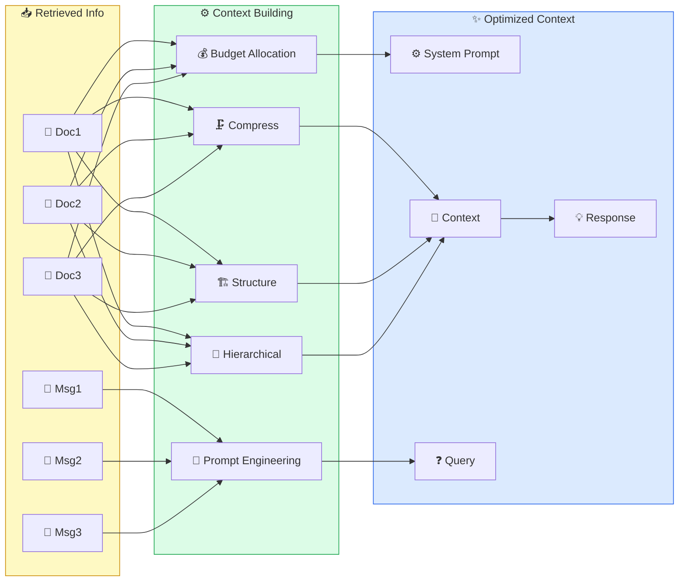

# 🔨 II. Build Context

> ## 📑 Table of Contents
>
> - [Overview](#overview)
> - [Why Is Build Context Important?](#why-is-build-context-important)
> - [Contents](#contents)
> - [1. Context Window Management](#1-context-window-management)
>   - [1.1 What Is a Context Window?](#11-what-is-a-context-window)
>   - [1.2 Token Budget Allocation](#12-token-budget-allocation)
>   - [1.3 Context Window Sizes — Comparison](#13-context-window-sizes--comparison)
>   - [1.4 "Lost in the Middle" Problem](#14-lost-in-the-middle-problem)
> - [2. Context Construction Strategies](#2-context-construction-strategies)
>   - [2.1 The 5 Strategies at a Glance](#21-the-5-strategies-at-a-glance)
>   - [2.2 Context Building Patterns — Code Examples](#22-context-building-patterns--code-examples)
>   - [2.3 4 Chain Types of LangChain (Stuff / Map-Reduce / Refine / Context Compression)](#23-4-chain-types-of-langchain-stuff--map-reduce--refine--context-compression)
> - [3. Context Compression & Summarization](#3-context-compression-&-summarization)
>   - [3.1 Why Compression Is Needed](#31-why-compression-is-needed)
>   - [3.2 Compression Techniques](#32-compression-techniques)
>   - [3.3 Compression Comparison](#33-compression-comparison)
>   - [3.4 SmartContextManager — Case Study (Claude Code Leak)](#34-smartcontextmanager--case-study-claude-code-leak)
> - [4. Prompt Engineering for Context](#4-prompt-engineering-for-context)
>   - [4.1 Prompt Templates](#41-prompt-templates)
>   - [4.2 Advanced Prompt Techniques](#42-advanced-prompt-techniques)
> - [5. Hierarchical Context](#5-hierarchical-context)
>   - [5.1 Hierarchical Structure](#51-hierarchical-structure)
>   - [5.2 Implementation](#52-implementation)
> - [6. Streaming Context](#6-streaming-context)
>   - [6.1 Concept](#61-concept)
>   - [6.2 Implementation](#62-implementation)
> - [7. Context Engineering Case Studies](#7-context-engineering-case-studies)
>   - [7.1. Claude Code — 5-Level Context System](#71-claude-code--5-level-context-system)
>   - [7.2. Cursor IDE — Context-Aware Coding](#72-cursor-ide--context-aware-coding)
>   - [7.3. Production RAG Pipeline — Context Engineering At Scale](#73-production-rag-pipeline--context-engineering-at-scale)
> - [8. Advanced Context Patterns](#8-advanced-context-patterns)
>   - [8.1. Context Routing](#81-context-routing)
>   - [8.2. RAG Fusion Pattern](#82-rag-fusion-pattern)
>   - [8.3. Context Caching Strategy](#83-context-caching-strategy)
>   - [8.4. Multi-turn Context Management](#84-multi-turn-context-management)
> - [9. Best Practices & Anti-Patterns](#9-best-practices-&-anti-patterns)
>   - [9.1. Context Building Best Practices](#91-context-building-best-practices)
>   - [9.2. Common Anti-Patterns](#92-common-anti-patterns)
> - [10. Context Validation & Testing](#10-context-validation-&-testing)
>   - [Integration Testing](#integration-testing)
> - [11. Performance Metrics & Optimization](#11-performance-metrics-&-optimization)
>   - [11.1. Context Quality Metrics](#111-context-quality-metrics)
>   - [11.2. Cost Optimization Strategies](#112-cost-optimization-strategies)
> - [12. Complete Production Pipeline](#12-complete-production-pipeline)
> - [13. Hands-on Labs](#13-hands-on-labs)
>   - [Lab 1: Context Budget Demo](#lab-1-context-budget-demo)
>   - [Lab 2: RAG Fusion Demo](#lab-2-rag-fusion-demo)
>   - [Lab 3: Context Cache Performance](#lab-3-context-cache-performance)
>   - [Lab 4: Context Validation](#lab-4-context-validation)
>   - [Lab 5: Context Routing](#lab-5-context-routing)
> - [14. References](#14-references)
>   - [Papers & Research](#papers-&-research)
>   - [Frameworks & Tools](#frameworks-&-tools)
>   - [Blogs & Resources](#blogs-&-resources)
>   - [Courses & Tutorials](#courses-&-tutorials)
>
---

### Opening Story

Imagine you are a speaker in front of 200 people. There are 200 slides on the table. If you show all 200 slides at once — the audience is overwhelmed, and nobody understands anything. If you show only 3 blank slides — the audience still learns nothing.

**That is exactly the Build Context problem.**

You retrieved great information in step 01. But if you **dump everything into the prompt** — the model gets overloaded, loses focus, and answers worse. If you **include too little** — the model lacks information and hallucinates.

Build Context is the art of **organizing information the right way, at the right time, in the right amount** — just like a great speaker knows how to select information before speaking.

### Why Is Build Context Important?

> *"Context is the new prompt — in modern AI engineering, context replaces traditional prompt engineering."*

#### 3 Scientific Pieces of Evidence

| # | Research | Key Finding |
|---|-----------|----------------------|
| 1 | **Google (2024) — "Lost in the Middle"** | Accuracy drops **from 76% down to 20%** when the important info sits in the middle of the context. Put it at the start/end → accuracy 80%+ |
| 2 | **Anthropic (2025) — Context Window Research** | A 200K context window does NOT mean using all of it. Optimal is at **40-60% utilization** |
| 3 | **Princeton SWE-agent (2024)** | Structured context increased task completion **from 14% up to 34%** on SWE-bench |

## Overview

> **📌 Core Concept**
>
> **Concept:** Build Context is the process of organizing, selecting, and managing information (retrieved documents, chat history, tool results...) and arranging them into a prompt ready to be handed to the LLM.
>
> **Analogy:** Like a great chef: there are many ingredients, but a good dish needs only a few key ones, seasoned and plated properly — not the whole market dumped into the pot.
>
> **Why it matters:** With the same amount of knowledge, different ways of organizing it change answer quality dramatically.

**Build Context** is the process of **organizing and managing information** to feed into the LLM's prompt. Good context helps the model understand better, answer more accurately, and avoid hallucination.



## Why Is Build Context Important?

> **📌 Core Concept**
>
> **Concept:** Build Context is the process of turning retrieved information into an optimal context for the LLM — including token allocation, compression, prioritization, and prompt formatting.
>
> **Analogy:** Like a teacher preparing a lesson: teaching the entire 200-page textbook is too much for students to digest, but choosing the right few key pages and students understand right away.
>
> **Why it matters:** A model is only as smart as the information fed to it the right way — without organizing context well, no matter how good the retrieval is, the answers will be poor.

> **"It's not about how much you know — it's about how much you can put in front of the model at the right time."**
> — Andrej Karpathy, 2025

### Background

You retrieved great information in step 01. But if you **dump everything into the prompt** — the model gets overloaded, loses focus, and answers worse. If you **include too little** — the model lacks information and hallucinates.

Build Context is the art of **organizing information the right way, at the right time, in the right amount** — just like a great speaker knows how to select information before speaking.

### Core Philosophy

1. **Context is the new prompt**: In modern AI engineering, context replaces traditional prompt engineering
2. **Quality over quantity**: 1000 tokens of good context beat 10,000 tokens of noisy context
3. **Structure matters**: Same content, different organization → results differ by 40-60%

### Why You Cannot Skip It?

```
┌──────────────────────────────────────────────────────────────────┐
│              WHY BUILD CONTEXT MATTERS?                          │
│                                                                  │
│  THE PROBLEM:                                                    │
│  ┌──────────────────────────────────────────────────────────┐   │
│  │ ❌ Context window limits (8K-200K tokens)               │   │
│  │ ❌ "Needle in a haystack": critical info gets buried   │   │
│  │ ❌ Token cost: every token = money ($0.001-0.03/1K)    │   │
│  │ ❌ "Lost in the middle": model forgets middle info     │   │
│  └──────────────────────────────────────────────────────────┘   │
│                                                                  │
│  THE SOLUTION:                                                   │
│  ┌──────────────────────────────────────────────────────────┐   │
│  │ ✅ Smart budget allocation: allocate tokens intelligently│   │
│  │ ✅ Hierarchical context: System > Docs > Query          │   │
│  │ ✅ Compression: cut 50-80% of tokens, keep the info    │   │
│  │ ✅ Prioritization: important info goes to start/end     │   │
│  └──────────────────────────────────────────────────────────┘   │
│                                                                  │
└──────────────────────────────────────────────────────────────────┘
```

### Research Evidence

**1. Google (2024) — "Lost in the Middle"**
- Model accuracy drops **from 76% down to 20%** when important information sits in the middle of the context
- Info placed at the start/end of context → accuracy 80%+

**2. Anthropic (2025) — Context Window Research**
- A 200K token context window does NOT mean using all 200K
- Optimal performance at **40-60% context utilization**

**3. Princeton SWE-agent (2024)**
- Structured context increased task completion **from 14% up to 34%** on SWE-bench

### Cost-Benefit Analysis

```
┌──────────────────────────────────────────────────────────────────┐
│                COST-BENEFIT: BUILD CONTEXT                        │
│                                                                  │
│  WITHOUT CONTEXT MANAGEMENT:                                     │
│  ├── Token usage: 100% (full context every time)               │
│  ├── Cost: $0.03 × 100K tokens = $3/query                      │
│  ├── Accuracy: 50-60% (with noise)                              │
│  └── Latency: High (too many tokens)                           │
│                                                                  │
│  WITH CONTEXT MANAGEMENT:                                        │
│  ├── Token usage: 40-60% (smart selection)                     │
│  ├── Cost: $0.03 × 50K tokens = $1.5/query                     │
│  ├── Accuracy: 75-85% (focused context)                        │
│  └── Latency: Lower (fewer tokens)                              │
│                                                                  │
│  ROI: 50% lower cost + 25-40% higher accuracy                  │
└──────────────────────────────────────────────────────────────────┘
```

### Analogies

| Analogy | Explanation |
|-----------|------------|
| **Travel suitcase** | Context window = a 50kg suitcase. You cannot cram in 100kg. You must pick the most important things |
| **Presentation** | 200 slides = nobody understands. 10 good slides = everyone gets it immediately |
| **Prescription drugs** | The right drug at 3 pills/day > the wrong drug at 30 pills/day |

### If You Skip It?

```
❌ Consequences:
├── "Lost in the middle": critical info is ignored by the model
├── More hallucinations because of noisy context
├── API costs rise 2-5x because the token budget is used up
├── Slower responses because of processing too many tokens
└── Poor user experience → adoption rate drops

💰 Costs:
├── Every 1K extra tokens × 10K queries/day = ~$300/month wasted
├── Lower accuracy → manual review costs
└── Scaling issues: 2x queries = 2x cost (linear instead of sub-linear)
```

### Evolutionary Context

```
┌──────────────────────────────────────────────────────────────────┐
│              EVOLUTION OF CONTEXT BUILDING                        │
│                                                                  │
│  2023: PROMPT ENGINEERING                                        │
│  ┌─────────────────────────────────┐                            │
│  │ "Write a good prompt → good    │                            │
│  │  results"                       │                            │
│  │ Context = secondary            │                            │
│  │ Problem: Prompt length limits   │                            │
│  └─────────────────────────────────┘                            │
│                    │                                              │
│                    ▼                                              │
│  2024: CONTEXT ENGINEERING                                      │
│  ┌─────────────────────────────────┐                            │
│  │ "Context replaces the prompt"   │                            │
│  │ Larger windows → more context   │                            │
│  │ Problem: Quality degrades       │                            │
│  └─────────────────────────────────┘                            │
│                    │                                              │
│                    ▼                                              │
│  2025-2026: STRUCTURED CONTEXT                                  │
│  ┌─────────────────────────────────┐                            │
│  │ "Context must be engineered"    │                            │
│  │ Budget allocation + hierarchy   │                            │
│  │ Compression + prioritization    │                            │
│  └─────────────────────────────────┘                            │
│                    │                                              │
│                    ▼                                              │
│  2027+: ADAPTIVE CONTEXT                                        │
│  ┌─────────────────────────────────┐                            │
│  │ "Self-organizing context"       │                            │
│  │ Agent chooses what to include   │                            │
│  │ Dynamic context optimization    │                            │
│  └─────────────────────────────────┘                            │
│                                                                  │
└──────────────────────────────────────────────────────────────────┘
```

---

## Contents

> **📌 Core Concept**
>
> **Concept:** A table-of-contents overview of the whole module — from context window management, context building strategies, compression, prompts, to real-world case studies and hands-on labs.
>
> **Analogy:** Like a restaurant menu: skim it to see which "dishes" are on offer, then click into each dish for details.
>
> **Why it matters:** It helps you quickly orient which parts to read first and which to read only when you hit the corresponding problem.

| # | Topic | Description |
|---|--------|-------|
| 1 | [Context Window Management](#1-context-window-management) | Manage the size of the context window |
| 2 | [Context Construction Strategies](#2-context-construction-strategies) | Strategies for building context |
| 3 | [Context Compression](#3-context-compression-&-summarization) | Compress and summarize context |
| 4 | [Prompt Engineering for Context](#4-prompt-engineering-for-context) | Prompt templates for context |
| 5 | [Hierarchical Context](#5-hierarchical-context) | Hierarchical context structure |
| 6 | [Streaming Context](#6-streaming-context) | Handle context in real-time |

---

## 1. Context Window Management

> **📌 Core Concept**
>
> **Concept:** Learn to manage the model's "capacity" — the context window — and how to divide up that space among components such as the system prompt, retrieved documents, chat history, and the question.
>
> **Analogy:** A context window is like the capacity of a tray: it has limited slots, so you must arrange what goes where sensibly, and know what to remove when the tray is full.
>
> **Why it matters:** Wrong token allocation is the number one reason models lack information or answer poorly, even when the information is already available.

### 1.1 What Is a Context Window?

The context window is the **temporary memory** of an LLM — all the tokens the model can "see" at one point in time. Managing it effectively is the most important skill.

In plain terms: the context window is like the model's desk — the wider the desk, the more paperwork you can put on it, but too much paper makes it hard to find the one sheet you need.

```
┌──────────────────────────────────────────────────────────────────┐
│                   CONTEXT WINDOW ANATOMY                         │
│                                                                  │
│  ◄─────────────────── Total Context (e.g., 128K tokens) ──────► │
│                                                                  │
│  ┌────────────────────────────────────────────────────────────┐  │
│  │░░░░░░░ System Prompt ░░░░░░░░░░░░░░░░░░░░░░░░░░░░░░░░░░░░│  │
│  │░░░░░░░ (Instructions, personality, rules)  ~500 tokens ░░░░│  │
│  ├────────────────────────────────────────────────────────────┤  │
│  │████████ Retrieved Context █████████████████████████████████│  │
│  │████████ (RAG documents, knowledge base)    2K-8K tokens ███│  │
│  ├────────────────────────────────────────────────────────────┤  │
│  │▓▓▓▓▓▓▓▓ Conversation History ▓▓▓▓▓▓▓▓▓▓▓▓▓▓▓▓▓▓▓▓▓▓▓▓▓▓▓│  │
│  │▓▓▓▓▓▓▓▓ (Past messages)              Variable ▓▓▓▓▓▓▓▓▓▓▓▓│  │
│  ├────────────────────────────────────────────────────────────┤  │
│  │▒▒▒▒▒▒▒▒ Tool Results ▒▒▒▒▒▒▒▒▒▒▒▒▒▒▒▒▒▒▒▒▒▒▒▒▒▒▒▒▒▒▒▒▒▒│  │
│  │▒▒▒▒▒▒▒▒ (API responses, code output)  Variable ▒▒▒▒▒▒▒▒▒▒│  │
│  ├────────────────────────────────────────────────────────────┤  │
│  │                                                            │  │
│  │  User Query                                  100-500 tokens│  │
│  │                                                            │  │
│  ├────────────────────────────────────────────────────────────┤  │
│  │                                                            │  │
│  │  Reserved for Output                        1K-4K tokens   │  │
│  │                                                            │  │
│  └────────────────────────────────────────────────────────────┘  │
│                                                                  │
│  ⚠️  When the context is full:                                   │
│  - FIFO: delete the oldest message                                │
│  - Truncation: cut the context (lose information!)               │
│  - Error: reject the request                                     │
│                                                                  │
└──────────────────────────────────────────────────────────────────┘
```

### 1.2 Token Budget Allocation

**Token Budget Allocation** is the process of **assigning a token count (the unit of measurement for LLMs) to each component** inside the context window: the system prompt, retrieved context, conversation history, tool results, and the user query.

**What it means:**
- The context window is limited (e.g. 128K tokens) → without allocation, one component "eats up" the space of another, leaving the model without the information it needs.
- Sensible allocation helps **maximize useful information** while still leaving room for the model's output.
- **Dynamic** allocation by question type optimizes each situation: simple questions need little retrieved context, retrieval-heavy questions need more.

<details>
<summary>Python Code (Click to expand/collapse)</summary>

```python
class ContextBudget:
    """
    Manage the token budget for context components

    Goal: Allocate tokens intelligently to maximize
    information while respecting the context window limit
    """
    
    def __init__(self, total_tokens=128000, reserve_output=4000):
        self.total = total_tokens
        self.reserve_output = reserve_output
        self.available = total_tokens - reserve_output
        
        # Default allocation (tunable)
        self.allocation = {
            "system_prompt": 0.05,      # 5% - Instructions
            "retrieved_context": 0.50,  # 50% - RAG documents
            "conversation": 0.30,       # 30% - Chat history
            "tool_results": 0.10,       # 10% - Tool/API outputs
            "user_query": 0.05,         # 5%  - Current query
        }
    
    def get_budget(self, component):
        """Get max tokens for a specific component"""
        return int(self.available * self.allocation.get(component, 0))
    
    def adjust_for_query_type(self, query_type):
        """
        Dynamic allocation based on query complexity
        
        query_type: "simple", "complex", "conversational", "retrieval"
        """
        if query_type == "simple":
            # Simple questions need less context
            self.allocation = {
                "system_prompt": 0.10,
                "retrieved_context": 0.30,
                "conversation": 0.40,
                "tool_results": 0.10,
                "user_query": 0.10,
            }
        elif query_type == "complex":
            # Complex questions need more context
            self.allocation = {
                "system_prompt": 0.05,
                "retrieved_context": 0.60,
                "conversation": 0.15,
                "tool_results": 0.15,
                "user_query": 0.05,
            }
        elif query_type == "conversational":
            # Conversations need more history
            self.allocation = {
                "system_prompt": 0.05,
                "retrieved_context": 0.20,
                "conversation": 0.55,
                "tool_results": 0.10,
                "user_query": 0.10,
            }
        elif query_type == "retrieval":
            # Heavy RAG needs most context space
            self.allocation = {
                "system_prompt": 0.03,
                "retrieved_context": 0.70,
                "conversation": 0.10,
                "tool_results": 0.12,
                "user_query": 0.05,
            }
    
    def fit_text_to_budget(self, text, component, tokenizer_func=None):
        """
        Truncate or compress text to fit within budget
        
        tokenizer_func: function(text) -> list of tokens
        """
        budget = self.get_budget(component)
        
        if tokenizer_func:
            tokens = tokenizer_func(text)
            if len(tokens) <= budget:
                return text
            # Truncate
            truncated_tokens = tokens[:budget]
            return "".join(truncated_tokens)  # simplified
        else:
            # Rough estimate: ~4 chars per token
            max_chars = budget * 4
            if len(text) <= max_chars:
                return text
            return text[:max_chars] + "\n[...truncated...]"
    
    def report(self):
        """Print budget allocation report"""
        print(f"\n{'='*55}")
        print(f"{'CONTEXT BUDGET REPORT':^55}")
        print(f"{'='*55}")
        print(f"{'Total Context:':<30} {self.total:>12,} tokens")
        print(f"{'Output Reserve:':<30} {self.reserve_output:>12,} tokens")
        print(f"{'Available:':<30} {self.available:>12,} tokens")
        print(f"{'-'*55}")
        
        for comp, pct in self.allocation.items():
            tokens = self.get_budget(comp)
            bar = '█' * int(pct * 40)
            print(f"  {comp:<25} {tokens:>8,}  {pct*100:>4.0f}% {bar}")
        
        print(f"{'='*55}")


# Usage
budget = ContextBudget(total_tokens=128000)
budget.report()

# Adjust for different scenarios
print("\n--- For Complex RAG Query ---")
budget.adjust_for_query_type("complex")
budget.report()
```

</details>

```
OUTPUT:
=======================================================
              CONTEXT BUDGET REPORT               
=======================================================
Total Context:                        128,000 tokens
Output Reserve:                         4,000 tokens
Available:                            124,000 tokens
-------------------------------------------------------
  system_prompt                    6,200    5% ██
  retrieved_context               62,000   50% ████████████████████████
  conversation                    37,200   30% ██████████████
  tool_results                    12,400   10% ████
  user_query                       6,200    5% ██
=======================================================
```

### 1.3 Context Window Sizes — Comparison

**Context Window Sizes** is the **maximum size of the context window** each model supports — that is, the maximum number of tokens a model can "see" in one inference pass.

**Why comparing sizes matters:**
- It helps you **pick the right model for the right job**: small-context models (4K-8K) suit simple, cheap tasks; large-context models (128K-1M) suit long documents and large codebases.
- **A bigger context window does NOT mean better** — more context means more noise and a higher chance of hitting "Lost in the Middle".
- Models running locally via Ollama (gemma3:12b, Llama 3.1) have 128K context, are free, and suit on-premises RAG deployments.

```
┌──────────────────────────────────────────────────────────────────┐
│               CONTEXT WINDOW SIZES ACROSS MODELS                 │
│                                                                  │
│  Model                    Context    Price     Best For          │
│  ──────────────────────── ────────── ───────── ──────────────   │
│  GPT-3.5 Turbo            4K/16K    $         Simple tasks      │
│  GPT-4                     8K/32K    $$$       General           │
│  GPT-4 Turbo               128K      $$$       Large documents   │
│  GPT-4o                    128K      $$$       Multimodal        │
│  Claude 3 Haiku            200K      $         Fast & large      │
│  Claude 3 Opus             200K      $$$$      Complex reasoning │
│  Gemini 1.5 Pro            1M        $$$       Massive context   │
│  Gemini 2.5 Pro            1M+       $$$       Latest            │
│  Llama 3.1 (8B)            128K      Free*     Open source       │
│  gemma3:12b (your model)   128K      Free*     Local RAG         │
│                                                                  │
│  * Free locally with Ollama                                      │
│                                                                  │
│  BIGGER CONTEXT ≠ BETTER                                        │
│  ├── "Lost in the Middle" problem                              │
│  ├── Models focus on beginning and end of context              │
│  ├── More context = more noise potential                       │
│  └── Better to have SMALL + RELEVANT context                  │
│                                                                  │
└──────────────────────────────────────────────────────────────────┘
```

### 1.4 "Lost in the Middle" Problem

The **"Lost in the Middle" problem** describes this phenomenon: **LLMs pay the most attention to information at the BEGINNING and the END of the context window, but overlook (or remember poorly) information in the MIDDLE.**

It is like a student who remembers the start and end of a class best, while the middle of the lecture easily slips away — LLMs also tend to "forget" what sits in the middle of the context.

**What it means / why it matters:**
- Google research (2024): accuracy drops **from 76% to 20%** when important information sits in the middle of the context.
- It directly affects RAG: if an important document is placed in the middle of the context → the model may skip it, leading to missing or wrong answers.
- Main solutions: put important information at the start/end, use re-ranking to bring the best document to the top, and compress the context to reduce noise.

```
┌──────────────────────────────────────────────────────────────────┐
│              THE "LOST IN THE MIDDLE" PROBLEM                    │
│                                                                  │
│  Research Finding: LLMs pay more attention to information       │
│  at the BEGINNING and END of the context,                      │
│  but less attention to information in the MIDDLE.              │
│                                                                  │
│  Attention Pattern:                                             │
│                                                                  │
│  High  ┃████                                              ████┃ │
│        ┃████                                              ████┃ │
│        ┃██████                                          ████┃  │
│  Med   ┃████████                                      ████┃    │
│        ┃██████████                                  ████┃      │
│        ┃████████████                              ████┃        │
│  Low   ┃████████████████████████████████████████████┃          │
│        ┗━━━━━━━━━━━━━━━━━━━━━━━━━━━━━━━━━━━━━━━━━━━━━━━━━━━━━━│
│         Beginning              Middle              End          │
│                                                                  │
│  SOLUTIONS:                                                     │
│  1. Put most important info at BEGINNING and END               │
│  2. Use shorter context (fewer, better docs)                   │
│  3. Repeat key information at strategic positions              │
│  4. Use re-ranking to put best docs first                      │
│  5. Use structured prompts that guide attention                │
│                                                                  │
└──────────────────────────────────────────────────────────────────┘
```

---

## 2. Context Construction Strategies

> **📌 Core Concept**
>
> **Concept:** The strategies that decide how to turn retrieved information into context — stuff it all in, filter it down, compress it, structure it, or pick automatically per question.
>
> **Analogy:** Like packing for a trip: cramming the whole wardrobe into the suitcase is heavy; choosing a few essential outfits is light and enough; rolling the clothes makes them even more compact.
>
> **Why it matters:** Picking the right strategy helps the model focus on the information it needs, cuts token costs, and reduces noise.

> **Quick read:** 2.1, 2.2, and 2.3 look at context construction from **3 DIFFERENT ANGLES** of the same problem — they are not competing taxonomies, but complementary views:
>
> | Subsection | Perspective | Question answered |
> |---|---|---|
> | **2.1 — 5 Strategies** | **Strategy** (abstract) | "Which way do I want to process the information?" — stuff it all, filter, compress, structure, or adapt? |
> | **2.2 — 5 Patterns** | **Implementation** (sample code) | "What code does my specific situation need?" — citations, ranking, categorization, conversation-aware, multi-source |
> | **2.3 — 4 Chain Types** | **Specific framework** (LangChain) | "When using LangChain, which `chain_type` parameter do I pick?" — stuff / map-reduce / refine / compression |
>
> The same strategy (2.1) can be implemented with a pattern (2.2) and/or a chosen chain type (2.3) — see the mapping table at the end of 2.3.

### 2.1 The 5 Strategies at a Glance

**Context Construction Strategies** are **strategies for organizing retrieved information into context before it goes into the prompt** — deciding how to arrange, filter, and format the input documents for the LLM.

**What it means:**
- It is not "retrieved N, so stuff all N into the prompt" — each strategy has its own trade-off between **completeness** and **precision/brevity**.
- Choosing the wrong strategy leads to: noisy context (lower accuracy), wasted tokens (higher cost), or missing information (hallucination).
- The **ADAPTIVE** strategy is the modern direction: automatically choose the right strategy based on the question type.

The 5 main strategies:

```
┌──────────────────────────────────────────────────────────────────┐
│              CONTEXT CONSTRUCTION STRATEGIES                      │
│                                                                  │
│  Strategy 1: PASS-THROUGH                                       │
│  ┌──────────────────────────────────────────────────────────┐   │
│  │ Retrieved ──► All docs ──► Directly into prompt          │   │
│  │ ✅ Simple, ✅ Complete info                              │   │
│  │ ❌ Noisy, ❌ Token waste                                 │   │
│  └──────────────────────────────────────────────────────────┘   │
│                                                                  │
│  Strategy 2: SELECTIVE                                          │
│  ┌──────────────────────────────────────────────────────────┐   │
│  │ Retrieved ──► Filter by relevance ──► Top-K only         │   │
│  │ ✅ Focused, ✅ Token-efficient                           │   │
│  │ ❌ May miss relevant info                                │   │
│  └──────────────────────────────────────────────────────────┘   │
│                                                                  │
│  Strategy 3: COMPRESSED                                         │
│  ┌──────────────────────────────────────────────────────────┐   │
│  │ Retrieved ──► LLM summarizes ──► Compact version         │   │
│  │ ✅ Efficient, ✅ Key info preserved                      │   │
│  │ ❌ May lose details, ❌ Extra LLM call                   │   │
│  └──────────────────────────────────────────────────────────┘   │
│                                                                  │
│  Strategy 4: STRUCTURED                                         │
│  ┌──────────────────────────────────────────────────────────┐   │
│  │ Retrieved ──► Categorize ──► Organized by type/topic     │   │
│  │ ✅ Organized, ✅ Easy to scan                             │   │
│  │ ❌ Schema design overhead                                 │   │
│  └──────────────────────────────────────────────────────────┘   │
│                                                                  │
│  Strategy 5: ADAPTIVE                                           │
│  ┌──────────────────────────────────────────────────────────┐   │
│  │ Query analysis ──► Choose strategy ──► Dynamic assembly  │   │
│  │ ✅ Optimal for each query                                 │   │
│  │ ❌ Complex to implement                                   │   │
│  └──────────────────────────────────────────────────────────┘   │
│                                                                  │
└──────────────────────────────────────────────────────────────────┘
```

### 2.2 Context Building Patterns — Code Examples

**Context Building Patterns** are **specific code patterns that realize context-building strategies in practice** — each pattern solves a typical situation when integrating RAG.

**What it means:**
- **Citation-based**: Assign source numbers [1], [2]... to each document → the model cites the right source, which is easy to verify (important in legal and medical domains).
- **Relevance-ranked**: Order documents by relevance → reduces "Lost in the Middle" by placing important information at the start/end.
- **Categorized**: Group documents by topic → the model can find and synthesize information per category more easily.
- **Conversation-aware**: Combine user profile + chat history + documents → answers are personalized and conversation-context-aware.
- **Multi-source**: Combine many sources (official, expert, database...) with a clear priority order → balances trustworthiness.

<details>
<summary>Python Code (Click to expand/collapse)</summary>

```python
import json
from datetime import datetime

# ============================================================
# PATTERN 1: Citation-based Context
# ============================================================
def build_citation_context(documents):
    """
    Assign source numbers [1], [2], [3]... to each document

    Suitable when the answer must cite its sources
    """
    context_parts = []
    for i, doc in enumerate(documents, 1):
        source = doc.get("source", "unknown")
        date = doc.get("date", "")
        content = doc["content"]
        context_parts.append(
            f"[{i}] ({source}, {date})\n{content}"
        )
    
    return "REFERENCE DOCUMENTS:\n" + "\n\n".join(context_parts)


# ============================================================
# PATTERN 2: Relevance-ranked Context
# ============================================================
def build_ranked_context(documents, scores):
    """
    Arrange the context by relevance

    Most important information at the beginning and end (avoids "lost in middle")
    """
    ranked = sorted(
        zip(documents, scores), 
        key=lambda x: x[1], 
        reverse=True
    )
    
    context = []
    
    # Group by relevance level
    high = [(d, s) for d, s in ranked if s > 0.8]
    medium = [(d, s) for d, s in ranked if 0.5 < s <= 0.8]
    low = [(d, s) for d, s in ranked if s <= 0.5]
    
    if high:
        context.append("🔴 MOST IMPORTANT INFORMATION:")
        for doc, score in high:
            context.append(f"  • {doc['content']}")
    
    if medium:
        context.append("\n🟡 SUPPLEMENTARY INFORMATION:")
        for doc, score in medium:
            context.append(f"  • {doc['content']}")
    
    if low:
        context.append("\n🔵 RELATED INFORMATION:")
        for doc, score in low:
            context.append(f"  • {doc['content']}")
    
    return "\n".join(context)


# ============================================================
# PATTERN 3: Categorized Context
# ============================================================
def build_categorized_context(documents):
    """
    Categorize the context by topic/type

    Helps the LLM find information easily by category
    """
    categories = {}
    for doc in documents:
        cat = doc.get("category", "general")
        if cat not in categories:
            categories[cat] = []
        categories[cat].append(doc)
    
    parts = []
    for cat_name, docs in sorted(categories.items()):
        parts.append(f"## {cat_name.upper()}")
        for doc in docs:
            parts.append(f"- {doc['content']}")
        parts.append("")  # blank line
    
    return "\n".join(parts)


# ============================================================
# PATTERN 4: Conversation-aware Context
# ============================================================
def build_conversational_context(query, docs, chat_history, user_profile=None):
    """
    Build context around the current conversation

    Combines: user profile + chat history + retrieved docs
    """
    parts = []
    
    # User profile (if available)
    if user_profile:
        parts.append("👤 ABOUT THE USER:")
        parts.append(f"  Name: {user_profile.get('name', 'N/A')}")
        parts.append(f"  Interests: {', '.join(user_profile.get('interests', []))}")
        parts.append(f"  Language: {user_profile.get('language', 'en')}")
        parts.append("")
    
    # Recent conversation
    if chat_history:
        parts.append("💬 RECENT CONVERSATION:")
        for msg in chat_history[-5:]:  # Last 5 messages
            role = "👤" if msg["role"] == "user" else "🤖"
            parts.append(f"  {role} {msg['content'][:100]}")
        parts.append("")
    
    # Retrieved documents
    if docs:
        parts.append(f"📚 REFERENCE INFORMATION ({len(docs)} sources):")
        for i, doc in enumerate(docs, 1):
            relevance = doc.get("score", 0)
            parts.append(f"  [{i}] (relevance: {relevance:.0%}) {doc['content']}")
        parts.append("")
    
    parts.append(f"❓ CURRENT QUESTION: {query}")
    
    return "\n".join(parts)


# ============================================================
# PATTERN 5: Multi-source Context
# ============================================================
def build_multisource_context(sources):
    """
    Combine multiple different information sources

    sources: dict of {source_name: [documents]}

    Example:
    - Official docs (highest priority)
    - Expert analysis
    - User data
    - Web search results
    """
    priority_order = ["official", "expert", "database", "web", "general"]
    
    parts = []
    parts.append("You have access to the following sources (priority in descending order):")
    parts.append("")
    
    for source_name in priority_order:
        if source_name in sources:
            docs = sources[source_name]
            parts.append(f"=== Source: {source_name.upper()} (priority: {priority_order.index(source_name)+1}) ===")
            for doc in docs:
                parts.append(f"  • {doc}")
            parts.append("")
    
    parts.append("GUIDANCE: Prioritize information from official sources, "
                 "then from experts, then from the other sources.")
    
    return "\n".join(parts)


# ============================================================
# USAGE EXAMPLE
# ============================================================
if __name__ == "__main__":
    # Sample documents
    docs = [
        {"content": "Health insurance is mandatory", "source": "Health Insurance Law", 
         "category": "legal", "score": 0.95},
        {"content": "Contribution level is 4.5% of base salary", "source": "Decree 105", 
         "category": "finance", "score": 0.88},
        {"content": "Insurance cards are valid for 5 years", "source": "Health Insurance Law", 
         "category": "legal", "score": 0.72},
        {"content": "See a doctor at district level or above", "source": "Guidelines", 
         "category": "medical", "score": 0.65},
    ]
    
    print("=== Citation Context ===")
    print(build_citation_context(docs))
    
    print("\n=== Categorized Context ===")
    print(build_categorized_context(docs))
```

</details>

---

### 2.3 4 Chain Types of LangChain (Stuff / Map-Reduce / Refine / Context Compression)

These are **4 standard ways to build context** in LangChain; you will meet them when using `RetrievalQA.from_chain_type()`:

```
                    ┌─────────────────────────────────────┐
                    │       4 CHAIN TYPES                 │
                    │                                     │
                    │   STUFF       ──── pass-through    │
                    │   MAP-REDUCE  ──── compressed      │
                    │   REFINE      ──── iterative        │
                    │   COMPRESSION ──── selective        │
                    └─────────────────────────────────────┘
```

<details>
<summary><b>1. STUFF — Cram all chunks into the prompt (Click to view)</b></summary>

```
Input chunks: [chunk_1, chunk_2, chunk_3, chunk_4]
                    │
                    ▼
     ┌──────────────────────────────┐
     │  PROMPT:                     │
     │                              │
     │  Context:                    │
     │  - chunk_1 (300 tokens)     │
     │  - chunk_2 (250 tokens)     │
     │  - chunk_3 (400 tokens)     │
     │  - chunk_4 (350 tokens)     │
     │                              │
     │  Question: ...               │
     └──────────────────────────────┘
                    │
                    ▼
     The LLM receives ALL chunks at once
```

<details>
<summary><b>Python Code (Click to expand/collapse)</b></summary>

```python
from langchain.chains import RetrievalQA

qa_chain = RetrievalQA.from_chain_type(
    llm=llm,
    retriever=vector_store.as_retriever(),
    chain_type="stuff"  # ← cram everything into one prompt
)
```

</details>

| ✅ Advantages | ❌ Disadvantages |
|-----------|-------------|
| Simple, easy to debug | Token limit: context easily overflows |
| Preserves the original information | Slow when there are too many chunks |
| A single LLM call | "Lost in the middle" — middle information is easily ignored |

**When to use:** Short context (< 4K tokens), need high accuracy, do not want to lose information.

</details>

<details>
<summary><b>2. MAP-REDUCE — Summarize each chunk, then combine (Click to view)</b></summary>

```
Input chunks: [chunk_1, chunk_2, chunk_3, chunk_4]
                    │
                    ▼
     ┌───────── MAP PHASE ─────────┐
     │  chunk_1 ──► LLM ──► summary_1  │
     │  chunk_2 ──► LLM ──► summary_2  │
     │  chunk_3 ──► LLM ──► summary_3  │
     │  chunk_4 ──► LLM ──► summary_4  │
     └────────────────────────────────┘
                    │
                    ▼
     ┌──────── REDUCE PHASE ────────┐
     │  summary_1 + summary_2 +       │
     │  summary_3 + summary_4 ──► LLM │
     │                      ──► final │
     └────────────────────────────────┘
                    │
                    ▼
        The LLM only sees the summaries
```

<details>
<summary><b>Python Code (Click to expand/collapse)</b></summary>

```python
qa_chain = RetrievalQA.from_chain_type(
    llm=llm,
    retriever=vector_store.as_retriever(),
    chain_type="map_reduce"  # ← map each chunk, then reduce
)
```

</details>

| ✅ Advantages | ❌ Disadvantages |
|-----------|-------------|
| No limit on the number of chunks | May lose important details |
| Token-efficient | Costs many LLM calls (one per chunk in the map) |
| Handles enormous context | Paraphrased information can be distorted |

**When to use:** Dozens of documents, very long context (> 10K tokens), only need the main ideas.

</details>

<details>
<summary><b>3. REFINE — Update the answer chunk by chunk (Click to view)</b></summary>

```
Input chunks: [chunk_1, chunk_2, chunk_3, chunk_4]
                    │
                    ▼
     ┌──────────────────────────────────┐
     │  Step 1: chunk_1 + question      │
     │    ──► LLM ──► answer_1 (draft) │
     └──────────────────────────────────┘
                    │
                    ▼
     ┌──────────────────────────────────┐
     │  Step 2: chunk_2 + answer_1      │
     │    ──► LLM ──► answer_2 (refine)│
     └──────────────────────────────────┘
                    │
                    ▼
     ┌──────────────────────────────────┐
     │  Step 3: chunk_3 + answer_2      │
     │    ──► LLM ──► answer_3 (refine)│
     └──────────────────────────────────┘
                    │
                    ▼
              ... until the last chunk
```

<details>
<summary><b>Python Code (Click to expand/collapse)</b></summary>

```python
qa_chain = RetrievalQA.from_chain_type(
    llm=llm,
    retriever=vector_store.as_retriever(),
    chain_type="refine"  # ← update the answer incrementally
)
```

</details>

| ✅ Advantages | ❌ Disadvantages |
|-----------|-------------|
| Combines information from many sources | Costs many LLM calls (N chunks = N calls) |
| Iterative refinement: more processing, more accurate | Depends on the order of the chunks |
| Not affected by "lost in the middle" | Easy to "over-refine" — turns a correct meaning into a wrong one |
| Easy to track each step | Slowest of the 4 chain types |

**When to use:** Need to analyze document by document in depth, complex questions that need many perspectives.

</details>

<details>
<summary><b>4. CONTEXT COMPRESSION — Compress the context before stuffing (Click to view)</b></summary>

This is a separate chain type; it does not use the `chain_type` parameter but uses `BaseDocumentCompressor`:

```
Input chunks: [chunk_1, chunk_2, chunk_3, chunk_4]
                    │
                    ▼
     ┌── CONTEXT COMPRESSOR ─────────┐
     │  chunk_1 ──► "HI 80-100%"    │
     │  chunk_2 ──► "cardiovascular ✔"      │
     │  chunk_3 ──► ✘ (not relevant)│
     │  chunk_4 ──► "last 5 years"  │
     └────────────────────────────────┘
                    │
                    ▼
     ┌──────────────────────────────┐
     │  Keep only relevant chunks,  │
     │  remove the noise            │
     └──────────────────────────────┘
                    │
                    ▼
        ──► Then still STUFF into the prompt
```

<details>
<summary><b>Python Code (Click to expand/collapse)</b></summary>

```python
from langchain.retrievers.document_compressors import LLMChainExtractor
from langchain.retrievers import ContextualCompressionRetriever

# Compressor extracts the relevant sentences from each chunk
compressor = LLMChainExtractor.from_llm(llm)

# Wrap the retriever with the compressor
compression_retriever = ContextualCompressionRetriever(
    base_compressor=compressor,
    base_retriever=vector_store.as_retriever()
)

# Combine with the STUFF chain
qa_chain = RetrievalQA.from_chain_type(
    llm=llm,
    retriever=compression_retriever,
    chain_type="stuff"
)
```

</details>

| ✅ Advantages | ❌ Disadvantages |
|-----------|-------------|
| Cuts tokens significantly | The LLM compressor costs extra calls |
| Keeps only information relevant to the question | May accidentally discard important information |
| Reduces noise, increases accuracy | More complex to set up |

**When to use:** Long context with many irrelevant chunks, want to save tokens and focus on the necessary information.

</details>

---

#### In Summary: Which Chain Type Should You Choose?

| Chain Type | LLM Calls | Token Usage | Accuracy | Use When |
|-----------|:-----------:|:----------:|:-----------:|---------|
| **Stuff** | 1 | Highest | High | Short context (< 4K tokens) |
| **Map-Reduce** | N + 1 | Low | Medium | Very long context (> 10K words) |
| **Refine** | N | High | Highest | Need sequential analysis |
| **Compression** | depends | Flexible | High | Many noisy chunks |

> **Note:** "Chain Types" is LangChain's naming. In practice, these 4 patterns appear in every RAG framework (LlamaIndex calls them `ResponseMode`, and in hand-written code you implement them manually).

#### The Relationship: 2.1 ↔ 2.2 ↔ 2.3

The three subsections do not present three independent things — they are **the same strategies viewed at different levels of detail**. The table below maps each strategy (2.1) to its code pattern (2.2) and LangChain chain type (2.3):

| 2.1 — Strategy | 2.2 — Pattern (code) | 2.3 — LangChain Chain Type | Real-world example |
|---|---|---|---|
| **PASS-THROUGH** (stuff it all) | Citation-based (assign source numbers [1][2]...) | **STUFF** | Pass all documents with source numbers so the model can cite them |
| **SELECTIVE** (keep the best after filtering) | Relevance-ranked (order by relevance) | — (filter top-K yourself first, then use stuff) | Keep only the 3 documents with the highest scores, put important ones at start/end |
| **COMPRESSED** (summarize to make it small) | — (covered in section 3 — Compression) | **MAP-REDUCE** / **CONTEXT COMPRESSION** | Summarize each document then combine, or compress before stuffing |
| **STRUCTURED** (organized arrangement) | Categorized (group by topic) | — (not built into LangChain, do it yourself) | Group documents by legal / finance / medical |
| **ADAPTIVE** (auto-select per question) | Conversation-aware / Multi-source | — (combine with the Router in section 8.1) | Simple question → fewer docs + more history; code question → file context + conventions |

**How to read it:** A RAG system usually combines **several strategies at once**. For example: `SELECTIVE + STRUCTURED + STUFF` = filter to the top-K documents, group them by topic, then stuff everything into a single prompt — this is exactly the most common pattern in production.

#### Should You Pick One Strategy or Combine Several?

**Short answer: Almost always COMBINE several strategies**, because they solve DIFFERENT problems at different layers — it is not "pick 1 of 5".

**Why combine?** Each strategy answers its own question, at its own layer of the pipeline:

| Strategy | Layer it operates in | Problem it solves | Concrete example |
|---|---|---|---|
| **SELECTIVE** | Filtering layer (retrieval) | "Which documents to pick?" — removes noise | Retrieve 50 docs → keep only the top 10 |
| **COMPRESSED** | Compression layer (post-processing) | "How to fit the token budget?" | 10 docs × 2K tokens → ~800 left per doc |
| **STRUCTURED** | Organization layer (assembly) | "How to arrange the context?" — avoids lost-in-middle | Group by topic, important items at start/end |
| **PASS-THROUGH / STUFF** | Delivery layer | "How to put it into the prompt?" | Stuff everything into a single prompt |
| **ADAPTIVE** | Orchestration layer | "Which combination for this question?" | Simple question ≠ complex question |

**Example of a typical production pipeline — combining 4 layers:**

```
Query "How much is the health insurance contribution?"
        │
        ▼
┌─ 1. SELECTIVE ──────────────────────────────┐
│  Retrieve 50 docs → filter to top 10 relevant│
│  (reduce noise, stay focused)                │
└─────────────────────────────────────────────┘
        │
        ▼
┌─ 2. COMPRESSED ─────────────────────────────┐
│  Each doc 2K tokens → compress to ~800 tokens│
│  (fit the token budget, keep the main ideas) │
└─────────────────────────────────────────────┘
        │
        ▼
┌─ 3. STRUCTURED ─────────────────────────────┐
│  Group: legal / finance / medical            │
│  Put the most important at the start & end   │
│  (easy to read, avoid lost-in-the-middle)    │
└─────────────────────────────────────────────┘
        │
        ▼
┌─ 4. STUFF (PASS-THROUGH) ──────────────────┐
│  The whole optimized context → 1 prompt      │
│  A single LLM call                          │
└─────────────────────────────────────────────┘
```

**When is it enough to use just one strategy?** — Rarely, only in very simple cases:

| Situation | Recommendation | Reason |
|---|---|---|
| Very short context (< 1K tokens), 1-2 documents | Only **STUFF** | No need to filter/compress — extra layers only add latency |
| Prototype / POC under validation | Only **SELECTIVE** | The simplest option still has quality control |
| Simple production retrieval, few docs | **SELECTIVE + STUFF** | Filter top-K then stuff — good enough |
| Standard production RAG | **SELECTIVE + STRUCTURED + STUFF** | The most common pattern today |
| Very long context, many docs | **SELECTIVE + COMPRESSED + STUFF** | Compression is required to fit the token budget |
| Complex system, varied questions | **ADAPTIVE + all of them** | Auto-select the combination per question type |

**Golden rule:** Add a layer only when it solves **a measurable problem** (token overflow, low accuracy, high latency). Do not combine everything blindly — every added layer = more latency + more complexity.

---

## 3. Context Compression & Summarization

> **📌 Core Concept**
>
> **Concept:** Shrink the size of the context by summarizing, filtering, or removing the surplus — keep the main ideas while saving tokens.
>
> **Analogy:** Like vacuum-packing clothes: you still have everything you need, but the suitcase is half as big.
>
> **Why it matters:** Tokens are limited and cost money — without compression, you cannot fit all the documents into the prompt.

### 3.1 Why Compression Is Needed?

**Compression (context compression)** is the process of **reducing the size of the context** by removing redundant information, summarizing, or keeping only the important parts — with the goal of preserving the core meaning while reducing the token count.

Easy picture: the dining table (context) has room for only a few dishes — you must choose the main dishes and pack them in neatly, instead of serving up the whole pile of raw ingredients.

**Why it is needed:**
- The context window is limited (e.g. 128K tokens), but retrieved documents often far exceed the budget — for example 10 documents × 2K tokens = 20K tokens, but the budget is only 8K.
- **Every token = money** (API cost) and = processing time (latency). A longer context is not automatically better — more noise makes "Lost in the Middle" more likely.
- Compression gets **as much useful information as possible into the token budget** instead of cutting the context arbitrarily (losing important information).

```
┌──────────────────────────────────────────────────────────────────┐
│                 CONTEXT COMPRESSION NEEDED                       │
│                                                                  │
│  Scenario: 10 documents, each doc ~2000 tokens                 │
│  Total raw context: ~20,000 tokens                              │
│  Budget available: ~8,000 tokens                                │
│                                                                  │
│  Problem: 20,000 > 8,000 → MUST compress!                       │
│                                                                  │
│  Compression Ratio = compressed_size / original_size             │
│                                                                  │
│  Target: 20,000 → 8,000 tokens (40% ratio)                     │
│                                                                  │
│  Techniques:                                                     │
│  ├── Map-Reduce: summarize each doc, then combine               │
│  ├── Extractive: pick the most important sentences             │
│  ├── Selective: keep only key facts                            │
│  ├── LLMLingua: drop low-importance tokens                     │
│  └── LLM Compression: use an LLM to summarize                  │
│                                                                  │
└──────────────────────────────────────────────────────────────────┘
```

### 3.2 Compression Techniques

**Compression Techniques** are **specific techniques for compressing context**; each has its own strengths depending on the document type and goal:

| Technique | How it works | Best when |
|----------|---------------|-------------|
| **Map-Reduce Summarization** | Summarize each document, then combine | Many documents, need a global summary |
| **Extractive** | Keep the original sentences, pick only the important ones | Need exact word-for-word information |
| **Selective Key-Fact** | Extract facts in a structured form | Need easily parseable output with figures |
| **Sliding Window Hierarchical** | Summarize in multiple hierarchical levels | Very long text |
| **Deduplication** | Remove duplicate/near-identical documents | A document store with many near-duplicates |

<details>
<summary>Python Code (Click to expand/collapse)</summary>

```python
import numpy as np

class ContextCompressor:
    """
    Collection of context compression techniques
    """
    
    def __init__(self, llm_func=None):
        """
        llm_func: function(prompt) -> response
        Without an LLM, use rule-based compression
        """
        self.llm = llm_func
    
    # --------------------------------------------------------
    # Technique 1: MAP-REDUCE SUMMARIZATION
    # --------------------------------------------------------
    def map_reduce_summarize(self, documents, target_ratio=0.4):
        """
        Summarize each document separately (map),
        then combine all summaries (reduce).

        Fits: many documents, need a global summary
        """
        # MAP: Summarize each document individually
        summaries = []
        for doc in documents:
            text = doc if isinstance(doc, str) else doc.get("content", "")
            summary = self._summarize_text(text, ratio=target_ratio * 2)
            summaries.append(summary)
        
        # REDUCE: Combine all summaries
        combined = "\n".join(f"- {s}" for s in summaries)
        
        if self.llm and len(combined) > 200:
            final = self.llm(
                f"Combine the following summaries into one short paragraph, "
                f"keeping the most important information:\n\n{combined}\n\n"
                f"Combined summary:"
            )
        else:
            final = combined
        
        return final
    
    # --------------------------------------------------------
    # Technique 2: EXTRACTIVE COMPRESSION
    # --------------------------------------------------------
    def extractive_compress(self, text, num_sentences=5):
        """
        Select the MOST IMPORTANT sentences from the text

        Use TF-IDF scoring to identify important sentences

        Fits: keeping the original wording, no paraphrasing
        """
        sentences = [s.strip() for s in text.split('. ') if s.strip()]
        
        if len(sentences) <= num_sentences:
            return text
        
        # Simple TF-IDF scoring
        word_freq = {}
        for sent in sentences:
            words = sent.lower().split()
            for word in words:
                word_freq[word] = word_freq.get(word, 0) + 1
        
        # Score each sentence
        scored = []
        for sent in sentences:
            words = sent.lower().split()
            score = sum(word_freq.get(w, 0) for w in words) / max(len(words), 1)
            scored.append((sent, score))
        
        # Select top sentences (maintain original order)
        scored.sort(key=lambda x: x[1], reverse=True)
        top_sentences = [s for s, _ in scored[:num_sentences]]
        
        # Re-order by original position
        ordered = sorted(top_sentences, key=lambda s: text.index(s))
        
        return '. '.join(ordered) + '.'
    
    # --------------------------------------------------------
    # Technique 3: SELECTIVE KEY-FACT EXTRACTION
    # --------------------------------------------------------
    def selective_compress(self, text, key_fields=None):
        """
        Extract key facts in a structured format

        Fits: needs structured output, easy to parse
        """
        if self.llm:
            prompt = f"""Extract the most important information from the following text.

Text:
{text}

Extract in this format:
- Topic: ...
- Key figures: ...
- Conclusion: ...
- Conditions/Exclusions: ...

Extraction:"""
            return self.llm(prompt)
        
        # Rule-based fallback
        facts = []
        lines = text.split('\n')
        for line in lines:
            line = line.strip()
            if not line:
                continue
            # Lines with numbers/dates are usually important
            if any(c.isdigit() for c in line):
                facts.append(f"• {line}")
            # Lines at the beginning/end are usually important
            elif line.startswith(('Article', 'Section', 'Item', '#')):
                facts.append(f"• {line}")
        
        return '\n'.join(facts[:10])  # Limit to 10 facts
    
    # --------------------------------------------------------
    # Technique 4: SLIDING WINDOW HIERARCHICAL SUMMARY
    # --------------------------------------------------------
    def hierarchical_summarize(self, text, window_size=3, max_depth=5):
        """
        Summarize hierarchically using a sliding window

        Level 1: summarize each window of paragraphs
        Level 2: summarize each window of Level-1 summaries
        ...continue until within budget...

        Fits: very long text, needs multi-level summarization
        """
        paragraphs = [p.strip() for p in text.split('\n\n') if p.strip()]
        
        return self._recursive_summarize(paragraphs, window_size, 0, max_depth)
    
    def _recursive_summarize(self, items, window_size, depth, max_depth):
        if depth >= max_depth or len(items) <= window_size:
            return '\n\n'.join(items)
        
        summaries = []
        for i in range(0, len(items), window_size):
            window = '\n\n'.join(items[i:i + window_size])
            if self.llm:
                summary = self.llm(
                    f"Summarize the following passage in 1-2 sentences:\n\n{window}\n\nSummary:"
                )
            else:
                # Simple: take the first sentence of each paragraph
                summary = '. '.join(
                    p.split('.')[0] + '.' 
                    for p in window.split('\n\n')[:2]
                )
            summaries.append(summary)
        
        return self._recursive_summarize(summaries, window_size, depth + 1, max_depth)
    
    # --------------------------------------------------------
    # Technique 5: DEDUPLICATION
    # --------------------------------------------------------
    def deduplicate(self, documents, similarity_threshold=0.85):
        """
        Remove duplicate or overly similar documents

        Reduces context size by merging similar docs
        """
        if not documents:
            return documents
        
        # Simple dedup by text similarity
        unique = [documents[0]]
        
        for doc in documents[1:]:
            doc_text = doc if isinstance(doc, str) else doc.get("content", "")
            is_duplicate = False
            
            for existing in unique:
                existing_text = existing if isinstance(existing, str) else existing.get("content", "")
                similarity = self._text_similarity(doc_text, existing_text)
                
                if similarity > similarity_threshold:
                    is_duplicate = True
                    break
            
            if not is_duplicate:
                unique.append(doc)
        
        return unique
    
    def _text_similarity(self, text1, text2):
        """Simple word overlap similarity"""
        words1 = set(text1.lower().split())
        words2 = set(text2.lower().split())
        
        if not words1 or not words2:
            return 0.0
        
        intersection = words1 & words2
        union = words1 | words2
        
        return len(intersection) / len(union)
    
    def _summarize_text(self, text, ratio=0.3):
        """Summarize a single text"""
        if self.llm:
            return self.llm(
                f"Summarize the following text to {ratio*100:.0f}% of its original length:\n\n{text}\n\nSummary:"
            )
        
        # Simple truncation
        words = text.split()
        n = max(int(len(words) * ratio), 1)
        return ' '.join(words[:n])


# Usage
compressor = ContextCompressor(llm_func=my_llm_function)

# Compress 10 documents into compact context
documents = [...]  # Your documents
compressed = compressor.map_reduce_summarize(documents, target_ratio=0.4)
print(f"Original: {sum(len(d) for d in documents)} chars")
print(f"Compressed: {len(compressed)} chars")
print(f"Ratio: {len(compressed)/sum(len(d) for d in documents):.1%}")
```

</details>

### 3.3 Compression Comparison

**Compression Comparison** compares compression techniques along 4 criteria: **quality** (how well meaning is preserved), **speed** (processing latency), **size reduction ratio**, and **suitable situations** — helping you pick the right technique for the right problem.

**How to read the table below:**
- The more ⭐ the better for that criterion.
- **Size Reduction %** = percentage saved versus the original (60-70% means 30-40% remains).
- Choose **Extractive** when you must keep exact wording (legal, contracts); choose **Hierarchical** for extremely long text; choose **Deduplication** when documents are duplicated.

```
┌──────────────────────┬──────────┬──────────┬──────────┬──────────────────┐
│ Technique            │ Quality  │ Speed    │ Size     │ Best For         │
│                      │          │          │ Reduction│                  │
├──────────────────────┼──────────┼──────────┼──────────┼──────────────────┤
│ Map-Reduce           │ ⭐⭐⭐⭐  │ ⭐⭐      │ 60-70%   │ Multi-doc        │
│ Extractive           │ ⭐⭐⭐    │ ⭐⭐⭐⭐⭐  │ 50-60%   │ Keep exact words │
│ Selective            │ ⭐⭐⭐⭐  │ ⭐⭐⭐    │ 70-80%   │ Key facts        │
│ Hierarchical         │ ⭐⭐⭐⭐⭐│ ⭐       │ 80-90%   │ Very long text   │
│ Deduplication        │ ⭐⭐     │ ⭐⭐⭐⭐   │ 20-40%   │ Redundant docs   │
│ LLMLingua            │ ⭐⭐⭐⭐  │ ⭐⭐⭐    │ 60-80%   │ Token-level      │
└──────────────────────┴──────────┴──────────┴──────────┴──────────────────┘
```

### 3.4 SmartContextManager — Case Study (Claude Code Leak)

Based on the leaked source code of Claude Code, here is how 5-level context management with automatic compression works in practice:

<details>
<summary><b>TypeScript Code (Click to expand/collapse)</b></summary>

```typescript
class SmartContextManager {
  // 5 Context Levels (per Anthropic)
  buildContext(query: string): Context {
    return {
      // Level 1: System Identity — always present, never evicted
      system: {
        role: "AI Coding Assistant",
        version: "Claude 3.5",
        capabilities: [...],
        limitations: [...]
      },
      
      // Level 2: Task Context — the current goal
      task: {
        currentGoal: this.getCurrentGoal(),
        progressSoFar: this.getProgress(),
        remainingSteps: this.getRemainingSteps()
      },
      
      // Level 3: Domain Knowledge — codebase info
      domain: {
        projectStructure: this.getProjectStructure(),
        conventions: this.getCodeConventions(),
        dependencies: this.getDependencies()
      },
      
      // Level 4: Conversation History (Compressed!)
      conversation: {
        recentMessages: this.getRecentMessages(10),
        summary: this.getSummary(),
        keyDecisions: this.getKeyDecisions()
      },
      
      // Level 5: Immediate Context — the open file
      immediate: {
        currentFile: this.getCurrentFile(),
        openFiles: this.getOpenFiles(),
        recentEdits: this.getRecentEdits(),
        cursorPosition: this.getCursorPosition()
      }
    };
  }
  
  // Context optimization pipeline
  async buildOptimizedContext(query: string): Promise<string> {
    // 1. Always include system & task (core — always present)
    const core = this.getSystemAndTaskContext();
    
    // 2. Retrieve relevant domain knowledge (RAG)
    const relevant = await this.retrieveRelevant(query);
    
    // 3. Add compressed conversation history
    const history = this.compressHistory();
    
    // 4. Include immediate context
    const immediate = this.getImmediateContext();
    
    // 5. Fit everything into the token limit
    return this.fitToLimit([core, relevant, history, immediate]);
  }
  
  // Ensure the context stays within the token limit
  private fitToLimit(contexts: string[]): string {
    const limit = 100000;
    let total = '';
    let tokenCount = 0;
    
    for (const ctx of contexts) {
      const tokens = this.countTokens(ctx);
      if (tokenCount + tokens < limit) {
        total += ctx;
        tokenCount += tokens;
      } else {
        // Throttle: skip or truncate
        break;
      }
    }
    
    return total;
  }
  
  // Compress old chat history when the limit is exceeded
  compressHistory(): string {
    if (this.messages.length > 20) {
      const old = this.messages.slice(0, -10);
      const summary = this.summarize(old);
      return summary;
    }
    return this.messages.map(m => `${m.role}: ${m.content}`).join('\n');
  }
}
```

</details>

**Best Practices:**
- ✅ Layer context by priority: system > task > domain > history > immediate
- ✅ Include only relevant information
- ✅ Monitor token usage
- ✅ Compress when approaching limits
- ❌ Don't include everything
- ❌ Don't ignore token limits
- ❌ Don't use static context
- ❌ Don't forget immediate context

---

## 4. Prompt Engineering for Context

> **📌 Core Concept**
>
> **Concept:** The art of writing prompts and context to "direct" the LLM's behavior — adding constraints, requesting step-by-step reasoning, enforcing output formats, and guarding against hallucination.
>
> **Analogy:** Like writing a clear exam question for a student: a vague question gets a rambling answer; a detailed question gets an answer that hits exactly what the grader wants.
>
> **Why it matters:** With the same context, a well-designed prompt improves accuracy noticeably without costing extra tokens or money.

### 4.1 Prompt Templates

**Prompt Templates** are **pre-made skeletons for prompts** — a fixed structure for arranging context, system messages, and answer instructions — so you do not have to rewrite the prompt every time.

Think of a template as a job application form: the frame is already there, you just fill in the specific content, and whoever fills it in gets the same level of completeness.

**What it means:**
- Guarantees **consistency**: the same prompt structure for every query → stable, predictable results.
- **Directs LLM behavior**: the template specifies "use only the context", "cite sources [n]", "if information is missing, say so clearly" → less hallucination.
- **Varies by purpose**: a BASIC template for everyday questions; CHAIN-OF-THOUGHT for analytical questions; SELF-CONSTRAINED for domains needing precision (health insurance, legal); CITATION-HEAVY when strict source citation is required.

5 typical templates:

```
┌──────────────────────────────────────────────────────────────────┐
│              PROMPT TEMPLATES FOR RAG CONTEXT                     │
│                                                                  │
│  ┌──────────────────────────────────────────────────────────┐   │
│  │ TEMPLATE 1: BASIC RAG                                    │   │
│  │                                                          │   │
│  │ System: You are an assistant. Answer based ONLY on the  │   │
│  │ provided information. If information is insufficient,   │   │
│  │ say so clearly.                                          │   │
│  │                                                          │   │
│  │ Context:                                                  │   │
│  │ [1] {doc1}                                               │   │
│  │ [2] {doc2}                                               │   │
│  │                                                          │   │
│  │ User: {query}                                            │   │
│  └──────────────────────────────────────────────────────────┘   │
│                                                                  │
│  ┌──────────────────────────────────────────────────────────┐   │
│  │ TEMPLATE 2: CHAIN-OF-THOUGHT RAG                        │   │
│  │                                                          │   │
│  │ System: You are an analytical assistant.                │   │
│  │                                                          │   │
│  │ Step 1: Read the provided information carefully.        │   │
│  │ Step 2: Identify the relevant information.               │   │
│  │ Step 3: Analyze and synthesize.                          │   │
│  │ Step 4: Answer clearly, citing [1], [2]...               │   │
│  │                                                          │   │
│  │ Information:                                              │   │
│  │ [1] {doc1}                                               │   │
│  │ [2] {doc2}                                               │   │
│  │                                                          │   │
│  │ Question: {query}                                        │   │
│  └──────────────────────────────────────────────────────────┘   │
│                                                                  │
│  ┌──────────────────────────────────────────────────────────┐   │
│  │ TEMPLATE 3: SELF-CONSTRAINED RAG                        │   │
│  │                                                          │   │
│  │ System: You are a health insurance assistant.           │   │
│  │                                                          │   │
│  │ PRINCIPLES:                                              │   │
│  │ 1. Use ONLY information from the context below          │   │
│  │ 2. NEVER fabricate information                           │   │
│  │ 3. If information is missing → "According to the        │   │
│  │    provided documents, I could not find information     │   │
│  │    about..."                                             │   │
│  │ 4. Always cite sources [1], [2]...                       │   │
│  │                                                          │   │
│  │ CONTEXT:                                                  │   │
│  │ {context}                                                │   │
│  │                                                          │   │
│  │ QUESTION: {query}                                        │   │
│  └──────────────────────────────────────────────────────────┘   │
│                                                                  │
│  ┌──────────────────────────────────────────────────────────┐   │
│  │ TEMPLATE 4: MULTI-SOURCE RAG                             │   │
│  │                                                          │   │
│  │ System: You are a multi-source analysis assistant.      │   │
│  │                                                          │   │
│  │ SOURCE 1 — Official documents (highest priority):       │   │
│  │ {official_docs}                                          │   │
│  │                                                          │   │
│  │ SOURCE 2 — Expert analysis:                              │   │
│  │ {expert_analysis}                                        │   │
│  │                                                          │   │
│  │ SOURCE 3 — Real-world data:                              │   │
│  │ {real_data}                                              │   │
│  │                                                          │   │
│  │ GUIDANCE: Prioritize source 1 > source 2 > source 3.    │   │
│  │ If sources differ, state each source's position clearly. │   │
│  │                                                          │   │
│  │ QUESTION: {query}                                        │   │
│  └──────────────────────────────────────────────────────────┘   │
│                                                                  │
│  ┌──────────────────────────────────────────────────────────┐   │
│  │ TEMPLATE 5: CITATION-HEAVY RAG                          │   │
│  │                                                          │   │
│  │ System: You are a legal assistant.                       │   │
│  │                                                          │   │
│  │ CITATION RULES:                                          │   │
│  │ - All information MUST have a source [1], [2]...        │   │
│  │ - If there is no source → "No information from an       │   │
│  │   official source yet"                                    │   │
│  │ - Do NOT infer beyond the context                         │   │
│  │                                                          │   │
│  │ DOCUMENTS:                                                │   │
│  │ [1] {doc1_source}: {doc1_content}                       │   │
│  │ [2] {doc2_source}: {doc2_content}                       │   │
│  │                                                          │   │
│  │ QUESTION: {query}                                        │   │
│  │                                                          │   │
│  │ Answer (always cite sources):                             │   │
│  └──────────────────────────────────────────────────────────┘   │
│                                                                  │
└──────────────────────────────────────────────────────────────────┘
```

### 4.2 Advanced Prompt Techniques

**Advanced Prompt Techniques** are **advanced prompting techniques** that increase the accuracy of RAG answers: adding explicit constraints, forcing the model to "think step by step" (reasoning), specifying output formats (JSON/Markdown/tables), and setting guardrails against hallucination.

**What it means:**
- **Chain-of-thought** significantly reduces hallucination by making the model analyze before answering.
- **Guardrails** (safety rules) require the model to say "insufficient information" instead of making things up — especially important in sensitive domains (health insurance, legal, medical).
- **Output format** makes results easy to integrate into applications (parse JSON, render tables) instead of free-form answers that are hard to process.

<details>
<summary>Python Code (Click to expand/collapse)</summary>

```python
class PromptBuilder:
    """Advanced prompt building techniques for RAG"""
    
    def __init__(self, system_prompt=None):
        self.system_prompt = system_prompt or "You are a smart AI assistant."
    
    def build_with_instructions(self, query, context_docs, 
                                  custom_instructions=None):
        """
        Prompt with custom instructions
        
        Techniques:
        - Explicit constraints
        - Step-by-step instructions
        - Output format specification
        """
        instructions = custom_instructions or """
Rules:
1. Use only information from the provided context
2. Always cite sources [1], [2]...
3. If information is insufficient, say so clearly
4. Answer briefly and clearly
"""
        
        context_parts = []
        for i, doc in enumerate(context_docs, 1):
            score = doc.get("score", 0)
            text = doc["content"] if isinstance(doc, dict) else doc
            context_parts.append(f"[{i}] {text}")
        
        context = "\n".join(context_parts)
        
        return f"""{self.system_prompt}

{instructions}

CONTEXT:
{context}

QUESTION: {query}

ANSWER:"""
    
    def build_with_reasoning(self, query, context_docs):
        """
        Prompt that asks the model to "think" before answering

        Helps reduce hallucination and improve accuracy
        """
        context_parts = []
        for i, doc in enumerate(context_docs, 1):
            text = doc["content"] if isinstance(doc, dict) else doc
            context_parts.append(f"[{i}] {text}")
        
        context = "\n".join(context_parts)
        
        return f"""You are an analytical assistant.

INFORMATION:
{context}

QUESTION: {query}

FOLLOW THESE STEPS:
1. [ANALYZE] Identify which information in the context is relevant
2. [EVALUATE] Assess the completeness of the information
3. [SYNTHESIZE] Synthesize the relevant information
4. [ANSWER] Answer the question clearly

BEGIN:"""
    
    def build_with_format(self, query, context_docs, 
                           output_format="markdown"):
        """
        Prompt with a specific output format

        output_format: "markdown", "json", "table", "list"
        """
        context_parts = []
        for i, doc in enumerate(context_docs, 1):
            text = doc["content"] if isinstance(doc, dict) else doc
            context_parts.append(f"[{i}] {text}")
        
        context = "\n".join(context_parts)
        
        format_instructions = {
            "markdown": "Answer in Markdown format with headers and bullet points.",
            "json": 'Answer in JSON format: {"answer": "...", "sources": [...], "confidence": 0.0-1.0}',
            "table": "Answer in a Markdown table.",
            "list": "Answer as a numbered list.",
        }
        
        return f"""{self.system_prompt}

CONTEXT:
{context}

QUESTION: {query}

OUTPUT FORMAT: {format_instructions.get(output_format, "Natural text.")}

ANSWER:"""
    
    def build_with_guardrails(self, query, context_docs):
        """
        Prompt with guardrails to prevent hallucination

        Techniques:
        - Explicit "don't make up" instruction
        - Confidence scoring
        - Source verification
        """
        context_parts = []
        for i, doc in enumerate(context_docs, 1):
            text = doc["content"] if isinstance(doc, dict) else doc
            context_parts.append(f"[{i}] {text}")
        
        context = "\n".join(context_parts)
        
        return f"""You are a precise assistant. FOLLOW STRICTLY:

⚠️ SAFETY RULES:
- NEVER fabricate information
- Do not infer beyond the context
- If the context is insufficient → Say "Not enough information available"
- Every claim MUST cite a source [n]

CONTEXT:
{context}

QUESTION: {query}

EVALUATE BEFORE ANSWERING:
1. Does the context contain information that answers the question?
2. If YES → Answer + cite sources
3. If NO → Say clearly "No information from reference sources yet"

ANSWER:"""


# Usage
builder = PromptBuilder()

prompt = builder.build_with_guardrails(
    query="How much is the health insurance contribution?",
    context_docs=[
        {"content": "The health insurance contribution level is 4.5% of base salary", "score": 0.95},
        {"content": "Insurance cards are valid for 5 years", "score": 0.7},
    ]
)
```

</details>

---

## 5. Hierarchical Context

> **📌 Core Concept**
>
> **Concept:** Organize the context into multiple layers with different priorities — from the immutable layer (system, persona) down to the most easily removable layer (specific details) — so you know what to cut when space runs out.
>
> **Analogy:** Like a wardrobe with drawers: daily essentials go in the most accessible drawer; when the wardrobe is cramped, clear out the less important drawer first — never throw away the core items.
>
> **Why it matters:** The context running full is bound to happen — a clear hierarchy lets you delete exactly what is safe to drop while preserving the model's "personality" and mission.

### 5.1 Hierarchical Structure

**Hierarchical Context** is a way of **organizing the context into multiple levels with different priorities** — from immutable information (always present) to ephemeral information (easiest to evict).

Simply put: like a refrigerator — the easiest shelf holds everyday essentials; when it is cramped, clear the less important shelf first, and never toss out the core items.

**What it means:**
- Not all information is equally important → a hierarchy is needed to **know what to delete first when the context fills up**.
- **Level 0 (Global)** is never deleted (system prompt, identity); **Level 4 (Focused)** is deleted first (specific details).
- When the context is full, the standard rule: **delete from the bottom up** (focused → retrieved → recent → session), keeping global intact — so the model always retains its "personality" and mission.

```
┌──────────────────────────────────────────────────────────────────┐
│                HIERARCHICAL CONTEXT STRUCTURE                     │
│                                                                  │
│  LEVEL 0: GLOBAL CONTEXT                                        │
│  ├── Always present in every request                            │
│  ├── System instructions, personality                           │
│  ├── User profile (if any)                                      │
│  └── Size: ~500 tokens                                          │
│  │                                                              │
│  ▼                                                              │
│  LEVEL 1: SESSION CONTEXT                                       │
│  ├── Information about the current session                      │
│  ├── Conversation summary (from earlier sessions)               │
│  ├── Active tasks/projects                                      │
│  └── Size: ~1000 tokens                                         │
│  │                                                              │
│  ▼                                                              │
│  LEVEL 2: RECENT CONTEXT                                        │
│  ├── Latest messages (sliding window)                          │
│  ├── Recent tool outputs                                        │
│  └── Size: ~2000-4000 tokens                                   │
│  │                                                              │
│  ▼                                                              │
│  LEVEL 3: RETRIEVED CONTEXT                                     │
│  ├── Documents from RAG                                         │
│  ├── Knowledge graph results                                    │
│  ├── Code snippets                                              │
│  └── Size: ~4000-8000 tokens                                   │
│  │                                                              │
│  ▼                                                              │
│  LEVEL 4: FOCUSED CONTEXT                                       │
│  ├── The specific section/detail pointed at                     │
│  ├── The current file under discussion                          │
│  └── Size: ~500-1000 tokens                                    │
│                                                                  │
│  RULE: When context is full, delete from the bottom up          │
│  (Level 4 → 3 → 2 → 1 → 0 never)                               │
│                                                                  │
└──────────────────────────────────────────────────────────────────┘
```

### 5.2 Implementation

The code below is a runnable `HierarchicalContext` class: you declare 5 layers (global, session, recent, retrieved, focused), fill each layer with the `set_*` methods, then call `build_prompt()` to assemble the prompt automatically in priority order. When the token budget is exceeded, it evicts the lowest-priority layer first — the exact scenario described in theory in 5.1.

<details>
<summary>Python Code (Click to expand/collapse)</summary>

```python
class HierarchicalContext:
    """
    Manage multi-level context with priority-based eviction
    """
    
    def __init__(self, total_budget=128000):
        self.total_budget = total_budget
        self.levels = {
            "global":    {"content": [], "priority": 0, "budget": 500},
            "session":   {"content": [], "priority": 1, "budget": 1000},
            "recent":    {"content": [], "priority": 2, "budget": 4000},
            "retrieved": {"content": [], "priority": 3, "budget": 8000},
            "focused":   {"content": [], "priority": 4, "budget": 1000},
        }
    
    def set_global(self, content):
        """Set global context (always present)"""
        self.levels["global"]["content"] = [content]
    
    def set_session(self, content):
        """Set session context"""
        self.levels["session"]["content"].append(content)
    
    def add_recent(self, message):
        """Add to recent messages"""
        self.levels["recent"]["content"].append(message)
        # Keep only the last 20 messages
        if len(self.levels["recent"]["content"]) > 20:
            self.levels["recent"]["content"] = \
                self.levels["recent"]["content"][-20:]
    
    def set_retrieved(self, documents):
        """Set retrieved context from RAG"""
        self.levels["retrieved"]["content"] = documents
    
    def set_focused(self, detail):
        """Set focused context (specific detail)"""
        self.levels["focused"]["content"] = [detail]
    
    def build_prompt(self, query, max_tokens=None):
        """
        Build the prompt from all levels

        Priority: global > session > recent > retrieved > focused
        If the budget is exceeded, remove from the lowest priority first
        """
        parts = []
        used_tokens = 0
        
        # Sort levels by priority (0 = highest)
        sorted_levels = sorted(
            self.levels.items(),
            key=lambda x: x[1]["priority"]
        )
        
        for level_name, level_data in sorted_levels:
            if not level_data["content"]:
                continue
            
            content_text = "\n".join(
                str(c) for c in level_data["content"]
            )
            
            # Estimate tokens (~4 chars per token)
            estimated_tokens = len(content_text) // 4
            
            # Check budget
            if max_tokens and used_tokens + estimated_tokens > max_tokens:
                # Try to fit partial content
                remaining_tokens = max_tokens - used_tokens
                if remaining_tokens > 200:
                    content_text = content_text[:remaining_tokens * 4]
                    parts.append(f"[{level_name.upper()}]\n{content_text}")
                continue
            
            parts.append(f"[{level_name.upper()}]\n{content_text}")
            used_tokens += estimated_tokens
        
        # Add the query at the end
        parts.append(f"[QUERY]\n{query}")
        
        return "\n\n".join(parts)
    
    def report(self):
        """Print context usage report"""
        print(f"\n{'='*50}")
        print(f"{'HIERARCHICAL CONTEXT REPORT':^50}")
        print(f"{'='*50}")
        
        total_used = 0
        for level_name, level_data in sorted(
            self.levels.items(), 
            key=lambda x: x[1]["priority"]
        ):
            content = "\n".join(str(c) for c in level_data["content"])
            tokens = len(content) // 4
            total_used += tokens
            
            status = "✅" if tokens <= level_data["budget"] else "⚠️"
            bar_len = min(int(tokens / level_data["budget"] * 20), 20)
            bar = '█' * bar_len + '░' * (20 - bar_len)
            
            print(f"  {level_name:<12} {tokens:>6} tokens "
                  f"[{bar}] {status}")
        
        print(f"{'-'*50}")
        print(f"  {'TOTAL':<12} {total_used:>6} tokens")
        print(f"  {'BUDGET':<12} {self.total_budget:>6} tokens")
        print(f"  {'REMAINING':<12} {self.total_budget - total_used:>6} tokens")
        print(f"{'='*50}")


# Usage
ctx = HierarchicalContext(total_budget=128000)

ctx.set_global("You are a health insurance assistant. Answer in English.")
ctx.set_session("The user is researching health insurance for their family")
ctx.add_recent({"role": "user", "content": "How much is the health insurance contribution?"})
ctx.add_recent({"role": "assistant", "content": "The contribution level is 4.5%..."})
ctx.set_retrieved([
    {"content": "Article 12 of the Health Insurance Law: participation benefits"},
    {"content": "Decree 105: detailed contribution levels"},
])
ctx.set_focused("Article 12: insured persons are entitled to benefits...")

prompt = ctx.build_prompt("Does the insurance card have an expiry?", max_tokens=5000)
ctx.report()
```

</details>

---

## 6. Streaming Context

> **📌 Core Concept**
>
> **Concept:** Update the context while the user is still typing — process each small part of the question instead of waiting for the full input before starting.
>
> **Analogy:** Like modern Google search: as you type, suggestions appear, so results show up almost instantly.
>
> **Why it matters:** It makes the app respond faster and gives users an experience as smooth as a real conversation.

### 6.1 Concept

**Streaming Context** is the technique of **continuously updating the context while the user is entering input** — instead of waiting for the user to finish the question and then building the context once, the system processes each small chunk of the question.

Imagine searching on Google: the moment you type the first few letters, suggestions already appear — streaming context does the same thing for a chatbot.

**What it means:**
- **Faster responses**: the moment the user types "health insurance", the system has already started retrieving health insurance documents, shortening the wait time.
- **Context grows with the question**: each extra word adds the matching topic to the context (health insurance → health insurance + finance → health insurance + finance + validity).
- **Debounce**: the system waits a short interval (500ms) after the user stops typing before processing, avoiding wasteful back-to-back API calls.

```
┌──────────────────────────────────────────────────────────────────┐
│                 STREAMING CONTEXT PIPELINE                       │
│                                                                  │
│  Traditional (Batch):                                           │
│  User sends full query → Wait → Full response                   │
│                                                                  │
│  Streaming:                                                      │
│  User types → Partial query → Incremental context → Stream resp │
│                                                                  │
│  ┌────────────────────────────────────────────────────────────┐  │
│  │                                                            │  │
│  │  User Types ──► Debounce ──► Update Context ──► Stream    │  │
│  │                                                            │  │
│  │  Turn 1: "health insurance"                               │  │
│  │  → Retrieve health insurance docs                         │  │
│  │  → Start streaming: "Health insurance is..."             │  │
│  │                                                            │  │
│  │  Turn 2: "how much is the contribution?" (append)         │  │
│  │  → Add financial docs to the context                      │  │
│  │  → Continue: "...the contribution is 4.5%..."            │  │
│  │                                                            │  │
│  │  Turn 3: "and the validity period?" (append)              │  │
│  │  → Add validity docs to the context                       │  │
│  │  → Continue: "...a 5-year validity period..."             │  │
│  │                                                            │  │
│  └────────────────────────────────────────────────────────────┘  │
│                                                                  │
└──────────────────────────────────────────────────────────────────┘
```

### 6.2 Implementation

This example implements the idea of "building context while the user is typing": the `StreamingContextManager` class gradually accumulates typed characters and waits for a short pause after typing stops (debounce) before building the prompt; `StreamingRAG` shows how to stream the response token by token from Ollama. Just read and understand the flow — you do not have to run it right away.

<details>
<summary>Python Code (Click to expand/collapse)</summary>

```python
import asyncio
from collections import deque
from datetime import datetime, timedelta

class StreamingContextManager:
    """
    Manage context for streaming/incremental conversations

    Handles:
    - Debouncing (waiting for the user to stop typing)
    - Incremental context updates
    - Token budget management during streaming
    """
    
    def __init__(self, debounce_ms=500, max_context_tokens=4000):
        self.debounce_ms = debounce_ms
        self.max_context_tokens = max_context_tokens
        self.partial_query = ""
        self.context_buffer = deque(maxlen=50)
        self.last_update = datetime.now()
        self.is_streaming = False
    
    def on_user_input(self, text_chunk, is_final=False):
        """
        Handle streaming user input

        text_chunk: partial text from the user
        is_final: True when the user has finished typing
        """
        self.partial_query += text_chunk
        self.last_update = datetime.now()
        
        if is_final:
            return self._process_final_query()
        
        return None
    
    def _process_final_query(self):
        """Process the complete query with updated context"""
        # Get relevant context based on the partial query
        context = self._retrieve_context(self.partial_query)
        
        # Build a streaming-ready prompt
        prompt = self._build_streaming_prompt(
            self.partial_query, context
        )
        
        # Reset the partial query
        self.partial_query = ""
        
        return prompt
    
    def _retrieve_context(self, query):
        """Retrieve context for the streaming query"""
        # This would call your vector store
        # Simplified: return from the buffer
        return list(self.context_buffer)
    
    def _build_streaming_prompt(self, query, context):
        """Build a prompt optimized for streaming responses"""
        context_text = "\n".join(
            f"[{i+1}] {c}" for i, c in enumerate(context)
        )
        
        return f"""Context:
{context_text}

Question: {query}

Answer concisely (suited for streaming):"""
    
    def add_to_context(self, information, source="conversation"):
        """Add information to the streaming context buffer"""
        self.context_buffer.append({
            "content": information,
            "source": source,
            "timestamp": datetime.now().isoformat(),
        })
    
    def get_context_size(self):
        """Estimate the current context size in tokens"""
        total_chars = sum(
            len(str(item["content"])) 
            for item in self.context_buffer
        )
        return total_chars // 4  # rough token estimate


# Usage with Ollama streaming
class StreamingRAG:
    """RAG with streaming responses"""
    
    def __init__(self, model="gemma3:12b"):
        self.model = model
        self.ollama_url = "http://localhost:11434"
        self.context_manager = StreamingContextManager()
    
    def query_streaming(self, question):
        """Stream the response token by token"""
        import requests
        
        # Build context
        context = self.context_manager._retrieve_context(question)
        prompt = self.context_manager._build_streaming_prompt(
            question, context
        )
        
        # Stream from Ollama
        response = requests.post(f"{self.ollama_url}/api/generate", json={
            "model": self.model,
            "prompt": prompt,
            "stream": True  # Enable streaming
        }, stream=True)
        
        for line in response.iter_lines():
            if line:
                import json
                chunk = json.loads(line)
                if "response" in chunk:
                    yield chunk["response"]  # Yield each token
```

</details>

---

## 7. Context Engineering Case Studies

> **📌 Core Concept**
>
> **Concept:** This section "dissects" how real AI products (Claude Code, Cursor, production RAG pipelines) build their context systems — in depth, from architecture down to code.
>
> **Analogy:** Like watching the backstage of a Michelin-starred restaurant: observe how they arrange their ingredients, and you learn to set your own dining table.
>
> **Why it matters:** Learning from systems that run at large scale helps you avoid re-solving mistakes they have already solved.

The case studies below show how leading companies build context management systems in practice.

---

### 7.1. Claude Code — 5-Level Context System

> *"The devil is in the details — every small detail in the context is carefully optimized"*

**Background**: Anthropic developed Claude Code — an AI coding assistant competing with Cursor. The source code leaked in 2026, revealing an extremely sophisticated context architecture.

**The 5-Level Context Architecture**:

<details>
<summary><b>TypeScript Code (Click to expand/collapse)</b></summary>

```typescript
/**
 * Claude Code Context Architecture
 * 
 * 5 levels, each with its own priority and eviction policy.
 * Level 0 = always present, NEVER evicted
 * Level 4 = can be evicted first when the context is full
 */
class ClaudeCodeContextManager {
  
  // ═══════════════════════════════════════════
  // LEVEL 0: System Identity (~200 tokens)
  // Always present, never evicted
  // ═══════════════════════════════════════════
  private systemContext = {
    role: "AI Coding Assistant",
    version: "claude-3.5-sonnet",
    capabilities: [
      "read_file", "write_file", "edit_file",
      "execute_command", "search_code", "list_files"
    ],
    limitations: [
      "Cannot access internet directly",
      "Cannot modify system files",
      "Must respect .gitignore"
    ],
    personality: "Precise, concise, action-oriented"
  };

  // ═══════════════════════════════════════════
  // LEVEL 1: Task Context (~500 tokens)
  // Current goal + progress tracking
  // ═══════════════════════════════════════════
  private taskContext = {
    currentGoal: "",
    progressSoFar: [],
    remainingSteps: [],
    estimatedComplexity: "unknown" as "simple" | "medium" | "complex",
    
    updateGoal(goal: string) {
      this.currentGoal = goal;
      this.progressSoFar = [];
      this.remainingSteps = this.parseGoalIntoSteps(goal);
    },
    
    markStepComplete(step: string) {
      this.progressSoFar.push(step);
      this.remainingSteps = this.remainingSteps.filter(s => s !== step);
    }
  };

  // ═══════════════════════════════════════════
  // LEVEL 2: Domain Knowledge (~2000-8000 tokens)
  // Project structure, conventions, dependencies
  // ═══════════════════════════════════════════
  private domainContext = {
    projectStructure: new Map<string, FileInfo>(),
    conventions: [] as CodeConvention[],
    dependencies: [] as Dependency[],
    
    async buildFromCodebase(rootPath: string) {
      // Scan the project structure
      const files = await this.scanDirectory(rootPath);
      
      // Detect conventions
      this.conventions = [
        ...this.detectNamingConventions(files),
        ...this.detectImportPatterns(files),
        ...this.detectTestPatterns(files)
      ];
      
      // Parse dependencies
      this.dependencies = await this.parsePackageJson(rootPath);
    },
    
    getRelevantContext(query: string): string {
      // Smart: include only relevant files, not ALL files
      const relevantFiles = this.findRelevantFiles(query, 10); // Max 10 files
      return relevantFiles.map(f => f.getSummary()).join('\n');
    }
  };

  // ═══════════════════════════════════════════
  // LEVEL 3: Conversation History (~2000-4000 tokens)
  // COMPRESSED — never store the full history
  // ═══════════════════════════════════════════
  private conversationContext = {
    recentMessages: [] as Message[],      // Last 10 messages
    summary: "",                           // Compressed summary of older messages
    keyDecisions: [] as Decision[],        // Important decisions made
    
    addMessage(msg: Message) {
      this.recentMessages.push(msg);
      
      // Auto-compress when the threshold is exceeded
      if (this.recentMessages.length > 20) {
        this.compress();
      }
    },
    
    compress() {
      const old = this.recentMessages.splice(0, 10);
      
      // Extract key decisions from old messages
      const newDecisions = this.extractDecisions(old);
      this.keyDecisions.push(...newDecisions);
      
      // Summarize the old messages
      const oldSummary = old.map(m => 
        `${m.role}: ${m.content.substring(0, 100)}`
      ).join('\n');
      
      // Merge with the existing summary
      this.summary = this.summary 
        ? `${this.summary}\n${oldSummary}`
        : oldSummary;
      
      // Keep the summary under control
      if (this.summary.length > 2000) {
        this.summary = this.summary.slice(-2000);
      }
    }
  };

  // ═══════════════════════════════════════════
  // LEVEL 4: Immediate Context (~500-1000 tokens)
  // The open file, cursor position, recent edits
  // ═══════════════════════════════════════════
  private immediateContext = {
    currentFile: "" as string | null,
    currentLine: 0,
    openFiles: [] as string[],
    recentEdits: [] as Edit[],
    selection: null as { start: number; end: number } | null,
    
    setCurrentFile(path: string, line: number) {
      this.currentFile = path;
      this.currentLine = line;
      if (!this.openFiles.includes(path)) {
        this.openFiles.push(path);
        // Keep only 10 open files
        if (this.openFiles.length > 10) {
          this.openFiles.shift();
        }
      }
    },
    
    addEdit(edit: Edit) {
      this.recentEdits.push(edit);
      if (this.recentEdits.length > 20) {
        this.recentEdits.shift();
      }
    }
  };

  // ═══════════════════════════════════════════
  // CONTEXT ASSEMBLY — the magic happens here
  // ═══════════════════════════════════════════
  async buildOptimizedContext(query: string): Promise<Context> {
    // Priority: System > Task > Domain > Conversation > Immediate
    // Budget: 128K total, 4K reserved for output
    
    const BUDGET = {
      system: 200,        // Always included
      task: 500,         // Always included
      domain: 5000,       // Smart retrieval, max 5K
      conversation: 2000, // Compressed
      immediate: 800,     // Current file context
      output: 4000,       // Reserved
    };
    
    const context: Context = {
      system: this.systemContext,
      task: this.taskContext,
      domain: await this.domainContext.getRelevantContext(query),
      conversation: this.buildConversationContext(),
      immediate: this.buildImmediateContext()
    };
    
    // Validate the total size
    const totalTokens = this.estimateTokens(context);
    if (totalTokens > 128000 - BUDGET.output) {
      // Smart eviction: remove from the lowest priority first
      return this.evictToFit(context, 128000 - BUDGET.output);
    }
    
    return context;
  }

  // Smart eviction strategy
  private evictToFit(context: Context, maxTokens: number): Context {
    // Eviction order:
    // 1. Immediate context (reduce open files)
    // 2. Domain context (keep only the most relevant)
    // 3. Conversation summary (truncate)
    // 4. NEVER evict system or task context
    
    let current = this.estimateTokens(context);
    
    // Step 1: Trim immediate
    if (current > maxTokens && context.immediate.openFiles.length > 3) {
      context.immediate.openFiles = context.immediate.openFiles.slice(-3);
      current = this.estimateTokens(context);
    }
    
    // Step 2: Trim domain
    if (current > maxTokens) {
      context.domain = this.topKRelevant(context.domain, 3);
      current = this.estimateTokens(context);
    }
    
    // Step 3: Trim conversation
    if (current > maxTokens) {
      context.conversation.summary = 
        context.conversation.summary.slice(0, 500);
      current = this.estimateTokens(context);
    }
    
    return context;
  }
}
```

</details>

**Key Insights from Claude Code**:
1. ✅ **5 levels with different eviction priorities** — Level 0 (system) is NEVER evicted
2. ✅ **Auto-compression** — conversation history compresses itself at 20 messages
3. ✅ **Smart domain retrieval** — loads only relevant files, not the entire codebase
4. ✅ **Key decisions tracking** — remembers important choices across the conversation
5. ✅ **Immediate context** — knows exactly what the user is looking at

---

### 7.2. Cursor IDE — Context-Aware Coding

**Cursor IDE** uses extremely smart context management to deliver the best coding experience:

<details>
<summary><b>TypeScript Code (Click to expand/collapse)</b></summary>

```typescript
/**
 * Cursor IDE Context Strategy
 * 
 * Characteristics: knows exactly what the user is doing,
 * predicts intent, and builds context accordingly.
 */
class CursorContextStrategy {
  
  // ═══════════════════════════════════════════
  // INTELLIGENT FILE DISCOVERY
  // ═══════════════════════════════════════════
  async buildCodingContext(currentFile: string, query: string) {
    const context = {
      // 1. Current file content (truncated to the relevant section)
      currentFile: await this.getRelevantSection(currentFile),
      
      // 2. Related files (imports, exports, types)
      relatedFiles: await this.findRelatedFiles(currentFile),
      
      // 3. Project conventions (detected from the codebase)
      conventions: await this.detectConventions(),
      
      // 4. Recent edits (to understand intent)
      recentEdits: this.getRecentEdits(5),
      
      // 5. Git context
      gitContext: await this.getGitContext(),
      
      // 6. Selected code (if any)
      selectedCode: this.getSelection(),
    };
    
    return this.prioritizeContext(context, query);
  }
  
  // Smart: load only the RELEVANT section of the file
  private async getRelevantSection(filePath: string) {
    const content = await readFile(filePath);
    const cursorLine = this.getCursorLine();
    
    // Don't load the entire file — just 100 lines around the cursor
    const start = Math.max(0, cursorLine - 50);
    const end = Math.min(content.length, cursorLine + 50);
    
    return {
      path: filePath,
      content: content.slice(start, end),
      startLine: start,
      cursorLine: cursorLine
    };
  }
  
  // Find files that import/use the current file
  private async findRelatedFiles(filePath: string) {
    const related = [];
    
    // 1. Files that import this file
    const importers = await this.findImporters(filePath);
    related.push(...importers.slice(0, 5));
    
    // 2. Files that this file imports
    const imports = await this.findImports(filePath);
    related.push(...imports.slice(0, 5));
    
    // 3. Type definition files
    const types = await this.findTypeDefs(filePath);
    related.push(...types.slice(0, 3));
    
    // 4. Test files
    const tests = await this.findTestFiles(filePath);
    related.push(...tests.slice(0, 3));
    
    return related;
  }
  
  // Detect project conventions automatically
  private async detectConventions() {
    return {
      indentation: await this.detectIndentation(),
      quoteStyle: await this.detectQuoteStyle(),
      naming: await this.detectNamingConvention(),
      importOrder: await this.detectImportOrder(),
      semicolons: await this.detectSemicolons()
    };
  }
  
  // Context priority based on query type
  private prioritizeContext(context: any, query: string) {
    if (query.includes('refactor')) {
      // Refactoring: focus on related files + patterns
      return this.prioritizeForRefactoring(context);
    }
    if (query.includes('bug') || query.includes('fix')) {
      // Bug fix: focus on error context + tests
      return this.prioritizeForBugFix(context);
    }
    if (query.includes('implement') || query.includes('add')) {
      // New feature: focus on conventions + examples
      return this.prioritizeForImplementation(context);
    }
    return context; // Default: balanced
  }
}
```

</details>

**Cursor Context Insights**:
1. ✅ **File windowing** — loads only 100 lines around the cursor, not the entire file
2. ✅ **Import graph traversal** — finds related files through the import chain
3. ✅ **Convention detection** — automatically learns the project style
4. ✅ **Query-aware prioritization** — different context for refactoring vs bug fixing vs implementing
5. ✅ **Git integration** — understands branches and uncommitted changes

---

### 7.3. Production RAG Pipeline — Context Engineering At Scale

This TypeScript example simulates a context-building pipeline for a RAG system serving thousands of users: it classifies the question, retrieves from multiple sources in parallel, merges the results with Reciprocal Rank Fusion, and then allocates tokens per question type. Each stage has its own time budget so total latency stays under 500ms.

<details>
<summary><b>7.3. Production RAG Pipeline — Context Engineering At Scale (Click to expand/collapse)</b></summary>

```typescript
/**
 * Production-grade RAG context pipeline
 * 
 * Handles: millions of documents, thousands of concurrent users,
 * real-time updates, multi-tenant context
 */
class ProductionRAGContext {
  
  // ═══════════════════════════════════════════
  // MULTI-STAGE RETRIEVAL PIPELINE
  // ═══════════════════════════════════════════
  async buildContext(query: string, userId: string): Promise<Context> {
    const startTime = Date.now();
    
    // Stage 1: Query analysis & expansion (50ms)
    const expandedQuery = await this.expandQuery(query);
    const queryClassification = await this.classifyQuery(query);
    
    // Stage 2: Multi-source retrieval (200ms)
    const retrievalResults = await Promise.all([
      this.vectorSearch(expandedQuery, 20),      // Semantic search
      this.keywordSearch(query, 10),             // BM25 search
      this.knowledgeGraphSearch(query, 5),       // Graph traversal
      this.userHistorySearch(userId, 5)          // User's past queries
    ]);
    
    // Stage 3: Fusion & ranking (100ms)
    const rankedResults = this.fuseResults(retrievalResults);
    
    // Stage 4: Context assembly (50ms)
    const context = this.assembleContext(query, rankedResults, queryClassification);
    
    // Stage 5: Compression & validation (30ms)
    const optimizedContext = this.compressAndValidate(context);
    
    console.log(`Context built in ${Date.now() - startTime}ms`);
    console.log(`Retrieved ${rankedResults.length} docs, ` +
                `context: ${this.estimateTokens(optimizedContext)} tokens`);
    
    return optimizedContext;
  }
  
  // ═══════════════════════════════════════════
  // RECIPROCAL RANK FUSION (RRF)
  // ═══════════════════════════════════════════
  private fuseResults(results: SearchResult[][]): RankedDocument[] {
    const k = 60; // RRF constant
    const scores = new Map<string, number>();
    const docs = new Map<string, RankedDocument>();
    
    for (const resultList of results) {
      for (let rank = 0; rank < resultList.length; rank++) {
        const id = resultList[rank].id;
        const rrfScore = 1 / (k + rank + 1);
        
        scores.set(id, (scores.get(id) || 0) + rrfScore);
        docs.set(id, resultList[rank]);
      }
    }
    
    // Sort by aggregated RRF score
    return Array.from(scores.entries())
      .sort((a, b) => b[1] - a[1])
      .slice(0, 15) // Top 15 after fusion
      .map(([id, score]) => ({ ...docs.get(id)!, rrfScore: score }));
  }
  
  // ═══════════════════════════════════════════
  // ADAPTIVE CONTEXT ASSEMBLY
  // ═══════════════════════════════════════════
  private assembleContext(
    query: string, 
    docs: RankedDocument[], 
    classification: QueryType
  ): Context {
    const budget = this.getBudgetForType(classification);
    
    // Different budget allocation per query type
    const allocation = {
      simple:    { docs: 3, tokensPerDoc: 500,  history: 500  },
      complex:   { docs: 8, tokensPerDoc: 800,  history: 300  },
      multi_hop: { docs: 12, tokensPerDoc: 600, history: 200  },
      conversational: { docs: 2, tokensPerDoc: 300, history: 2000 }
    }[classification];
    
    const contextDocs = docs
      .slice(0, allocation.docs)
      .map(d => ({
        content: d.content.slice(0, allocation.tokensPerDoc * 4),
        source: d.source,
        score: d.score,
        metadata: d.metadata
      }));
    
    return {
      systemPrompt: this.buildSystemPrompt(classification),
      documents: contextDocs,
      history: this.getCompressedHistory(allocation.history),
      query: query,
      metadata: {
        classification,
        docCount: contextDocs.length,
        estimatedTokens: this.estimateTotalTokens(contextDocs)
      }
    };
  }
}
```

</details>

**Production Pipeline Insights**:
1. ✅ **Multi-stage pipeline** — query expansion → multi-retrieval → fusion → assembly → compression
2. ✅ **Reciprocal Rank Fusion** — combines results from multiple search methods
3. ✅ **Query-aware budget** — simple queries get fewer docs, complex ones get more
4. ✅ **Sub-500ms latency** — each stage has a time budget

---

## 8. Advanced Context Patterns

> **📌 Core Concept**
>
> **Concept:** Advanced patterns for building context: question routing, merging results from multiple queries (RAG fusion), caching contexts, and multi-turn conversation management.
>
> **Analogy:** Like a smart switchboard operator: route each caller to the right department (routing), rephrase a few different ways to double-check (fusion), keep notes so you never have to ask again (caching, multi-turn).
>
> **Why it matters:** These are the techniques that make the real difference between a prototype and a genuine production RAG system.

### 8.1. Context Routing

**Context Routing** is the technique of **automatically classifying questions and choosing the context-building strategy that fits each type** — just as a network router decides which path each packet takes.

**What it means:**
- Not every question needs the same context: simple questions need few documents but a lot of conversation history; code questions need context about the open file and conventions; analytical questions need multiple sources + chain-of-thought.
- Routing **optimizes both tokens and quality**: right question type → right context type → better results at lower cost.
- Classification can use simple rules (keywords) or the LLM itself.

<details>
<summary>Python Code (Click to expand/collapse)</summary>

```python
"""
Context Routing: automatically choose the right context strategy
based on the query type and system state.

Like routing in microservices — each query flows through its own pipeline.
"""

class ContextRouter:
    """
    Route queries to the appropriate context-building strategies
    """
    
    def __init__(self):
        self.strategies = {
            "factual": self.build_factual_context,
            "analytical": self.build_analytical_context,
            "creative": self.build_creative_context,
            "code": self.build_code_context,
            "conversational": self.build_conversational_context
        }
    
    def route(self, query, user_context=None):
        """Classify the query and build the appropriate context"""
        
        # Step 1: Classify
        query_type = self.classify_query(query)
        
        # Step 2: Route to a strategy
        strategy = self.strategies.get(query_type, self.build_factual_context)
        
        # Step 3: Build the context
        context = strategy(query, user_context)
        
        # Step 4: Add metadata
        context["routing_metadata"] = {
            "query_type": query_type,
            "strategy": strategy.__name__,
            "timestamp": datetime.now().isoformat()
        }
        
        return context
    
    def classify_query(self, query):
        """Simple rule-based classification (or use an LLM)"""
        query_lower = query.lower()
        
        if any(kw in query_lower for kw in ["code", "function", "bug", "fix", "implement"]):
            return "code"
        elif any(kw in query_lower for kw in ["analyze", "compare", "evaluate", "why"]):
            return "analytical"
        elif any(kw in query_lower for kw in ["write", "create", "story", "idea"]):
            return "creative"
        elif any(kw in query_lower for kw in ["what", "when", "where", "who", "is"]):
            return "factual"
        else:
            return "conversational"
    
    def build_factual_context(self, query, user_ctx=None):
        """Factual: heavy retrieval, minimal history"""
        return {
            "priority": "retrieval",
            "max_docs": 10,
            "include_history": False,
            "include_domain": True,
            "compression": "extractive"
        }
    
    def build_analytical_context(self, query, user_ctx=None):
        """Analytical: multiple sources, reasoning prompts"""
        return {
            "priority": "multi_source",
            "max_docs": 15,
            "include_history": True,
            "include_domain": True,
            "compression": "none",
            "extra": "chain_of_thought_enabled"
        }
    
    def build_code_context(self, query, user_ctx=None):
        """Code: file structure, recent edits, conventions"""
        return {
            "priority": "immediate",
            "max_docs": 5,
            "include_history": False,
            "include_domain": True,
            "include_file_context": True,
            "include_conventions": True,
            "compression": "none"
        }
    
    def build_creative_context(self, query, user_ctx=None):
        """Creative: minimal constraints, more examples"""
        return {
            "priority": "examples",
            "max_docs": 3,
            "include_history": True,
            "include_domain": False,
            "compression": "none",
            "temperature_boost": True
        }
    
    def build_conversational_context(self, query, user_ctx=None):
        """Conversational: heavy history, minimal retrieval"""
        return {
            "priority": "history",
            "max_docs": 2,
            "include_history": True,
            "history_window": 20,
            "include_domain": False,
            "compression": "summary"
        }
```

</details>

### 8.2. RAG Fusion Pattern

The **RAG Fusion Pattern** is the technique of **running multiple query variations concurrently, retrieving separately for each variation, then fusing the results** with Reciprocal Rank Fusion (RRF) — instead of relying on a single original question.

**What it means:**
- One question can be phrased many ways; variations ("How much is the health insurance contribution?", "health insurance payment level?", "monthly health insurance fee?") retrieve **different documents** → fusion raises recall (finding more relevant documents) without losing precision.
- **RRF (k=60)**: each document's score = the sum of `1/(k+rank)` across all result lists → a document that ranks high in MANY lists is preferred — noise is filtered out automatically.
- Trade-off: one extra LLM call to generate the query variations, but retrieval quality improves noticeably.

<details>
<summary>Python Code (Click to expand/collapse)</summary>

```python
"""
RAG Fusion: combine multiple retrieval strategies
to improve recall and precision.

By running many queries and fusing the results,
we reduce the risk of missing important information.
"""

class RAGFusion:
    """
    Multi-query retrieval with reciprocal rank fusion
    """
    
    def __init__(self, vector_store, llm_func):
        self.vector_store = vector_store
        self.llm = llm_func
        self.k = 60  # RRF constant
    
    def retrieve(self, query, num_results=10):
        """
        1. Generate multiple query variations
        2. Retrieve for each variation
        3. Fuse the results with Reciprocal Rank Fusion
        """
        
        # Step 1: Generate query variations
        variations = self.generate_variations(query, n=5)
        variations = [query] + variations  # Include the original
        
        # Step 2: Retrieve for each variation
        all_results = []
        for variation in variations:
            results = self.vector_store.search(variation, top_k=20)
            all_results.append(results)
        
        # Step 3: Reciprocal Rank Fusion
        fused = self.reciprocal_rank_fusion(all_results)
        
        # Step 4: Return the top-k
        return fused[:num_results]
    
    def generate_variations(self, query, n=5):
        """Use an LLM to generate query variations"""
        prompt = f"""Generate {n} different search queries 
that would find information relevant to: "{query}"

Each query should approach the topic from a different angle.
Return only the queries, one per line:"""
        
        response = self.llm(prompt)
        variations = [q.strip() for q in response.split('\n') 
                     if q.strip() and q.strip() != query]
        
        return variations[:n]
    
    def reciprocal_rank_fusion(self, result_lists):
        """
        RRF Score = Σ 1/(k + rank_i) for each list i

        k=60 is standard (from the original RRF paper)
        """
        doc_scores = {}
        
        for result_list in result_lists:
            for rank, doc in enumerate(result_list):
                doc_id = doc.get("id", doc.get("content", "")[:100])
                
                if doc_id not in doc_scores:
                    doc_scores[doc_id] = {
                        "doc": doc,
                        "score": 0,
                        "appearances": 0
                    }
                
                doc_scores[doc_id]["score"] += 1 / (self.k + rank + 1)
                doc_scores[doc_id]["appearances"] += 1
        
        # Sort by RRF score
        ranked = sorted(
            doc_scores.values(),
            key=lambda x: x["score"],
            reverse=True
        )
        
        return [r["doc"] for r in ranked]
```

</details>

### 8.3. Context Caching Strategy

**Context Caching** is the technique of **storing previously built context and reusing it for similar questions** — instead of retrieving + rebuilding from scratch every time.

**What it means:**
- For systems with many repeated questions (staff asking about the same health insurance policy), caching cuts **latency by 50-80%** and **reduces cost** because there is no need to call embedding + retrieval + build again.
- **TTL (Time-to-Live)**: the cache is valid only for a period (e.g. 5 minutes) because data can change — when it expires, it is deleted automatically to avoid using stale context.
- **Cache invalidation**: manually clear the cache when the source data changes (e.g. a new policy update).

<details>
<summary>Python Code (Click to expand/collapse)</summary>

```python
"""
Context Caching: avoid re-doing retrieval + context building
for similar queries.

Cuts latency by 50-80% for repetitive queries.
"""

class ContextCache:
    """
    Cache context builds to avoid redundant computation
    """
    
    def __init__(self, ttl_seconds=300, max_size=100):
        self.cache = {}
        self.ttl = ttl_seconds
        self.max_size = max_size
        self.hits = 0
        self.misses = 0
    
    def get_or_build(self, query, build_func, **kwargs):
        """
        Get cached context or build a new one

        Cache key: normalized query + relevant params
        """
        cache_key = self._make_key(query, kwargs)
        
        # Check the cache
        if cache_key in self.cache:
            entry = self.cache[cache_key]
            if not self._is_expired(entry):
                self.hits += 1
                return entry["context"]
        
        # Cache miss — build the context
        self.misses += 1
        context = build_func(query, **kwargs)
        
        # Store in the cache
        self._store(cache_key, context)
        
        return context
    
    def _make_key(self, query, params):
        """Create the cache key from the query and params"""
        import hashlib
        normalized = query.lower().strip()
        param_str = str(sorted(params.items()))
        return hashlib.md5(f"{normalized}:{param_str}".encode()).hexdigest()
    
    def _store(self, key, context):
        """Store with eviction if at capacity"""
        if len(self.cache) >= self.max_size:
            # Evict the oldest
            oldest_key = min(self.cache, key=lambda k: self.cache[k]["timestamp"])
            del self.cache[oldest_key]
        
        self.cache[key] = {
            "context": context,
            "timestamp": time.time()
        }
    
    def _is_expired(self, entry):
        return time.time() - entry["timestamp"] > self.ttl
    
    def invalidate(self, pattern=None):
        """Invalidate cache entries"""
        if pattern:
            self.cache = {k: v for k, v in self.cache.items() 
                         if pattern not in k}
        else:
            self.cache.clear()
    
    def stats(self):
        total = self.hits + self.misses
        hit_rate = self.hits / total if total > 0 else 0
        return {
            "hits": self.hits,
            "misses": self.misses,
            "hit_rate": f"{hit_rate:.1%}",
            "cache_size": len(self.cache)
        }
```

</details>

### 8.4. Multi-turn Context Management

**Multi-turn Context Management** is managing context **across many conversation turns** — because users do not ask just one question but exchange back and forth many times, and later questions usually build on the context of earlier ones.

**What it means:**
- The context window is finite but conversations can be long → you need a **sliding window + summary + key facts** strategy: keep the last N messages, compress the older part into a summary, and store the important events (decisions, figures, preferences).
- Avoid "forgetting" context: if all history is dropped, a question like "so what about the validity period?" (while talking about health insurance) will be misunderstood.
- **Key facts extraction**: extract the important information from each turn for later use without costing many tokens.

<details>
<summary>Python Code (Click to expand/collapse)</summary>

```python
"""
Multi-turn Context: manage context across many turns
in a complex conversation.

Problem: the context window is limited, but the conversation is long.
Solution: sliding window + summary + key facts extraction.
"""

class MultiTurnContextManager:
    """
    Manage context across multiple conversation turns
    with intelligent compression
    """
    
    def __init__(self, max_turns=50, summary_threshold=20):
        self.turns = []
        self.max_turns = max_turns
        self.summary_threshold = summary_threshold
        self.summaries = []
        self.key_facts = []
    
    def add_turn(self, role, content, metadata=None):
        """Add a conversation turn"""
        turn = {
            "role": role,
            "content": content,
            "timestamp": datetime.now().isoformat(),
            "metadata": metadata or {}
        }
        self.turns.append(turn)
        
        # Auto-manage when there are too many turns
        if len(self.turns) > self.max_turns:
            self._compress_old_turns()
    
    def build_context(self, max_tokens=4000):
        """
        Build optimized context from all turns

        Strategy:
        1. Always include the last N turns (recent context)
        2. Add a compressed summary of older turns
        3. Add key facts extracted from the entire conversation
        """
        parts = []
        token_budget = max_tokens
        
        # Part 1: key facts (most important, smallest)
        if self.key_facts:
            facts_text = "Key facts from the conversation:\n"
            facts_text += "\n".join(f"• {f}" for f in self.key_facts[-10:])
            parts.append(("key_facts", facts_text))
            token_budget -= len(facts_text) // 4
        
        # Part 2: summaries of the older conversation
        if self.summaries:
            summary_text = "\n".join(self.summaries[-3:])  # Last 3 summaries
            parts.append(("summary", summary_text))
            token_budget -= len(summary_text) // 4
        
        # Part 3: recent turns (fill the remaining budget)
        recent_turns = self.turns[-10:]  # Start with the last 10
        recent_text = ""
        for turn in reversed(recent_turns):
            line = f"{turn['role']}: {turn['content']}\n"
            if len(recent_text) // 4 + len(line) // 4 < token_budget:
                recent_text = line + recent_text
        
        if recent_text:
            parts.append(("recent", recent_text))
        
        return parts
    
    def _compress_old_turns(self):
        """Compress old turns into a summary"""
        # Take the turns before the recent window
        old_turns = self.turns[:self.summary_threshold]
        self.turns = self.turns[self.summary_threshold:]
        
        # Extract key facts
        for turn in old_turns:
            facts = self._extract_facts(turn["content"])
            self.key_facts.extend(facts)
        
        # Create the summary
        summary = self._summarize_turns(old_turns)
        self.summaries.append(summary)
    
    def _extract_facts(self, text):
        """Extract key facts (numbers, decisions, preferences)"""
        facts = []
        lines = text.split('\n')
        for line in lines:
            # Lines with numbers are usually facts
            if any(c.isdigit() for c in line):
                facts.append(line.strip()[:200])
            # Lines with decision keywords
            if any(kw in line.lower() for kw in ["decided", "chose", "prefer", "important"]):
                facts.append(line.strip()[:200])
        return facts[:5]  # Max 5 facts per turn
    
    def _summarize_turns(self, turns):
        """Summarize a batch of turns"""
        text = "\n".join(f"{t['role']}: {t['content'][:100]}" for t in turns)
        # Simple extractive summary (first sentence of each)
        sentences = text.split('.')[:5]
        return '. '.join(sentences) + '.'
```

</details>

---

## 9. Best Practices & Anti-Patterns

> **📌 Core Concept**
>
> **Concept:** The set of do's (best practices) and the classic mistakes to avoid (anti-patterns) when building context.
>
> **Analogy:** Like a driver's handbook: it lists safe habits to cultivate and common dangerous habits, so you can check your own "driving".
>
> **Why it matters:** Reading this section lets you audit your own system — when you spot a mistake, fix it immediately before it turns into big costs.

### 9.1. Context Building Best Practices

**Context Building Best Practices** is a **set of the best-practice principles** when building context — the DOs and DON'Ts distilled from practical experience and research.

**What it means:**
- Avoid common, expensive quality-reducing mistakes: stuffing the whole codebase, keeping unlimited chat history, ignoring "Lost in the Middle", using static context for every question.
- It is a **quick checklist** to assess whether your context system is good or bad — any missing DO item is where to improve.

```
┌──────────────────────────────────────────────────────────────────┐
│                   CONTEXT BUILDING DO's                          │
├──────────────────────────────────────────────────────────────────┤
│                                                                  │
│  ✅ DO: Layer context by priority                               │
│     System > Task > Domain > History > Immediate                │
│     When full → delete from the bottom up, NEVER delete system  │
│                                                                  │
│  ✅ DO: Compress proactively                                     │
│     - Summarize the old conversation after 20 messages          │
│     - Truncate irrelevant sections                              │
│     - Use extractive summarization for key facts                │
│                                                                  │
│  ✅ DO: Use query-aware routing                                 │
│     - Simple query → fewer docs, more history                   │
│     - Complex query → more docs, less history                   │
│     - Code query → file context, conventions                    │
│                                                                  │
│  ✅ DO: Cache context for similar queries                       │
│     - 80% hit rate achievable with a 5-min TTL                 │
│     - Dramatically reduces latency                              │
│                                                                  │
│  ✅ DO: Include metadata with context                           │
│     - Source attribution [1], [2]...                            │
│     - Confidence scores                                          │
│     - Timestamp for freshness                                    │
│                                                                  │
│  ✅ DO: Test context quality                                    │
│     - Unit test: budget limits respected                        │
│     - Integration test: relevant docs included                  │
│     - A/B test: context strategies                               │
│                                                                  │
│  ✅ DO: Monitor token usage                                     │
│     - Alert when consistently > 80% of budget                   │
│     - Track cost per query                                       │
│     - Log context building time                                  │
│                                                                  │
└──────────────────────────────────────────────────────────────────┘
```

```
┌──────────────────────────────────────────────────────────────────┐
│                   CONTEXT BUILDING DON'Ts                        │
├──────────────────────────────────────────────────────────────────┤
│                                                                  │
│  ❌ DON'T: Dump the entire codebase into context                │
│     → Load only relevant files/sections                          │
│     → Use file windowing (100 lines around the cursor)          │
│                                                                  │
│  ❌ DON'T: Keep the full conversation history                   │
│     → Compress after 20 messages                                │
│     → Keep only the last 10 messages + a summary                │
│                                                                  │
│  ❌ DON'T: Ignore the "Lost in the Middle" problem              │
│     → Put important info at the BEGINNING and END               │
│     → Don't put critical info in the middle                     │
│                                                                  │
│  ❌ DON'T: Use static context for all queries                   │
│     → Different queries need different context                  │
│     → Use context routing                                        │
│                                                                  │
│  ❌ DON'T: Skip context validation                              │
│     → Always check token limits                                  │
│     → Always verify that relevant docs are included             │
│                                                                  │
│  ❌ DON'T: Mix different context types without structure        │
│     → Use clear separators [SYSTEM], [CONTEXT], [HISTORY]      │
│     → Label each section                                         │
│                                                                  │
│  ❌ DON'T: Forget about cost                                      │
│     → Every token = money                                       │
│     → Compress aggressively for high-volume queries             │
│                                                                  │
└──────────────────────────────────────────────────────────────────┘
```

### 9.2. Common Anti-Patterns

**Anti-Patterns** are **common failure patterns** that almost every context system falls into — for each anti-pattern, this document shows **BAD (wrong) and GOOD (right) code examples** so you can recognize and avoid them.

**What it means:**
- **Context Overflow**: stuffing in too many documents/history beyond the budget → fix with budget-aware + prioritization.
- **Stale Context**: a cache that never expires → fix with TTL (Time-to-Live).
- **Lost in the Middle**: ordering documents randomly → fix with relevance-ranked ordering, important info at start/end.
- **No Context Validation**: not checking the context before sending → fix by validating token count + relevance.

<details>
<summary>Python Code (Click to expand/collapse)</summary>

```python
"""
ANTI-PATTERNS in Context Engineering
and how to fix them
"""

# ═══════════════════════════════════════════
# ANTI-PATTERN 1: Context Overflow
# ═══════════════════════════════════════════
# BAD: load everything, hope for the best
def bad_context_build(query):
    all_docs = vector_store.search(query, top_k=100)  # ❌ Too many!
    all_history = get_full_history()                    # ❌ Never compress!
    return f"Docs: {all_docs}\nHistory: {all_history}" # ❌ Over budget!

# GOOD: budget-aware, prioritized
def good_context_build(query):
    budget = ContextBudget(total_tokens=128000)
    
    docs = vector_store.search(query, top_k=10)  # ✅ Reasonable
    history = get_recent_history(10)               # ✅ Only recent
    
    # Fit within budget
    context_parts = []
    remaining = budget.available
    
    for doc in docs:
        tokens = estimate_tokens(doc)
        if tokens < remaining:
            context_parts.append(doc)
            remaining -= tokens
    
    return "\n".join(context_parts)


# ═══════════════════════════════════════════
# ANTI-PATTERN 2: Stale Context
# ═══════════════════════════════════════════
# BAD: cache forever
context_cache = {}  # ❌ Never invalidated!

# GOOD: TTL-based caching
class SmartCache:
    def __init__(self, ttl=300):
        self.cache = {}
        self.ttl = ttl
    
    def get(self, key):
        if key in self.cache:
            entry = self.cache[key]
            if time.time() - entry["time"] < self.ttl:
                return entry["data"]
            else:
                del self.cache[key]  # ✅ Expire stale entries
        return None


# ═══════════════════════════════════════════
# ANTI-PATTERN 3: Lost in the Middle
# ═══════════════════════════════════════════
# BAD: random ordering
docs = random.shuffle(all_docs)  # ❌ An important doc might land in the middle!

# GOOD: relevance-ranked with importance at the edges
docs = rank_by_relevance(all_docs)
context = f"""
MOST IMPORTANT: {docs[0]}  ← Beginning (high attention)
{docs[1:-1]}                  ← Middle (lower attention)
MOST IMPORTANT: {docs[-1]}   ← End (high attention)
"""


# ═══════════════════════════════════════════
# ANTI-PATTERN 4: No Context Validation
# ═══════════════════════════════════════════
# BAD: trust but don't verify
context = build_context(query)
response = llm.generate(context)  # ❌ What if the context is garbage?

# GOOD: validate before sending
context = build_context(query)

# Validate token count
assert estimate_tokens(context) < 128000, "Context overflow!"

# Validate relevance
if not contains_relevant_docs(context, query):
    context = add_fallback_context(query)

response = llm.generate(context)  # ✅ Validated context
```

</details>

---

## 10. Context Validation & Testing

> **📌 Core Concept**
>
> **Concept:** The process of checking context quality BEFORE sending it to the LLM — whether it exceeds the token budget, whether all required components are present, and how relevant and fresh the data is.
>
> **Analogy:** Like a quality inspector at a factory: each batch is checked before it ships — defects are caught on the spot instead of waiting for customer returns.
>
> **Why it matters:** Bad context makes the LLM answer poorly or fail mid-way — checking early saves cost and keeps the user experience good.

**Context Validation & Testing** is the process of **checking context quality BEFORE it reaches the LLM** — ensuring the context does not exceed the token budget, contains the required components (system, query), has sufficiently high relevance, is not stale, and has a clear structure.

**What it means:**
- Bad context (overflow, missing sections, low relevance) → the LLM answers poorly or errors mid-request → wasted money, bad UX.
- **Validating early** catches problems and auto-fixes them before paying for the LLM call.
- Testing (unit + integration) in CI/CD ensures every change to the context builder does not degrade quality.

<details>
<summary>Python Code (Click to expand/collapse)</summary>

```python
"""
Context Validation Framework
Checks context quality before sending it to the LLM
"""

class ContextValidator:
    """Validate context quality and compliance"""
    
    def __init__(self, config=None):
        self.config = config or {
            "max_tokens": 128000,
            "min_relevance_score": 0.5,
            "required_sections": ["system", "query"],
            "max_context_age_hours": 24
        }
    
    def validate(self, context):
        """Run all validation checks"""
        results = {
            "valid": True,
            "issues": [],
            "warnings": [],
            "metrics": {}
        }
        
        # Check 1: token budget
        token_check = self.check_token_budget(context)
        results["issues"].extend(token_check["issues"])
        results["metrics"]["tokens"] = token_check["count"]
        
        # Check 2: required sections
        section_check = self.check_required_sections(context)
        results["issues"].extend(section_check["issues"])
        
        # Check 3: relevance scores
        relevance_check = self.check_relevance(context)
        results["warnings"].extend(relevance_check["warnings"])
        results["metrics"]["avg_relevance"] = relevance_check["avg_score"]
        
        # Check 4: freshness
        freshness_check = self.check_freshness(context)
        results["warnings"].extend(freshness_check["warnings"])
        
        # Check 5: structure
        structure_check = self.check_structure(context)
        results["issues"].extend(structure_check["issues"])
        
        results["valid"] = len(results["issues"]) == 0
        
        return results
    
    def check_token_budget(self, context):
        """Ensure the context fits within the token budget"""
        count = self.estimate_tokens(context)
        issues = []
        
        if count > self.config["max_tokens"]:
            issues.append({
                "type": "OVERFLOW",
                "message": f"Context has {count} tokens, " +
                          f"max is {self.config['max_tokens']}",
                "severity": "critical"
            })
        elif count > self.config["max_tokens"] * 0.9:
            issues.append({
                "type": "NEAR_OVERFLOW",
                "message": f"Context at {count/self.config['max_tokens']:.0%} " +
                          f"of budget",
                "severity": "warning"
            })
        
        return {"count": count, "issues": issues}
    
    def check_relevance(self, context):
        """Check whether the retrieved docs are relevant"""
        warnings = []
        scores = []
        
        for doc in context.get("documents", []):
            score = doc.get("score", 0)
            scores.append(score)
            
            if score < self.config["min_relevance_score"]:
                warnings.append({
                    "type": "LOW_RELEVANCE",
                    "message": f"Doc score {score:.2f} is below threshold",
                    "doc_preview": doc.get("content", "")[:100],
                    "severity": "warning"
                })
        
        avg = sum(scores) / len(scores) if scores else 0
        return {"avg_score": avg, "warnings": warnings}
    
    def check_freshness(self, context):
        """Check whether the context data is fresh enough"""
        warnings = []
        max_age = self.config["max_context_age_hours"]
        
        for doc in context.get("documents", []):
            timestamp = doc.get("metadata", {}).get("timestamp")
            if timestamp:
                age_hours = (datetime.now() - 
                           datetime.fromisoformat(timestamp)).total_seconds() / 3600
                if age_hours > max_age:
                    warnings.append({
                        "type": "STALE_DATA",
                        "message": f"Doc is {age_hours:.0f}h old",
                        "severity": "info"
                    })
        
        return {"warnings": warnings}
    
    def estimate_tokens(self, context):
        """Estimate the total tokens in the context"""
        text = str(context)
        return len(text) // 4  # Rough estimate
```

</details>

### Integration Testing

The test snippet below runs as part of CI/CD to make sure the context-building system does not break when code changes: it checks that the context always stays within the token budget, that relevant documents are included, and that the cache works correctly. If a test goes red, you immediately know what to fix before deploying.

<details>
<summary>Python Code (Click to expand/collapse)</summary>

```python
"""
Context Quality Tests — run as part of CI/CD
"""

import pytest

class TestContextQuality:
    """Test context-building quality"""
    
    def setup_method(self):
        self.builder = ContextBuilder()
        self.validator = ContextValidator()
    
    def test_context_fits_budget(self):
        """Context must always fit within the token budget"""
        query = "What is the company policy on remote work?"
        context = self.builder.build(query)
        
        result = self.validator.validate(context)
        assert result["valid"], f"Issues: {result['issues']}"
    
    def test_context_includes_relevant_docs(self):
        """Relevant documents must be included"""
        query = "How much is the health insurance contribution?"
        context = self.builder.build(query)
        
        # Check that health insurance docs are included
        docs = context.get("documents", [])
        assert len(docs) > 0, "No documents retrieved"
        
        has_health_ins = any("insurance" in d.get("content", "").lower() for d in docs)
        assert has_health_ins, "Health insurance docs not found in context"
    
    def test_context_budget_allocation(self):
        """The token budget should be allocated properly"""
        context = self.builder.build("Complex analytical query")
        
        result = self.validator.validate(context)
        tokens = result["metrics"]["tokens"]
        
        # Should use 30-80% of the budget for complex queries
        ratio = tokens / 128000
        assert 0.1 < ratio < 0.9, f"Budget usage {ratio:.0%} is unusual"
    
    def test_context_with_large_query(self):
        """Context should handle large queries gracefully"""
        large_query = "Explain " + "the policy " * 100
        context = self.builder.build(large_query)
        
        result = self.validator.validate(context)
        assert result["valid"], "Large query caused context overflow"
    
    def test_cache_hit(self):
        """The same query should hit the cache"""
        query = "test query for caching"
        
        # First call — miss
        ctx1 = self.builder.build(query)
        
        # Second call — hit
        ctx2 = self.builder.build(query)
        
        stats = self.builder.cache.stats()
        assert stats["hits"] > 0, "Cache not working"
```

</details>

---

## 11. Performance Metrics & Optimization

> **📌 Core Concept**
>
> **Concept:** Measuring the quality of your context-building system with metrics (latency, token usage, relevance, cache hit rate...) and optimizing cost based on those numbers.
>
> **Analogy:** Like the fuel-gauge cluster in a car: you only know whether the car is burning fuel or running efficient by looking at the gauges, and that's how you adjust how you drive.
>
> **Why it matters:** "You can't improve what you can't measure" — the numbers are the only yardstick that tells you which optimization is actually working.

### 11.1. Context Quality Metrics

**Context Quality Metrics** are the **metrics that measure the quality of the context-building process** — they tell you whether your system is performing well or poorly, and where it needs optimization.

**What each metric means:**
- **Latency (ms)**: time to build context — if high, it means retrieval/building is slow and users have to wait longer.
- **Token usage**: number of tokens used per request — directly tied to API cost.
- **Relevance scores**: average relevance of retrieved documents — low means retrieval is weak or the query is ambiguous.
- **Cache hit rate**: fraction of queries that reuse the cache — high means substantial savings in cost and time.
- **Compression ratio**: compression ratio — low means you are wasting tokens.
- **Query distribution**: distribution of query types — helps you tune routing for each type.

<details>
<summary>Python Code (Click to expand/collapse)</summary>

```python
"""
Metrics for measuring context quality
"""

class ContextMetrics:
    """Track and measure context building performance"""
    
    def __init__(self):
        self.metrics = {
            "latency_ms": [],
            "token_usage": [],
            "relevance_scores": [],
            "cache_hit_rate": [],
            "compression_ratio": [],
            "query_types": {}
        }
    
    def record(self, query_type, latency_ms, tokens, 
               relevance, cache_hit, compression_ratio):
        """Record a context building event"""
        self.metrics["latency_ms"].append(latency_ms)
        self.metrics["token_usage"].append(tokens)
        self.metrics["relevance_scores"].extend(relevance)
        self.metrics["cache_hit_rate"].append(1 if cache_hit else 0)
        self.metrics["compression_ratio"].append(compression_ratio)
        
        if query_type not in self.metrics["query_types"]:
            self.metrics["query_types"][query_type] = 0
        self.metrics["query_types"][query_type] += 1
    
    def report(self):
        """Generate performance report"""
        def avg(lst):
            return sum(lst) / len(lst) if lst else 0
        
        def p95(lst):
            if not lst: return 0
            sorted_lst = sorted(lst)
            idx = int(len(sorted_lst) * 0.95)
            return sorted_lst[idx]
        
        report = f"""
╔══════════════════════════════════════════════╗
║         CONTEXT METRICS REPORT               ║
╠══════════════════════════════════════════════╣
║                                              ║
║  Latency:                                    ║
║    Average: {avg(self.metrics['latency_ms']):>8.0f} ms              ║
║    P95:     {p95(self.metrics['latency_ms']):>8.0f} ms              ║
║                                              ║
║  Token Usage:                                ║
║    Average: {avg(self.metrics['token_usage']):>8.0f} tokens         ║
║    Max:     {max(self.metrics['token_usage']) if self.metrics['token_usage'] else 0:>8} tokens         ║
║                                              ║
║  Relevance:                                  ║
║    Average: {avg(self.metrics['relevance_scores']):>8.2f}              ║
║                                              ║
║  Cache Hit Rate:                             ║
║    Rate:    {avg(self.metrics['cache_hit_rate']):>7.1%}               ║
║                                              ║
║  Query Distribution:                         ║"""
        
        for qtype, count in self.metrics["query_types"].items():
            report += f"\n║    {qtype:<20} {count:>5}           ║"
        
        report += """
║                                              ║
╚══════════════════════════════════════════════╝"""
        
        return report


# Usage
metrics = ContextMetrics()

# After each context build:
metrics.record(
    query_type="factual",
    latency_ms=250,
    tokens=8500,
    relevance=[0.95, 0.88, 0.72],
    cache_hit=False,
    compression_ratio=0.4
)

print(metrics.report())
```

</details>

### 11.2. Cost Optimization Strategies

**Cost Optimization Strategies** are the **strategies for cutting API and resource costs** when building context — because every token put into context costs money (input) and every returned token costs money too (output).

**Significance:**
- Context accounts for the bulk of a RAG pipeline's cost: more documents, more history, more LLM calls... = more expensive.
- Combining the strategies (40-60% caching, 60-80% compression, smart retrieval 50-70%, tiered models 30-50%) can cut **60-80% of total context cost** without reducing quality.

```
┌──────────────────────────────────────────────────────────────────┐
│              CONTEXT COST OPTIMIZATION                            │
├──────────────────────────────────────────────────────────────────┤
│                                                                  │
│  Strategy 1: SMART CACHING                                       │
│  ├── Cache context for similar queries (5-min TTL)             │
│  ├── Hit rate target: 40-60%                                    │
│  ├── Savings: 40-60% on retrieval compute                      │
│  └── Implementation: Hash normalized query + params            │
│                                                                  │
│  Strategy 2: AGGRESSIVE COMPRESSION                              │
│  ├── Compress conversation history after 10 turns              │
│  ├── Use extractive summarization (no LLM needed)              │
│  ├── Target: 60-80% size reduction                             │
│  └── Savings: 60-80% on token costs                            │
│                                                                  │
│  Strategy 3: SMART RETRIEVAL                                     │
│  ├── Use smaller embedding model for first-pass                │
│  ├── Only use expensive reranker for top-20 results           │
│  ├── Pre-filter by metadata before vector search              │
│  └── Savings: 50-70% on retrieval latency                     │
│                                                                  │
│  Strategy 4: TIERED MODELS                                       │
│  ├── Simple queries → cheaper model (gemma3:12b)              │
│  ├── Complex queries → expensive model (claude-3.5)           │
│  ├── Use classifier to route (cost: negligible)               │
│  └── Savings: 30-50% on API costs                             │
│                                                                  │
│  Total Potential Savings: 60-80% on overall context costs       │
│                                                                  │
└──────────────────────────────────────────────────────────────────┘
```

---

## 12. Complete Production Pipeline

> **📌 Core Concept**
>
> **Concept:** A complete pipeline that connects every technique you've learned into one working flow: cache → routing → retrieval → fusion → assembly → compression → validation → metrics.
>
> **Analogy:** Like an automobile assembly line: each station does one job, in strict order — the final product that rolls off the line is context ready for the LLM.
>
> **Why it matters:** This is the "template" you can run and adapt to build your own production system.

**Complete Production Pipeline** is **a complete context engineering pipeline that integrates ALL the techniques** you've learned: routing → multi-source retrieval → fusion → assembly → compression → validation → caching → metrics.

**Significance:**
- The individual techniques (budget, compression, routing, caching...) in isolation only solve part of the problem; combining them into one unified pipeline is what delivers real production results.
- The pipeline has a **mandatory order**: check the cache first (savings), then retrieve, assemble, compress if needed, validate and auto-fix, and finally record metrics for further optimization.
- This is a **runnable template** that you adapt to your own system.

<details>
<summary>Python Code (Click to expand/collapse)</summary>

```python
"""
End-to-End Context Engineering Pipeline
A production-ready pipeline that integrates ALL the techniques
learned in this document.
"""

class ProductionContextPipeline:
    """
    Complete context engineering pipeline
    
    Components:
    1. Query Analysis (classify, expand)
    2. Multi-source Retrieval (vector, keyword, graph)
    3. Fusion & Ranking (RRF)
    4. Budget-aware Assembly
    5. Compression (if needed)
    6. Validation
    7. Caching
    8. Metrics
    """
    
    def __init__(self, config=None):
        self.config = config or {
            "max_tokens": 128000,
            "cache_ttl": 300,
            "top_k_retrieval": 20,
            "top_k_final": 10
        }
        
        # Initialize components
        self.router = ContextRouter()
        self.fusion = RAGFusion(vector_store, llm)
        self.cache = ContextCache(ttl=self.config["cache_ttl"])
        self.validator = ContextValidator()
        self.metrics = ContextMetrics()
        self.compressor = ContextCompressor()
        self.hierarchical = HierarchicalContext(self.config["max_tokens"])
    
    async def build_context(self, query, user_id=None):
        """Build production-ready context"""
        
        start_time = time.time()
        
        # Step 0: Check cache
        cached = self.cache.get_or_build(
            query, self._build_context_uncached, user_id=user_id
        )
        if cached:
            return cached
        
        # Step 1: Route query
        routing = self.router.route(query)
        
        # Step 2: Multi-source retrieval
        docs = await self.fusion.retrieve(
            query, 
            num_results=self.config["top_k_retrieval"]
        )
        
        # Step 3: Assemble with budget awareness
        context = self._assemble_context(query, docs, routing)
        
        # Step 4: Compress if over budget
        context = self._compress_if_needed(context)
        
        # Step 5: Validate
        validation = self.validator.validate(context)
        if not validation["valid"]:
            # Auto-fix common issues
            context = self._auto_fix(context, validation["issues"])
        
        # Step 6: Record metrics
        latency = (time.time() - start_time) * 1000
        self.metrics.record(
            query_type=routing["routing_metadata"]["query_type"],
            latency_ms=latency,
            tokens=validation["metrics"]["tokens"],
            relevance=[d.get("score", 0) for d in docs],
            cache_hit=False,
            compression_ratio=len(str(context)) / len(str(docs))
        )
        
        # Step 7: Cache result
        self.cache._store(self.cache._make_key(query, {"user_id": user_id}), context)
        
        return context
    
    def _assemble_context(self, query, docs, routing):
        """Assemble context from components"""
        # Use hierarchical context builder
        self.hierarchical.set_global(
            "You are a helpful assistant. Answer based on provided context."
        )
        self.hierarchical.set_retrieved(docs)
        self.hierarchical.add_recent({"role": "user", "content": query})
        
        return self.hierarchical.build_prompt(query)
    
    def _compress_if_needed(self, context):
        """Compress context if over budget"""
        tokens = self.validator.estimate_tokens(context)
        
        if tokens > self.config["max_tokens"] * 0.9:
            context = self.compressor.map_reduce_summarize(
                context, target_ratio=0.5
            )
        
        return context
    
    def _auto_fix(self, context, issues):
        """Auto-fix common context issues"""
        for issue in issues:
            if issue["type"] == "OVERFLOW":
                # Compress aggressively
                context = self.compressor.hierarchical_summarize(
                    str(context), max_depth=3
                )
            elif issue["type"] == "MISSING_SECTION":
                # Add missing section with defaults
                if "system" in issue.get("section", ""):
                    context = "System: You are a helpful assistant.\n" + context
        
        return context
    
    def health_check(self):
        """Check pipeline health"""
        cache_stats = self.cache.stats()
        metrics_report = self.metrics.report()
        
        return {
            "cache": cache_stats,
            "metrics": metrics_report,
            "status": "healthy" if cache_stats["hit_rate"] != "0.0%" else "cold_start"
        }
```

</details>

---

## 13. Hands-On Labs

> **📌 Core Concept**
>
> **Concept:** 5 step-by-step hands-on labs — run the code so you can "see for yourself" how budget, RAG fusion, cache, validation, and routing actually work.
>
> **Analogy:** Like a chemistry lab session: reading the theory isn't enough — you have to run the experiment yourself to truly remember and deeply understand it.
>
> **Why it matters:** Practice turns knowledge you've read into skills you can apply — you only really "absorb" it after doing it.

### Lab 1: Context Budget Demo

This lab runs the `ContextBudget` class with three scenarios (simple question, complex RAG, long conversation) so you can see with your own eyes how the token budget is reallocated for each query type.

<details>
<summary>Python Code (Click to expand/collapse)</summary>

```python
# python 02-build-context/lab_budget.py
from 02_build_context.context_budget import ContextBudget

# Different scenarios
scenarios = [
    ("simple_qa", 128000),
    ("complex_rag", 32000),
    ("long_conversation", 8000),
]

for name, total in scenarios:
    print(f"\n{'='*50}")
    print(f"Scenario: {name} ({total:,} tokens)")
    budget = ContextBudget(total_tokens=total)
    budget.adjust_for_query_type("complex" if "rag" in name else "conversational")
    budget.report()
```

</details>

### Lab 2: RAG Fusion Demo

This lab compares two ways of finding documents: using a single query versus generating multiple query variations and fusing the results (RAG Fusion). After running it, you'll see that the second method retrieves noticeably more relevant documents.

<details>
<summary>Python Code (Click to expand/collapse)</summary>

```python
# python 02-build-context/lab_rag_fusion.py

# Demo: RAG Fusion vs Single Query Retrieval
#
# Compare retrieval quality between:
# A) Single query search
# B) Multi-query + RRF Fusion

from rag_fusion import RAGFusion

fusion = RAGFusion(vector_store, llm)

query = "What are the benefits of health insurance?"

# Method A: Single query
single_results = vector_store.search(query, top_k=10)
print("=== Single Query Results ===")
for i, r in enumerate(single_results[:5], 1):
    print(f"  {i}. Score: {r['score']:.3f} | {r['content'][:80]}...")

# Method B: RAG Fusion (5 variations + original)
fused_results = fusion.retrieve(query, num_results=10)
print("\n=== RAG Fusion Results ===")
for i, r in enumerate(fused_results[:5], 1):
    print(f"  {i}. Score: {r.get('rrfScore', r.get('score', 0)):.3f} | {r['content'][:80]}...")

# Compare overlap and diversity
single_ids = set(r.get('id', r['content'][:50]) for r in single_results[:10])
fused_ids = set(r.get('id', r['content'][:50]) for r in fused_results[:10])
print(f"\n=== Comparison ===")
print(f"Single: {len(single_ids)} unique docs")
print(f"Fusion: {len(fused_ids)} unique docs")
print(f"Overlap: {len(single_ids & fused_ids)} docs")
print(f"New from Fusion: {len(fused_ids - single_ids)} docs")
```

</details>

### Lab 3: Context Cache Performance

This lab measures the benefit of caching: it runs the same query multiple times to see how much faster a cache hit is than a miss, and to see what hit rate is achieved.

<details>
<summary>Python Code (Click to expand/collapse)</summary>

```python
# python 02-build-context/lab_cache.py

import time

# Demo: Cache hit rate and latency improvement

cache = ContextCache(ttl=60)

queries = [
    "How much is the health insurance contribution?",
    "Does the health insurance card expire?",
    "Where can I get health insurance checkups?",
    "How much is the health insurance contribution?",      # Repeat
    "Does the health insurance card expire?",    # Repeat
]

builder = ContextBuilder()

print("=== Cache Performance Test ===")
print(f"{'Query':<40} {'Cached':<8} {'Latency':<10}")
print("-" * 60)

for q in queries:
    start = time.time()
    context = cache.get_or_build(q, builder.build)
    latency = (time.time() - start) * 1000
    
    is_cached = cache.hits > 0
    print(f"{q:<40} {'✅' if is_cached else '❌':<8} {latency:.1f}ms")

print(f"\n=== Cache Stats ===")
print(cache.stats())
```

</details>

### Lab 4: Context Validation

This lab demos the `ContextValidator`: it feeds in one valid context and one broken context (missing system/query sections, low-relevance documents) to see how the validator detects and reports each kind of error.

<details>
<summary>Python Code (Click to expand/collapse)</summary>

```python
# python 02-build-context/lab_validation.py

# Demo: Context quality checks

validator = ContextValidator({
    "max_tokens": 128000,
    "min_relevance_score": 0.6,
    "required_sections": ["system", "query"]
})

# Test with valid context
valid_context = {
    "system": "You are a helpful assistant.",
    "documents": [
        {"content": "Health insurance info", "score": 0.95, "metadata": {"timestamp": "2026-07-19T00:00:00"}},
        {"content": "More health insurance info", "score": 0.82, "metadata": {"timestamp": "2026-07-18T00:00:00"}}
    ],
    "query": "What is health insurance?"
}

result = validator.validate(valid_context)
print("=== Valid Context Test ===")
print(f"Valid: {result['valid']}")
print(f"Metrics: {result['metrics']}")

# Test with invalid context (too many low-relevance docs)
invalid_context = {
    "documents": [
        {"content": "Irrelevant doc", "score": 0.2, "metadata": {}},
        {"content": "Another irrelevant", "score": 0.1, "metadata": {}}
    ]
    # Missing "system" and "query" sections!
}

result = validator.validate(invalid_context)
print("\n=== Invalid Context Test ===")
print(f"Valid: {result['valid']}")
print(f"Issues: {len(result['issues'])}")
for issue in result["issues"]:
    print(f"  ❌ {issue['type']}: {issue['message']}")
```

</details>

### Lab 5: Context Routing

This lab runs the `ContextRouter` with 5 sample queries (factual, analytical, code, creative, conversational) to see how the router classifies each one and picks a different context-building strategy.

<details>
<summary>Python Code (Click to expand/collapse)</summary>

```python
# python 02-build-context/lab_routing.py

# Demo: Query routing to different context strategies

router = ContextRouter()

test_queries = [
    "How much is the health insurance contribution?",              # Factual
    "Why is health insurance mandatory?",            # Analytical  
    "Write a Python function for health insurance",   # Code
    "Tell me a story about healthcare",   # Creative
    "Hi, how are you today?",             # Conversational
]

print("=== Context Routing Demo ===")
print(f"{'Query':<40} {'Type':<16} {'Strategy'}")
print("-" * 75)

for q in test_queries:
    context = router.route(q)
    meta = context["routing_metadata"]
    print(f"{q:<40} {meta['query_type']:<16} {meta['strategy'].replace('build_', '').replace('_context', '')}")
```

</details>

---

## 14. References

> **📌 Core Concept**
>
> **Concept:** A list of scientific papers, frameworks, blogs, and courses to go deeper into each topic in this module.
>
> **Analogy:** Like a library's bookshelves organized by section: to dig into RAG, go to the RAG shelf; to learn frameworks, head to the tools shelf.
>
> **Why it matters:** When you hit a complex problem beyond this module, you'll know exactly where to read next.

### Papers & Research

1. **Lost in the Middle: How Language Models Use Long Contexts**
   - Stanford NLP, 2023
   - https://arxiv.org/abs/2307.03172
   - Issue: LLMs focus on beginning/end, miss middle content

2. **FreshLLMs: Refreshing Large Language Models with Search Engine Augmentation**
   - Google Research, 2023
   - https://arxiv.org/abs/2310.03214
   - Tackling stale context problem

3. **RAGAS: Automated Evaluation of Retrieval Augmented Generation**
   - Exploding Gradients, 2023
   - https://arxiv.org/abs/2309.15217
   - Framework for evaluating RAG context quality

4. **RECIPROCAL RANK FUSION outperforms Vector Space Multiplicity**
   - Cormack et al., 2009
   - Foundation for RAG Fusion pattern

5. **Query Expansion Techniques for RAG**
   - Ma et al., 2023
   - Improving retrieval through query expansion

### Frameworks & Tools

1. **LangChain** — Context building, RAG pipelines — https://langchain.com
2. **LlamaIndex** — Data framework for RAG — https://www.llamaindex.ai
3. **Chroma** — Vector database for context storage — https://www.trychroma.com
4. **Qdrant** — High-performance vector search — https://qdrant.tech
5. **Guardrails AI** — Context validation — https://www.guardrailsai.com

### Blogs & Resources

1. **Anthropic Research** — Claude context management insights
2. **LangChain Blog** — RAG patterns and best practices
3. **Pinecone Learning Center** — Vector search and context engineering
4. **Mitchell Hashimoto** — Harness Engineering context philosophy

### Courses & Tutorials

1. **LangChain Academy** — Building RAG applications
2. **DeepLearning.AI** — Building effective RAG pipelines
3. **Anthropic Cookbook** — Context management with Claude

---

## 15. Quick Summary

> **📌 Core Concept**
>
> **Concept:** A super-short recap of the whole module — 10 key points and 7 golden rules, with links to each detailed section.
>
> **Analogy:** Like the "news in 60 seconds" segment at the end of a news broadcast: you grasp the core immediately; if you want more detail, dig into the corresponding story.
>
> **Why it matters:** Perfect for a quick review before a lab, an interview, or re-familiarizing yourself with material after a while.

> This piece is a quick summary of the whole document, with links to each section so you can easily follow the details.

### Key points

#### 1. Layered context by priority (Layered Context)
→ [Section 1. Context Window Management](#1-context-window-management) · [1.2 Token Budget Allocation](#12-token-budget-allocation) · [1.4 "Lost in the Middle" Problem](#14-lost-in-the-middle-problem)

Mandatory order: `System > Task > Domain > History > Immediate`
- When tokens run out → evict from the bottom up, __NEVER evict system__
- Each layer has its own token budget, adjustable per query type

#### 2. Budget-aware (every token = money)
→ [Section 1.2 Token Budget Allocation](#12-token-budget-allocation)

- Allocate the token budget deliberately, don't stuff randomly
- Adjust by query type: factual (fewer documents, more history), complex (more documents, less history), code/chat...

#### 3. Query-aware routing (different context for each query)
→ [Section 8.1 Context Routing](#81-context-routing)

- Simple query → fewer docs, more history
- Complex query → more docs, less history
- Code query → file context + conventions
- Sample code for classifying queries: factual, analytical, code, creative, conversational

#### 4. Multi-source retrieval + RAG Fusion
→ [Section 8.2 RAG Fusion Pattern](#82-rag-fusion-pattern)

- Combine vector + keyword + graph search
- __Multi-query + Reciprocal Rank Fusion (RRF)__: generate multiple query variations, fuse them → significantly improves recall compared to a single query

#### 5. Proactive context compression + Multi-turn Management
→ [Section 3. Context Compression & Summarization](#3-context-compression-&-summarization) · [Section 8.4 Multi-turn Context Management](#84-multi-turn-context-management)

- 4 methods: __map-reduce, hierarchical, extractive + LLM__
- __Multi-turn__: sliding window (keep the N most recent messages) + summary (compress older parts) + key facts extraction (decisions, figures, preferences) — avoids "forgetting" context

#### 6. Smart caching
→ [Section 8.3 Context Caching Strategy](#83-context-caching-strategy)

- Cache context by query + params (MD5 hash), TTL ~5 minutes
- Can reach an __80% hit rate__, significantly reducing latency

#### 7. Anti-patterns to avoid (4 classic mistakes)
→ [Section 9.2 Common Anti-Patterns](#92-common-anti-patterns)

- __Context Overflow__: stuffing in too much → fix with budget-aware + prioritization
- __Stale Context__: cache that never expires → fix with TTL
- __Lost in the Middle__: put important info at the __BEGINNING and END__ of context (LLMs tend to miss the middle)
- __No Context Validation__: always check before sending

#### 8. Validation & Testing
→ [Section 10. Context Validation & Testing](#10-context-validation-&-testing)

- Checks: token budget, required sections, relevance score, freshness, structure
- Unit + integration tests in CI/CD; auto-fix issues before calling the LLM

#### 9. Metrics & Cost Optimization
→ [Section 11.1 Context Quality Metrics](#111-context-quality-metrics) · [11.2 Cost Optimization Strategies](#112-cost-optimization-strategies)

- Measure: latency, token usage, relevance, cache hit rate, compression ratio, query distribution
- __4 strategies that cut cost by 60-80%__: smart caching (40-60%), aggressive compression (60-80%), smart retrieval (small embedding + reranker only for top-20), __tiered models__ (simple queries → cheap model gemma3, complex → expensive model)
- Suggested tools: LangChain, LlamaIndex, Chroma, Qdrant, Guardrails AI → [Frameworks & Tools](#frameworks-&-tools)

#### 10. Complete production pipeline (runnable template)
→ [Section 12. Complete Production Pipeline](#12-complete-production-pipeline)

Mandatory order: __cache check → route query → multi-source retrieval → fusion → budget-aware assembly → compress if over → validate & auto-fix → metrics → cache again__

### Key Takeaways (7 golden rules)
→ [Section 9. Best Practices & Anti-Patterns](#9-best-practices-&-anti-patterns)

1. Layer by priority — System > Task > Domain > History > Immediate
2. Budget-aware — every token costs money
3. Query-adaptive — every query needs its own context
4. Cache aggressively — reduce latency by 40-60%
5. Compress proactively — don't wait until overflow
6. Validate always — check quality before sending to the LLM
7. Measure everything — you can't improve what you can't measure

### Labs & References

- __5 hands-on labs__ (budget, RAG fusion, cache, validation, routing): [Section 13. Labs](#13-hands-on-labs)
  - [Lab 1: Context Budget](#lab-1-context-budget-demo) · [Lab 2: RAG Fusion](#lab-2-rag-fusion-demo) · [Lab 3: Cache Performance](#lab-3-context-cache-performance) · [Lab 4: Validation](#lab-4-context-validation) · [Lab 5: Routing](#lab-5-context-routing)
- __References__ include famous papers: Lost in the Middle (Stanford), FreshLLMs (Google), RAGAS, Reciprocal Rank Fusion... → [Section 14. References](#14-references)

---

**Conclusion**

Context Engineering is the art and science of organizing information for LLMs. It is not just "putting documents into a prompt" — it is a complex system that includes retrieval, fusion, compression, validation, and optimization.

> **"Good context is invisible — the model just seems smarter. Bad context is obvious — the model seems confused."**

Key takeaways:
1. ✅ **Layer by priority** — System > Task > Domain > History > Immediate
2. ✅ **Budget-aware** — Every token costs money
3. ✅ **Query-adaptive** — Different queries need different context
4. ✅ **Cache aggressively** — 40-60% latency reduction
5. ✅ **Compress proactively** — Don't wait until overflow
6. ✅ **Validate always** — Quality check before sending to LLM
7. ✅ **Measure everything** — You can't improve what you don't measure

---

*Document: II. Build Context*  
*Last updated: 07/19/2026*  
*Author: AI Knowledge Repository*  
*Environment: Ollama (gemma3:12b, nomic-embed-text)*
