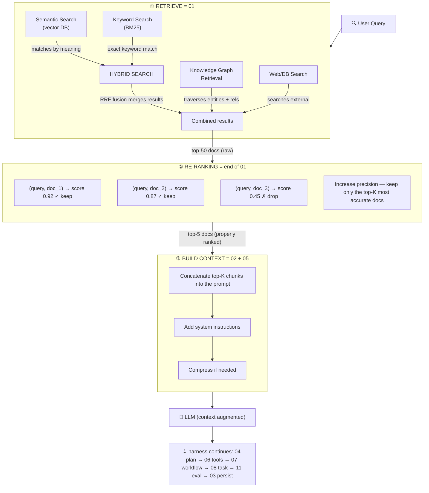

# Harness Architecture — Big Picture (01–15)

> Where does each folder fit in a real harness? This README is the map.
> Details live in `../HARNESS_ENGINEERING.md`; implementation lives in `01/`–`15/`.
> Modules `01–11` are pipeline stages; `12–15` are cross-cutting modules that wrap every stage.

## 1. What Is a Harness, in One Diagram

A harness is **everything around the LLM** that turns a single
`prompt → completion` call into a reliable `request → verified outcome` system.

```
┌──────────────────────────── REAL HARNESS LIFECYCLE ────────────────────────────┐
│                                                                                │
│  User request                                                                  │
│      │                                                                         │
│      ▼                                                                         │
│  ┌────────┐  ┌────────┐  ┌────────┐  ┌────────┐  ┌────────┐  ┌────────┐          │
│  │01 Retri│─▶│02 Build│─▶│04 Plan │─▶│05 Promp│─▶│06 Tools│─▶│ LLM    │          │
│  │eve     │  │Context │  │Decompo │  │Builder │  │Decide  │  │ call   │          │
│  └────────┘  └────────┘  └────────┘  └────────┘  └────────┘  └────┬───┘          │
│       ▲                                                          │              │
│       │                                                     tool outputs        │
│       │                                                          │              │
│       │         ┌────────┐  ┌────────┐  ┌────────┐  ┌────────▼───┐              │
│       │         │03 Updat│◀─│11 Evalu│◀─│07 Workf│◀─│08 Task     │              │
│       │         │e Memory│  │ate     │  │low     │  │Execute    │              │
│       │         └────────┘  └────────┘  └────────┘  └────────────┘              │
│       │              ▲            ▲            │                                │
│       │              │            │            ▼                                │
│       │         ┌────┴────────────┴─────┐  ┌────────┐  ┌────────┐               │
│       └─────────│09 Multi-Agent (scale │  │10 Autom│  │Guardrai│               │
│                 │   -out option)       │  │ation   │  │ls+Perms│               │
│                 └──────────────────────┘  └────────┘  │ (every │               │
│                                                       │  step) │               │
│                                                       └────────┘               │
└────────────────────────────────────────────────────────────────────────────────┘
```

Inner loop (owned by the harness runtime, e.g. Claude Code / opencode):
`LLM → tool_call → observation → LLM → … → stop`.
Outer loop (owned by you, the loop engineer):
`plan → execute → validate → fix → persist → evaluate`.

## 2. The 7 Components → 15 Modules Map

The harness has 7 logical components. This repo splits them into 11
hands-on stage modules plus 4 cross-cutting modules, so each one can be
studied and tested in isolation.

| # | Module folder | Harness component | Answers the question |
|---|---------------|-------------------|----------------------|
| 01 | `01-retrieve-memory-knowledge/` | Memory (read) | What does the agent remember that is relevant? Embeddings, chunking, vector + BM25 hybrid, rerank, RAG variants. |
| 02 | `02-build-context/` | Context management | What exactly goes into the token window, in what order, under what budget? 5-level hierarchy, compression, routing, caching. |
| 03 | `03-update-memory-store/` | Memory (write) | What is worth keeping after the task? Write-back, consolidation, versioning, audit. Companion: `trajectory-fork-replay.md`. |
| 04 | `04-plan-decompose-task/` | Orchestration (plan) | How is a big goal split into small verifiable steps? Decomposition patterns, ReAct/ReWOO/ToT, replanning. |
| 05 | `05-prompt-builder/` | Guardrails (input shaping) | How is the final prompt assembled safely? Templates, few-shot, CoT, schema enforcement, injection hardening. |
| 06 | `06-decide-tools-mcp/` | Tools + Permissions | What is the agent allowed to do, and via which tool? Registry, intent classification, MCP client, RBAC, sandbox. Companion: `code-mode-sdk.md`. |
| 07 | `07-workflow/` | Orchestration (run) | In what order do steps run, retry, compensate? Sequential/parallel/DAG/HSM, saga, circuit breaker, tracing. Companion: `cordis-kernel-plugin.md`. |
| 08 | `08-task/` | Orchestration (unit of work) | What is one trackable unit? Lifecycle, DAG deps, priority, budget, timeout/cancel. Thinnest module — start here if lost. |
| 09 | `09-multi-agent/` | Orchestration (scale-out) | When does one agent become a team? Roles, protocols, shared memory, conflict resolution. Only needed when 04+07 hit limits. |
| 10 | `10-automation/` | Feedback (scheduled) | What runs without a human asking? CI/CD, schedulers, self-healing loops with iteration/cost guards. |
| 11 | `11-evaluation/` | Feedback (measured) | Did it actually work? Rubrics, trajectory metrics, LLM-judge, regression, benchmarks. Companion: `minimal-benchmark-harness.md`. |
| 12 | `12-sandbox-execution/` | **Cross-cutting: execution** | Where does untrusted code run? Isolation tiers, five mandatory controls, per-role matrix. Canonical home of the sandbox concept. |
| 13 | `13-trajectory-observability/` | **Cross-cutting: observability** | How is every run recorded? Event contract, session stream, fork/replay/resume, join keys. Map to `03/.../trajectory-fork-replay.md` (engine). |
| 14 | `14-compaction-context/` | **Cross-cutting: context** | How do long runs survive the token ceiling? 70% policy, pruning, memory contract, compaction-safe prompts. |
| 15 | `15-approval-gates/` | **Cross-cutting: control** | Who authorizes irreversible actions? Risk tiers, gate payload, timeout-deny, pause/resume, audit. |

Guardrails + Permissions are **not a stage** — they wrap every arrow in the
diagram above (input check, tool approval, output validation).

## 3. Request Lifecycle, End to End

A typical coding request, e.g. *"Fix login bug"*:

1. **Retrieve (01).** Embed the query, hybrid-search vector DB + BM25,
   rerank top-k. Output: ranked chunks with scores. Fallback if empty.
2. **Build context (02).** Merge system instructions + task goal + retrieved
   chunks + conversation summary + immediate files into a token budget
   (e.g. 100k). Truncate low-priority first. Mark untrusted content.
3. **Plan (04) → Task graph (08).** Produce a DAG of tasks:
   `reproduce → locate → patch → test`. Each task has id, inputs, budget,
   timeout, approval flag.
4. **Build prompt (05).** Render per-task prompt from a versioned template,
   inject few-shot examples, attach output schema.
5. **Decide tools (06).** Intent classifier picks tools
   (`read_file`, `run_tests`, …). Permission check: can this task write
   outside `src/`? Dangerous op → pause for approval.
6. **Execute workflow (07).** Run the DAG. Sequential where dependent,
   parallel where independent. Retry with backoff, circuit-break on
   repeated failure, saga compensation on partial success.
7. **Inner tool loop.** LLM calls tools, harness executes them in a sandbox,
   returns observations. Memoize identical calls, cap result size.
8. **Validate (11).** Syntax check, run tests, LLM-judge rubric, trajectory
   metrics (steps used, tool precision, recovery). Fail → replan or escalate.
9. **Persist (03).** Write back what matters: success pattern, new fact,
   updated file summary. Version it. Drop ephemeral noise.
10. **Automate (10) / Scale out (09) — optional.** Schedule regression, or
    fan out to reviewer/tester agents with shared memory.

Every step emits **trajectory events** (see §4), so a run can be replayed,
forked, or audited later (`03-update-memory-store/trajectory-fork-replay.md`).

### 3.1. Where the RAG Pipeline Lives

The classic RAG pipeline (retrieve → re-rank → build context → LLM) is the
**head of the lifecycle** — it ends at the first LLM call, the harness
carries on from there:



| RAG stage | Harness module | Notes |
|-----------|----------------|-------|
| ① Retrieve (hybrid + KG + web, top-50) | `01-retrieve-memory-knowledge` | Embeddings, chunking, hybrid + RRF fusion, GraphRAG variant, external sources |
| ② Re-ranking (cross-encoder, top-5) | End of `01` (input to `02`) | Precision filter only — nothing enters the prompt yet |
| ③ Build context (concat + system + compress) | `02-build-context` (+ `05-prompt-builder` renders it) | Merges system/goal/chunks/history/immediate into a token budget, marks untrusted content |
| 🧠 LLM | Inner tool loop (`06` → `07` → `08`) | RAG ends here; the harness loop (plan → execute → validate → persist) takes over |

Key point: RAG does **not** run once. It re-runs on every task / every
inner-loop iteration whose query changes (replan in `04` → retrieve again
in `01`). RAG alone gives a good one-shot answer; the rest of the lifecycle
is what makes an end-to-end agent.

## 4. The Three Shared Contracts

If the 11 modules share nothing else, share these three shapes:

**A. Trajectory event** — the single source of truth for debugging:

```typescript
interface TrajectoryEvent {
  id: string;            // evt_01H…
  sessionId: string;
  parentTaskId?: string; // link to 08-task
  ts: number;
  kind: "prompt" | "tool_call" | "tool_result" | "plan" | "eval" | "memory_write" | "approval";
  payload: unknown;
  tokens?: { in: number; out: number };
  latencyMs?: number;
}
```

**B. Context object** — what 02 builds and 05 renders:

```typescript
interface BuiltContext {
  system: string;        // identity, rules (never truncated)
  goal: string;          // current task + definition of done
  retrieved: Chunk[];    // from 01, with scores
  history: string;       // compressed summary, not raw log
  immediate: FileSnap[]; // open files, diffs
  budget: { limit: number; used: number };
}
```

**C. Task node** — what 04 creates, 07 runs, 08 tracks:

```typescript
interface TaskNode {
  id: string;
  title: string;
  status: "pending" | "running" | "blocked" | "done" | "failed";
  idempotencyKey: string; // safe to retry
  needsApproval: boolean;
  budget: { maxSteps: number; maxTokens: number; timeoutMs: number };
  deps: string[];
}
```

## 5. How to Read This Folder

- **New to harness?** Read in this order: `08` → `07` → `02` → `06` →
  `01` → `03` → `04` → `05` → `11` → `10` → `09`, then cross-cutting:
  `12` → `13` → `14` → `15`.
- **Building a minimal harness?** `02 + 05 + 06 + 07 + 11` is enough.
  Add `01/03` when you need memory, `04/08` when tasks get complex,
  `09/10` last.
- **Debugging a bad run?** Start from the trajectory (`03/trajectory-fork-replay.md`),
  then check `02` (wrong context?), `06` (wrong tool?), `11` (wrong rubric?).

## 6. Companion Docs

| File | What it adds beyond the module README |
|------|----------------------------------------|
| `03-update-memory-store/trajectory-fork-replay.md` | Session event stream, fork/replay/resume implementation |
| `06-decide-tools-mcp/code-mode-sdk.md` | Code-mode vs JSON tool-call pattern + sandbox sketch |
| `07-workflow/cordis-kernel-plugin.md` | Micro-kernel + plugin lifecycle, 4 runtime modes |
| `11-evaluation/minimal-benchmark-harness.md` | Minimal isolation harness for unbiased capability eval |
| `../HARNESS_ENGINEERING.md` | Full theory: 7 components, SOLID, 10 commandments, case studies (SWE-agent, Anthropic, Claude Code leak, Cursor, DeepSeek) |

## 7. Known Gaps (Contributions Welcome)

Former cross-cutting gaps now have homes: sandbox → `12`, trajectory → `13`,
compaction → `14`, approvals → `15`. Remaining items no single module owns yet:
PII/secret scrubbing pipeline, tenant isolation, cost-per-task SLOs.
Per-module gaps are listed in each README's supplement section.
