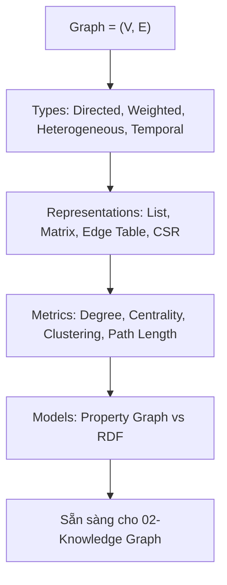

# 🧱 01. Foundations — Nền Tảng Graph Engineering

> ## 📑 Mục Lục
>
> - [Câu Chuyện Mở Đầu](#câu-chuyện-mở-đầu)
> - [Tại Sao Foundations Quan Trọng?](#tại-sao-foundations-quan-trọng)
> - [Tổng Quan](#tổng-quan)
> - [Nội Dung](#nội-dung)
> - [1. Graph Là Gì? Định Nghĩa & Thuật Ngữ](#1-graph-là-gì-định-nghĩa--thuật-ngữ)
> - [2. Các Loại Graph](#2-các-loại-graph)
> - [3. Biểu Diễn Graph (Representations)](#3-biểu-diễn-graph-representations)
> - [4. Metrics & Đặc Trưng Của Graph](#4-metrics--đặc-trưng-của-graph)
> - [5. Property Graph vs RDF Triple Store](#5-property-graph-vs-rdf-triple-store)
> - [6. Labs Thực Hành](#6-labs-thực-hành)
> - [Tài Liệu Tham Khảo](#tài-liệu-tham-khảo)

---

### Câu Chuyện Mở Đầu

Năm 1736, Euler giải bài toán **7 cây cầu Königsberg**: có thể đi qua mỗi cây cầu đúng một lần và quay về điểm xuất phát không? Ông vẽ các vùng đất thành **nodes**, các cây cầu thành **edges** — và khai sinh ra **Graph Theory**.

300 năm sau, cùng một abstraction đó mô tả:
- Mạng xã hội (người —[follows]→ người)
- Codebase (function —[calls]→ function)
- Tri thức doanh nghiệp (hợp đồng —[approved_by]→ người —[reports_to]→ quản lý)

**Graph không phải cấu trúc dữ liệu mới. Nó là cách nhìn thế giới như một mạng lưới quan hệ.**

### Tại Sao Foundations Quan Trọng?

> *"Không hiểu graph types và representations, bạn sẽ chọn sai DB, viết sai query, và đo sai metric."*

#### 3 Bằng Chứng

| # | Nguồn | Phát Hiện |
|---|-------|-----------|
| 1 | **Stanford CS224W** | Chọn sai representation (adjacency matrix vs list) làm **chậm 100×** trên sparse graphs |
| 2 | **Neo4j Benchmark (2024)** | Property graph nhanh hơn RDF triple store **3-5×** cho traversal queries 2-3 hops |
| 3 | **Microsoft GraphRAG** | Hiểu community structure (modularity) giúp chọn đúng Leiden resolution → tăng 15% answer quality |

---

## Tổng Quan

Module này cung cấp **nền tảng lý thuyết và thực hành** để mọi module sau dựa vào:



---

## Nội Dung

| # | Chủ đề | Mô tả |
|---|--------|-------|
| 1 | [Graph Là Gì?](#1-graph-là-gì-định-nghĩa--thuật-ngữ) | Định nghĩa, thuật ngữ, ví dụ trực quan |
| 2 | [Các Loại Graph](#2-các-loại-graph) | Directed, weighted, heterogeneous, temporal, hypergraph |
| 3 | [Biểu Diễn](#3-biểu-diễn-graph-representations) | Adjacency list/matrix, edge list, CSR, so sánh |
| 4 | [Metrics](#4-metrics--đặc-trưng-của-graph) | Degree, centrality, clustering, path, modularity |
| 5 | [Property Graph vs RDF](#5-property-graph-vs-rdf-triple-store) | So sánh mô hình, khi nào dùng gì |
| 6 | [Labs](#6-labs-thực-hành) | NetworkX hands-on |

---

## 1. Graph Là Gì? Định Nghĩa & Thuật Ngữ

### 1.1 Định Nghĩa Toán Học

```
G = (V, E)

V = tập đỉnh (Vertices / Nodes) — thực thể
E = tập cạnh (Edges / Relations) — quan hệ

Ví dụ:
V = {Alice, Bob, Project Phoenix, Contract C-2024}
E = { (Alice, APPROVES, Contract C-2024),
      (Bob, REPORTS_TO, Alice),
      (Contract C-2024, BELONGS_TO, Project Phoenix) }
```

**Triple (Subject, Predicate, Object)** chính là một edge có hướng:

```
(S) Alice  —[REPORTS_TO]→ (O) Bob
 ▲           ▲                ▲
 │           │                │
Subject   Predicate         Object
```

### 1.2 Thuật Ngữ Cốt Lõi

> **📌 Giải thích:** Graph là cấu trúc dữ liệu gồm **nodes** (điểm) và **edges** (đường nối). Mọi quan hệ trong thế giới thực đều có thể biểu diễn bằng graph.

| Thuật ngữ | Ý nghĩa | Ví dụ trực quan |
|-----------|---------|-----------------|
| **Node / Vertex** | Thực thể — bất kỳ "thứ gì" bạn muốn mô tả | Người (Alice), Dự án (Phoenix), Tài liệu (Hợp đồng C-2024) |
| **Edge / Relation** | Mối quan hệ giữa 2 nodes — **có hướng** hoặc **vô hướng** | Alice **→ MANAGES →** Bob (có hướng: Alice quản lý Bob, không ngược lại) |
| **Label** | "Nhãn" phân loại — giống kiểu dữ liệu trong programming | `Person` (loại node), `MANAGES` (loại edge) |
| **Property** | Thuộc tính附加 (key-value) trên node hoặc edge | `Person{name: "Alice", role: "CTO", age: 35}` |
| **Degree** | Số lượng edges nối với 1 node —越多 degree =越多 kết nối | Alice có 3 edges → degree = 3 |
| **Path** | Chuỗi nodes nối liên tiếp bởi edges — giống "con đường" đi từ A đến B | `Alice → Bob → Carol` là path độ dài 2 (2 hops) |
| **Neighbor** | Nodes kề trực tiếp (1-hop) — "xóm giềng" | Neighbors của Alice = {Bob, Contract} |
| **Subgraph** | Một phần của graph — lấy 1 node và tất cả nodes xung quanh | Subgraph 1-hop của Phoenix = Phoenix + tất cả nodes nối trực tiếp |
| **Community** | Nhóm nodes liên kết chặt chẽ với nhau, ít liên kết với bên ngoài | Team AI trong org chart — họ làm việc chung, báo cáo chung |

### 1.3 Ví Dụ Trực Quan

```
     ┌──────────┐
     │  Alice   │ (Person)
     │ CTO      │
     └────┬─────┘
          │ MANAGES
          ▼
     ┌──────────┐     APPROVES     ┌──────────────┐
     │  Bob     │─────────────────►│ Contract     │
     │ Engineer │                  │ C-2024       │
     └────┬─────┘                  └──────┬───────┘
          │ BELONGS_TO                    │ BELONGS_TO
          ▼                               ▼
     ┌──────────┐                  ┌──────────────┐
     │ Project  │                  │ Project      │
     │ Phoenix  │◄─────────────────│ Phoenix      │
     └──────────┘                  └──────────────┘
```

---

## 2. Các Loại Graph

### 2.1 Phân Loại Chi Tiết

> **📌 Hiểu nhanh:** "Loại graph" = câu trả lời cho câu hỏi *"Quan hệ của bạn có đặc điểm gì?"* Có hướng không? Có trọng số không? Có nhiều loại thực thể không? Mỗi khi bạn chọn wrong type, bạn sẽ viết code không đúng hoặc truy vấn sai.

```
┌─────────────────┬─────────────────────────────────────────┬──────────────────┐
│ Loại            │ Đặc điểm                                │ Ví dụ            │
├─────────────────┼─────────────────────────────────────────┼──────────────────┤
│ Directed        │ Edge có hướng (A→B ≠ B→A)               │ REPORTS_TO       │
│ Undirected      │ Edge vô hướng (A—B = B—A)               │ COLLABORATES_WITH│
│ Weighted        │ Edge có trọng số (confidence, strength) │ KNOWS {weight:0.9}│
│ Heterogeneous   │ Nhiều loại node/edge khác nhau          │ Person, Project  │
│ Homogeneous     │ Một loại node/edge                      │ Social network   │
│ Bipartite       │ 2 tập nodes, chỉ nối chéo               │ User—Item        │
│ Temporal        │ Edge có thời gian (valid_from/until)    │ WORKS_AT (2020→) │
│ Hypergraph      │ Edge nối >2 nodes                       │ Meeting {3 người}│
│ Knowledge Graph │ Directed + Heterogeneous + Labeled      │ Enterprise KG    │
└─────────────────┴─────────────────────────────────────────┴──────────────────┘
```

#### Giải thích từng loại — dễ hiểu nhất:

| Loại | "Dịch ra tiếng người" | Khi nào thì gặp? | Ví dụ cụ thể |
|------|----------------------|-------------------|--------------|
| **Directed** | Mối quan hệ chỉ đi **một chiều**, như tên đường một chiều | Org chart, quyền truy cập | "Alice `REPORTS_TO` Bob" — Bob *không* report cho Alice |
| **Undirected** | Mối quan hệ **hai chiều như nhau**, như quan hệ bạn bè | Mạng xã hội, collaboration | "Alice `COLLABORATES` Bob" — tính chất giống nhau từ cả 2 phía |
| **Weighted** | Edge mang **"độ mạnh"** của quan hệ, như mức độ tình bạn | Hệ thống khuyến nghị, scoring | `KNOWS {weight: 0.92}` — biết rõ, vs `weight: 0.3` — quen sơ sơ |
| **Heterogeneous** | Graph chứa **nhiều kiểu thực thể khác nhau**, như một tổ chức có Person, Project, Document | Hầu hết Knowledge Graph | Person → Project → Document (mỗi loại node khác nhau) |
| **Homogeneous** | Chỉ **một loại thực thể** duy nhất | Mạng xã hội thuần (chỉ người) | Facebook friends: tất cả là Person |
| **Bipartite** | Chia làm **2 nhóm, chỉ kết nối chéo** giữa 2 nhóm | Mua sắm, phim ảnh | User—Movie (user ta quen movie, movie quen user, 2 user không kết nối) |
| **Temporal** | Quan hệ **có thời gian hiệu lực**, như hợp đồng có ngày hết hạn | Nhân sự, sản phẩm, lịch sử | "Alice `WORKS_AT` Công ty X từ 2020→2024" — hết hạn rồi thì không còn đúng |
| **Hypergraph** | Một edge nối **nhiều hơn 2 nodes** cùng lúc, như một cuộc họp nhiều người | Họp bàn, teamwork | Meeting: {Alice, Bob, Carol} cùng tham dự → 1 edge nối cả 3 |
| **Knowledge Graph** | **"Bản đồ tri thức"** — kết hợp mọi loại trên: có hướng, nhiều loại, có nhãn | Enterprise KG, GraphRAG | `Person -[MANAGES]→ Person -[BELONGS_TO]→ Project` |

#### Tại sao phải hiểu rõ loại graph? (Nếu bạn chọn sai)

```
❌ Chọn Undirected khi thực tế là Directed:
   Alice—Bob (vô hướng) → truy vấn "ai báo cáo cho ai?" ✅ chạy được
                          nhưng kết quả SAI — mất hướng quan hệ

✅ Chọn Directed đúng:
   Alice→Bob → trả lời chính xác "Alice reports to Bob", "Bob quản lý Alice" là SAI

❌ Chọn bỏ qua Temporal:
   "Alice quản lý Team B" (hết hạn 2024) → vẫn trả lời đúng thông tin cũ
   
✅ Chọn Temporal:
   Thêm valid_until → chỉ trả lời quan hệ đang còn hiệu lực
```

### 2.2 Khi Nào Dùng Loại Nào?

> **📌 Khái Niệm Bổ Sung: Homophily vs Heterophily**
>
> **Homophily** = các nodes **cùng loại/cùng tính chất có xu hướng nối nhau** ("đồng thanh tương ứng"). Ví dụ: bạn bè thường chung sở thích, đồng nghiệp cùng team hay trao đổi, trang web cùng chủ đề hay link nhau.
>
> **Heterophily** = ngược lại — các nodes **khác nhau mới nối nhau**. Ví dụ: **fraud detection** (fraudster cố liên lạc với người lành), virus network (người lạ tiếp xúc người bệnh), cyber attack (kẻ tấn công tìm nạn nhân).
>
> **Tại sao phải biết?** Vì **GNN chuẩn (GCN/GraphSAGE) mặc định giả định homophily** — distance gần nghĩa là cùng label. Trên graph heterophily, GNN tiêu chuẩn hoạt động kém và bạn cần biến thể chuyên dụng (`link prediction` module 07). Đây là 1 quyết định ít người nghĩ tới nhưng quyết định chất lượng model.

```python
# Directed: quan hệ có hướng
# REPORTS_TO: Alice reports to Bob ≠ Bob reports to Alice
G_directed = nx.DiGraph()
G_directed.add_edge("Alice", "Bob", relation="REPORTS_TO")

# Weighted: độ tin cậy khác nhau
# KNOWS với confidence từ extraction
G_weighted = nx.Graph()
G_weighted.add_edge("Alice", "Bob", weight=0.92, source="email_123")

# Temporal: quan hệ thay đổi theo thời gian
# Alice WORKS_AT Company X từ 2020, chuyển sang Y năm 2024
G_temporal_data = {
    "nodes": ["Alice", "CompanyX", "CompanyY"],
    "edges": [
        {"from": "Alice", "to": "CompanyX", "type": "WORKS_AT", "valid": "[2020, 2024)"},
        {"from": "Alice", "to": "CompanyY", "type": "WORKS_AT", "valid": "[2024, now)"},
    ]
}

# Heterogeneous: nhiều loại
# Codebase graph: File, Function, Class là node types khác nhau
hetero_schema = {
    "node_types": ["File", "Function", "Class", "Test"],
    "edge_types": ["DEFINES", "CALLS", "INHERITS", "TESTED_BY"]
}
```

---

## 3. Biểu Diễn Graph (Representations)

> **📌 Hiểu nhanh:** "Biểu diễn graph" = **cách bạn lưu graph vào bộ nhớ / file**. Cùng một graph, có nhiều cách lưu khác nhau — mỗi cách có "điểm mạnh" và "điểm yếu" riêng. Giống như bạn có thể lưu cùng một danh bạ dưới dạng giấy, Excel, hoặc đám mây — nội dung giống nhau nhưng cách tra cứu rất khác.

**Ví dụ trực quan nhất** — cùng graph "Alice biết Bob, Bob biết Carol":

```
Graph thực tế:          Alice ──── Bob ──── Carol

Cách 1 — Adjacency List (danh sách kề):  giống "ai là bạn của ai"
  Alice → [Bob]
  Bob   → [Alice, Carol]
  Carol → [Bob]

Cách 2 — Matrix (ma trận):               giống "bảng check ✓/✗"
          Alice  Bob  Carol
  Alice    0     1     0
  Bob      1     0     1
  Carol    0     1     0

Cách 3 — Edge List (danh sách cạnh):     giống "danh sách cặp đôi"
  (Alice, Bob)
  (Bob, Carol)
```

### 3.1 So Sánh Chi Tiết

| Representation | Memory (bộ nhớ) | Traversal (đi thăm) | Dễ hiểu như | Best For |
|----------------|------------------|----------------------|-------------|----------|
| **Adjacency List** | O(V + E) — nhỏ gọn | O(degree) — nhanh | Danh bạ "ai quen ai" | Sparse graphs (hầu hết KG) |
| **Adjacency Matrix** | O(V²) — tốn khi graph thưa | O(1) lookup — cực nhanh | Bảng ✓/✗ đầy đủ | Dense graphs, matrix ops |
| **Edge List** | O(E) — nhẹ nhất | O(E) scan — phải quét hết | Hóa đơn liệt kê quan hệ | Storage, streaming, ETL |
| **CSR (Compressed)** | O(V + E) — gọn như list | O(degree) — nhanh | Danh bạ nén tối ưu | Large-scale, GNN training |
| **Property Table** | O(V + E) — như DB | O(index) — rất nhanh | Bảng tính có cột thuộc tính | Neo4j, Kuzu (DB native) |

#### Giải thích từng cách — "khi nào chọn gì":

| Cách lưu | Ưu điểm | Nhược điểm | Tình huống dùng |
|----------|---------|------------|-----------------|
| **Adjacency List** | Gọn, dễ viết code, tìm neighbors nhanh | Muốn biết "A nối B không?" phải tìm trong list | Dùng để **học tập, prototype** — NetworkX chính là cái này |
| **Adjacency Matrix** | Kiểm tra 2 nodes có kết nối = nhìn 1 ô (O(1)) | Graph 100K nodes → matrix 10 tỷ ô, tốn thiếu bộ nhớ | Chỉ khi graph **đặc** (dense) hoặc cần toán ma trận |
| **Edge List** | Đơn giản nhất để **lưu file / truyền qua mạng** | Muốn tìm neighbors phải quét toàn bộ — chậm | ETL, export parquet/csv, streaming ingest |
| **CSR** | Vừa nén gọn vừa traversal nhanh | Khó đọc, khó sửa | Graph triệu nodes, train GNN trên GPU |
| **Property Table** | Có index, transaction, hỗ trợ query phức tạp | Phải chạy database server | Production, cần truy vấn linh hoạt |

### 3.2 Code Minh Họa

<details>
<summary>Python Code — 4 Representations (Click để xem)</summary>

```python
import networkx as nx
import numpy as np

# Tạo graph mẫu
edges = [("Alice", "Bob"), ("Bob", "Carol"), ("Alice", "Carol"), ("Carol", "Dave")]
G = nx.Graph()
G.add_edges_from(edges)

# 1. Adjacency List (dict of sets) — phổ biến nhất
adj_list = {n: list(G.neighbors(n)) for n in G.nodes()}
print("Adjacency List:", adj_list)
# {'Alice': ['Bob', 'Carol'], 'Bob': ['Alice', 'Carol'], ...}

# 2. Adjacency Matrix (V x V)
nodes = sorted(G.nodes())
matrix = nx.adjacency_matrix(G, nodelist=nodes).todense()
print("Adjacency Matrix:\n", matrix)
# [[0 1 1 0]
#  [1 0 1 0]
#  [1 1 0 1]
#  [0 0 1 0]]

# 3. Edge List (đơn giản nhất, dễ serialize)
edge_list = list(G.edges(data=True))
print("Edge List:", edge_list)
# [('Alice', 'Bob', {}), ('Bob', 'Carol', {}), ...]

# 4. CSR — dùng cho large-scale / GNN
# (scipy sparse matrix)
from scipy.sparse import csr_matrix
csr = csr_matrix(matrix)
print("CSR:", csr.data, csr.indices, csr.indptr)

# 5. Property Graph (Neo4j-style) — node/edge có properties
G_prop = nx.DiGraph()
G_prop.add_node("Alice", label="Person", age=35, role="CTO")
G_prop.add_node("Phoenix", label="Project", budget=500000)
G_prop.add_edge("Alice", "Phoenix", type="MANAGES", since="2024-01-01", confidence=0.95)
print("Properties:", dict(G_prop.nodes(data=True)))
```

</details>

### 3.3 Chọn Representation — Quyết Định Từng Bước

```
Bạn có bao nhiêu nodes?
├── Chưa biết, chưa rõ yêu cầu   → Adjacency List (NetworkX) — đơn giản, linh hoạt nhất
├── <10K nodes, cần traversal nhanh → Adjacency List (NetworkX)
├── >1M nodes, cần train GNN      → CSR (PyG / DGL)
├── Cần lưu lâu dài + truy vấn phức tạp → Property Table (Neo4j / Kuzu)
├── Graph đặc, ít nhất 30% đầy đủ → Adjacency Matrix + GPU
└── Cần ETL, export, streaming    → Edge List (parquet / csv)
```

**Nguyên tắc vàng cho người mới:** Bắt đầu bằng **Adjacency List** (NetworkX). Chỉ chuyển sang cách khác khi bạn *đo được* vấn đề (chậm, tốn bộ nhớ). Đừng tối ưu sớm khi chưa biết vấn đề thực sự.

---

## 4. Metrics & Đặc Trưng Của Graph

> **📌 Hiểu nhanh:** Metrics = **thước đo** giúp bạn trả lời câu hỏi *"Graph này có đặc điểm gì?"* Vài ví dụ: Node nào quan trọng nhất? Nhóm nào kết nối chặt? Graph có "đặc" hay "thưa" không?

### 4.1 Metrics Quan Trọng

> **Bắt đầu từ 3 metrics Basics trước:** `Degree` (ai kết nối nhiều), `Path Length` (các node cách nhau bao xa), `Clustering` (bạn bè có quen nhau không). Hiểu 3 cái này rồi mới học đến `Centrality` và `Modularity` (khó hơn).

| Metric | Ý nghĩa "tiếng người" | Ví dụ minh họa |
|--------|------------------------|----------------|
| **Degree** | Node có **bao nhiêu mối quan hệ**? | Alice quản lý 2 người + 1 contract → degree = 3 |
| **In/Out-degree** | (Directed) Degree **đi vào** vs **đi ra** | Bob "nhận" 1 lệnh (in=1), "phát" 2 lệnh (out=2) |
| **Centrality (Degree)** | Node này **quan trọng vì kết nối nhiều** không? | Người có 50 contacts vs người có 2 contacts |
| **Centrality (Betweenness)** | **Cầu nối** — nằm trên bao nhiêu con đường ngắn nhất giữa người khác? | Middle-man: bỏ anh ta ra thì 2 đội không liên lạc được nhau |
| **Centrality (PageRank)** | Node được **"vote" bởi các node quan trọng** → càng được vote nhiều càng quan trọng | Google: trang web quan trọng → tìm ra trang quan trọng tiếp theo |
| **Clustering Coeff.** | Bạn bè của node này có **là bạn bè của nhau** không? | Nhóm 5 người hay họp → clustering cao; người quen rời rạc → thấp |
| **Path Length** | 2 nodes **cách nhau bao xa**? | "Alice cách Khách hàng X 3 quan hệ" |
| **Diameter** | Khoảng cách **xa nhất** giữa 2 nodes bất kỳ | "Xa nhất cũng chỉ 6 tay bắt" (6 degrees of separation) |
| **Modularity** | Các nhóm có **tách biệt rõ ràng** không? | Q cao = cộng đồng rõ ràng (team A tách team B) |
| **Density** | Graph **đặc** (nhiều kết nối) hay **thưa**? | Mạng xã hội đầy đủ (dense) vs email cá nhân (sparse) |

### 4.2 Code — Tính Metrics

<details>
<summary>Python Code — Graph Metrics với NetworkX (Click để xem)</summary>

```python
import networkx as nx

G = nx.karate_club_graph()  # Graph mẫu 34 nodes

# Degree
degrees = dict(G.degree())
print(f"Avg degree: {sum(degrees.values())/len(degrees):.1f}")

# Centrality
betweenness = nx.betweenness_centrality(G)
pagerank = nx.pagerank(G)
print(f"Top betweenness: {sorted(betweenness, key=betweenness.get, reverse=True)[:3]}")
print(f"Top PageRank: {sorted(pagerank, key=pagerank.get, reverse=True)[:3]}")

# Clustering
clustering = nx.average_clustering(G)
print(f"Average clustering: {clustering:.3f}")

# Path
print(f"Diameter: {nx.diameter(G)}")
print(f"Avg shortest path: {nx.average_shortest_path_length(G):.2f}")

# Community (modularity)
import community as community_louvain  # python-louvain
partition = community_louvain.best_partition(G)
modularity = community_louvain.modularity(partition, G)
print(f"Modularity: {modularity:.3f}, Communities: {len(set(partition.values()))}")
```

</details>

### 4.3 Khi Nào Dùng Metric Nào?

> **Nguyên tắc:** Chọn metric theo **câu hỏi bạn đang muốn trả lời**, không phải theo "metric nào hay".

| Mục đích | Metric | Câu hỏi ví dụ |
|----------|--------|---------------|
| Tìm người quan trọng nhất (nhiều kết nối) | Degree Centrality | "Ai là trung tâm của mạng lưới nội bộ?" |
| Tìm người là **cầu nối** / bottleneck | Betweenness | "Ai là người chặn mọi quy trình duyệt → loại role này thì chậm process?" |
| Tìm người được tôn trọng (được những người quan trọng vote) | PageRank | "Ai thực sự có ảnh hưởng dù không giao tiếp nhiều?" |
| Tìm nhóm liên kết chặt (cho GraphRAG) | Clustering + Modularity | "Chia 1000 entities thành các chủ đề để tóm tắt từng nhóm?" |
| Đo độ phức tạp codebase | Density + avg degree | "File nào nhiều dependencies nhất, dễ gãy khi thay đổi?" |
| Đặt `max_hops` cho traversal | Diameter + avg path length | "Traverse bao nhiêu hops là đủ để không bỏ sót thông tin?" |

---

## 5. Property Graph vs RDF Triple Store

```
┌─────────────────────────┬──────────────────────────────────┬──────────────────────────────────┐
│ Khía cạnh               │ Property Graph (Neo4j, Kuzu)     │ RDF Triple Store (Jena, Virtuoso)│
├─────────────────────────┼──────────────────────────────────┼──────────────────────────────────┤
│ Đơn vị                  │ Node + Edge có properties        │ Triple (S, P, O) + URI          │
│ Schema                  │ Flexible, label-based            │ Strict, ontology (OWL/RDFS)      │
│ Query language          │ Cypher / GQL                     │ SPARQL                           │
│ Properties trên edge    │ Native (edge["weight"]=0.9)      │ Reification (phức tạp)           │
│ Reasoning               │ Thủ công (code)                  │ Built-in (OWL inference)         │
│ Ecosystem               │ Lớn, production-ready            │ Academic, semantic web           │
│ Best for                │ Enterprise KG, GraphRAG, coding  │ Linked data, ontology-heavy      │
└─────────────────────────┴──────────────────────────────────┴──────────────────────────────────┘
```

**Khuyến nghị cho AI Coding Skills Framework:** Dùng **Property Graph** (Neo4j/Kuzu/NetworkX). RDF chỉ khi làm việc với linked open data hoặc yêu cầu OWL reasoning.

Ví dụ Property Graph (Cypher):

```cypher
// Tạo nodes + edges với properties
CREATE (a:Person {name: 'Alice', role: 'CTO'})
CREATE (b:Person {name: 'Bob', role: 'Engineer'})
CREATE (p:Project {name: 'Phoenix', budget: 500000})
CREATE (a)-[:MANAGES {since: '2024-01-01'}]->(b)
CREATE (b)-[:WORKS_ON {role: 'Lead'}]->(p)

// Truy vấn: ai quản lý project Phoenix?
MATCH (person:Person)-[:MANAGES*1..2]->(proj:Project {name: 'Phoenix'})
RETURN person.name
```

Ví dụ RDF (SPARQL):

```sparql
# Tạo triple
# <Alice> <manages> <Bob> .
# <Bob> <worksOn> <Phoenix> .
# Truy vấn
SELECT ?person WHERE {
  ?person <manages> ?someone .
  ?someone <worksOn> <Phoenix> .
}
```

---

## 6. Labs Thực Hành

### Lab 1: Xây Graph Đầu Tiên với NetworkX

```python
import networkx as nx
import matplotlib.pyplot as plt

G = nx.DiGraph()
G.add_node("Alice", type="Person", role="CTO")
G.add_node("Bob", type="Person", role="Engineer")
G.add_node("Phoenix", type="Project", budget=500000)
G.add_edges_from([
    ("Alice", "Bob", {"type": "MANAGES"}),
    ("Bob", "Phoenix", {"type": "WORKS_ON"}),
])

print(f"Nodes: {list(G.nodes(data=True))}")
print(f"Edges: {list(G.edges(data=True))}")
print(f"Is DAG? {nx.is_directed_acyclic_graph(G)}")

# Vẽ
nx.draw(G, with_labels=True, node_color="lightblue", arrows=True)
plt.show()
```

### Lab 2: So Sánh Traversal Performance

```python
import time

# Tạo graph lớn 10K nodes
G_large = nx.erdos_renyi_graph(10000, 0.001)

start = time.time()
path = nx.shortest_path(G_large, source=0, target=100)
print(f"Shortest path length: {len(path)}, time: {(time.time()-start)*1000:.1f}ms")

start = time.time()
centrality = nx.degree_centrality(G_large)
print(f"Degree centrality time: {(time.time()-start)*1000:.1f}ms")
```

### Lab 3: Tạo Codebase Graph Mini

```python
# Graph cho codebase: File → Function → Calls
G_code = nx.DiGraph()
G_code.add_node("main.py", type="File")
G_code.add_node("handlePayment", type="Function", file="main.py")
G_code.add_node("validateCard", type="Function", file="utils.py")
G_code.add_edges_from([
    ("main.py", "handlePayment", {"type": "DEFINES"}),
    ("handlePayment", "validateCard", {"type": "CALLS"}),
])

# Truy vấn: hàm nào gọi validateCard?
callers = list(G_code.predecessors("validateCard"))
print(f"Callers of validateCard: {callers}")
```

---

## Tài Liệu Tham Khảo

- Stanford CS224W — *Machine Learning with Graphs* (Lecture 1: Graph Theory Basics)
- Neo4j GraphAcademy — *Graph Data Modeling Fundamentals*
- NetworkX Documentation — *Algorithms & Metrics* (https://networkx.org)
- *Graph Theory* — Diestel (textbook, free online)

---

*Tiếp theo: [02 — Knowledge Graph Construction](../02-knowledge-graph/)*
