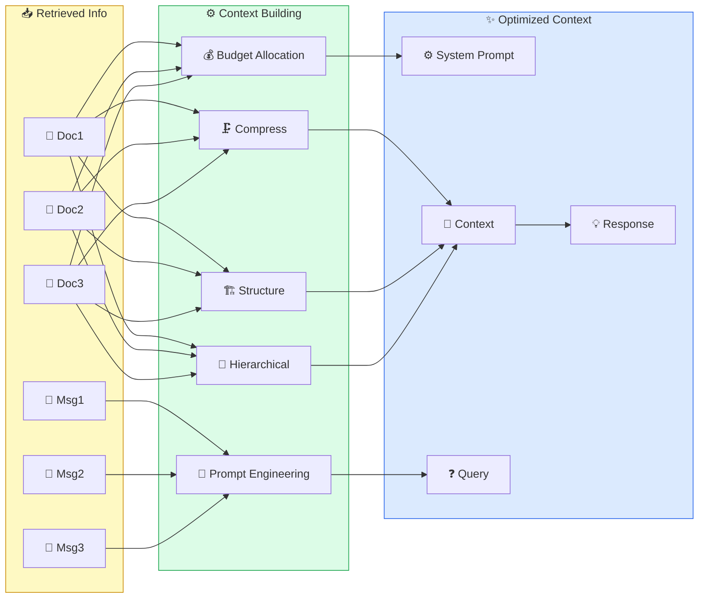

# 🔨 II. Build Context

> ## 📑 Mục Lục
>
> - [Tổng Quan](#tổng-quan)
> - [Tại Sao Build Context Quan Trọng?](#tại-sao-build-context-quan-trọng)
> - [Nội Dung](#nội-dung)
> - [1. Context Window Management](#1-context-window-management)
>   - [1.1 Context Window Là Gì?](#11-context-window-là-gì)
>   - [1.2 Token Budget Allocation](#12-token-budget-allocation)
>   - [1.3 Context Window Sizes — So Sánh](#13-context-window-sizes-so-sánh)
>   - [1.4 "Lost in the Middle" Problem](#14-lost-in-the-middle-problem)
> - [2. Context Construction Strategies](#2-context-construction-strategies)
>   - [2.1 5 Strategies Tổng Quan](#21-5-strategies-tổng-quan)
>   - [2.2 Context Building Patterns — Code Examples](#22-context-building-patterns-code-examples)
>   - [2.3 4 Chain Types của LangChain (Stuff / Map-Reduce / Refine / Context Compression)](#23-4-chain-types-của-langchain-stuff-map-reduce-refine-context-compression)
> - [3. Context Compression & Summarization](#3-context-compression-summarization)
>   - [3.1 Tại Sao Cần Compression?](#31-tại-sao-cần-compression)
>   - [3.2 Compression Techniques](#32-compression-techniques)
>   - [3.3 Compression Comparison](#33-compression-comparison)
>   - [3.4 SmartContextManager — Case Study (Claude Code Leak)](#34-smartcontextmanager-case-study-claude-code-leak)
> - [4. Prompt Engineering for Context](#4-prompt-engineering-for-context)
>   - [4.1 Prompt Templates](#41-prompt-templates)
>   - [4.2 Advanced Prompt Techniques](#42-advanced-prompt-techniques)
> - [5. Hierarchical Context](#5-hierarchical-context)
>   - [5.1 Cấu Trúc Phân Cấp](#51-cấu-trúc-phân-cấp)
>   - [5.2 Implementation](#52-implementation)
> - [6. Streaming Context](#6-streaming-context)
>   - [6.1 Khái Niệm](#61-khái-niệm)
>   - [6.2 Implementation](#62-implementation)
> - [7. Context Engineering Case Studies](#7-context-engineering-case-studies)
>   - [7.1. Claude Code — Hệ Thống Context 5 Cấp Độ](#71-claude-code-hệ-thống-context-5-cấp-độ)
>   - [7.2. Cursor IDE — Context-Aware Coding](#72-cursor-ide-context-aware-coding)
>   - [7.3. Production RAG Pipeline — Context Engineering At Scale](#73-production-rag-pipeline-context-engineering-at-scale)
> - [8. Advanced Context Patterns](#8-advanced-context-patterns)
>   - [8.1. Context Routing](#81-context-routing)
>   - [8.2. RAG Fusion Pattern](#82-rag-fusion-pattern)
>   - [8.3. Context Caching Strategy](#83-context-caching-strategy)
>   - [8.4. Multi-turn Context Management](#84-multi-turn-context-management)
> - [9. Best Practices & Anti-Patterns](#9-best-practices-anti-patterns)
>   - [9.1. Context Building Best Practices](#91-context-building-best-practices)
>   - [9.2. Common Anti-Patterns](#92-common-anti-patterns)
> - [10. Context Validation & Testing](#10-context-validation-testing)
>   - [Integration Testing](#integration-testing)
> - [11. Performance Metrics & Optimization](#11-performance-metrics-optimization)
>   - [11.1. Context Quality Metrics](#111-context-quality-metrics)
>   - [11.2. Cost Optimization Strategies](#112-cost-optimization-strategies)
> - [12. Complete Production Pipeline](#12-complete-production-pipeline)
> - [13. Labs Thực Hành](#13-labs-thực-hành)
>   - [Lab 1: Context Budget Demo](#lab-1-context-budget-demo)
>   - [Lab 2: RAG Fusion Demo](#lab-2-rag-fusion-demo)
>   - [Lab 3: Context Cache Performance](#lab-3-context-cache-performance)
>   - [Lab 4: Context Validation](#lab-4-context-validation)
>   - [Lab 5: Context Routing](#lab-5-context-routing)
> - [14. Tài Liệu Tham Khảo](#14-tài-liệu-tham-khảo)
>   - [Papers & Research](#papers-research)
>   - [Frameworks & Tools](#frameworks-tools)
>   - [Blogs & Resources](#blogs-resources)
>   - [Courses & Tutorials](#courses-tutorials)
>
---

### Câu Chuyện Mở Đầu

Hãy tưởng tượng bạn là diễn giả trước 200 người. Trên bàn có 200 slide. Nếu bạn chiếu hết 200 slide cùng lúc — khán giả choáng ngợp, chẳng ai hiểu gì. Nếu bạn chỉ chiếu 3 slide trống — khán giả cũng chẳng hiểu gì.

**Đó chính xác là vấn đề của Build Context.**

Bạn đã retrieve được thông tin tuyệt vời từ bước 01. Nhưng nếu bạn **đưa hết tất cả vào prompt** — model bị overload, mất focus, và trả lời kém đi. Nếu bạn **đưa quá ít** — model thiếu thông tin và hallucinate.

Build Context là nghệ thuật **tổ chức thông tin đúng cách, đúng lúc, đúng lượng** — giống như một diễn giả giỏi biết cách chọn lọc thông tin trước khi phát biểu.

### Tại Sao Build Context Quan Trọng?

> *"Context is the new prompt — trong modern AI engineering, context thay thế prompt engineering truyền thống."*

#### 3 Bằng Chứng Khoa Học

| # | Nghiên Cứu | Phát Hiện Quan Trọng |
|---|-----------|----------------------|
| 1 | **Google (2024) — "Lost in the Middle"** | Accuracy giảm **từ 76% xuống còn 20%** khi info quan trọng nằm giữa context. Đặt đầu/cuối → accuracy 80%+ |
| 2 | **Anthropic (2025) — Context Window Research** | Context window 200K KHÔNG có nghĩa dùng hết. Optimal ở **40-60% utilization** |
| 3 | **Princeton SWE-agent (2024)** | Structured context tăng task completion **từ 14% lên 34%** trên SWE-bench |

## Tổng Quan

> **📌 Khái Niệm Cơ Bản**
>
> **Khái niệm:** Build Context là quá trình tổ chức, chọn lọc và quản lý thông tin (tài liệu retrieve được, lịch sử chat, kết quả tool...) rồi sắp xếp chúng thành prompt sẵn sàng đưa cho LLM.
>
> **Ẩn dụ/so sánh:** Giống một đầu bếp giỏi: nguyên liệu thì nhiều, nhưng món ngon chỉ cần vài nguyên liệu chính được nêm nếm và bày biện hợp lý — không phải đổ cả chợ vào nồi.
>
> **Vì sao quan trọng:** Cùng một lượng kiến thức, cách tổ chức khác nhau làm thay đổi rất lớn chất lượng câu trả lời.

**Build Context** là quá trình **tổ chức và quản lý thông tin** để đưa vào prompt của LLM. Context tốt giúp model hiểu rõ hơn, trả lời chính xác hơn, và tránh hallucination.



## Tại Sao Build Context Quan Trọng?

> **📌 Khái Niệm Cơ Bản**
>
> **Khái niệm:** Build Context là quá trình chuyển thông tin retrieve được thành ngữ cảnh tối ưu cho LLM — gồm phân bổ token, nén bớt, xếp thứ tự ưu tiên và định dạng prompt.
>
> **Ẩn dụ/so sánh:** Giống một giáo viên chuẩn bị giáo án: dạy cả 200 trang giáo trình thì học sinh không nuốt nổi, nhưng chọn đúng vài trang trọng tâm thì học sinh hiểu ngay.
>
> **Vì sao quan trọng:** Model chỉ thông minh bằng lượng thông tin được đưa vào đúng cách — không tổ chức context tốt thì retrieve hay đến mấy cũng trả lời kém.

> **"It's not about how much you know — it's about how much you can put in front of the model at the right time."**
> — Andrej Karpathy, 2025

### Bối Cảnh

Bạn đã retrieve được thông tin tuyệt vời từ bước 01. Nhưng nếu bạn **đưa hết tất cả vào prompt** — model sẽ bị overload, mất focus, và trả lời kém đi. Nếu bạn **đưa quá ít** — model thiếu thông tin và hallucinate.

Build Context là nghệ thuật **tổ chức thông tin đúng cách, đúng lúc, đúng lượng** — giống như một diễn giả giỏi biết cách chọn lọc thông tin trước khi phát biểu.

### Triết Lý Cốt Lõi

1. **Context is the new prompt**: Trong modern AI engineering, context thay thế prompt engineering truyền thống
2. **Quality over quantity**: 1000 tokens context tốt hơn 10,000 tokens context nhiễu
3. **Structure matters**: Cùng 1 nội dung, tổ chức khác nhau → kết quả khác nhau 40-60%

### Tại Sao Không Thể Bỏ Qua?

```
┌──────────────────────────────────────────────────────────────────┐
│            TẠI SAO BUILD CONTEXT QUAN TRỌNG?                     │
│                                                                  │
│  VẤN ĐỀ:                                                         │
│  ┌──────────────────────────────────────────────────────────┐   │
│  │ ❌ Context window giới hạn (8K-200K tokens)             │   │
│  │ ❌ "Needle in a haystack": Info quan trọng bị chôn      │   │
│  │ ❌ Token cost: Mỗi token = tiền ($0.001-0.03/1K)       │   │
│  │ ❌ "Lost in the middle": Model quên info ở giữa         │   │
│  └──────────────────────────────────────────────────────────┘   │
│                                                                  │
│  GIẢI PHÁP:                                                      │
│  ┌──────────────────────────────────────────────────────────┐   │
│  │ ✅ Smart budget allocation: Phân bổ token thông minh    │   │
│  │ ✅ Hierarchical context: System > Docs > Query          │   │
│  │ ✅ Compression: Giảm 50-80% tokens giữ nguyên info     │   │
│  │ ✅ Prioritization: Info quan trọng lên đầu/cuối        │   │
│  └──────────────────────────────────────────────────────────┘   │
│                                                                  │
└──────────────────────────────────────────────────────────────────┘
```

### Bằng Chứng Nghiên Cứu

**1. Google (2024) — "Lost in the Middle"**
- Model accuracy giảm **từ 76% xuống còn 20%** khi thông tin quan trọng nằm giữa context
- Info đặt đầu/cuối context → accuracy 80%+

**2. Anthropic (2025) — Context Window Research**
- context window 200K tokens KHÔNG có nghĩa dùng hết 200K
- Optimal performance ở **40-60% context utilization**

**3. Princeton SWE-agent (2024)**
- Structured context tăng task completion **từ 14% lên 34%** trên SWE-bench

### Cost-Benefit Analysis

```
┌──────────────────────────────────────────────────────────────────┐
│                COST-BENEFIT: BUILD CONTEXT                        │
│                                                                  │
│  KHÔNG CÓ CONTEXT MANAGEMENT:                                   │
│  ├── Token usage: 100% (full context mỗi lần)                  │
│  ├── Cost: $0.03 × 100K tokens = $3/query                      │
│  ├── Accuracy: 50-60% (noise (nhiễu))                              │
│  └── Latency: Cao (quá nhiều tokens)                           │
│                                                                  │
│  CÓ CONTEXT MANAGEMENT:                                         │
│  ├── Token usage: 40-60% (smart selection)                     │
│  ├── Cost: $0.03 × 50K tokens = $1.5/query                     │
│  ├── Accuracy: 75-85% (focused context)                        │
│  └── Latency: Thấp hơn (fewer tokens)                          │
│                                                                  │
│  ROI: Giảm 50% cost + Tăng 25-40% accuracy                     │
└──────────────────────────────────────────────────────────────────┘
```

### Analogies

| Analogies | Giải thích |
|-----------|------------|
| **Valizer du lịch** | Context window = valizer 50kg. Bạn không nhét được 100kg. Phải chọn đồ quan trọng nhất |
| **Bài thuyết trình** | Slide 200 trang = không ai hiểu. Slide 10 trang tốt = mọi người hiểu ngay |
| **Thuốc kê toa** | Thuốc đúng bệnh 3 viên/ngày > thuốc sai bệnh 30 viên/ngày |

### Nếu Bạn Bỏ Qua?

```
❌ Hậu quả:
├── "Lost in the middle": Info quan trọng bị model bỏ qua
├── Hallucination tăng vì context nhiễu
├── Chi phí API tăng 2-5x vì dùng hết token budget
├── Response chậm hơn vì processing quá nhiều tokens
└── User experience tệ → adoption rate drops

💰 Chi phí:
├── Mỗi 1K tokens thừa × 10K queries/ngày = ~$300/tháng lãng phí
├── Accuracy giảm → manual review costs
└── Scaling issues: 2x queries = 2x cost (linear thay vì sub-linear)
```

### Evolutionary Context

```
┌──────────────────────────────────────────────────────────────────┐
│              TIẾN HÓA CỦA CONTEXT BUILDING                      │
│                                                                  │
│  2023: PROMPT ENGINEERING                                        │
│  ┌─────────────────────────────────┐                            │
│  │ "Viết prompt hay → kết quả hay"│                            │
│  │ Context = thứ yếu              │                            │
│  │ Problem: Prompt length limits   │                            │
│  └─────────────────────────────────┘                            │
│                    │                                              │
│                    ▼                                              │
│  2024: CONTEXT ENGINEERING                                      │
│  ┌─────────────────────────────────┐                            │
│  │ "Context thay thế prompt"       │                           │
│  │ Larger windows → more context   │                           │
│  │ Problem: Quality degrades       │                           │
│  └─────────────────────────────────┘                            │
│                    │                                              │
│                    ▼                                              │
│  2025-2026: STRUCTURED CONTEXT                                  │
│  ┌─────────────────────────────────┐                            │
│  │ "Context must be engineered"    │                           │
│  │ Budget allocation + hierarchy   │                           │
│  │ Compression + prioritization    │                           │
│  └─────────────────────────────────┘                            │
│                    │                                              │
│                    ▼                                              │
│  2027+: ADAPTIVE CONTEXT                                        │
│  ┌─────────────────────────────────┐                            │
│  │ "Self-organizing context"       │                           │
│  │ Agent chooses what to include   │                           │
│  │ Dynamic context optimization    │                           │
│  └─────────────────────────────────┘                            │
│                                                                  │
└──────────────────────────────────────────────────────────────────┘
```

---

## Nội Dung

> **📌 Khái Niệm Cơ Bản**
>
> **Khái niệm:** Bảng mục lục khái quát toàn bộ module — từ quản lý context window, chiến lược xây dựng context, nén, prompt, đến các case study thực tế và lab thực hành.
>
> **Ẩn dụ/so sánh:** Giống thực đơn của nhà hàng: đọc nhanh để biết có những "món" nào, rồi bấm vào từng món để xem chi tiết.
>
> **Vì sao quan trọng:** Giúp bạn định hướng nhanh phần nào cần đọc trước, phần nào chỉ cần đọc khi gặp bài toán tương ứng.

| # | Chủ đề | Mô tả |
|---|--------|-------|
| 1 | [Context Window Management](#1-context-window-management) | Quản lý kích thước context window |
| 2 | [Context Construction Strategies](#2-context-construction-strategies) | Các chiến lược xây dựng context |
| 3 | [Context Compression](#3-context-compression--summarization) | Nén và tóm tắt context |
| 4 | [Prompt Engineering for Context](#4-prompt-engineering-for-context) | Prompt templates cho context |
| 5 | [Hierarchical Context](#5-hierarchical-context) | Cấu trúc context phân cấp |
| 6 | [Streaming Context](#6-streaming-context) | Xử lý context real-time |

---

## 1. Context Window Management

> **📌 Khái Niệm Cơ Bản**
>
> **Khái niệm:** Học cách quản lý "sức chứa" của model — context window — và cách phân bổ chỗ trống đó cho từng thành phần như system prompt, tài liệu retrieve, lịch sử chat và câu hỏi.
>
> **Ẩn dụ/so sánh:** Context window giống sức chứa của một chiếc khay: có giới hạn ô, phải sắp xếp ai ở chỗ nào cho hợp lý, và biết món nào phải bỏ khi khay đầy.
>
> **Vì sao quan trọng:** Phân bổ token sai là nguyên nhân số một khiến model thiếu thông tin hoặc trả lời kém, dù thông tin đã có đủ.

### 1.1 Context Window Là Gì?

Context window là **bộ nhớ tạm thời** của LLM — tất cả token mà model có thể "nhìn thấy" tại một thời điểm. Quản lý nó hiệu quả là kỹ năng quan trọng nhất.

Nói nôm na: context window giống cái bàn làm việc của model — bàn càng rộng thì đặt được càng nhiều giấy tờ, nhưng giấy tờ quá nhiều lại khiến khó tìm đúng tờ mình cần.

```
┌──────────────────────────────────────────────────────────────────┐
│                   CONTEXT WINDOW ANATOMY                         │
│                                                                  │
│  ◄─────────────────── Total Context (e.g., 128K tokens) ──────► │
│                                                                  │
│  ┌────────────────────────────────────────────────────────────┐  │
│  │░░░░░░░ System Prompt ░░░░░░░░░░░░░░░░░░░░░░░░░░░░░░░░░░░░│  │
│  │░░░░░░░ (Instructions, personality, rules)  ~500 tokens ░░░░│  │
│  ├────────────────────────────────────────────────────────────┤  │
│  │████████ Retrieved Context █████████████████████████████████│  │
│  │████████ (RAG documents, knowledge base)    2K-8K tokens ███│  │
│  ├────────────────────────────────────────────────────────────┤  │
│  │▓▓▓▓▓▓▓▓ Conversation History ▓▓▓▓▓▓▓▓▓▓▓▓▓▓▓▓▓▓▓▓▓▓▓▓▓▓▓│  │
│  │▓▓▓▓▓▓▓▓ (Past messages)              Variable ▓▓▓▓▓▓▓▓▓▓▓▓│  │
│  ├────────────────────────────────────────────────────────────┤  │
│  │▒▒▒▒▒▒▒▒ Tool Results ▒▒▒▒▒▒▒▒▒▒▒▒▒▒▒▒▒▒▒▒▒▒▒▒▒▒▒▒▒▒▒▒▒▒│  │
│  │▒▒▒▒▒▒▒▒ (API responses, code output)  Variable ▒▒▒▒▒▒▒▒▒▒│  │
│  ├────────────────────────────────────────────────────────────┤  │
│  │                                                            │  │
│  │  User Query                                  100-500 tokens│  │
│  │                                                            │  │
│  ├────────────────────────────────────────────────────────────┤  │
│  │                                                            │  │
│  │  Reserved for Output                        1K-4K tokens   │  │
│  │                                                            │  │
│  └────────────────────────────────────────────────────────────┘  │
│                                                                  │
│  ⚠️  Khi context đầy:                                          │
│  - FIFO: Xóa message cũ nhất                                  │
│  - Truncation: Cắt bớt context (mất thông tin!)              │
│  - Error: Reject request                                       │
│                                                                  │
└──────────────────────────────────────────────────────────────────┘
```

### 1.2 Token Budget Allocation

**Token Budget Allocation** là quá trình **phân bổ số lượng token (đơn vị đo lường của LLM) cho từng thành phần** bên trong context window: system prompt, retrieved context, conversation history, tool results và user query.

**Ý nghĩa:**
- Context window có giới hạn (ví dụ 128K tokens) → nếu không phân bổ, một thành phần sẽ "ăn hết" chỗ của thành phần khác, khiến model thiếu thông tin cần thiết.
- Phân bổ hợp lý giúp **tối đa hóa thông tin hữu ích** trong khi vẫn đảm bảo model còn chỗ dành cho output.
- Phân bổ **động** (dynamic allocation) theo loại câu hỏi giúp tối ưu từng tình huống: câu hỏi đơn giản cần ít retrieved context, câu hỏi retrieval nặng cần nhiều retrieved context hơn.

<details>
<summary>Python Code (Click to expand/collapse)</summary>

```python
class ContextBudget:
    """
    Quản lý ngân sách token cho các thành phần context
    
    Mục tiêu: Phân bổ token một cách thông minh để maximize
    thông tin trong khi respects context window limit
    """
    
    def __init__(self, total_tokens=128000, reserve_output=4000):
        self.total = total_tokens
        self.reserve_output = reserve_output
        self.available = total_tokens - reserve_output
        
        # Default allocation (tunable)
        self.allocation = {
            "system_prompt": 0.05,      # 5% - Instructions
            "retrieved_context": 0.50,  # 50% - RAG documents
            "conversation": 0.30,       # 30% - Chat history
            "tool_results": 0.10,       # 10% - Tool/API outputs
            "user_query": 0.05,         # 5%  - Current query
        }
    
    def get_budget(self, component):
        """Get max tokens for a specific component"""
        return int(self.available * self.allocation.get(component, 0))
    
    def adjust_for_query_type(self, query_type):
        """
        Dynamic allocation based on query complexity
        
        query_type: "simple", "complex", "conversational", "retrieval"
        """
        if query_type == "simple":
            # Simple questions need less context
            self.allocation = {
                "system_prompt": 0.10,
                "retrieved_context": 0.30,
                "conversation": 0.40,
                "tool_results": 0.10,
                "user_query": 0.10,
            }
        elif query_type == "complex":
            # Complex questions need more context
            self.allocation = {
                "system_prompt": 0.05,
                "retrieved_context": 0.60,
                "conversation": 0.15,
                "tool_results": 0.15,
                "user_query": 0.05,
            }
        elif query_type == "conversational":
            # Conversations need more history
            self.allocation = {
                "system_prompt": 0.05,
                "retrieved_context": 0.20,
                "conversation": 0.55,
                "tool_results": 0.10,
                "user_query": 0.10,
            }
        elif query_type == "retrieval":
            # Heavy RAG needs most context space
            self.allocation = {
                "system_prompt": 0.03,
                "retrieved_context": 0.70,
                "conversation": 0.10,
                "tool_results": 0.12,
                "user_query": 0.05,
            }
    
    def fit_text_to_budget(self, text, component, tokenizer_func=None):
        """
        Truncate or compress text to fit within budget
        
        tokenizer_func: function(text) -> list of tokens
        """
        budget = self.get_budget(component)
        
        if tokenizer_func:
            tokens = tokenizer_func(text)
            if len(tokens) <= budget:
                return text
            # Truncate
            truncated_tokens = tokens[:budget]
            return "".join(truncated_tokens)  # simplified
        else:
            # Rough estimate: ~4 chars per token
            max_chars = budget * 4
            if len(text) <= max_chars:
                return text
            return text[:max_chars] + "\n[...truncated...]"
    
    def report(self):
        """Print budget allocation report"""
        print(f"\n{'='*55}")
        print(f"{'CONTEXT BUDGET REPORT':^55}")
        print(f"{'='*55}")
        print(f"{'Total Context:':<30} {self.total:>12,} tokens")
        print(f"{'Output Reserve:':<30} {self.reserve_output:>12,} tokens")
        print(f"{'Available:':<30} {self.available:>12,} tokens")
        print(f"{'-'*55}")
        
        for comp, pct in self.allocation.items():
            tokens = self.get_budget(comp)
            bar = '█' * int(pct * 40)
            print(f"  {comp:<25} {tokens:>8,}  {pct*100:>4.0f}% {bar}")
        
        print(f"{'='*55}")


# Usage
budget = ContextBudget(total_tokens=128000)
budget.report()

# Adjust for different scenarios
print("\n--- For Complex RAG Query ---")
budget.adjust_for_query_type("complex")
budget.report()
```

</details>

```
OUTPUT:
=======================================================
              CONTEXT BUDGET REPORT               
=======================================================
Total Context:                        128,000 tokens
Output Reserve:                         4,000 tokens
Available:                            124,000 tokens
-------------------------------------------------------
  system_prompt                    6,200    5% ██
  retrieved_context               62,000   50% ████████████████████████
  conversation                    37,200   30% ██████████████
  tool_results                    12,400   10% ████
  user_query                       6,200    5% ██
=======================================================
```

### 1.3 Context Window Sizes — So Sánh

**Context Window Sizes** là **kích thước tối đa của context window** mà mỗi mô hình hỗ trợ — tức là số token tối đa mà model có thể "nhìn thấy" trong một lần suy luận.

**Ý nghĩa của việc so sánh kích thước:**
- Giúp **chọn đúng mô hình cho đúng bài toán**: model context nhỏ (4K-8K) phù hợp tác vụ đơn giản và rẻ; model context lớn (128K-1M) phù hợp xử lý tài liệu dài, mã nguồn lớn.
- **Context window lớn hơn KHÔNG đồng nghĩa với tốt hơn** — nhiều context hơn đồng nghĩa nhiều nhiễu hơn và dễ gặp "Lost in the Middle".
- Model chạy local qua Ollama (gemma3:12b, Llama 3.1) có context 128K, miễn phí, phù hợp triển khai RAG tại chỗ.

```
┌──────────────────────────────────────────────────────────────────┐
│               CONTEXT WINDOW SIZES ACROSS MODELS                 │
│                                                                  │
│  Model                    Context    Price     Best For          │
│  ──────────────────────── ────────── ───────── ──────────────   │
│  GPT-3.5 Turbo            4K/16K    $         Simple tasks      │
│  GPT-4                     8K/32K    $$$       General           │
│  GPT-4 Turbo               128K      $$$       Large documents   │
│  GPT-4o                    128K      $$$       Multimodal        │
│  Claude 3 Haiku            200K      $         Fast & large      │
│  Claude 3 Opus             200K      $$$$      Complex reasoning │
│  Gemini 1.5 Pro            1M        $$$       Massive context   │
│  Gemini 2.5 Pro            1M+       $$$       Latest            │
│  Llama 3.1 (8B)            128K      Free*     Open source       │
│  gemma3:12b (your model)   128K      Free*     Local RAG         │
│                                                                  │
│  * Free locally with Ollama                                      │
│                                                                  │
│  BIGGER CONTEXT ≠ BETTER                                        │
│  ├── "Lost in the Middle" problem                              │
│  ├── Models focus on beginning and end of context              │
│  ├── More context = more noise potential                       │
│  └── Better to have SMALL + RELEVANT context                  │
│                                                                  │
└──────────────────────────────────────────────────────────────────┘
```

### 1.4 "Lost in the Middle" Problem

**"Lost in the Middle" Problem** mô tả hiện tượng: **LLM tập trung chú ý vào thông tin ở ĐẦU và CUỐI context window, nhưng bỏ qua (hoặc ghi nhớ kém) thông tin nằm ở GIỮA.**

Giống như học sinh thường nhớ nhất lời giảng ở đầu giờ và cuối giờ, còn phần giữa tiết học thì dễ bị bỏ lơ — LLM cũng có xu hướng "quên" những gì nằm giữa context.

**Ý nghĩa / Tại sao quan trọng:**
- Nghiên cứu Google (2024): accuracy giảm **từ 76% xuống 20%** khi thông tin quan trọng nằm giữa context.
- Ảnh hưởng trực tiếp đến RAG: nếu document quan trọng bị xếp vào giữa context → model có thể bỏ qua, dẫn đến trả lời thiếu hoặc sai.
- Giải pháp chính: xếp thông tin quan trọng ở đầu/cuối, dùng re-ranking để đưa document tốt nhất lên đầu, và nén context để giảm nhiễu.

```
┌──────────────────────────────────────────────────────────────────┐
│              THE "LOST IN THE MIDDLE" PROBLEM                    │
│                                                                  │
│  Research Finding: LLMs pay more attention to information       │
│  at the BEGINNING and END of the context,                      │
│  but less attention to information in the MIDDLE.              │
│                                                                  │
│  Attention Pattern:                                             │
│                                                                  │
│  High  ┃████                                              ████┃ │
│        ┃████                                              ████┃ │
│        ┃██████                                          ████┃  │
│  Med   ┃████████                                      ████┃    │
│        ┃██████████                                  ████┃      │
│        ┃████████████                              ████┃        │
│  Low   ┃████████████████████████████████████████████┃          │
│        ┗━━━━━━━━━━━━━━━━━━━━━━━━━━━━━━━━━━━━━━━━━━━━━━━━━━━━━━│
│         Beginning              Middle              End          │
│                                                                  │
│  SOLUTIONS:                                                     │
│  1. Put most important info at BEGINNING and END               │
│  2. Use shorter context (fewer, better docs)                   │
│  3. Repeat key information at strategic positions              │
│  4. Use re-ranking to put best docs first                      │
│  5. Use structured prompts that guide attention                │
│                                                                  │
└──────────────────────────────────────────────────────────────────┘
```

---

## 2. Context Construction Strategies

> **📌 Khái Niệm Cơ Bản**
>
> **Khái niệm:** Các chiến lược quyết định cách biến thông tin retrieve được thành context — nhét hết, lọc bớt, nén, sắp xếp có cấu trúc, hay tự động chọn theo từng câu hỏi.
>
> **Ẩn dụ/so sánh:** Như đóng gói chuyến đi: nhét cả tủ đồ vào vali thì nặng nề; chọn vài bộ đồ thiết yếu thì nhẹ và đủ dùng; cuộn nén quần áo thì gọn gàng hơn.
>
> **Vì sao quan trọng:** Chọn đúng chiến lược giúp model tập trung vào thông tin cần thiết, cắt giảm chi phí token và giảm nhiễu.

> **Đọc nhanh:** 2.1, 2.2, 2.3 nhìn context construction ở **3 góc độ KHÁC NHAU** của cùng một vấn đề — chúng không phải là 3 bộ phân loại cạnh tranh, mà bổ sung cho nhau:
>
> | Subsection | Góc nhìn | Trả lời câu hỏi |
> |---|---|---|
> | **2.1 — 5 Strategies** | **Chiến lược** (trừu tượng) | "Tôi muốn xử lý thông tin theo hướng nào?" — nhét hết, lọc, nén, cấu trúc, hay tự thích ứng? |
> | **2.2 — 5 Patterns** | **Triển khai** (code mẫu) | "Tình huống cụ thể của tôi cần code gì?" — trích dẫn, sắp xếp, phân loại, theo hội thoại, đa nguồn |
> | **2.3 — 4 Chain Types** | **Framework cụ thể** (LangChain) | "Dùng LangChain thì chọn tham số `chain_type` nào?" — stuff / map-reduce / refine / compression |
>
> Cùng một chiến lược (2.1) có thể được triển khai bằng pattern (2.2) và/hoặc chọn chain type (2.3) — xem bảng mapping ở cuối 2.3.

### 2.1 5 Strategies Tổng Quan

**Context Construction Strategies** là các **chiến lược tổ chức thông tin đã retrieve được thành context trước khi đưa vào prompt** — quyết định cách sắp xếp, lọc bỏ và định dạng tài liệu đầu vào cho LLM.

**Ý nghĩa:**
- Không phải cứ retrieve bao nhiêu là nhét bấy nhiêu vào prompt — mỗi chiến lược có đánh đổi riêng giữa **độ đầy đủ** (completeness) và **độ sạch/ngắn gọn** (precision).
- Chọn sai chiến lược dẫn đến: context nhiễu (giảm accuracy), token lãng phí (tăng chi phí), hoặc thiếu thông tin (hallucination).
- Chiến lược **ADAPTIVE** (thích ứng) là hướng đi hiện đại: tự động chọn chiến lược phù hợp dựa trên loại câu hỏi.

5 chiến lược chính:

```
┌──────────────────────────────────────────────────────────────────┐
│              CONTEXT CONSTRUCTION STRATEGIES                      │
│                                                                  │
│  Strategy 1: PASS-THROUGH                                       │
│  ┌──────────────────────────────────────────────────────────┐   │
│  │ Retrieved ──► All docs ──► Directly into prompt          │   │
│  │ ✅ Simple, ✅ Complete info                              │   │
│  │ ❌ Noisy, ❌ Token waste                                 │   │
│  └──────────────────────────────────────────────────────────┘   │
│                                                                  │
│  Strategy 2: SELECTIVE                                          │
│  ┌──────────────────────────────────────────────────────────┐   │
│  │ Retrieved ──► Filter by relevance ──► Top-K only         │   │
│  │ ✅ Focused, ✅ Token-efficient                           │   │
│  │ ❌ May miss relevant info                                │   │
│  └──────────────────────────────────────────────────────────┘   │
│                                                                  │
│  Strategy 3: COMPRESSED                                         │
│  ┌──────────────────────────────────────────────────────────┐   │
│  │ Retrieved ──► LLM summarizes ──► Compact version         │   │
│  │ ✅ Efficient, ✅ Key info preserved                      │   │
│  │ ❌ May lose details, ❌ Extra LLM call                   │   │
│  └──────────────────────────────────────────────────────────┘   │
│                                                                  │
│  Strategy 4: STRUCTURED                                         │
│  ┌──────────────────────────────────────────────────────────┐   │
│  │ Retrieved ──► Categorize ──► Organized by type/topic     │   │
│  │ ✅ Organized, ✅ Easy to scan                           │   │
│  │ ❌ Schema design overhead                                │   │
│  └──────────────────────────────────────────────────────────┘   │
│                                                                  │
│  Strategy 5: ADAPTIVE                                           │
│  ┌──────────────────────────────────────────────────────────┐   │
│  │ Query analysis ──► Choose strategy ──► Dynamic assembly  │   │
│  │ ✅ Optimal for each query                                │   │
│  │ ❌ Complex to implement                                  │   │
│  └──────────────────────────────────────────────────────────┘   │
│                                                                  │
└──────────────────────────────────────────────────────────────────┘
```

### 2.2 Context Building Patterns — Code Examples

**Context Building Patterns** là các **mẫu code cụ thể hóa chiến lược xây dựng context trong thực tế** — mỗi pattern giải quyết một tình huống điển hình khi tích hợp RAG.

**Ý nghĩa:**
- **Citation-based**: Gán số nguồn [1], [2]... cho từng tài liệu → model trích dẫn đúng nguồn, dễ kiểm chứng (quan trọng cho lĩnh vực pháp lý, y tế).
- **Relevance-ranked**: Sắp xếp tài liệu theo độ liên quan → giảm "Lost in the Middle", đặt thông tin quan trọng ở đầu/cuối.
- **Categorized**: Nhóm tài liệu theo chủ đề → model dễ dàng tìm và tổng hợp thông tin theo category.
- **Conversation-aware**: Kết hợp hồ sơ người dùng + lịch sử chat + tài liệu → câu trả lời cá nhân hóa và theo ngữ cảnh hội thoại.
- **Multi-source**: Kết hợp nhiều nguồn (official, expert, database...) với thứ tự ưu tiên rõ ràng → cân bằng độ tin cậy.

<details>
<summary>Python Code (Click to expand/collapse)</summary>

```python
import json
from datetime import datetime

# ============================================================
# PATTERN 1: Citation-based Context
# ============================================================
def build_citation_context(documents):
    """
    Gán số nguồn [1], [2], [3]... cho mỗi document
    
    Phù hợp khi cần trích dẫn nguồn trong câu trả lời
    """
    context_parts = []
    for i, doc in enumerate(documents, 1):
        source = doc.get("source", "unknown")
        date = doc.get("date", "")
        content = doc["content"]
        context_parts.append(
            f"[{i}] ({source}, {date})\n{content}"
        )
    
    return "TÀI LIỆU THAM KHẢO:\n" + "\n\n".join(context_parts)


# ============================================================
# PATTERN 2: Relevance-ranked Context
# ============================================================
def build_ranked_context(documents, scores):
    """
    Sắp xếp context theo mức độ liên quan
    
    Thông tin quan trọng nhất ở đầu và cuối (tránh "lost in middle")
    """
    ranked = sorted(
        zip(documents, scores), 
        key=lambda x: x[1], 
        reverse=True
    )
    
    context = []
    
    # Group by relevance level
    high = [(d, s) for d, s in ranked if s > 0.8]
    medium = [(d, s) for d, s in ranked if 0.5 < s <= 0.8]
    low = [(d, s) for d, s in ranked if s <= 0.5]
    
    if high:
        context.append("🔴 THÔNG TIN QUAN TRỌNG NHẤT:")
        for doc, score in high:
            context.append(f"  • {doc['content']}")
    
    if medium:
        context.append("\n🟡 THÔNG TIN BỔ SUNG:")
        for doc, score in medium:
            context.append(f"  • {doc['content']}")
    
    if low:
        context.append("\n🔵 THÔNG TIN LIÊN QUAN:")
        for doc, score in low:
            context.append(f"  • {doc['content']}")
    
    return "\n".join(context)


# ============================================================
# PATTERN 3: Categorized Context
# ============================================================
def build_categorized_context(documents):
    """
    Phân loại context theo chủ đề/loại
    
    Giúp LLM dễ dàng tìm thông tin theo category
    """
    categories = {}
    for doc in documents:
        cat = doc.get("category", "general")
        if cat not in categories:
            categories[cat] = []
        categories[cat].append(doc)
    
    parts = []
    for cat_name, docs in sorted(categories.items()):
        parts.append(f"## {cat_name.upper()}")
        for doc in docs:
            parts.append(f"- {doc['content']}")
        parts.append("")  # blank line
    
    return "\n".join(parts)


# ============================================================
# PATTERN 4: Conversation-aware Context
# ============================================================
def build_conversational_context(query, docs, chat_history, user_profile=None):
    """
    Xây context theo cuộc trò chuyện hiện tại
    
    Kết hợp: user profile + chat history + retrieved docs
    """
    parts = []
    
    # User profile (if available)
    if user_profile:
        parts.append("👤 VỀ NGƯỜI DÙNG:")
        parts.append(f"  Tên: {user_profile.get('name', 'N/A')}")
        parts.append(f"  Sở thích: {', '.join(user_profile.get('interests', []))}")
        parts.append(f"  Ngôn ngữ: {user_profile.get('language', 'vi')}")
        parts.append("")
    
    # Recent conversation
    if chat_history:
        parts.append("💬 CUỘC TRÒ CHUYỆN GẦN ĐÂY:")
        for msg in chat_history[-5:]:  # Last 5 messages
            role = "👤" if msg["role"] == "user" else "🤖"
            parts.append(f"  {role} {msg['content'][:100]}")
        parts.append("")
    
    # Retrieved documents
    if docs:
        parts.append(f"📚 THÔNG TIN THAM KHẢO ({len(docs)} nguồn):")
        for i, doc in enumerate(docs, 1):
            relevance = doc.get("score", 0)
            parts.append(f"  [{i}] (liên quan: {relevance:.0%}) {doc['content']}")
        parts.append("")
    
    parts.append(f"❓ CÂU HỎI HIỆN TẠI: {query}")
    
    return "\n".join(parts)


# ============================================================
# PATTERN 5: Multi-source Context
# ============================================================
def build_multisource_context(sources):
    """
    Kết hợp nhiều nguồn thông tin khác nhau
    
    sources: dict of {source_name: [documents]}
    
    Ví dụ:
    - Official docs (ưu tiên cao nhất)
    - Expert analysis
    - User data
    - Web search results
    """
    priority_order = ["official", "expert", "database", "web", "general"]
    
    parts = []
    parts.append("Bạn có quyền truy cập các nguồn sau (ưu tiên giảm dần):")
    parts.append("")
    
    for source_name in priority_order:
        if source_name in sources:
            docs = sources[source_name]
            parts.append(f"=== Nguồn: {source_name.upper()} (ưu tiên: {priority_order.index(source_name)+1}) ===")
            for doc in docs:
                parts.append(f"  • {doc}")
            parts.append("")
    
    parts.append("HƯỚNG DẪN: Ưu tiên thông tin từ nguồn oficial, "
                 "sau đó đến expert, rồi đến các nguồn khác.")
    
    return "\n".join(parts)


# ============================================================
# USAGE EXAMPLE
# ============================================================
if __name__ == "__main__":
    # Sample documents
    docs = [
        {"content": "BHYT là bảo hiểm bắt buộc", "source": "Luật BHYT", 
         "category": "legal", "score": 0.95},
        {"content": "Mức đóng 4.5% lương cơ sở", "source": "QĐ 105", 
         "category": "finance", "score": 0.88},
        {"content": "Thẻ BHYT có hiệu lực 5 năm", "source": "Luật BHYT", 
         "category": "legal", "score": 0.72},
        {"content": "Khám tại tuyến huyện trở lên", "source": "Hướng dẫn", 
         "category": "medical", "score": 0.65},
    ]
    
    print("=== Citation Context ===")
    print(build_citation_context(docs))
    
    print("\n=== Categorized Context ===")
    print(build_categorized_context(docs))
```

</details>

---

### 2.3 4 Chain Types của LangChain (Stuff / Map-Reduce / Refine / Context Compression)

Đây là **4 cách build context chuẩn** trong LangChain, bạn sẽ gặp khi dùng `RetrievalQA.from_chain_type()`:

```
                    ┌─────────────────────────────────────┐
                    │       4 CHAIN TYPES                 │
                    │                                     │
                    │   STUFF       ──── pass-through    │
                    │   MAP-REDUCE  ──── compressed      │
                    │   REFINE      ──── iterative        │
                    │   COMPRESSION ──── selective        │
                    └─────────────────────────────────────┘
```

<details>
<summary><b>1. STUFF — Nhồi tất cả chunks vào prompt (Click để xem)</b></summary>

```
Input chunks: [chunk_1, chunk_2, chunk_3, chunk_4]
                    │
                    ▼
     ┌──────────────────────────────┐
     │  PROMPT:                     │
     │                              │
     │  Context:                    │
     │  - chunk_1 (300 tokens)     │
     │  - chunk_2 (250 tokens)     │
     │  - chunk_3 (400 tokens)     │
     │  - chunk_4 (350 tokens)     │
     │                              │
     │  Question: ...               │
     └──────────────────────────────┘
                    │
                    ▼
     LLM nhận ALL chunks cùng lúc
```

<details>
<summary><b>Python Code (Click to expand/collapse)</b></summary>

```python
from langchain.chains import RetrievalQA

qa_chain = RetrievalQA.from_chain_type(
    llm=llm,
    retriever=vector_store.as_retriever(),
    chain_type="stuff"  # ← nhồi tất cả vào 1 prompt
)
```

</details>

| ✅ Ưu điểm | ❌ Nhược điểm |
|-----------|-------------|
| Đơn giản, dễ debug | Token limit: context dễ bị overflow |
| Giữ nguyên thông tin gốc | Chậm khi quá nhiều chunks |
| Một lần gọi LLM duy nhất | "Lost in the middle" — thông tin giữa dễ bị bỏ qua |

**Khi nào dùng:** Context ngắn (< 4K tokens), cần độ chính xác cao, không muốn mất thông tin.

</details>

<details>
<summary><b>2. MAP-REDUCE — Tóm tắt từng chunk rồi gộp (Click để xem)</b></summary>

```
Input chunks: [chunk_1, chunk_2, chunk_3, chunk_4]
                    │
                    ▼
     ┌───────── MAP PHASE ─────────┐
     │  chunk_1 ──► LLM ──► summary_1  │
     │  chunk_2 ──► LLM ──► summary_2  │
     │  chunk_3 ──► LLM ──► summary_3  │
     │  chunk_4 ──► LLM ──► summary_4  │
     └────────────────────────────────┘
                    │
                    ▼
     ┌──────── REDUCE PHASE ────────┐
     │  summary_1 + summary_2 +       │
     │  summary_3 + summary_4 ──► LLM │
     │                      ──► final │
     └────────────────────────────────┘
                    │
                    ▼
        LLM chỉ nhìn thấy summaries
```

<details>
<summary><b>Python Code (Click to expand/collapse)</b></summary>

```python
qa_chain = RetrievalQA.from_chain_type(
    llm=llm,
    retriever=vector_store.as_retriever(),
    chain_type="map_reduce"  # ← map từng chunk rồi reduce
)
```

</details>

| ✅ Ưu điểm | ❌ Nhược điểm |
|-----------|-------------|
| Không giới hạn số lượng chunks | Có thể mất chi tiết quan trọng |
| Token-efficient | Tốn nhiều LLM calls (map mỗi chunk 1 call) |
| Xử lý được context khổng lồ | Thông tin bị paraphrase có thể sai lệch |

**Khi nào dùng:** Hàng chục documents, context rất dài (> 10K tokens), chỉ cần ý chính.

</details>

<details>
<summary><b>3. REFINE — Cập nhật câu trả lời qua từng chunk (Click để xem)</b></summary>

```
Input chunks: [chunk_1, chunk_2, chunk_3, chunk_4]
                    │
                    ▼
     ┌──────────────────────────────────┐
     │  Step 1: chunk_1 + question      │
     │    ──► LLM ──► answer_1 (draft) │
     └──────────────────────────────────┘
                    │
                    ▼
     ┌──────────────────────────────────┐
     │  Step 2: chunk_2 + answer_1      │
     │    ──► LLM ──► answer_2 (refine)│
     └──────────────────────────────────┘
                    │
                    ▼
     ┌──────────────────────────────────┐
     │  Step 3: chunk_3 + answer_2      │
     │    ──► LLM ──► answer_3 (refine)│
     └──────────────────────────────────┘
                    │
                    ▼
              ... đến chunk cuối
```

<details>
<summary><b>Python Code (Click to expand/collapse)</b></summary>

```python
qa_chain = RetrievalQA.from_chain_type(
    llm=llm,
    retriever=vector_store.as_retriever(),
    chain_type="refine"  # ← cập nhật dần dần
)
```

</details>

| ✅ Ưu điểm | ❌ Nhược điểm |
|-----------|-------------|
| Kết hợp thông tin từ nhiều nguồn | Tốn nhiều LLM calls (N chunks = N calls) |
| Iterative refinement: càng xử lý càng chính xác | Phụ thuộc vào thứ tự chunks |
| Không bị "lost in the middle" | Dễ bị "over-refine" — thay đổi ý đúng thành sai |
| Dễ dàng track từng bước | Chậm nhất trong 4 chain types |

**Khi nào dùng:** Cần phân tích sâu từng document một, câu hỏi phức tạp cần nhiều góc nhìn.

</details>

<details>
<summary><b>4. CONTEXT COMPRESSION — Nén context trước khi nhồi (Click để xem)</b></summary>

Đây là chain type riêng, không dùng `chain_type` param mà dùng `BaseDocumentCompressor`:

```
Input chunks: [chunk_1, chunk_2, chunk_3, chunk_4]
                    │
                    ▼
     ┌── CONTEXT COMPRESSOR ─────────┐
     │  chunk_1 ──► "BHYT 80-100%"    │
     │  chunk_2 ──► "tim mạch ✔"      │
     │  chunk_3 ──► ✘ (không liên quan)│
     │  chunk_4 ──► "5 năm gần nhất"  │
     └────────────────────────────────┘
                    │
                    ▼
     ┌──────────────────────────────┐
     │  Chỉ giữ chunks liên quan,   │
     │  loại bỏ nhiễu               │
     └──────────────────────────────┘
                    │
                    ▼
        ──► Sau đó vẫn STUFF vào prompt
```

<details>
<summary><b>Python Code (Click to expand/collapse)</b></summary>

```python
from langchain.retrievers.document_compressors import LLMChainExtractor
from langchain.retrievers import ContextualCompressionRetriever

# Compressor trích xuất câu liên quan từ mỗi chunk
compressor = LLMChainExtractor.from_llm(llm)

# Bọc retriever với compressor
compression_retriever = ContextualCompressionRetriever(
    base_compressor=compressor,
    base_retriever=vector_store.as_retriever()
)

# Kết hợp với STUFF chain
qa_chain = RetrievalQA.from_chain_type(
    llm=llm,
    retriever=compression_retriever,
    chain_type="stuff"
)
```

</details>

| ✅ Ưu điểm | ❌ Nhược điểm |
|-----------|-------------|
| Giảm token đáng kể | LLM compressor tốn thêm call |
| Chỉ giữ thông tin liên quan tới câu hỏi | Có thể vứt nhầm thông tin quan trọng |
| Giảm noise, tăng accuracy | Phức tạp hơn để setup |

**Khi nào dùng:** Context dài, nhiều chunks không liên quan, muốn tiết kiệm tokens và focus vào thông tin cần thiết.

</details>

---

#### Tổng Kết: Chọn Chain Type Nào?

| Chain Type | Số LLM Calls | Token Usage | Độ Chính Xác | Dùng Khi |
|-----------|:-----------:|:----------:|:-----------:|---------|
| **Stuff** | 1 | Cao nhất | Cao | Context ngắn (< 4K tokens) |
| **Map-Reduce** | N + 1 | Thấp | Trung bình | Context rất dài (> 10K chữ) |
| **Refine** | N | Cao | Cao nhất | Cần phân tích tuần tự |
| **Compression** | depends | Linh hoạt | Cao | Nhiều chunks nhiễu |

> **Ghi chú:** "Chain Types" là tên gọi của LangChain. Trong thực tế, 4 pattern này xuất hiện trong mọi RAG framework (LlamaIndex gọi là `ResponseMode`, hay trong code tự viết bạn implement manual).

#### Mối Quan Hệ: 2.1 ↔ 2.2 ↔ 2.3

Ba subsection không trình bày 3 thứ độc lập — chúng là **cùng một chiến lược được nhìn ở các mức độ khác nhau**. Bảng dưới đây map từng chiến lược (2.1) sang pattern code (2.2) và chain type LangChain (2.3):

| 2.1 — Strategy | 2.2 — Pattern (code) | 2.3 — LangChain Chain Type | Ví dụ thực tế |
|---|---|---|---|
| **PASS-THROUGH** (nhét hết) | Citation-based (gán số nguồn [1][2]...) | **STUFF** | Đưa toàn bộ tài liệu kèm số nguồn để model trích dẫn |
| **SELECTIVE** (lọc giữ tốt nhất) | Relevance-ranked (xếp theo độ liên quan) | — (tự lọc top-K trước rồi dùng stuff) | Chỉ giữ 3 tài liệu có score cao nhất, đặt quan trọng ở đầu/cuối |
| **COMPRESSED** (tóm tắt cho nhỏ) | — (thuộc mục 3 — Compression) | **MAP-REDUCE** / **CONTEXT COMPRESSION** | Tóm tắt từng document rồi gộp lại, hoặc nén trước khi nhồi |
| **STRUCTURED** (sắp xếp có tổ chức) | Categorized (nhóm theo chủ đề) | — (LangChain không có sẵn, tự làm) | Nhóm tài liệu theo legal / finance / medical |
| **ADAPTIVE** (tự chọn theo câu hỏi) | Conversation-aware / Multi-source | — (kết hợp với Router ở mục 8.1) | Câu hỏi đơn giản → ít docs + nhiều lịch sử; câu hỏi code → context file + conventions |

**Cách đọc:** Một hệ thống RAG thường kết hợp **nhiều chiến lược cùng lúc**. Ví dụ: `SELECTIVE + STRUCTURED + STUFF` = lọc top-K tài liệu, nhóm theo chủ đề, rồi nhồi toàn bộ vào một prompt duy nhất — đây chính là pattern phổ biến nhất trong production.

#### Nên Chọn 1 Hay Kết Hợp Nhiều Chiến Lược?

**Câu trả lời ngắn: Hầu như luôn KẾT HỢP nhiều chiến lược**, vì chúng giải quyết các vấn đề KHÁC NHAU ở các tầng khác nhau — không phải "chọn 1 trong 5".

**Vì sao phải kết hợp?** Mỗi chiến lược trả lời một câu hỏi riêng, ở một tầng riêng trong pipeline:

| Chiến lược | Tầng hoạt động | Giải quyết vấn đề | Ví dụ cụ thể |
|---|---|---|---|
| **SELECTIVE** | Tầng lọc (retrieval) | "Chọn tài liệu nào?" — loại nhiễu | Retrieve 50 docs → chỉ giữ top 10 |
| **COMPRESSED** | Tầng nén (post-processing) | "Làm sao cho vừa token budget?" | 10 docs × 2K tokens → mỗi doc còn ~800 |
| **STRUCTURED** | Tầng tổ chức (assembly) | "Sắp xếp context ra sao?" — tránh lost-in-middle | Nhóm theo chủ đề, quan trọng ở đầu/cuối |
| **PASS-THROUGH / STUFF** | Tầng giao (delivery) | "Đưa vào prompt thế nào?" | Nhồi toàn bộ vào 1 prompt duy nhất |
| **ADAPTIVE** | Tầng điều phối (orchestration) | "Chọn tổ hợp nào cho câu hỏi này?" | Câu hỏi đơn giản ≠ câu hỏi complex |

**Ví dụ pipeline production điển hình — kết hợp 4 tầng:**

```
Query "BHYT đóng bao nhiêu?"
        │
        ▼
┌─ 1. SELECTIVE ──────────────────────────────┐
│  Retrieve 50 docs → lọc còn top 10 liên quan│
│  (giảm nhiễu, tập trung)                    │
└─────────────────────────────────────────────┘
        │
        ▼
┌─ 2. COMPRESSED ─────────────────────────────┐
│  Mỗi doc 2K tokens → nén còn ~800 tokens    │
│  (vừa token budget, giữ ý chính)           │
└─────────────────────────────────────────────┘
        │
        ▼
┌─ 3. STRUCTURED ─────────────────────────────┐
│  Nhóm: legal / finance / medical            │
│  Quan trọng nhất đặt đầu & cuối            │
│  (dễ đọc, tránh lost-in-the-middle)        │
└─────────────────────────────────────────────┘
        │
        ▼
┌─ 4. STUFF (PASS-THROUGH) ──────────────────┐
│  Toàn bộ context đã tối ưu → 1 prompt      │
│  1 lần gọi LLM duy nhất                    │
└─────────────────────────────────────────────┘
```

**Khi nào chỉ dùng 1 chiến lược?** — Hiếm khi, chỉ trong trường hợp rất đơn giản:

| Tình huống | Khuyến nghị | Lý do |
|---|---|---|
| Context rất ngắn (< 1K tokens), 1-2 tài liệu | Chỉ **STUFF** | Không cần lọc/nén — thêm tầng chỉ tốn latency |
| Prototype / POC đang kiểm chứng | Chỉ **SELECTIVE** | Đơn giản nhất vẫn có kiểm soát chất lượng |
| Production retrieval đơn giản, docs ít | **SELECTIVE + STUFF** | Lọc top-K rồi nhồi — đủ tốt |
| Production RAG chuẩn | **SELECTIVE + STRUCTURED + STUFF** | Pattern phổ biến nhất hiện nay |
| Context rất dài, nhiều docs | **SELECTIVE + COMPRESSED + STUFF** | Nén là bắt buộc để vừa token budget |
| Hệ thống phức tạp, đa dạng câu hỏi | **ADAPTIVE + tất cả** | Tự chọn tổ hợp theo loại câu hỏi |

**Nguyên tắc vàng:** Chỉ thêm một tầng khi nó giải quyết được **một vấn đề đo được** (token overflow, accuracy thấp, latency cao). Đừng kết hợp mọi thứ một cách mù quáng — mỗi tầng thêm vào = thêm latency + độ phức tạp.

---

## 3. Context Compression & Summarization

> **📌 Khái Niệm Cơ Bản**
>
> **Khái niệm:** Làm giảm kích thước context bằng cách tóm tắt, chọn lọc hoặc bỏ phần thừa — giữ ý chính trong khi tiết kiệm token.
>
> **Ẩn dụ/so sánh:** Giống nén quần áo bằng túi hút chân không: vẫn đủ đồ cần dùng nhưng vali gọn lại gấp đôi.
>
> **Vì sao quan trọng:** Token có giới hạn và tốn tiền — không nén thì không thể nhét nổi toàn bộ tài liệu vào prompt.

### 3.1 Tại Sao Cần Compression?

**Compression (Nén context)** là quá trình **giảm kích thước context** bằng cách loại bỏ thông tin dư thừa, tóm tắt, hoặc chỉ giữ lại phần quan trọng — với mục tiêu giữ nguyên ý nghĩa cốt lõi trong khi giảm số token.

Dễ hình dung: bàn ăn (context) chỉ đủ chỗ cho vài món — bạn phải chọn món chính và gom gọn lại, thay vì dọn cả mớ nguyên liệu lên.

**Tại sao cần:**
- Context window có hạn (ví dụ 128K tokens) nhưng tài liệu retrieve được thường vượt xa ngân sách — ví dụ 10 documents × 2K tokens = 20K tokens nhưng budget chỉ 8K.
- **Mỗi token = tiền** (chi phí API) và = thời gian xử lý (latency). Context dài hơn không tự động tốt hơn — nhiều nhiễu hơn dễ gây "Lost in the Middle".
- Compression giúp đưa **nhiều thông tin hữu ích nhất vào đúng ngân sách token** thay vì cắt bớt context một cách tùy tiện (mất thông tin quan trọng).

```
┌──────────────────────────────────────────────────────────────────┐
│                 CONTEXT COMPRESSION NEEDED                        │
│                                                                  │
│  Scenario: 10 documents, mỗi doc ~2000 tokens                  │
│  Total raw context: ~20,000 tokens                              │
│  Budget available: ~8,000 tokens                                │
│                                                                  │
│  Problem: 20,000 > 8,000 → PHẢI nén!                          │
│                                                                  │
│  Compression Ratio = compressed_size / original_size             │
│                                                                  │
│  Target: 20,000 → 8,000 tokens (40% ratio)                     │
│                                                                  │
│  Techniques:                                                     │
│  ├── Map-Reduce: Tóm tắt từng doc rồi gộp                     │
│  ├── Extractive: Chọn câu quan trọng nhất                     │
│  ├── Selective: Chỉ giữ key facts                              │
│  ├── LLMLingua: Bỏ token ít quan trọng                        │
│  └── LLM Compression: Dùng LLM để tóm tắt                    │
│                                                                  │
└──────────────────────────────────────────────────────────────────┘
```

### 3.2 Compression Techniques

**Compression Techniques** là các **kỹ thuật cụ thể để nén context**, mỗi kỹ thuật có thế mạnh riêng tùy vào loại tài liệu và mục tiêu:

| Kỹ thuật | Cách hoạt động | Phù hợp khi |
|----------|---------------|-------------|
| **Map-Reduce Summarization** | Tóm tắt từng tài liệu rồi gộp lại | Nhiều tài liệu, cần tóm tắt toàn cục |
| **Extractive** | Giữ nguyên câu gốc, chỉ chọn câu quan trọng | Cần thông tin chính xác từng câu chữ |
| **Selective Key-Fact** | Trích xuất sự kiện theo dạng có cấu trúc | Cần output dễ parse, chứa số liệu |
| **Sliding Window Hierarchical** | Tóm tắt theo cấp bậc nhiều tầng | Văn bản rất dài |
| **Deduplication** | Loại tài liệu trùng/giống nhau quá mức | Kho tài liệu có nhiều bản gần giống |

<details>
<summary>Python Code (Click to expand/collapse)</summary>

```python
import numpy as np

class ContextCompressor:
    """
    Collection of context compression techniques
    """
    
    def __init__(self, llm_func=None):
        """
        llm_func: function(prompt) -> response
        Nếu không có LLM, dùng rule-based compression
        """
        self.llm = llm_func
    
    # --------------------------------------------------------
    # Technique 1: MAP-REDUCE SUMMARIZATION
    # --------------------------------------------------------
    def map_reduce_summarize(self, documents, target_ratio=0.4):
        """
        Tóm tắt từng document riêng biệt (map),
        sau đó gộp tất cả summaries lại (reduce).
        
        Phù hợp: Nhiều documents, cần tóm tắt toàn cục
        """
        # MAP: Summarize each document individually
        summaries = []
        for doc in documents:
            text = doc if isinstance(doc, str) else doc.get("content", "")
            summary = self._summarize_text(text, ratio=target_ratio * 2)
            summaries.append(summary)
        
        # REDUCE: Combine all summaries
        combined = "\n".join(f"- {s}" for s in summaries)
        
        if self.llm and len(combined) > 200:
            final = self.llm(
                f"Gộp các tóm tắt sau thành một đoạn ngắn, "
                f"giữ lại thông tin quan trọng nhất:\n\n{combined}\n\n"
                f"Tóm tắt gộp:"
            )
        else:
            final = combined
        
        return final
    
    # --------------------------------------------------------
    # Technique 2: EXTRACTIVE COMPRESSION
    # --------------------------------------------------------
    def extractive_compress(self, text, num_sentences=5):
        """
        Chọn các câu QUAN TRỌNG NHẤT từ văn bản
        
        Dùng TF-IDF scoring để xác định câu quan trọng
        
        Phù hợp: Cần giữ nguyên wording, không paraphrase
        """
        sentences = [s.strip() for s in text.split('. ') if s.strip()]
        
        if len(sentences) <= num_sentences:
            return text
        
        # Simple TF-IDF scoring
        word_freq = {}
        for sent in sentences:
            words = sent.lower().split()
            for word in words:
                word_freq[word] = word_freq.get(word, 0) + 1
        
        # Score each sentence
        scored = []
        for sent in sentences:
            words = sent.lower().split()
            score = sum(word_freq.get(w, 0) for w in words) / max(len(words), 1)
            scored.append((sent, score))
        
        # Select top sentences (maintain original order)
        scored.sort(key=lambda x: x[1], reverse=True)
        top_sentences = [s for s, _ in scored[:num_sentences]]
        
        # Re-order by original position
        ordered = sorted(top_sentences, key=lambda s: text.index(s))
        
        return '. '.join(ordered) + '.'
    
    # --------------------------------------------------------
    # Technique 3: SELECTIVE KEY-FACT EXTRACTION
    # --------------------------------------------------------
    def selective_compress(self, text, key_fields=None):
        """
        Trích xuất key facts theo structured format
        
        Phù hợp: Cần structured output, dễ parse
        """
        if self.llm:
            prompt = f"""Trích xuất các thông tin quan trọng nhất từ văn bản sau.
            
Văn bản:
{text}

Trích xuất theo format:
- Chủ đề: ...
- Số liệu chính: ...
- Kết luận: ...
- Điều kiện/Loại trừ: ...

Trích xuất:"""
            return self.llm(prompt)
        
        # Rule-based fallback
        facts = []
        lines = text.split('\n')
        for line in lines:
            line = line.strip()
            if not line:
                continue
            # Lines with numbers/dates are usually important
            if any(c.isdigit() for c in line):
                facts.append(f"• {line}")
            # Lines at the beginning/end are usually important
            elif line.startswith(('Điều', 'Khoản', 'Mục', '#')):
                facts.append(f"• {line}")
        
        return '\n'.join(facts[:10])  # Limit to 10 facts
    
    # --------------------------------------------------------
    # Technique 4: SLIDING WINDOW HIERARCHICAL SUMMARY
    # --------------------------------------------------------
    def hierarchical_summarize(self, text, window_size=3, max_depth=5):
        """
        Tóm tắt theo cấp bậc using sliding window
        
        Level 1: Summarize each window of paragraphs
        Level 2: Summarize each window of Level-1 summaries
        ...continue until within budget...
        
        Phù hợp: Văn bản rất dài, cần tóm tắt nhiều cấp
        """
        paragraphs = [p.strip() for p in text.split('\n\n') if p.strip()]
        
        return self._recursive_summarize(paragraphs, window_size, 0, max_depth)
    
    def _recursive_summarize(self, items, window_size, depth, max_depth):
        if depth >= max_depth or len(items) <= window_size:
            return '\n\n'.join(items)
        
        summaries = []
        for i in range(0, len(items), window_size):
            window = '\n\n'.join(items[i:i + window_size])
            if self.llm:
                summary = self.llm(
                    f"Tóm tắt đoạn văn sau trong 1-2 câu:\n\n{window}\n\nTóm tắt:"
                )
            else:
                # Simple: take first sentence of each paragraph
                summary = '. '.join(
                    p.split('.')[0] + '.' 
                    for p in window.split('\n\n')[:2]
                )
            summaries.append(summary)
        
        return self._recursive_summarize(summaries, window_size, depth + 1, max_depth)
    
    # --------------------------------------------------------
    # Technique 5: DEDUPLICATION
    # --------------------------------------------------------
    def deduplicate(self, documents, similarity_threshold=0.85):
        """
        Loại bỏ documents trùng lặp hoặc quá giống nhau
        
        Giảm context size bằng cách merge similar docs
        """
        if not documents:
            return documents
        
        # Simple dedup by text similarity
        unique = [documents[0]]
        
        for doc in documents[1:]:
            doc_text = doc if isinstance(doc, str) else doc.get("content", "")
            is_duplicate = False
            
            for existing in unique:
                existing_text = existing if isinstance(existing, str) else existing.get("content", "")
                similarity = self._text_similarity(doc_text, existing_text)
                
                if similarity > similarity_threshold:
                    is_duplicate = True
                    break
            
            if not is_duplicate:
                unique.append(doc)
        
        return unique
    
    def _text_similarity(self, text1, text2):
        """Simple word overlap similarity"""
        words1 = set(text1.lower().split())
        words2 = set(text2.lower().split())
        
        if not words1 or not words2:
            return 0.0
        
        intersection = words1 & words2
        union = words1 | words2
        
        return len(intersection) / len(union)
    
    def _summarize_text(self, text, ratio=0.3):
        """Summarize a single text"""
        if self.llm:
            return self.llm(
                f"Tóm tắt văn bản sau thành {ratio*100:.0f}% độ dài gốc:\n\n{text}\n\nTóm tắt:"
            )
        
        # Simple truncation
        words = text.split()
        n = max(int(len(words) * ratio), 1)
        return ' '.join(words[:n])


# Usage
compressor = ContextCompressor(llm_func=my_llm_function)

# Compress 10 documents into compact context
documents = [...]  # Your documents
compressed = compressor.map_reduce_summarize(documents, target_ratio=0.4)
print(f"Original: {sum(len(d) for d in documents)} chars")
print(f"Compressed: {len(compressed)} chars")
print(f"Ratio: {len(compressed)/sum(len(d) for d in documents):.1%}")
```

</details>

### 3.3 Compression Comparison

**Compression Comparison** so sánh các kỹ thuật nén theo 4 tiêu chí: **chất lượng** (mức giữ nguyên ý nghĩa), **tốc độ** (độ trễ xử lý), **tỷ lệ giảm kích thước** (size reduction) và **tình huống phù hợp** — giúp bạn chọn đúng kỹ thuật cho đúng bài toán.

**Cách đọc bảng dưới đây:**
- ⭐ càng nhiều = càng tốt cho tiêu chí đó.
- **Size Reduction %** = phần trăm giảm được so với gốc (60-70% nghĩa là còn lại 30-40%).
- Chọn **Extractive** khi cần giữ nguyên từng câu chữ (pháp lý, hợp đồng); chọn **Hierarchical** khi văn bản cực dài; chọn **Deduplication** khi tài liệu bị trùng lặp.

```
┌──────────────────────┬──────────┬──────────┬──────────┬──────────────────┐
│ Technique            │ Quality  │ Speed    │ Size     │ Best For         │
│                      │          │          │ Reduction│                  │
├──────────────────────┼──────────┼──────────┼──────────┼──────────────────┤
│ Map-Reduce           │ ⭐⭐⭐⭐  │ ⭐⭐      │ 60-70%   │ Multi-doc        │
│ Extractive           │ ⭐⭐⭐    │ ⭐⭐⭐⭐⭐  │ 50-60%   │ Keep exact words │
│ Selective            │ ⭐⭐⭐⭐  │ ⭐⭐⭐    │ 70-80%   │ Key facts        │
│ Hierarchical         │ ⭐⭐⭐⭐⭐│ ⭐       │ 80-90%   │ Very long text   │
│ Deduplication        │ ⭐⭐     │ ⭐⭐⭐⭐   │ 20-40%   │ Redundant docs   │
│ LLMLingua            │ ⭐⭐⭐⭐  │ ⭐⭐⭐    │ 60-80%   │ Token-level      │
└──────────────────────┴──────────┴──────────┴──────────┴──────────────────┘
```

### 3.4 SmartContextManager — Case Study (Claude Code Leak)

Dựa trên source code bị leak của Claude Code, đây là cách quản lý context 5 cấp độ với compression tự động trong thực tế:

<details>
<summary><b>TypeScript Code (Click to expand/collapse)</b></summary>

```typescript
class SmartContextManager {
  // 5 Cấp Độ Context (theo Anthropic)
  buildContext(query: string): Context {
    return {
      // Level 1: System Identity — Luôn luôn có, không bao giờ xóa
      system: {
        role: "AI Coding Assistant",
        version: "Claude 3.5",
        capabilities: [...],
        limitations: [...]
      },
      
      // Level 2: Task Context — Mục tiêu hiện tại
      task: {
        currentGoal: this.getCurrentGoal(),
        progressSoFar: this.getProgress(),
        remainingSteps: this.getRemainingSteps()
      },
      
      // Level 3: Domain Knowledge — Codebase info
      domain: {
        projectStructure: this.getProjectStructure(),
        conventions: this.getCodeConventions(),
        dependencies: this.getDependencies()
      },
      
      // Level 4: Conversation History (Compressed!)
      conversation: {
        recentMessages: this.getRecentMessages(10),
        summary: this.getSummary(),
        keyDecisions: this.getKeyDecisions()
      },
      
      // Level 5: Immediate Context — File đang mở
      immediate: {
        currentFile: this.getCurrentFile(),
        openFiles: this.getOpenFiles(),
        recentEdits: this.getRecentEdits(),
        cursorPosition: this.getCursorPosition()
      }
    };
  }
  
  // Pipeline tối ưu context
  async buildOptimizedContext(query: string): Promise<string> {
    // 1. Always include system & task (core — luôn có)
    const core = this.getSystemAndTaskContext();
    
    // 2. Retrieve relevant domain knowledge (RAG)
    const relevant = await this.retrieveRelevant(query);
    
    // 3. Add compressed conversation history
    const history = this.compressHistory();
    
    // 4. Include immediate context
    const immediate = this.getImmediateContext();
    
    // 5. Fit everything into token limit
    return this.fitToLimit([core, relevant, history, immediate]);
  }
  
  // Đảm bảo context nằm trong token limit
  private fitToLimit(contexts: string[]): string {
    const limit = 100000;
    let total = '';
    let tokenCount = 0;
    
    for (const ctx of contexts) {
      const tokens = this.countTokens(ctx);
      if (tokenCount + tokens < limit) {
        total += ctx;
        tokenCount += tokens;
      } else {
        // Throttle: skip hoặc truncate
        break;
      }
    }
    
    return total;
  }
  
  // Nén lịch sử chat cũ khi vượt quá giới hạn
  compressHistory(): string {
    if (this.messages.length > 20) {
      const old = this.messages.slice(0, -10);
      const summary = this.summarize(old);
      return summary;
    }
    return this.messages.map(m => `${m.role}: ${m.content}`).join('\n');
  }
}
```

</details>

**Best Practices:**
- ✅ Layer context by priority: system > task > domain > history > immediate
- ✅ Include only relevant information
- ✅ Monitor token usage
- ✅ Compress when approaching limits
- ❌ Don't include everything
- ❌ Don't ignore token limits
- ❌ Don't use static context
- ❌ Don't forget immediate context

---

## 4. Prompt Engineering for Context

> **📌 Khái Niệm Cơ Bản**
>
> **Khái niệm:** Nghệ thuật soạn prompt và context để "hướng dẫn" LLM hành xử đúng — thêm ràng buộc, yêu cầu suy luận từng bước, ép định dạng output và chống hallucination.
>
> **Ẩn dụ/so sánh:** Giống viết đề bài rõ ràng cho học sinh: đề mơ hồ thì bài làm lan man; đề có yêu cầu chi tiết thì học sinh trả lời đúng ý người chấm.
>
> **Vì sao quan trọng:** Cùng một context, prompt được thiết kế tốt cải thiện độ chính xác rõ rệt mà không tốn thêm token hay chi phí.

### 4.1 Prompt Templates

**Prompt Templates** là các **khuôn mẫu (template) có sẵn cho prompt** — định sẵn cấu trúc, cách sắp xếp context, system message và hướng dẫn trả lời — để bạn không phải viết lại prompt mỗi lần.

Coi template như một mẫu đơn xin việc: khung có sẵn, chỉ cần điền nội dung cụ thể, đảm bảo ai điền cũng có độ đầy đủ như nhau.

**Ý nghĩa:**
- Đảm bảo **nhất quán**: cùng một cấu trúc prompt cho mọi query → kết quả ổn định, dễ đoán.
- **Định hướng hành vi LLM**: template quy định rõ "chỉ dùng context", "trích dẫn nguồn [n]", "nếu thiếu thông tin thì nói rõ" → giảm hallucination.
- **Đa dạng theo mục đích**: template BASIC cho câu hỏi thường; CHAIN-OF-THOUGHT cho câu hỏi phân tích; SELF-CONSTRAINED cho lĩnh vực cần chính xác (BHYT, pháp lý); CITATION-HEAVY khi cần trích dẫn nguồn nghiêm ngặt.

5 template điển hình:

```
┌──────────────────────────────────────────────────────────────────┐
│              PROMPT TEMPLATES FOR RAG CONTEXT                     │
│                                                                  │
│  ┌──────────────────────────────────────────────────────────┐   │
│  │ TEMPLATE 1: BASIC RAG                                    │   │
│  │                                                          │   │
│  │ System: Bạn là trợ lý. Trả lời DỰA TRÊN thông tin     │   │
│  │ được cung cấp. Nếu không đủ thông tin, nói rõ.        │   │
│  │                                                          │   │
│  │ Context:                                                  │   │
│  │ [1] {doc1}                                               │   │
│  │ [2] {doc2}                                               │   │
│  │                                                          │   │
│  │ User: {query}                                            │   │
│  └──────────────────────────────────────────────────────────┘   │
│                                                                  │
│  ┌──────────────────────────────────────────────────────────┐   │
│  │ TEMPLATE 2: CHAIN-OF-THOUGHT RAG                        │   │
│  │                                                          │   │
│  │ System: Bạn là trợ lý phân tích.                       │   │
│  │                                                          │   │
│  │ Bước 1: Đọc kỹ thông tin được cung cấp.                │   │
│  │ Bước 2: Xác định thông tin liên quan.                   │   │
│  │ Bước 3: Phân tích và tổng hợp.                          │   │
│  │ Bước 4: Trả lời rõ ràng, dẫn chứng [1], [2]...       │   │
│  │                                                          │   │
│  │ Information:                                              │   │
│  │ [1] {doc1}                                               │   │
│  │ [2] {doc2}                                               │   │
│  │                                                          │   │
│  │ Question: {query}                                        │   │
│  └──────────────────────────────────────────────────────────┘   │
│                                                                  │
│  ┌──────────────────────────────────────────────────────────┐   │
│  │ TEMPLATE 3: SELF-CONSTRAINED RAG                        │   │
│  │                                                          │   │
│  │ System: Bạn là trợ lý BHYT.                             │   │
│  │                                                          │   │
│  │ NGUYÊN TẮC:                                              │   │
│  │ 1. CHỈ dùng thông tin từ context bên dưới              │   │
│  │ 2. KHÔNG bịa đặt thông tin                              │   │
│  │ 3. Nếu không có thông tin → "Theo tài liệu được cung   │   │
│  │    cấp, tôi chưa tìm thấy thông tin về..."             │   │
│  │ 4. Luôn trích dẫn nguồn [1], [2]...                     │   │
│  │                                                          │   │
│  │ CONTEXT:                                                  │   │
│  │ {context}                                                │   │
│  │                                                          │   │
│  │ CÂU HỎI: {query}                                        │   │
│  └──────────────────────────────────────────────────────────┘   │
│                                                                  │
│  ┌──────────────────────────────────────────────────────────┐   │
│  │ TEMPLATE 4: MULTI-SOURCE RAG                            │   │
│  │                                                          │   │
│  │ System: Bạn là trợ lý phân tích đa nguồn.             │   │
│  │                                                          │   │
│  │ NGUỒN 1 — Tài liệu chính thức (ưu tiên cao):          │   │
│  │ {official_docs}                                          │   │
│  │                                                          │   │
│  │ NGUỒN 2 — Phân tích chuyên gia:                         │   │
│  │ {expert_analysis}                                        │   │
│  │                                                          │   │
│  │ NGUỒN 3 — Dữ liệu thực tế:                              │   │
│  │ {real_data}                                              │   │
│  │                                                          │   │
│  │ HƯỚNG DẪN: Ưu tiên nguồn 1 > nguồn 2 > nguồn 3.      │   │
│  │ Nếu nguồn khác nhau, nêu rõ quan điểm từng nguồn.     │   │
│  │                                                          │   │
│  │ CÂU HỎI: {query}                                        │   │
│  └──────────────────────────────────────────────────────────┘   │
│                                                                  │
│  ┌──────────────────────────────────────────────────────────┐   │
│  │ TEMPLATE 5: CITATION-HEAVY RAG                          │   │
│  │                                                          │   │
│  │ System: Bạn là trợ lý pháp lý.                         │   │
│  │                                                          │   │
│  │ QUY TẮC TRÍCH DẪN:                                      │   │
│  │ - Mọi thông tin PHẢI có nguồn [1], [2]...             │   │
│  │ - Nếu không có nguồn → "Chưa có thông tin từ nguồn     │   │
│  │   chính thức"                                            │   │
│  │ - KHÔNG suy luận thêm từ context                       │   │
│  │                                                          │   │
│  │ TÀI LIỆU:                                                │   │
│  │ [1] {doc1_source}: {doc1_content}                       │   │
│  │ [2] {doc2_source}: {doc2_content}                       │   │
│  │                                                          │   │
│  │ CÂU HỎI: {query}                                        │   │
│  │                                                          │   │
│  │ Trả lời (luôn trích dẫn nguồn):                        │   │
│  └──────────────────────────────────────────────────────────┘   │
│                                                                  │
└──────────────────────────────────────────────────────────────────┘
```

### 4.2 Advanced Prompt Techniques

**Advanced Prompt Techniques** là các **kỹ thuật prompt nâng cao** giúp tăng độ chính xác của câu trả lời RAG: thêm ràng buộc tường minh (constraints), ép model "suy nghĩ từng bước" (reasoning), định dạng output cụ thể (JSON/Markdown/bảng), và đặt guardrails chống hallucination.

**Ý nghĩa:**
- **Chain-of-thought** giảm hallucination đáng kể bằng cách bắt model phân tích trước khi trả lời.
- **Guardrails** (quy tắc an toàn) yêu cầu model nói rõ "không đủ thông tin" thay vì bịa đặt — đặc biệt quan trọng cho lĩnh vực nhạy cảm (BHYT, pháp lý, y tế).
- **Output format** giúp kết quả dễ tích hợp vào ứng dụng (parse JSON, render bảng) thay vì trả lời tự do khó xử lý.

<details>
<summary>Python Code (Click to expand/collapse)</summary>

```python
class PromptBuilder:
    """Advanced prompt building techniques for RAG"""
    
    def __init__(self, system_prompt=None):
        self.system_prompt = system_prompt or "Bạn là trợ lý AI thông minh."
    
    def build_with_instructions(self, query, context_docs, 
                                  custom_instructions=None):
        """
        Prompt với instructions tùy chỉnh
        
        Techniques:
        - Explicit constraints
        - Step-by-step instructions
        - Output format specification
        """
        instructions = custom_instructions or """
Quy tắc:
1. Chỉ dùng thông tin từ context được cung cấp
2. Luôn trích dẫn nguồn [1], [2]...
3. Nếu không đủ thông tin, nói rõ
4. Trả lời ngắn gọn, rõ ràng
"""
        
        context_parts = []
        for i, doc in enumerate(context_docs, 1):
            score = doc.get("score", 0)
            text = doc["content"] if isinstance(doc, dict) else doc
            context_parts.append(f"[{i}] {text}")
        
        context = "\n".join(context_parts)
        
        return f"""{self.system_prompt}

{instructions}

CONTEXT:
{context}

CÂU HỎI: {query}

TRẢ LỜI:"""
    
    def build_with_reasoning(self, query, context_docs):
        """
        Prompt yêu cầu model "suy nghĩ" trước khi trả lời
        
        Giúp giảm hallucination và tăng accuracy
        """
        context_parts = []
        for i, doc in enumerate(context_docs, 1):
            text = doc["content"] if isinstance(doc, dict) else doc
            context_parts.append(f"[{i}] {text}")
        
        context = "\n".join(context_parts)
        
        return f"""Bạn là trợ lý phân tích.

THÔNG TIN:
{context}

CÂU HỎI: {query}

HÃY LÀM THEO CÁC BƯỚC SAU:
1. [PHÂN TÍCH] Xác định thông tin nào trong context liên quan
2. [ĐÁNH GIÁ] Đánh giá độ đầy đủ của thông tin
3. [TỔNG HỢP] Tổng hợp thông tin liên quan
4. [TRẢ LỜI] Trả lời câu hỏi một cách rõ ràng

BẮT ĐẦU:"""
    
    def build_with_format(self, query, context_docs, 
                           output_format="markdown"):
        """
        Prompt với output format cụ thể
        
        output_format: "markdown", "json", "table", "list"
        """
        context_parts = []
        for i, doc in enumerate(context_docs, 1):
            text = doc["content"] if isinstance(doc, dict) else doc
            context_parts.append(f"[{i}] {text}")
        
        context = "\n".join(context_parts)
        
        format_instructions = {
            "markdown": "Trả lời bằng Markdown format với headers và bullet points.",
            "json": 'Trả lời bằng JSON format: {"answer": "...", "sources": [...], "confidence": 0.0-1.0}',
            "table": "Trả lời dưới dạng bảng Markdown.",
            "list": "Trả lời dưới dạng danh sách có đánh số.",
        }
        
        return f"""{self.system_prompt}

CONTEXT:
{context}

CÂU HỎI: {query}

OUTPUT FORMAT: {format_instructions.get(output_format, "Text tự nhiên.")}

TRẢ LỜI:"""
    
    def build_with_guardrails(self, query, context_docs):
        """
        Prompt với guardrails để prevent hallucination
        
        Techniques:
        - Explicit "don't make up" instruction
        - Confidence scoring
        - Source verification
        """
        context_parts = []
        for i, doc in enumerate(context_docs, 1):
            text = doc["content"] if isinstance(doc, dict) else doc
            context_parts.append(f"[{i}] {text}")
        
        context = "\n".join(context_parts)
        
        return f"""Bạn là trợ lý chính xác. TUÂN THỦ NGHIÊM NGẶT:

⚠️ QUY TẮC AN TOÀN:
- KHÔNG BAO GIỜ bịa đặt thông tin
- KHÔNG suy luận thêm từ context
- Nếu context không đủ → Nói "Không có đủ thông tin"
- Mỗi luận điểm PHẢI trích dẫn được nguồn [n]

CONTEXT:
{context}

CÂU HỎI: {query}

ĐÁNH GIÁ TRƯỚC KHI TRẢ LỜI:
1. Context có chứa thông tin trả lời câu hỏi không?
2. Nếu CÓ → Trả lời + trích dẫn nguồn
3. Nếu KHÔNG → Nói rõ "Chưa có thông tin từ nguồn tham khảo"

TRẢ LỜI:"""


# Usage
builder = PromptBuilder()

prompt = builder.build_with_guardrails(
    query="BHYT đóng bao nhiêu?",
    context_docs=[
        {"content": "Mức đóng BHYT là 4.5% lương cơ sở", "score": 0.95},
        {"content": "Thẻ BHYT có hiệu lực 5 năm", "score": 0.7},
    ]
)
```

</details>

---

## 5. Hierarchical Context

> **📌 Khái Niệm Cơ Bản**
>
> **Khái niệm:** Tổ chức context thành nhiều tầng với mức ưu tiên khác nhau — từ tầng bất biến (system, nhân cách) đến tầng dễ xóa nhất (chi tiết cụ thể) — để biết cắt bỏ gì trước khi hết chỗ.
>
> **Ẩn dụ/so sánh:** Giống tủ quần áo có ngăn: đồ quan trọng dùng hằng ngày để ngăn dễ lấy nhất; khi tủ chật thì dọn ngăn ít quan trọng trước, không bao giờ vứt đồ cốt lõi.
>
> **Vì sao quan trọng:** Context sắp đầy là chuyện chắc chắn xảy ra — phân cấp rõ ràng giúp xóa đúng thứ dễ bỏ mà vẫn giữ được "nhân cách" và nhiệm vụ của model.

### 5.1 Cấu Trúc Phân Cấp

**Hierarchical Context (Context phân cấp)** là cách **tổ chức context thành nhiều tầng (level) với mức ưu tiên khác nhau** — từ thông tin bất biến (luôn có) đến thông tin tạm thời (dễ bị xóa nhất).

Nói đơn giản: giống tủ lạnh — ngăn nào dễ lấy nhất thì để đồ quan trọng dùng hằng ngày; khi tủ chật, bỏ ngăn ít quan trọng trước, không bao giờ ném bỏ đồ cốt lõi.

**Ý nghĩa:**
- Không phải thông tin nào cũng quan trọng như nhau → cần phân cấp để **biết xóa gì trước khi context đầy**.
- **Level 0 (Global)** không bao giờ bị xóa (system prompt, identity); **Level 4 (Focused)** bị xóa đầu tiên (chi tiết cụ thể).
- Khi context đầy, quy tắc chuẩn: **xóa từ dưới lên trên** (focused → retrieved → recent → session), giữ nguyên global — đảm bảo model luôn còn "nhân cách" và nhiệm vụ.

```
┌──────────────────────────────────────────────────────────────────┐
│                HIERARCHICAL CONTEXT STRUCTURE                     │
│                                                                  │
│  LEVEL 0: GLOBAL CONTEXT                                        │
│  ├── Luôn có trong mọi request                                 │
│  ├── System instructions, personality                           │
│  ├── User profile (nếu có)                                     │
│  └── Size: ~500 tokens                                         │
│  │                                                              │
│  ▼                                                              │
│  LEVEL 1: SESSION CONTEXT                                       │
│  ├── Thông tin về session hiện tại                             │
│  ├── Conversation summary (từ các session trước)              │
│  ├── Active tasks/projects                                     │
│  └── Size: ~1000 tokens                                        │
│  │                                                              │
│  ▼                                                              │
│  LEVEL 2: RECENT CONTEXT                                        │
│  ├── Messages gần nhất (sliding window)                       │
│  ├── Tool outputs gần đây                                     │
│  └── Size: ~2000-4000 tokens                                  │
│  │                                                              │
│  ▼                                                              │
│  LEVEL 3: RETRIEVED CONTEXT                                     │
│  ├── Documents từ RAG                                         │
│  ├── Knowledge graph results                                  │
│  ├── Code snippets                                             │
│  └── Size: ~4000-8000 tokens                                  │
│  │                                                              │
│  ▼                                                              │
│  LEVEL 4: FOCUSED CONTEXT                                       │
│  ├── Specific section/detail được chỉ ra                      │
│  ├── Current file being discussed                              │
│  └── Size: ~500-1000 tokens                                   │
│                                                                  │
│  RULE: Khi context đầy, xóa từ dưới lên trên                  │
│  (Level 4 → 3 → 2 → 1 → 0 never)                              │
│                                                                  │
└──────────────────────────────────────────────────────────────────┘
```

### 5.2 Implementation

Code dưới đây đi kèm class `HierarchicalContext` chạy được: bạn khai báo 5 tầng (global, session, recent, retrieved, focused), nhét dữ liệu vào từng tầng bằng các hàm `set_*`, rồi gọi `build_prompt()` để tự động ghép prompt theo thứ tự ưu tiên. Khi vượt ngân sách token, nó tự xóa tầng ưu tiên thấp trước — kịch bản đúng như lý thuyết trong 5.1.

<details>
<summary>Python Code (Click to expand/collapse)</summary>

```python
class HierarchicalContext:
    """
    Manage multi-level context with priority-based eviction
    """
    
    def __init__(self, total_budget=128000):
        self.total_budget = total_budget
        self.levels = {
            "global":    {"content": [], "priority": 0, "budget": 500},
            "session":   {"content": [], "priority": 1, "budget": 1000},
            "recent":    {"content": [], "priority": 2, "budget": 4000},
            "retrieved": {"content": [], "priority": 3, "budget": 8000},
            "focused":   {"content": [], "priority": 4, "budget": 1000},
        }
    
    def set_global(self, content):
        """Set global context (always present)"""
        self.levels["global"]["content"] = [content]
    
    def set_session(self, content):
        """Set session context"""
        self.levels["session"]["content"].append(content)
    
    def add_recent(self, message):
        """Add to recent messages"""
        self.levels["recent"]["content"].append(message)
        # Keep only last 20 messages
        if len(self.levels["recent"]["content"]) > 20:
            self.levels["recent"]["content"] = \
                self.levels["recent"]["content"][-20:]
    
    def set_retrieved(self, documents):
        """Set retrieved context from RAG"""
        self.levels["retrieved"]["content"] = documents
    
    def set_focused(self, detail):
        """Set focused context (specific detail)"""
        self.levels["focused"]["content"] = [detail]
    
    def build_prompt(self, query, max_tokens=None):
        """
        Build prompt from all levels
        
        Priority: global > session > recent > retrieved > focused
        If exceeds budget, remove from lowest priority first
        """
        parts = []
        used_tokens = 0
        
        # Sort levels by priority (0 = highest)
        sorted_levels = sorted(
            self.levels.items(),
            key=lambda x: x[1]["priority"]
        )
        
        for level_name, level_data in sorted_levels:
            if not level_data["content"]:
                continue
            
            content_text = "\n".join(
                str(c) for c in level_data["content"]
            )
            
            # Estimate tokens (~4 chars per token)
            estimated_tokens = len(content_text) // 4
            
            # Check budget
            if max_tokens and used_tokens + estimated_tokens > max_tokens:
                # Try to fit partial content
                remaining_tokens = max_tokens - used_tokens
                if remaining_tokens > 200:
                    content_text = content_text[:remaining_tokens * 4]
                    parts.append(f"[{level_name.upper()}]\n{content_text}")
                continue
            
            parts.append(f"[{level_name.upper()}]\n{content_text}")
            used_tokens += estimated_tokens
        
        # Add query at the end
        parts.append(f"[QUERY]\n{query}")
        
        return "\n\n".join(parts)
    
    def report(self):
        """Print context usage report"""
        print(f"\n{'='*50}")
        print(f"{'HIERARCHICAL CONTEXT REPORT':^50}")
        print(f"{'='*50}")
        
        total_used = 0
        for level_name, level_data in sorted(
            self.levels.items(), 
            key=lambda x: x[1]["priority"]
        ):
            content = "\n".join(str(c) for c in level_data["content"])
            tokens = len(content) // 4
            total_used += tokens
            
            status = "✅" if tokens <= level_data["budget"] else "⚠️"
            bar_len = min(int(tokens / level_data["budget"] * 20), 20)
            bar = '█' * bar_len + '░' * (20 - bar_len)
            
            print(f"  {level_name:<12} {tokens:>6} tokens "
                  f"[{bar}] {status}")
        
        print(f"{'-'*50}")
        print(f"  {'TOTAL':<12} {total_used:>6} tokens")
        print(f"  {'BUDGET':<12} {self.total_budget:>6} tokens")
        print(f"  {'REMAINING':<12} {self.total_budget - total_used:>6} tokens")
        print(f"{'='*50}")


# Usage
ctx = HierarchicalContext(total_budget=128000)

ctx.set_global("Bạn là trợ lý BHYT. Trả lời bằng tiếng Việt.")
ctx.set_session("User đang tìm hiểu về BHYT cho gia đình")
ctx.add_recent({"role": "user", "content": "BHYT đóng bao nhiêu?"})
ctx.add_recent({"role": "assistant", "content": "Mức đóng BHYT là 4.5%..."})
ctx.set_retrieved([
    {"content": "Điều 12 Luật BHYT: Quyền lợi tham gia"},
    {"content": "QĐ 105: Mức đóng chi tiết"},
])
ctx.set_focused("Điều 12: Người tham gia BHYT được hưởng quyền lợi...")

prompt = ctx.build_prompt("Thẻ BHYT có hạn không?", max_tokens=5000)
ctx.report()
```

</details>

---

## 6. Streaming Context

> **📌 Khái Niệm Cơ Bản**
>
> **Khái niệm:** Cập nhật context trong khi người dùng còn đang gõ — xử lý từng phần nhỏ của câu hỏi thay vì chờ gõ xong mới bắt đầu.
>
> **Ẩn dụ/so sánh:** Như Google tìm kiếm hiện đại: bạn gõ đến đâu, gợi ý hiện ra đến đó, để kết quả xuất hiện gần như tức thời.
>
> **Vì sao quan trọng:** Giúp ứng dụng phản hồi nhanh hơn, trải nghiệm người dùng mượt mà như đang trò chuyện thật.

### 6.1 Khái Niệm

**Streaming Context** là kỹ thuật **cập nhật context liên tục trong khi người dùng đang nhập liệu** — thay vì chờ người dùng gõ xong câu hỏi rồi mới build context một lần, hệ thống xử lý từng phần nhỏ (chunk) của câu hỏi.

Tưởng tượng bạn search Google: ngay khi gõ nửa chữ đầu, kết quả gợi ý đã xuất hiện — streaming context làm điều tương tự cho chatbot.

**Ý nghĩa:**
- **Phản hồi nhanh hơn**: người dùng chỉ cần gõ "BHYT" là hệ thống đã bắt đầu retrieve tài liệu BHYT, rút ngắn thời gian chờ đợi.
- **Context tăng dần theo câu hỏi**: mỗi lượt gõ thêm chữ, context được bổ sung chủ đề tương ứng (BHYT → BHYT + tài chính → BHYT + tài chính + thời hạn).
- **Debounce**: hệ thống chờ một khoảng ngắn (500ms) sau khi người dùng ngừng gõ rồi mới xử lý, tránh gọi API liên tục lãng phí.

```
┌──────────────────────────────────────────────────────────────────┐
│                 STREAMING CONTEXT PIPELINE                        │
│                                                                  │
│  Traditional (Batch):                                           │
│  User sends full query → Wait → Full response                   │
│                                                                  │
│  Streaming:                                                      │
│  User types → Partial query → Incremental context → Stream resp │
│                                                                  │
│  ┌────────────────────────────────────────────────────────────┐  │
│  │                                                            │  │
│  │  User Types ──► Debounce ──► Update Context ──► Stream    │  │
│  │                                                            │  │
│  │  Turn 1: "BHYT"                                           │  │
│  │  → Retrieve BHYT docs                                    │  │
│  │  → Start streaming: "BHYT là..."                         │  │
│  │                                                            │  │
│  │  Turn 2: "BHYT đóng bao nhiêu?" (append)                 │  │
│  │  → Add financial docs to context                         │  │
│  │  → Continue: "...mức đóng là 4.5%..."                    │  │
│  │                                                            │  │
│  │  Turn 3: "và thời hạn?" (append)                          │  │
│  │  → Add validity docs to context                          │  │
│  │  → Continue: "...thời hạn 5 năm..."                      │  │
│  │                                                            │  │
│  └────────────────────────────────────────────────────────────┘  │
│                                                                  │
└──────────────────────────────────────────────────────────────────┘
```

### 6.2 Implementation

Ví dụ này triển khai ý tưởng "build context trong khi người dùng đang gõ": class `StreamingContextManager` gom dần các ký tự nhập vào, chờ một khoảng ngắn sau khi ngừng gõ (debounce) rồi mới build prompt; còn `StreamingRAG` hướng dẫn stream từng token phản hồi từ Ollama. Bạn chỉ cần đọc hiểu luồng, không phải chạy ngay.

<details>
<summary>Python Code (Click to expand/collapse)</summary>

```python
import asyncio
from collections import deque
from datetime import datetime, timedelta

class StreamingContextManager:
    """
    Manage context for streaming/incremental conversations
    
    Handles:
    - Debouncing (wait for user to stop typing)
    - Incremental context updates
    - Token budget management during streaming
    """
    
    def __init__(self, debounce_ms=500, max_context_tokens=4000):
        self.debounce_ms = debounce_ms
        self.max_context_tokens = max_context_tokens
        self.partial_query = ""
        self.context_buffer = deque(maxlen=50)
        self.last_update = datetime.now()
        self.is_streaming = False
    
    def on_user_input(self, text_chunk, is_final=False):
        """
        Handle streaming user input
        
        text_chunk: partial text from user
        is_final: True when user finished typing
        """
        self.partial_query += text_chunk
        self.last_update = datetime.now()
        
        if is_final:
            return self._process_final_query()
        
        return None
    
    def _process_final_query(self):
        """Process complete query with updated context"""
        # Get relevant context based on partial query
        context = self._retrieve_context(self.partial_query)
        
        # Build streaming-ready prompt
        prompt = self._build_streaming_prompt(
            self.partial_query, context
        )
        
        # Reset partial query
        self.partial_query = ""
        
        return prompt
    
    def _retrieve_context(self, query):
        """Retrieve context for streaming query"""
        # This would call your vector store
        # Simplified: return from buffer
        return list(self.context_buffer)
    
    def _build_streaming_prompt(self, query, context):
        """Build prompt optimized for streaming response"""
        context_text = "\n".join(
            f"[{i+1}] {c}" for i, c in enumerate(context)
        )
        
        return f"""Context:
{context_text}

Câu hỏi: {query}

Trả lời ngắn gọn (phù hợp cho streaming):"""
    
    def add_to_context(self, information, source="conversation"):
        """Add information to streaming context buffer"""
        self.context_buffer.append({
            "content": information,
            "source": source,
            "timestamp": datetime.now().isoformat(),
        })
    
    def get_context_size(self):
        """Estimate current context size in tokens"""
        total_chars = sum(
            len(str(item["content"])) 
            for item in self.context_buffer
        )
        return total_chars // 4  # rough token estimate


# Usage with Ollama streaming
class StreamingRAG:
    """RAG with streaming response"""
    
    def __init__(self, model="gemma3:12b"):
        self.model = model
        self.ollama_url = "http://localhost:11434"
        self.context_manager = StreamingContextManager()
    
    def query_streaming(self, question):
        """Stream response token by token"""
        import requests
        
        # Build context
        context = self.context_manager._retrieve_context(question)
        prompt = self.context_manager._build_streaming_prompt(
            question, context
        )
        
        # Stream from Ollama
        response = requests.post(f"{self.ollama_url}/api/generate", json={
            "model": self.model,
            "prompt": prompt,
            "stream": True  # Enable streaming
        }, stream=True)
        
        for line in response.iter_lines():
            if line:
                import json
                chunk = json.loads(line)
                if "response" in chunk:
                    yield chunk["response"]  # Yield each token
```

</details>

---

## 7. Context Engineering Case Studies

> **📌 Khái Niệm Cơ Bản**
>
> **Khái niệm:** Phần này "mổ xẻ" cách các sản phẩm AI thực tế (Claude Code, Cursor, RAG pipeline production) xây dựng hệ thống context — tường tận từ kiến trúc đến code.
>
> **Ẩn dụ/so sánh:** Giống xem hậu trường một nhà hàng đạt sao Michelin: nhìn cách họ sắp xếp nguyên liệu để học được cách bày bàn bữa ăn của chính mình.
>
> **Vì sao quan trọng:** Học từ hệ thống đã vận hành ở quy mô lớn giúp bạn tránh làm lại từ đầu những sai lầm mà họ đã giải quyết.

Các case studies sau đây cho thấy cách các công ty hàng đầu xây dựng hệ thống context management trong thực tế.

---

### 7.1. Claude Code — Hệ Thống Context 5 Cấp Độ

> *"Devil is in the details — Mỗi chi tiết nhỏ trong context đều được optimize kỹ lưỡng"*

**Bối cảnh**: Anthropic phát triển Claude Code — AI coding assistant cạnh tranh với Cursor. Source code bị leak năm 2026, hé lộ kiến trúc context cực kỳ tinh vi.

**Kiến trúc Context 5 Cấp Độ**:

<details>
<summary><b>TypeScript Code (Click to expand/collapse)</b></summary>

```typescript
/**
 * Claude Code Context Architecture
 * 
 * 5 Levels, mỗi level có priority và eviction policy riêng.
 * Level 0 = Luôn có, KHÔNG BAO GIỜ bị xóa
 * Level 4 = Có thể bị xóa đầu tiên khi context đầy
 */
class ClaudeCodeContextManager {
  
  // ═══════════════════════════════════════════
  // LEVEL 0: System Identity (~200 tokens)
  // Luôn luôn present, never evicted
  // ═══════════════════════════════════════════
  private systemContext = {
    role: "AI Coding Assistant",
    version: "claude-3.5-sonnet",
    capabilities: [
      "read_file", "write_file", "edit_file",
      "execute_command", "search_code", "list_files"
    ],
    limitations: [
      "Cannot access internet directly",
      "Cannot modify system files",
      "Must respect .gitignore"
    ],
    personality: "Precise, concise, action-oriented"
  };

  // ═══════════════════════════════════════════
  // LEVEL 1: Task Context (~500 tokens)
  // Mục tiêu hiện tại + progress tracking
  // ═══════════════════════════════════════════
  private taskContext = {
    currentGoal: "",
    progressSoFar: [],
    remainingSteps: [],
    estimatedComplexity: "unknown" as "simple" | "medium" | "complex",
    
    updateGoal(goal: string) {
      this.currentGoal = goal;
      this.progressSoFar = [];
      this.remainingSteps = this.parseGoalIntoSteps(goal);
    },
    
    markStepComplete(step: string) {
      this.progressSoFar.push(step);
      this.remainingSteps = this.remainingSteps.filter(s => s !== step);
    }
  };

  // ═══════════════════════════════════════════
  // LEVEL 2: Domain Knowledge (~2000-8000 tokens)
  // Project structure, conventions, dependencies
  // ═══════════════════════════════════════════
  private domainContext = {
    projectStructure: new Map<string, FileInfo>(),
    conventions: [] as CodeConvention[],
    dependencies: [] as Dependency[],
    
    async buildFromCodebase(rootPath: string) {
      // Scan project structure
      const files = await this.scanDirectory(rootPath);
      
      // Detect conventions
      this.conventions = [
        ...this.detectNamingConventions(files),
        ...this.detectImportPatterns(files),
        ...this.detectTestPatterns(files)
      ];
      
      // Parse dependencies
      this.dependencies = await this.parsePackageJson(rootPath);
    },
    
    getRelevantContext(query: string): string {
      // Smart: Only include relevant files, not ALL files
      const relevantFiles = this.findRelevantFiles(query, 10); // Max 10 files
      return relevantFiles.map(f => f.getSummary()).join('\n');
    }
  };

  // ═══════════════════════════════════════════
  // LEVEL 3: Conversation History (~2000-4000 tokens)
  // COMPRESSED — never store full history
  // ═══════════════════════════════════════════
  private conversationContext = {
    recentMessages: [] as Message[],      // Last 10 messages
    summary: "",                           // Compressed summary of older messages
    keyDecisions: [] as Decision[],        // Important decisions made
    
    addMessage(msg: Message) {
      this.recentMessages.push(msg);
      
      // Auto-compress when exceeding threshold
      if (this.recentMessages.length > 20) {
        this.compress();
      }
    },
    
    compress() {
      const old = this.recentMessages.splice(0, 10);
      
      // Extract key decisions from old messages
      const newDecisions = this.extractDecisions(old);
      this.keyDecisions.push(...newDecisions);
      
      // Summarize old messages
      const oldSummary = old.map(m => 
        `${m.role}: ${m.content.substring(0, 100)}`
      ).join('\n');
      
      // Merge with existing summary
      this.summary = this.summary 
        ? `${this.summary}\n${oldSummary}`
        : oldSummary;
      
      // Keep summary under control
      if (this.summary.length > 2000) {
        this.summary = this.summary.slice(-2000);
      }
    }
  };

  // ═══════════════════════════════════════════
  // LEVEL 4: Immediate Context (~500-1000 tokens)
  // File đang mở, cursor position, recent edits
  // ═══════════════════════════════════════════
  private immediateContext = {
    currentFile: "" as string | null,
    currentLine: 0,
    openFiles: [] as string[],
    recentEdits: [] as Edit[],
    selection: null as { start: number; end: number } | null,
    
    setCurrentFile(path: string, line: number) {
      this.currentFile = path;
      this.currentLine = line;
      if (!this.openFiles.includes(path)) {
        this.openFiles.push(path);
        // Keep only 10 open files
        if (this.openFiles.length > 10) {
          this.openFiles.shift();
        }
      }
    },
    
    addEdit(edit: Edit) {
      this.recentEdits.push(edit);
      if (this.recentEdits.length > 20) {
        this.recentEdits.shift();
      }
    }
  };

  // ═══════════════════════════════════════════
  // CONTEXT ASSEMBLY — The magic happens here
  // ═══════════════════════════════════════════
  async buildOptimizedContext(query: string): Promise<Context> {
    // Priority: System > Task > Domain > Conversation > Immediate
    // Budget: 128K total, 4K reserved for output
    
    const BUDGET = {
      system: 200,        // Always included
      task: 500,          // Always included
      domain: 5000,       // Smart retrieval, max 5K
      conversation: 2000, // Compressed
      immediate: 800,     // Current file context
      output: 4000,       // Reserved
    };
    
    const context: Context = {
      system: this.systemContext,
      task: this.taskContext,
      domain: await this.domainContext.getRelevantContext(query),
      conversation: this.buildConversationContext(),
      immediate: this.buildImmediateContext()
    };
    
    // Validate total size
    const totalTokens = this.estimateTokens(context);
    if (totalTokens > 128000 - BUDGET.output) {
      // Smart eviction: remove from lowest priority first
      return this.evictToFit(context, 128000 - BUDGET.output);
    }
    
    return context;
  }

  // Smart eviction strategy
  private evictToFit(context: Context, maxTokens: number): Context {
    // Order of eviction:
    // 1. Immediate context (reduce open files)
    // 2. Domain context (keep only most relevant)
    // 3. Conversation summary (truncate)
    // 4. NEVER evict system or task context
    
    let current = this.estimateTokens(context);
    
    // Step 1: Trim immediate
    if (current > maxTokens && context.immediate.openFiles.length > 3) {
      context.immediate.openFiles = context.immediate.openFiles.slice(-3);
      current = this.estimateTokens(context);
    }
    
    // Step 2: Trim domain
    if (current > maxTokens) {
      context.domain = this.topKRelevant(context.domain, 3);
      current = this.estimateTokens(context);
    }
    
    // Step 3: Trim conversation
    if (current > maxTokens) {
      context.conversation.summary = 
        context.conversation.summary.slice(0, 500);
      current = this.estimateTokens(context);
    }
    
    return context;
  }
}
```

</details>

**Key Insights từ Claude Code**:
1. ✅ **5 Levels with different eviction priorities** — Level 0 (system) NEVER gets evicted
2. ✅ **Auto-compression** — Conversation history compresses itself at 20 messages
3. ✅ **Smart domain retrieval** — Only loads relevant files, not entire codebase
4. ✅ **Key decisions tracking** — Remembers important choices across conversation
5. ✅ **Immediate context** — Knows exactly what user is looking at

---

### 7.2. Cursor IDE — Context-Aware Coding

**Cursor IDE** sử dụng context management cực kỳ thông minh để tạo ra coding experience tốt nhất:

<details>
<summary><b>TypeScript Code (Click to expand/collapse)</b></summary>

```typescript
/**
 * Cursor IDE Context Strategy
 * 
 * Đặc điểm: Biết chính xác user đang làm gì,
 * dự đoán intent, và build context accordingly.
 */
class CursorContextStrategy {
  
  // ═══════════════════════════════════════════
  // INTELLIGENT FILE DISCOVERY
  // ═══════════════════════════════════════════
  async buildCodingContext(currentFile: string, query: string) {
    const context = {
      // 1. Current file content (truncated to relevant section)
      currentFile: await this.getRelevantSection(currentFile),
      
      // 2. Related files (imports, exports, types)
      relatedFiles: await this.findRelatedFiles(currentFile),
      
      // 3. Project conventions (detected from codebase)
      conventions: await this.detectConventions(),
      
      // 4. Recent edits (to understand intent)
      recentEdits: this.getRecentEdits(5),
      
      // 5. Git context
      gitContext: await this.getGitContext(),
      
      // 6. Selected code (if any)
      selectedCode: this.getSelection(),
    };
    
    return this.prioritizeContext(context, query);
  }
  
  // Smart: Only load RELEVANT section of file
  private async getRelevantSection(filePath: string) {
    const content = await readFile(filePath);
    const cursorLine = this.getCursorLine();
    
    // Don't load entire file — just 100 lines around cursor
    const start = Math.max(0, cursorLine - 50);
    const end = Math.min(content.length, cursorLine + 50);
    
    return {
      path: filePath,
      content: content.slice(start, end),
      startLine: start,
      cursorLine: cursorLine
    };
  }
  
  // Find files that import/use current file
  private async findRelatedFiles(filePath: string) {
    const related = [];
    
    // 1. Files that import this file
    const importers = await this.findImporters(filePath);
    related.push(...importers.slice(0, 5));
    
    // 2. Files that this file imports
    const imports = await this.findImports(filePath);
    related.push(...imports.slice(0, 5));
    
    // 3. Type definition files
    const types = await this.findTypeDefs(filePath);
    related.push(...types.slice(0, 3));
    
    // 4. Test files
    const tests = await this.findTestFiles(filePath);
    related.push(...tests.slice(0, 3));
    
    return related;
  }
  
  // Detect project conventions automatically
  private async detectConventions() {
    return {
      indentation: await this.detectIndentation(),
      quoteStyle: await this.detectQuoteStyle(),
      naming: await this.detectNamingConvention(),
      importOrder: await this.detectImportOrder(),
      semicolons: await this.detectSemicolons()
    };
  }
  
  // Context priority based on query type
  private prioritizeContext(context: any, query: string) {
    if (query.includes('refactor')) {
      // Refactoring: Focus on related files + patterns
      return this.prioritizeForRefactoring(context);
    }
    if (query.includes('bug') || query.includes('fix')) {
      // Bug fix: Focus on error context + tests
      return this.prioritizeForBugFix(context);
    }
    if (query.includes('implement') || query.includes('add')) {
      // New feature: Focus on conventions + examples
      return this.prioritizeForImplementation(context);
    }
    return context; // Default: balanced
  }
}
```

</details>

**Cursor Context Insights**:
1. ✅ **File windowing** — Only loads 100 lines around cursor, not entire file
2. ✅ **Import graph traversal** — Finds related files through import chain
3. ✅ **Convention detection** — Automatically learns project style
4. ✅ **Query-aware prioritization** — Different context for refactor vs bug fix vs implement
5. ✅ **Git integration** — Understands branch, uncommitted changes

---

### 7.3. Production RAG Pipeline — Context Engineering At Scale

Ví dụ TypeScript này mô phỏng pipeline build context cho hệ thống RAG phục vụ hàng nghìn người dùng: phân loại câu hỏi, retrieve nhiều nguồn song song, gộp kết quả bằng Reciprocal Rank Fusion, rồi phân bổ token theo loại câu hỏi. Mỗi giai đoạn đều có ngân sách thời gian riêng để tổng latency dưới 500ms.

<details>
<summary><b>7.3. Production RAG Pipeline — Context Engineering At Scale (Click to expand/collapse)</b></summary>

```typescript
/**
 * Production-grade RAG context pipeline
 * 
 * Handles: millions of documents, thousands of concurrent users,
 * real-time updates, multi-tenant context
 */
class ProductionRAGContext {
  
  // ═══════════════════════════════════════════
  // MULTI-STAGE RETRIEVAL PIPELINE
  // ═══════════════════════════════════════════
  async buildContext(query: string, userId: string): Promise<Context> {
    const startTime = Date.now();
    
    // Stage 1: Query Analysis & Expansion (50ms)
    const expandedQuery = await this.expandQuery(query);
    const queryClassification = await this.classifyQuery(query);
    
    // Stage 2: Multi-source Retrieval (200ms)
    const retrievalResults = await Promise.all([
      this.vectorSearch(expandedQuery, 20),      // Semantic search
      this.keywordSearch(query, 10),             // BM25 search
      this.knowledgeGraphSearch(query, 5),       // Graph traversal
      this.userHistorySearch(userId, 5)           // User's past queries
    ]);
    
    // Stage 3: Fusion & Ranking (100ms)
    const rankedResults = this.fuseResults(retrievalResults);
    
    // Stage 4: Context Assembly (50ms)
    const context = this.assembleContext(query, rankedResults, queryClassification);
    
    // Stage 5: Compression & Validation (30ms)
    const optimizedContext = this.compressAndValidate(context);
    
    console.log(`Context built in ${Date.now() - startTime}ms`);
    console.log(`Retrieved ${rankedResults.length} docs, ` +
                `context: ${this.estimateTokens(optimizedContext)} tokens`);
    
    return optimizedContext;
  }
  
  // ═══════════════════════════════════════════
  // RECIPROCAL RANK FUSION (RRF)
  // ═══════════════════════════════════════════
  private fuseResults(results: SearchResult[][]): RankedDocument[] {
    const k = 60; // RRF constant
    const scores = new Map<string, number>();
    const docs = new Map<string, RankedDocument>();
    
    for (const resultList of results) {
      for (let rank = 0; rank < resultList.length; rank++) {
        const id = resultList[rank].id;
        const rrfScore = 1 / (k + rank + 1);
        
        scores.set(id, (scores.get(id) || 0) + rrfScore);
        docs.set(id, resultList[rank]);
      }
    }
    
    // Sort by aggregated RRF score
    return Array.from(scores.entries())
      .sort((a, b) => b[1] - a[1])
      .slice(0, 15) // Top 15 after fusion
      .map(([id, score]) => ({ ...docs.get(id)!, rrfScore: score }));
  }
  
  // ═══════════════════════════════════════════
  // ADAPTIVE CONTEXT ASSEMBLY
  // ═══════════════════════════════════════════
  private assembleContext(
    query: string, 
    docs: RankedDocument[], 
    classification: QueryType
  ): Context {
    const budget = this.getBudgetForType(classification);
    
    // Different budget allocation per query type
    const allocation = {
      simple:    { docs: 3, tokensPerDoc: 500,  history: 500  },
      complex:   { docs: 8, tokensPerDoc: 800,  history: 300  },
      multi_hop: { docs: 12, tokensPerDoc: 600, history: 200  },
      conversational: { docs: 2, tokensPerDoc: 300, history: 2000 }
    }[classification];
    
    const contextDocs = docs
      .slice(0, allocation.docs)
      .map(d => ({
        content: d.content.slice(0, allocation.tokensPerDoc * 4),
        source: d.source,
        score: d.score,
        metadata: d.metadata
      }));
    
    return {
      systemPrompt: this.buildSystemPrompt(classification),
      documents: contextDocs,
      history: this.getCompressedHistory(allocation.history),
      query: query,
      metadata: {
        classification,
        docCount: contextDocs.length,
        estimatedTokens: this.estimateTotalTokens(contextDocs)
      }
    };
  }
}
```

</details>

**Production Pipeline Insights**:
1. ✅ **Multi-stage pipeline** — Query expand → Multi-retrieval → Fusion → Assembly → Compress
2. ✅ **Reciprocal Rank Fusion** — Combines results from multiple search methods
3. ✅ **Query-aware budget** — Simple queries get fewer docs, complex get more
4. ✅ **Sub-500ms latency** — Each stage has a time budget

---

## 8. Advanced Context Patterns

> **📌 Khái Niệm Cơ Bản**
>
> **Khái niệm:** Các mẫu (patterns) nâng cao để xây dựng context: định tuyến câu hỏi (routing), gộp kết quả nhiều truy vấn (RAG fusion), lưu cache context, và quản lý hội thoại nhiều lượt.
>
> **Ẩn dụ/so sánh:** Giống tổng đài viên thông minh: phân loại người gọi đến đúng bộ phận (routing), hỏi thêm vài cách khác nhau cho chắc chắn (fusion), ghi biên bản để lần sau không hỏi lại (cache, multi-turn).
>
> **Vì sao quan trọng:** Đây là những kỹ thuật tạo ra khác biệt lớn giữa prototype và hệ thống RAG sản xuất thực thụ.

### 8.1. Context Routing

**Context Routing** là kỹ thuật **tự động phân loại câu hỏi và chọn chiến lược xây dựng context phù hợp** cho từng loại — giống như router trong mạng quyết định gói tin đi đường nào.

**Ý nghĩa:**
- Không phải câu hỏi nào cũng cần context giống nhau: câu hỏi đơn giản cần ít tài liệu nhưng nhiều lịch sử hội thoại; câu hỏi code cần context về file đang mở và conventions; câu hỏi phân tích cần nhiều nguồn + chain-of-thought.
- Routing giúp **tối ưu token và chất lượng**: đúng loại câu hỏi → đúng loại context → kết quả tốt hơn với chi phí thấp hơn.
- Phân loại có thể dùng quy tắc (keyword) đơn giản hoặc dùng chính LLM để phân loại.

<details>
<summary>Python Code (Click to expand/collapse)</summary>

```python
"""
Context Routing: Tự động chọn chiến lược context phù hợp
dựa trên type của query và trạng thái hệ thống.

Giống routing trong microservices — query nào đi qua pipeline nào.
"""

class ContextRouter:
    """
    Route queries to appropriate context building strategies
    """
    
    def __init__(self):
        self.strategies = {
            "factual": self.build_factual_context,
            "analytical": self.build_analytical_context,
            "creative": self.build_creative_context,
            "code": self.build_code_context,
            "conversational": self.build_conversational_context
        }
    
    def route(self, query, user_context=None):
        """Classify query and build appropriate context"""
        
        # Step 1: Classify
        query_type = self.classify_query(query)
        
        # Step 2: Route to strategy
        strategy = self.strategies.get(query_type, self.build_factual_context)
        
        # Step 3: Build context
        context = strategy(query, user_context)
        
        # Step 4: Add metadata
        context["routing_metadata"] = {
            "query_type": query_type,
            "strategy": strategy.__name__,
            "timestamp": datetime.now().isoformat()
        }
        
        return context
    
    def classify_query(self, query):
        """Simple rule-based classification (or use LLM)"""
        query_lower = query.lower()
        
        if any(kw in query_lower for kw in ["code", "function", "bug", "fix", "implement"]):
            return "code"
        elif any(kw in query_lower for kw in ["analyze", "compare", "evaluate", "why"]):
            return "analytical"
        elif any(kw in query_lower for kw in ["write", "create", "story", "idea"]):
            return "creative"
        elif any(kw in query_lower for kw in ["what", "when", "where", "who", "is"]):
            return "factual"
        else:
            return "conversational"
    
    def build_factual_context(self, query, user_ctx=None):
        """Factual: Heavy retrieval, minimal history"""
        return {
            "priority": "retrieval",
            "max_docs": 10,
            "include_history": False,
            "include_domain": True,
            "compression": "extractive"
        }
    
    def build_analytical_context(self, query, user_ctx=None):
        """Analytical: Multiple sources, reasoning prompts"""
        return {
            "priority": "multi_source",
            "max_docs": 15,
            "include_history": True,
            "include_domain": True,
            "compression": "none",
            "extra": "chain_of_thought_enabled"
        }
    
    def build_code_context(self, query, user_ctx=None):
        """Code: File structure, recent edits, conventions"""
        return {
            "priority": "immediate",
            "max_docs": 5,
            "include_history": False,
            "include_domain": True,
            "include_file_context": True,
            "include_conventions": True,
            "compression": "none"
        }
    
    def build_creative_context(self, query, user_ctx=None):
        """Creative: Minimal constraints, more examples"""
        return {
            "priority": "examples",
            "max_docs": 3,
            "include_history": True,
            "include_domain": False,
            "compression": "none",
            "temperature_boost": True
        }
    
    def build_conversational_context(self, query, user_ctx=None):
        """Conversational: Heavy history, minimal retrieval"""
        return {
            "priority": "history",
            "max_docs": 2,
            "include_history": True,
            "history_window": 20,
            "include_domain": False,
            "compression": "summary"
        }
```

</details>

### 8.2. RAG Fusion Pattern

**RAG Fusion Pattern** là kỹ thuật **chạy nhiều biến thể của câu hỏi (query variations) đồng thời, retrieve riêng cho từng biến thể, rồi gộp (fusion) kết quả lại** theo Reciprocal Rank Fusion (RRF) — thay vì chỉ dùng một câu hỏi gốc duy nhất.

**Ý nghĩa:**
- Một câu hỏi có thể diễn tả bằng nhiều cách; biến thể ("BHYT đóng bao nhiêu?", "mức đóng bảo hiểm y tế?", "phí BHYT hàng tháng?") sẽ retrieve được **các tài liệu khác nhau** → fusion giúp tăng recall (tìm được nhiều tài liệu liên quan hơn) mà không giảm precision.
- **RRF (k=60)**: điểm của mỗi tài liệu = tổng `1/(k+rank)` trên mọi danh sách kết quả → tài liệu xuất hiện ở vị trí cao ở NHIỀU danh sách sẽ được ưu tiên — tự động loại nhiễu.
- Trade-off: tốn thêm 1 LLM call để sinh biến thể câu hỏi, nhưng chất lượng retrieval cải thiện rõ rệt.

<details>
<summary>Python Code (Click to expand/collapse)</summary>

```python
"""
RAG Fusion: Kết hợp nhiều retrieval strategies
để tăng recall và precision.

Bằng cách chạy nhiều queries và fusion kết quả,
ta giảm nguy cơ miss thông tin quan trọng.
"""

class RAGFusion:
    """
    Multi-query retrieval with reciprocal rank fusion
    """
    
    def __init__(self, vector_store, llm_func):
        self.vector_store = vector_store
        self.llm = llm_func
        self.k = 60  # RRF constant
    
    def retrieve(self, query, num_results=10):
        """
        1. Generate multiple query variations
        2. Retrieve for each variation
        3. Fuse results using Reciprocal Rank Fusion
        """
        
        # Step 1: Generate query variations
        variations = self.generate_variations(query, n=5)
        variations = [query] + variations  # Include original
        
        # Step 2: Retrieve for each variation
        all_results = []
        for variation in variations:
            results = self.vector_store.search(variation, top_k=20)
            all_results.append(results)
        
        # Step 3: Reciprocal Rank Fusion
        fused = self.reciprocal_rank_fusion(all_results)
        
        # Step 4: Return top-k
        return fused[:num_results]
    
    def generate_variations(self, query, n=5):
        """Use LLM to generate query variations"""
        prompt = f"""Generate {n} different search queries 
that would find information relevant to: "{query}"

Each query should approach the topic from a different angle.
Return only the queries, one per line:"""
        
        response = self.llm(prompt)
        variations = [q.strip() for q in response.split('\n') 
                     if q.strip() and q.strip() != query]
        
        return variations[:n]
    
    def reciprocal_rank_fusion(self, result_lists):
        """
        RRF Score = Σ 1/(k + rank_i) for each list i
        
        k=60 is standard (from original RRF paper)
        """
        doc_scores = {}
        
        for result_list in result_lists:
            for rank, doc in enumerate(result_list):
                doc_id = doc.get("id", doc.get("content", "")[:100])
                
                if doc_id not in doc_scores:
                    doc_scores[doc_id] = {
                        "doc": doc,
                        "score": 0,
                        "appearances": 0
                    }
                
                doc_scores[doc_id]["score"] += 1 / (self.k + rank + 1)
                doc_scores[doc_id]["appearances"] += 1
        
        # Sort by RRF score
        ranked = sorted(
            doc_scores.values(),
            key=lambda x: x["score"],
            reverse=True
        )
        
        return [r["doc"] for r in ranked]
```

</details>

### 8.3. Context Caching Strategy

**Context Caching** là kỹ thuật **lưu lại context đã build trước đó và tái sử dụng cho các câu hỏi tương tự** — thay vì retrieve + build lại từ đầu mỗi lần.

**Ý nghĩa:**
- Với hệ thống có nhiều câu hỏi lặp lại (nhân viên hỏi cùng chính sách BHYT), caching giúp **giảm latency 50-80%** và **giảm chi phí** vì không phải gọi embedding + retrieval + build lại.
- **TTL (Time-to-Live)**: cache chỉ có giá trị trong một khoảng thời gian (ví dụ 5 phút) vì dữ liệu có thể thay đổi — hết hạn là tự xóa để tránh dùng context cũ (stale).
- **Cache invalidation**: xóa cache thủ công khi dữ liệu nguồn thay đổi (vd: cập nhật chính sách mới).

<details>
<summary>Python Code (Click to expand/collapse)</summary>

```python
"""
Context Caching: Tránh retrieve + build context lại từ đầu
cho các query tương tự.

Giảm latency 50-80% cho repetitive queries.
"""

class ContextCache:
    """
    Cache context builds to avoid redundant computation
    """
    
    def __init__(self, ttl_seconds=300, max_size=100):
        self.cache = {}
        self.ttl = ttl_seconds
        self.max_size = max_size
        self.hits = 0
        self.misses = 0
    
    def get_or_build(self, query, build_func, **kwargs):
        """
        Get cached context or build new one
        
        Cache key: normalized query + relevant params
        """
        cache_key = self._make_key(query, kwargs)
        
        # Check cache
        if cache_key in self.cache:
            entry = self.cache[cache_key]
            if not self._is_expired(entry):
                self.hits += 1
                return entry["context"]
        
        # Cache miss — build context
        self.misses += 1
        context = build_func(query, **kwargs)
        
        # Store in cache
        self._store(cache_key, context)
        
        return context
    
    def _make_key(self, query, params):
        """Create cache key from query and params"""
        import hashlib
        normalized = query.lower().strip()
        param_str = str(sorted(params.items()))
        return hashlib.md5(f"{normalized}:{param_str}".encode()).hexdigest()
    
    def _store(self, key, context):
        """Store with eviction if at capacity"""
        if len(self.cache) >= self.max_size:
            # Evict oldest
            oldest_key = min(self.cache, key=lambda k: self.cache[k]["timestamp"])
            del self.cache[oldest_key]
        
        self.cache[key] = {
            "context": context,
            "timestamp": time.time()
        }
    
    def _is_expired(self, entry):
        return time.time() - entry["timestamp"] > self.ttl
    
    def invalidate(self, pattern=None):
        """Invalidate cache entries"""
        if pattern:
            self.cache = {k: v for k, v in self.cache.items() 
                         if pattern not in k}
        else:
            self.cache.clear()
    
    def stats(self):
        total = self.hits + self.misses
        hit_rate = self.hits / total if total > 0 else 0
        return {
            "hits": self.hits,
            "misses": self.misses,
            "hit_rate": f"{hit_rate:.1%}",
            "cache_size": len(self.cache)
        }
```

</details>

### 8.4. Multi-turn Context Management

**Multi-turn Context Management** là quản lý context **xuyên suốt nhiều lượt hội thoại** (turns) — vì người dùng không hỏi một câu duy nhất mà trao đổi qua lại nhiều lần, câu hỏi sau thường dựa trên ngữ cảnh của câu trước.

**Ý nghĩa:**
- Context window có hạn nhưng hội thoại có thể dài → cần chiến lược **sliding window + summary + key facts**: giữ N tin nhắn gần nhất, nén phần cũ thành tóm tắt, và lưu các sự kiện quan trọng (quyết định, số liệu, sở thích).
- Tránh "lãng quên" ngữ cảnh: nếu bỏ hết lịch sử thì câu hỏi "vậy còn thời hạn thì sao?" (đang nói về BHYT) sẽ bị hiểu sai.
- **Key facts extraction**: trích xuất thông tin quan trọng từng lượt để dùng về sau mà không tốn nhiều token.

<details>
<summary>Python Code (Click to expand/collapse)</summary>

```python
"""
Multi-turn Context: Quản lý context qua nhiều turns
trong conversation phức tạp.

Vấn đề: Context window giới hạn, nhưng conversation dài.
Giải pháp: Sliding window + Summary + Key facts extraction.
"""

class MultiTurnContextManager:
    """
    Manage context across multiple conversation turns
    with intelligent compression
    """
    
    def __init__(self, max_turns=50, summary_threshold=20):
        self.turns = []
        self.max_turns = max_turns
        self.summary_threshold = summary_threshold
        self.summaries = []
        self.key_facts = []
    
    def add_turn(self, role, content, metadata=None):
        """Add a conversation turn"""
        turn = {
            "role": role,
            "content": content,
            "timestamp": datetime.now().isoformat(),
            "metadata": metadata or {}
        }
        self.turns.append(turn)
        
        # Auto-manage when too many turns
        if len(self.turns) > self.max_turns:
            self._compress_old_turns()
    
    def build_context(self, max_tokens=4000):
        """
        Build optimized context from all turns
        
        Strategy:
        1. Always include last N turns (recent context)
        2. Add compressed summary of older turns
        3. Add key facts extracted from entire conversation
        """
        parts = []
        token_budget = max_tokens
        
        # Part 1: Key facts (most important, smallest)
        if self.key_facts:
            facts_text = "Key facts from conversation:\n"
            facts_text += "\n".join(f"• {f}" for f in self.key_facts[-10:])
            parts.append(("key_facts", facts_text))
            token_budget -= len(facts_text) // 4
        
        # Part 2: Summaries of old conversation
        if self.summaries:
            summary_text = "\n".join(self.summaries[-3:])  # Last 3 summaries
            parts.append(("summary", summary_text))
            token_budget -= len(summary_text) // 4
        
        # Part 3: Recent turns (fill remaining budget)
        recent_turns = self.turns[-10:]  # Start with last 10
        recent_text = ""
        for turn in reversed(recent_turns):
            line = f"{turn['role']}: {turn['content']}\n"
            if len(recent_text) // 4 + len(line) // 4 < token_budget:
                recent_text = line + recent_text
        
        if recent_text:
            parts.append(("recent", recent_text))
        
        return parts
    
    def _compress_old_turns(self):
        """Compress old turns into summary"""
        # Take turns before the recent window
        old_turns = self.turns[:self.summary_threshold]
        self.turns = self.turns[self.summary_threshold:]
        
        # Extract key facts
        for turn in old_turns:
            facts = self._extract_facts(turn["content"])
            self.key_facts.extend(facts)
        
        # Create summary
        summary = self._summarize_turns(old_turns)
        self.summaries.append(summary)
    
    def _extract_facts(self, text):
        """Extract key facts (numbers, decisions, preferences)"""
        facts = []
        lines = text.split('\n')
        for line in lines:
            # Lines with numbers are usually facts
            if any(c.isdigit() for c in line):
                facts.append(line.strip()[:200])
            # Lines with decision keywords
            if any(kw in line.lower() for kw in ["decided", "chose", "prefer", "important"]):
                facts.append(line.strip()[:200])
        return facts[:5]  # Max 5 facts per turn
    
    def _summarize_turns(self, turns):
        """Summarize a batch of turns"""
        text = "\n".join(f"{t['role']}: {t['content'][:100]}" for t in turns)
        # Simple extractive summary (first sentence of each)
        sentences = text.split('.')[:5]
        return '. '.join(sentences) + '.'
```

</details>

---

## 9. Best Practices & Anti-Patterns

> **📌 Khái Niệm Cơ Bản**
>
> **Khái niệm:** Tập hợp các nguyên tắc nên làm (best practices) và các lỗi kinh điển cần tránh (anti-patterns) khi xây dựng context.
>
> **Ẩn dụ/so sánh:** Giống cuốn cẩm nang lái xe: liệt kê thói quen an toàn nên có và thói quen nguy hiểm phổ biến để bạn tự kiểm tra "tay lái" của mình.
>
> **Vì sao quan trọng:** Đọc phần này giúp bạn soi lại hệ thống của mình — thấy lỗi nào đang mắc là sửa ngay trước khi phát sinh chi phí lớn.

### 9.1. Context Building Best Practices

**Context Building Best Practices** là **tập hợp các nguyên tắc thực hành tốt nhất** khi xây dựng context — những việc nên làm (DO) và không nên làm (DON'T) đúc kết từ kinh nghiệm thực tế và nghiên cứu.

**Ý nghĩa:**
- Tránh các lỗi phổ biến tốn tiền và giảm chất lượng: nhét toàn bộ codebase, giữ lịch sử chat vô hạn, bỏ qua "Lost in the Middle", dùng context tĩnh cho mọi câu hỏi.
- Là **checklist nhanh** để đánh giá hệ thống context của bạn đang tốt hay tệ — đối chiếu từng mục DO còn thiếu là chỗ cần cải thiện.

```
┌──────────────────────────────────────────────────────────────────┐
│                   CONTEXT BUILDING DO's                           │
├──────────────────────────────────────────────────────────────────┤
│                                                                  │
│  ✅ DO: Layer context by priority                                │
│     System > Task > Domain > History > Immediate                 │
│     Khi đầy → xóa từ dưới lên, KHÔNG BAO GIỜ xóa system       │
│                                                                  │
│  ✅ DO: Compress proactively                                    │
│     - Summary old conversation after 20 messages                │
│     - Truncate irrelevant sections                              │
│     - Use extractive summarization for key facts                │
│                                                                  │
│  ✅ DO: Use query-aware routing                                 │
│     - Simple query → fewer docs, more history                   │
│     - Complex query → more docs, less history                   │
│     - Code query → file context, conventions                    │
│                                                                  │
│  ✅ DO: Cache context for similar queries                       │
│     - 80% hit rate achievable with 5-min TTL                   │
│     - Dramatically reduces latency                              │
│                                                                  │
│  ✅ DO: Include metadata with context                           │
│     - Source attribution [1], [2]...                            │
│     - Confidence scores                                         │
│     - Timestamp for freshness                                   │
│                                                                  │
│  ✅ DO: Test context quality                                    │
│     - Unit test: budget limits respected                        │
│     - Integration test: relevant docs included                  │
│     - A/B test: context strategies                              │
│                                                                  │
│  ✅ DO: Monitor token usage                                     │
│     - Alert when consistently > 80% budget                     │
│     - Track cost per query                                     │
│     - Log context building time                                │
│                                                                  │
└──────────────────────────────────────────────────────────────────┘
```

```
┌──────────────────────────────────────────────────────────────────┐
│                   CONTEXT BUILDING DON'Ts                        │
├──────────────────────────────────────────────────────────────────┤
│                                                                  │
│  ❌ DON'T: Dump entire codebase into context                    │
│     → Only load relevant files/sections                         │
│     → Use file windowing (100 lines around cursor)              │
│                                                                  │
│  ❌ DON'T: Keep full conversation history                       │
│     → Compress after 20 messages                                │
│     → Keep only last 10 messages + summary                      │
│                                                                  │
│  ❌ DON'T: Ignore "Lost in the Middle" problem                  │
│     → Put important info at BEGINNING and END                    │
│     → Don't put critical info in the middle                     │
│                                                                  │
│  ❌ DON'T: Use static context for all queries                   │
│     → Different queries need different context                  │
│     → Use context routing                                      │
│                                                                  │
│  ❌ DON'T: Skip context validation                              │
│     → Always check token limits                                 │
│     → Always verify relevant docs are included                  │
│                                                                  │
│  ❌ DON'T: Mix different context types without structure         │
│     → Use clear separators [SYSTEM], [CONTEXT], [HISTORY]      │
│     → Label each section                                        │
│                                                                  │
│  ❌ DON'T: Forget about cost                                    │
│     → Every token = money                                       │
│     → Compress aggressively for high-volume queries             │
│                                                                  │
└──────────────────────────────────────────────────────────────────┘
```

### 9.2. Common Anti-Patterns

**Anti-Patterns** là các **mẫu lỗi phổ biến** mà hầu hết hệ thống context đều mắc phải — với mỗi anti-pattern, tài liệu đưa ra **code minh họa BAD (sai) và GOOD (đúng)** để bạn nhận diện và tránh.

**Ý nghĩa:**
- **Context Overflow**: nhét quá nhiều tài liệu/lịch sử vượt ngân sách → chữa bằng budget-aware + ưu tiên.
- **Stale Context**: cache không bao giờ hết hạn → chữa bằng TTL (Time-to-Live).
- **Lost in the Middle**: sắp xếp tài liệu ngẫu nhiên → chữa bằng relevance-ranked, đặt thông tin quan trọng đầu/cuối.
- **No Context Validation**: không kiểm tra context trước khi gửi → chữa bằng validate token count + relevance.

<details>
<summary>Python Code (Click to expand/collapse)</summary>

```python
"""
ANTI-PATTERNS trong Context Engineering
và cách fix chúng
"""

# ═══════════════════════════════════════════
# ANTI-PATTERN 1: Context Overflow
# ═══════════════════════════════════════════
# BAD: Load everything, hope for the best
def bad_context_build(query):
    all_docs = vector_store.search(query, top_k=100)  # ❌ Too many!
    all_history = get_full_history()                    # ❌ Never compress!
    return f"Docs: {all_docs}\nHistory: {all_history}" # ❌ Over budget!

# GOOD: Budget-aware, prioritized
def good_context_build(query):
    budget = ContextBudget(total_tokens=128000)
    
    docs = vector_store.search(query, top_k=10)  # ✅ Reasonable
    history = get_recent_history(10)               # ✅ Only recent
    
    # Fit within budget
    context_parts = []
    remaining = budget.available
    
    for doc in docs:
        tokens = estimate_tokens(doc)
        if tokens < remaining:
            context_parts.append(doc)
            remaining -= tokens
    
    return "\n".join(context_parts)


# ═══════════════════════════════════════════
# ANTI-PATTERN 2: Stale Context
# ═══════════════════════════════════════════
# BAD: Cache forever
context_cache = {}  # ❌ Never invalidated!

# GOOD: TTL-based caching
class SmartCache:
    def __init__(self, ttl=300):
        self.cache = {}
        self.ttl = ttl
    
    def get(self, key):
        if key in self.cache:
            entry = self.cache[key]
            if time.time() - entry["time"] < self.ttl:
                return entry["data"]
            else:
                del self.cache[key]  # ✅ Expire stale entries
        return None


# ═══════════════════════════════════════════
# ANTI-PATTERN 3: Lost in the Middle
# ═══════════════════════════════════════════
# BAD: Random ordering
docs = random.shuffle(all_docs)  # ❌ Important doc might be in middle!

# GOOD: Relevance-ranked with importance at edges
docs = rank_by_relevance(all_docs)
context = f"""
MOST IMPORTANT: {docs[0]}  ← Beginning (high attention)
{docs[1:-1]}                  ← Middle (lower attention)
MOST IMPORTANT: {docs[-1]}   ← End (high attention)
"""


# ═══════════════════════════════════════════
# ANTI-PATTERN 4: No Context Validation
# ═══════════════════════════════════════════
# BAD: Trust but don't verify
context = build_context(query)
response = llm.generate(context)  # ❌ What if context is garbage?

# GOOD: Validate before sending
context = build_context(query)

# Validate token count
assert estimate_tokens(context) < 128000, "Context overflow!"

# Validate relevance
if not contains_relevant_docs(context, query):
    context = add_fallback_context(query)

response = llm.generate(context)  # ✅ Validated context
```

</details>

---

## 10. Context Validation & Testing

> **📌 Khái Niệm Cơ Bản**
>
> **Khái niệm:** Quy trình kiểm tra chất lượng context TRƯỚC KHI gửi cho LLM — xem có vượt token budget không, đủ các thành phần bắt buộc không, độ liên quan và độ tươi của dữ liệu ra sao.
>
> **Ẩn dụ/so sánh:** Giống nhân viên kiểm phẩm ở xưởng sản xuất: kiểm từng lô hàng trước khi xuất xưởng — hàng lỗi phát hiện tại chỗ chứ không đợi khách trả về.
>
> **Vì sao quan trọng:** Context lỗi khiến LLM trả lời kém hoặc lỗi giữa chừng — kiểm tra sớm giúp tiết kiệm chi phí và giữ trải nghiệm người dùng tốt.

**Context Validation & Testing** là quá trình **kiểm tra chất lượng context TRƯỚC KHI gửi đến LLM** — đảm bảo context không vượt token budget, chứa đúng thành phần bắt buộc (system, query), có độ liên quan đủ cao, không bị stale và có cấu trúc rõ ràng.

**Ý nghĩa:**
- Context lỗi (overflow, thiếu section, relevance thấp) → LLM trả lời kém hoặc lỗi ngay giữa request → tốn tiền, tệ UX.
- **Validate sớm** giúp phát hiện và tự sửa (auto-fix) trước khi tốn chi phí gọi LLM.
- Testing (unit + integration) trong CI/CD đảm bảo mỗi lần sửa code context builder không làm hỏng chất lượng.

<details>
<summary>Python Code (Click to expand/collapse)</summary>

```python
"""
Context Validation Framework
Kiểm tra context quality trước khi gửi đến LLM
"""

class ContextValidator:
    """Validate context quality and compliance"""
    
    def __init__(self, config=None):
        self.config = config or {
            "max_tokens": 128000,
            "min_relevance_score": 0.5,
            "required_sections": ["system", "query"],
            "max_context_age_hours": 24
        }
    
    def validate(self, context):
        """Run all validation checks"""
        results = {
            "valid": True,
            "issues": [],
            "warnings": [],
            "metrics": {}
        }
        
        # Check 1: Token budget
        token_check = self.check_token_budget(context)
        results["issues"].extend(token_check["issues"])
        results["metrics"]["tokens"] = token_check["count"]
        
        # Check 2: Required sections
        section_check = self.check_required_sections(context)
        results["issues"].extend(section_check["issues"])
        
        # Check 3: Relevance scores
        relevance_check = self.check_relevance(context)
        results["warnings"].extend(relevance_check["warnings"])
        results["metrics"]["avg_relevance"] = relevance_check["avg_score"]
        
        # Check 4: Freshness
        freshness_check = self.check_freshness(context)
        results["warnings"].extend(freshness_check["warnings"])
        
        # Check 5: Structure
        structure_check = self.check_structure(context)
        results["issues"].extend(structure_check["issues"])
        
        results["valid"] = len(results["issues"]) == 0
        
        return results
    
    def check_token_budget(self, context):
        """Ensure context fits within token budget"""
        count = self.estimate_tokens(context)
        issues = []
        
        if count > self.config["max_tokens"]:
            issues.append({
                "type": "OVERFLOW",
                "message": f"Context has {count} tokens, " +
                          f"max is {self.config['max_tokens']}",
                "severity": "critical"
            })
        elif count > self.config["max_tokens"] * 0.9:
            issues.append({
                "type": "NEAR_OVERFLOW",
                "message": f"Context at {count/self.config['max_tokens']:.0%} " +
                          f"of budget",
                "severity": "warning"
            })
        
        return {"count": count, "issues": issues}
    
    def check_relevance(self, context):
        """Check if retrieved docs are relevant"""
        warnings = []
        scores = []
        
        for doc in context.get("documents", []):
            score = doc.get("score", 0)
            scores.append(score)
            
            if score < self.config["min_relevance_score"]:
                warnings.append({
                    "type": "LOW_RELEVANCE",
                    "message": f"Doc score {score:.2f} is below threshold",
                    "doc_preview": doc.get("content", "")[:100],
                    "severity": "warning"
                })
        
        avg = sum(scores) / len(scores) if scores else 0
        return {"avg_score": avg, "warnings": warnings}
    
    def check_freshness(self, context):
        """Check if context data is fresh enough"""
        warnings = []
        max_age = self.config["max_context_age_hours"]
        
        for doc in context.get("documents", []):
            timestamp = doc.get("metadata", {}).get("timestamp")
            if timestamp:
                age_hours = (datetime.now() - 
                           datetime.fromisoformat(timestamp)).total_seconds() / 3600
                if age_hours > max_age:
                    warnings.append({
                        "type": "STALE_DATA",
                        "message": f"Doc is {age_hours:.0f}h old",
                        "severity": "info"
                    })
        
        return {"warnings": warnings}
    
    def estimate_tokens(self, context):
        """Estimate total tokens in context"""
        text = str(context)
        return len(text) // 4  # Rough estimate
```

</details>

### Integration Testing

Đoạn test dưới đây chạy như một phần của CI/CD để đảm bảo hệ thống build context không bị hỏng khi sửa code: kiểm tra context luôn nằm trong token budget, tài liệu liên quan được đưa vào, và cache hoạt động đúng. Nếu một test đỏ, bạn biết ngay chỗ nào cần sửa trước khi deploy.

<details>
<summary>Python Code (Click to expand/collapse)</summary>

```python
"""
Context Quality Tests — Run as part of CI/CD
"""

import pytest

class TestContextQuality:
    """Test context building quality"""
    
    def setup_method(self):
        self.builder = ContextBuilder()
        self.validator = ContextValidator()
    
    def test_context_fits_budget(self):
        """Context must always fit within token budget"""
        query = "What is the company policy on remote work?"
        context = self.builder.build(query)
        
        result = self.validator.validate(context)
        assert result["valid"], f"Issues: {result['issues']}"
    
    def test_context_includes_relevant_docs(self):
        """Relevant documents must be included"""
        query = "BHYT đóng bao nhiêu?"
        context = self.builder.build(query)
        
        # Check that BHYT-related docs are included
        docs = context.get("documents", [])
        assert len(docs) > 0, "No documents retrieved"
        
        has_bhyt = any("BHYT" in d.get("content", "") for d in docs)
        assert has_bhyt, "BHYT docs not found in context"
    
    def test_context_budget_allocation(self):
        """Token budget should be properly allocated"""
        context = self.builder.build("Complex analytical query")
        
        result = self.validator.validate(context)
        tokens = result["metrics"]["tokens"]
        
        # Should use 30-80% of budget for complex queries
        ratio = tokens / 128000
        assert 0.1 < ratio < 0.9, f"Budget usage {ratio:.0%} is unusual"
    
    def test_context_with_large_query(self):
        """Context should handle large queries gracefully"""
        large_query = "Explain " + "the policy " * 100
        context = self.builder.build(large_query)
        
        result = self.validator.validate(context)
        assert result["valid"], "Large query caused context overflow"
    
    def test_cache_hit(self):
        """Same query should hit cache"""
        query = "test query for caching"
        
        # First call — miss
        ctx1 = self.builder.build(query)
        
        # Second call — hit
        ctx2 = self.builder.build(query)
        
        stats = self.builder.cache.stats()
        assert stats["hits"] > 0, "Cache not working"
```

</details>

---

## 11. Performance Metrics & Optimization

> **📌 Khái Niệm Cơ Bản**
>
> **Khái niệm:** Đo lường chất lượng hệ thống build context bằng các chỉ số (latency, token usage, relevance, cache hit rate...) và tối ưu chi phí dựa trên những con số đó.
>
> **Ẩn dụ/so sánh:** Giống bảng đồng hồ tiêu thụ trên xe: nhìn đồng hồ mới biết xe đang hao xăng hay tiết kiệm, từ đó điều chỉnh cách lái.
>
> **Vì sao quan trọng:** "Không đo được thì không cải thiện được" — số liệu là thước đo duy nhất cho biết tối ưu nào đang thực sự hiệu quả.

### 11.1. Context Quality Metrics

**Context Quality Metrics** là các **chỉ số đo lường chất lượng của quá trình build context** — giúp bạn biết hệ thống đang hoạt động tốt hay tệ, và chỗ nào cần tối ưu.

**Ý nghĩa của từng chỉ số:**
- **Latency (ms)**: thời gian build context — nếu cao nghĩa là retrieval/build chậm, người dùng phải chờ lâu.
- **Token usage**: số token dùng mỗi lần — liên quan trực tiếp đến chi phí API.
- **Relevance scores**: độ liên quan trung bình của tài liệu retrieve được — thấp nghĩa là retrieval kém hoặc câu hỏi mơ hồ.
- **Cache hit rate**: tỷ lệ query tái sử dụng cache — cao nghĩa là tiết kiệm nhiều chi phí và thời gian.
- **Compression ratio**: tỷ lệ nén — thấp nghĩa là đang tốn token thừa.
- **Query distribution**: phân bố loại câu hỏi — giúp tối ưu routing cho từng loại.

<details>
<summary>Python Code (Click to expand/collapse)</summary>

```python
"""
Metrics để đo lường context quality
"""

class ContextMetrics:
    """Track and measure context building performance"""
    
    def __init__(self):
        self.metrics = {
            "latency_ms": [],
            "token_usage": [],
            "relevance_scores": [],
            "cache_hit_rate": [],
            "compression_ratio": [],
            "query_types": {}
        }
    
    def record(self, query_type, latency_ms, tokens, 
               relevance, cache_hit, compression_ratio):
        """Record a context building event"""
        self.metrics["latency_ms"].append(latency_ms)
        self.metrics["token_usage"].append(tokens)
        self.metrics["relevance_scores"].extend(relevance)
        self.metrics["cache_hit_rate"].append(1 if cache_hit else 0)
        self.metrics["compression_ratio"].append(compression_ratio)
        
        if query_type not in self.metrics["query_types"]:
            self.metrics["query_types"][query_type] = 0
        self.metrics["query_types"][query_type] += 1
    
    def report(self):
        """Generate performance report"""
        def avg(lst):
            return sum(lst) / len(lst) if lst else 0
        
        def p95(lst):
            if not lst: return 0
            sorted_lst = sorted(lst)
            idx = int(len(sorted_lst) * 0.95)
            return sorted_lst[idx]
        
        report = f"""
╔══════════════════════════════════════════════╗
║         CONTEXT METRICS REPORT               ║
╠══════════════════════════════════════════════╣
║                                              ║
║  Latency:                                    ║
║    Average: {avg(self.metrics['latency_ms']):>8.0f} ms              ║
║    P95:     {p95(self.metrics['latency_ms']):>8.0f} ms              ║
║                                              ║
║  Token Usage:                                ║
║    Average: {avg(self.metrics['token_usage']):>8.0f} tokens         ║
║    Max:     {max(self.metrics['token_usage']) if self.metrics['token_usage'] else 0:>8} tokens         ║
║                                              ║
║  Relevance:                                  ║
║    Average: {avg(self.metrics['relevance_scores']):>8.2f}              ║
║                                              ║
║  Cache Hit Rate:                             ║
║    Rate:    {avg(self.metrics['cache_hit_rate']):>7.1%}               ║
║                                              ║
║  Query Distribution:                         ║"""
        
        for qtype, count in self.metrics["query_types"].items():
            report += f"\n║    {qtype:<20} {count:>5}           ║"
        
        report += """
║                                              ║
╚══════════════════════════════════════════════╝"""
        
        return report


# Usage
metrics = ContextMetrics()

# After each context build:
metrics.record(
    query_type="factual",
    latency_ms=250,
    tokens=8500,
    relevance=[0.95, 0.88, 0.72],
    cache_hit=False,
    compression_ratio=0.4
)

print(metrics.report())
```

</details>

### 11.2. Cost Optimization Strategies

**Cost Optimization Strategies** là các **chiến lược giảm chi phí API và tài nguyên** khi xây dựng context — vì mỗi token đưa vào context đều tốn tiền (input) và token trả về cũng tốn tiền (output).

**Ý nghĩa:**
- Context chiếm phần lớn chi phí của một RAG pipeline: càng nhiều tài liệu, lịch sử, số lần gọi LLM... càng đắt.
- Kết hợp các chiến lược (caching 40-60%, compression 60-80%, retrieval thông minh 50-70%, tiered models 30-50%) có thể giảm **60-80% tổng chi phí context** mà không giảm chất lượng.

```
┌──────────────────────────────────────────────────────────────────┐
│              CONTEXT COST OPTIMIZATION                            │
├──────────────────────────────────────────────────────────────────┤
│                                                                  │
│  Strategy 1: SMART CACHING                                       │
│  ├── Cache context for similar queries (5-min TTL)             │
│  ├── Hit rate target: 40-60%                                    │
│  ├── Savings: 40-60% on retrieval compute                      │
│  └── Implementation: Hash normalized query + params            │
│                                                                  │
│  Strategy 2: AGGRESSIVE COMPRESSION                              │
│  ├── Compress conversation history after 10 turns              │
│  ├── Use extractive summarization (no LLM needed)              │
│  ├── Target: 60-80% size reduction                             │
│  └── Savings: 60-80% on token costs                            │
│                                                                  │
│  Strategy 3: SMART RETRIEVAL                                     │
│  ├── Use smaller embedding model for first-pass                │
│  ├── Only use expensive reranker for top-20 results           │
│  ├── Pre-filter by metadata before vector search              │
│  └── Savings: 50-70% on retrieval latency                     │
│                                                                  │
│  Strategy 4: TIERED MODELS                                       │
│  ├── Simple queries → cheaper model (gemma3:12b)              │
│  ├── Complex queries → expensive model (claude-3.5)           │
│  ├── Use classifier to route (cost: negligible)               │
│  └── Savings: 30-50% on API costs                             │
│                                                                  │
│  Total Potential Savings: 60-80% on overall context costs       │
│                                                                  │
└──────────────────────────────────────────────────────────────────┘
```

---

## 12. Complete Production Pipeline

> **📌 Khái Niệm Cơ Bản**
>
> **Khái niệm:** Một pipeline hoàn chỉnh nối tất cả kỹ thuật đã học thành một luồng chạy được: cache → routing → retrieval → fusion → assembly → compression → validation → metrics.
>
> **Ẩn dụ/so sánh:** Giống dây chuyền lắp ráp ô tô: mỗi trạm làm một việc, theo đúng thứ tự — sản phẩm cuối ra lò là context sẵn sàng cho LLM.
>
> **Vì sao quan trọng:** Đây là "bản mẫu" chạy được để bạn dựa vào đó xây dựng hệ thống production của riêng mình.

**Complete Production Pipeline** là **một pipeline context engineering hoàn chỉnh tích hợp TẤT CẢ các kỹ thuật** đã học: routing → multi-source retrieval → fusion → assembly → compression → validation → caching → metrics.

**Ý nghĩa:**
- Các kỹ thuật riêng lẻ (budget, compression, routing, caching...) khi đứng độc lập chỉ giải quyết một phần; kết hợp chúng thành một pipeline thống nhất mới đạt hiệu quả production thực sự.
- Pipeline có **thứ tự bắt buộc**: check cache trước (tiết kiệm), rồi mới retrieve, assemble, compress nếu cần, validate và auto-fix, cuối cùng ghi metrics để tối ưu tiếp.
- Đây là **bản mẫu (template) chạy được** để bạn điều chỉnh theo hệ thống của mình.

<details>
<summary>Python Code (Click to expand/collapse)</summary>

```python
"""
End-to-End Context Engineering Pipeline
Một production-ready pipeline tích hợp TẤT CẢ các kỹ thuật
đã học trong document này.
"""

class ProductionContextPipeline:
    """
    Complete context engineering pipeline
    
    Components:
    1. Query Analysis (classify, expand)
    2. Multi-source Retrieval (vector, keyword, graph)
    3. Fusion & Ranking (RRF)
    4. Budget-aware Assembly
    5. Compression (if needed)
    6. Validation
    7. Caching
    8. Metrics
    """
    
    def __init__(self, config=None):
        self.config = config or {
            "max_tokens": 128000,
            "cache_ttl": 300,
            "top_k_retrieval": 20,
            "top_k_final": 10
        }
        
        # Initialize components
        self.router = ContextRouter()
        self.fusion = RAGFusion(vector_store, llm)
        self.cache = ContextCache(ttl=self.config["cache_ttl"])
        self.validator = ContextValidator()
        self.metrics = ContextMetrics()
        self.compressor = ContextCompressor()
        self.hierarchical = HierarchicalContext(self.config["max_tokens"])
    
    async def build_context(self, query, user_id=None):
        """Build production-ready context"""
        
        start_time = time.time()
        
        # Step 0: Check cache
        cached = self.cache.get_or_build(
            query, self._build_context_uncached, user_id=user_id
        )
        if cached:
            return cached
        
        # Step 1: Route query
        routing = self.router.route(query)
        
        # Step 2: Multi-source retrieval
        docs = await self.fusion.retrieve(
            query, 
            num_results=self.config["top_k_retrieval"]
        )
        
        # Step 3: Assemble with budget awareness
        context = self._assemble_context(query, docs, routing)
        
        # Step 4: Compress if over budget
        context = self._compress_if_needed(context)
        
        # Step 5: Validate
        validation = self.validator.validate(context)
        if not validation["valid"]:
            # Auto-fix common issues
            context = self._auto_fix(context, validation["issues"])
        
        # Step 6: Record metrics
        latency = (time.time() - start_time) * 1000
        self.metrics.record(
            query_type=routing["routing_metadata"]["query_type"],
            latency_ms=latency,
            tokens=validation["metrics"]["tokens"],
            relevance=[d.get("score", 0) for d in docs],
            cache_hit=False,
            compression_ratio=len(str(context)) / len(str(docs))
        )
        
        # Step 7: Cache result
        self.cache._store(self.cache._make_key(query, {"user_id": user_id}), context)
        
        return context
    
    def _assemble_context(self, query, docs, routing):
        """Assemble context from components"""
        # Use hierarchical context builder
        self.hierarchical.set_global(
            "You are a helpful assistant. Answer based on provided context."
        )
        self.hierarchical.set_retrieved(docs)
        self.hierarchical.add_recent({"role": "user", "content": query})
        
        return self.hierarchical.build_prompt(query)
    
    def _compress_if_needed(self, context):
        """Compress context if over budget"""
        tokens = self.validator.estimate_tokens(context)
        
        if tokens > self.config["max_tokens"] * 0.9:
            context = self.compressor.map_reduce_summarize(
                context, target_ratio=0.5
            )
        
        return context
    
    def _auto_fix(self, context, issues):
        """Auto-fix common context issues"""
        for issue in issues:
            if issue["type"] == "OVERFLOW":
                # Compress aggressively
                context = self.compressor.hierarchical_summarize(
                    str(context), max_depth=3
                )
            elif issue["type"] == "MISSING_SECTION":
                # Add missing section with defaults
                if "system" in issue.get("section", ""):
                    context = "System: You are a helpful assistant.\n" + context
        
        return context
    
    def health_check(self):
        """Check pipeline health"""
        cache_stats = self.cache.stats()
        metrics_report = self.metrics.report()
        
        return {
            "cache": cache_stats,
            "metrics": metrics_report,
            "status": "healthy" if cache_stats["hit_rate"] != "0.0%" else "cold_start"
        }
```

</details>

---

## 13. Labs Thực Hành

> **📌 Khái Niệm Cơ Bản**
>
> **Khái niệm:** 5 bài lab thực hành cầm tay chỉ việc — chạy thử code để tự mình "thấy" cách budget, RAG fusion, cache, validation và routing hoạt động.
>
> **Ẩn dụ/so sánh:** Giống bài thực nghiệm trong lớp hóa lý: đọc lý thuyết chưa đủ, phải tự tay làm thí nghiệm mới nhớ và hiểu sâu.
>
> **Vì sao quan trọng:** Thực hành biến kiến thức đọc được thành kỹ năng áp dụng được — làm rồi mới thật sự "ngấm".

### Lab 1: Context Budget Demo

Lab này chạy class `ContextBudget` với ba kịch bản (câu hỏi đơn giản, RAG phức tạp, hội thoại dài) để bạn tận mắt thấy ngân sách token được chia lại như thế nào theo từng loại câu hỏi.

<details>
<summary>Python Code (Click to expand/collapse)</summary>

```python
# python 02-build-context/lab_budget.py
from 02_build_context.context_budget import ContextBudget

# Different scenarios
scenarios = [
    ("simple_qa", 128000),
    ("complex_rag", 32000),
    ("long_conversation", 8000),
]

for name, total in scenarios:
    print(f"\n{'='*50}")
    print(f"Scenario: {name} ({total:,} tokens)")
    budget = ContextBudget(total_tokens=total)
    budget.adjust_for_query_type("complex" if "rag" in name else "conversational")
    budget.report()
```

</details>

### Lab 2: RAG Fusion Demo

Lab này so sánh hai cách tìm tài liệu: dùng một câu hỏi duy nhất so với sinh nhiều biến thể câu hỏi rồi gộp kết quả (RAG Fusion). Chạy xong bạn sẽ thấy cách thứ hai tìm được nhiều tài liệu liên quan hơn rõ rệt.

<details>
<summary>Python Code (Click to expand/collapse)</summary>

```python
# python 02-build-context/lab_rag_fusion.py

# Demo: RAG Fusion vs Single Query Retrieval
# 
# So sánh chất lượng retrieval giữa:
# A) Single query search
# B) Multi-query + RRF Fusion

from rag_fusion import RAGFusion

fusion = RAGFusion(vector_store, llm)

query = "What are the benefits of BHYT?"

# Method A: Single query
single_results = vector_store.search(query, top_k=10)
print("=== Single Query Results ===")
for i, r in enumerate(single_results[:5], 1):
    print(f"  {i}. Score: {r['score']:.3f} | {r['content'][:80]}...")

# Method B: RAG Fusion (5 variations + original)
fused_results = fusion.retrieve(query, num_results=10)
print("\n=== RAG Fusion Results ===")
for i, r in enumerate(fused_results[:5], 1):
    print(f"  {i}. Score: {r.get('rrfScore', r.get('score', 0)):.3f} | {r['content'][:80]}...")

# Compare overlap and diversity
single_ids = set(r.get('id', r['content'][:50]) for r in single_results[:10])
fused_ids = set(r.get('id', r['content'][:50]) for r in fused_results[:10])
print(f"\n=== Comparison ===")
print(f"Single: {len(single_ids)} unique docs")
print(f"Fusion: {len(fused_ids)} unique docs")
print(f"Overlap: {len(single_ids & fused_ids)} docs")
print(f"New from Fusion: {len(fused_ids - single_ids)} docs")
```

</details>

### Lab 3: Context Cache Performance

Lab này đo lợi ích của cache: chạy lại cùng một câu hỏi nhiều lần để xem lượt trúng cache (hit) nhanh hơn lượt trượt (miss) bao nhiêu, đồng thời xem tỷ lệ hit rate đạt được.

<details>
<summary>Python Code (Click to expand/collapse)</summary>

```python
# python 02-build-context/lab_cache.py

import time

# Demo: Cache hit rate and latency improvement

cache = ContextCache(ttl=60)

queries = [
    "BHYT đóng bao nhiêu?",
    "Thẻ BHYT có hạn không?",
    "BHYT khám ở đâu được?",
    "BHYT đóng bao nhiêu?",      # Repeat
    "Thẻ BHYT có hạn không?",    # Repeat
]

builder = ContextBuilder()

print("=== Cache Performance Test ===")
print(f"{'Query':<40} {'Cached':<8} {'Latency':<10}")
print("-" * 60)

for q in queries:
    start = time.time()
    context = cache.get_or_build(q, builder.build)
    latency = (time.time() - start) * 1000
    
    is_cached = cache.hits > 0
    print(f"{q:<40} {'✅' if is_cached else '❌':<8} {latency:.1f}ms")

print(f"\n=== Cache Stats ===")
print(cache.stats())
```

</details>

### Lab 4: Context Validation

Lab này demo `ContextValidator`: đưa vào một context hợp lệ và một context lỗi (thiếu section system/query, tài liệu kém liên quan) để xem validator phát hiện và báo lỗi từng loại như thế nào.

<details>
<summary>Python Code (Click to expand/collapse)</summary>

```python
# python 02-build-context/lab_validation.py

# Demo: Context quality checks

validator = ContextValidator({
    "max_tokens": 128000,
    "min_relevance_score": 0.6,
    "required_sections": ["system", "query"]
})

# Test with valid context
valid_context = {
    "system": "You are a helpful assistant.",
    "documents": [
        {"content": "BHYT info", "score": 0.95, "metadata": {"timestamp": "2026-07-19T00:00:00"}},
        {"content": "More BHYT info", "score": 0.82, "metadata": {"timestamp": "2026-07-18T00:00:00"}}
    ],
    "query": "BHYT là gì?"
}

result = validator.validate(valid_context)
print("=== Valid Context Test ===")
print(f"Valid: {result['valid']}")
print(f"Metrics: {result['metrics']}")

# Test with invalid context (too many low-relevance docs)
invalid_context = {
    "documents": [
        {"content": "Irrelevant doc", "score": 0.2, "metadata": {}},
        {"content": "Another irrelevant", "score": 0.1, "metadata": {}}
    ]
    # Missing "system" and "query" sections!
}

result = validator.validate(invalid_context)
print("\n=== Invalid Context Test ===")
print(f"Valid: {result['valid']}")
print(f"Issues: {len(result['issues'])}")
for issue in result["issues"]:
    print(f"  ❌ {issue['type']}: {issue['message']}")
```

</details>

### Lab 5: Context Routing

Lab này chạy `ContextRouter` với 5 câu hỏi mẫu (factual, analytical, code, creative, conversational) để xem router phân loại từng câu và chọn chiến lược xây dựng context khác nhau ra sao.

<details>
<summary>Python Code (Click to expand/collapse)</summary>

```python
# python 02-build-context/lab_routing.py

# Demo: Query routing to different context strategies

router = ContextRouter()

test_queries = [
    "BHYT đóng bao nhiêu?",              # Factual
    "Tại sao BHYT bắt buộc?",            # Analytical  
    "Write a Python function for BHYT",   # Code
    "Tell me a story about healthcare",   # Creative
    "Hi, how are you today?",             # Conversational
]

print("=== Context Routing Demo ===")
print(f"{'Query':<40} {'Type':<16} {'Strategy'}")
print("-" * 75)

for q in test_queries:
    context = router.route(q)
    meta = context["routing_metadata"]
    print(f"{q:<40} {meta['query_type']:<16} {meta['strategy'].replace('build_', '').replace('_context', '')}")
```

</details>

---

## 14. Tài Liệu Tham Khảo

> **📌 Khái Niệm Cơ Bản**
>
> **Khái niệm:** Danh sách các bài báo khoa học, framework, blog và khóa học liên quan để đào sâu thêm từng chủ đề trong module.
>
> **Ẩn dụ/so sánh:** Giống giá sách thư viện được phân loại theo kệ: muốn tìm hiểu sâu về RAG thì vào kệ RAG, muốn học framework thì sang giá công cụ.
>
> **Vì sao quan trọng:** Khi gặp bài toán phức tạp vượt ngoài module này, bạn biết chính xác nên đọc tiếp ở đâu.

### Papers & Research

1. **Lost in the Middle: How Language Models Use Long Contexts**
   - Stanford NLP, 2023
   - https://arxiv.org/abs/2307.03172
   - Issue: LLMs focus on beginning/end, miss middle content

2. **FreshLLMs: Refreshing Large Language Models with Search Engine Augmentation**
   - Google Research, 2023
   - https://arxiv.org/abs/2310.03214
   - Tackling stale context problem

3. **RAGAS: Automated Evaluation of Retrieval Augmented Generation**
   - Exploding Gradients, 2023
   - https://arxiv.org/abs/2309.15217
   - Framework for evaluating RAG context quality

4. **RECIPROCAL RANK FUSION outperforms Vector Space Multiplicity**
   - Cormack et al., 2009
   - Foundation for RAG Fusion pattern

5. **Query Expansion Techniques for RAG**
   - Ma et al., 2023
   - Improving retrieval through query expansion

### Frameworks & Tools

1. **LangChain** — Context building, RAG pipelines — https://langchain.com
2. **LlamaIndex** — Data framework for RAG — https://www.llamaindex.ai
3. **Chroma** — Vector database for context storage — https://www.trychroma.com
4. **Qdrant** — High-performance vector search — https://qdrant.tech
5. **Guardrails AI** — Context validation — https://www.guardrailsai.com

### Blogs & Resources

1. **Anthropic Research** — Claude context management insights
2. **LangChain Blog** — RAG patterns and best practices
3. **Pinecone Learning Center** — Vector search and context engineering
4. **Mitchell Hashimoto** — Harness Engineering context philosophy

### Courses & Tutorials

1. **LangChain Academy** — Building RAG applications
2. **DeepLearning.AI** — Building effective RAG pipelines
3. **Anthropic Cookbook** — Context management with Claude

---

## 15. Tóm Tắt Nhanh (Quick Summary)

> **📌 Khái Niệm Cơ Bản**
>
> **Khái niệm:** Bản tóm tắt siêu ngắn toàn bộ module — 10 ý chính và 7 nguyên tắc vàng, kèm link đến từng section chi tiết.
>
> **Ẩn dụ/so sánh:** Giống mục "tin tức trong 60 giây" cuối bản tin: đọc là nắm được lõi ngay, muốn rõ hơn thì tìm sâu ở từng bài tương ứng.
>
> **Vì sao quan trọng:** Phù hợp để ôn nhanh trước khi làm lab, phỏng vấn, hoặc nhắc lại kiến thức sau một thời gian quên.

> Bài viết này là bản tóm tắt nhanh toàn bộ tài liệu, kèm link tới từng section để dễ theo dõi chi tiết.

### Ý chính quan trọng

#### 1. Phân tầng context theo độ ưu tiên (Layered Context)
→ [Section 1. Context Window Management](#1-context-window-management) · [1.2 Token Budget Allocation](#12-token-budget-allocation) · [1.4 "Lost in the Middle" Problem](#14-lost-in-the-middle-problem)

Thứ tự __bắt buộc__: `System > Task > Domain > History > Immediate`
- Khi đầy token → xóa từ dưới lên, __KHÔNG BAO GIỜ xóa system__
- Mỗi tầng gán token budget riêng, có thể điều chỉnh theo loại query

#### 2. Budget-aware (Mỗi token = tiền)
→ [Section 1.2 Token Budget Allocation](#12-token-budget-allocation)

- Phân bổ ngân sách token có chủ đích, không nhét bừa
- Điều chỉnh theo loại câu hỏi: factual (ít tài liệu, nhiều lịch sử), complex (nhiều tài liệu, ít lịch sử), code/dạo chuyện...

#### 3. Query-aware routing (Context khác nhau cho từng câu hỏi)
→ [Section 8.1 Context Routing](#81-context-routing)

- Simple query → ít docs, nhiều history
- Complex query → nhiều docs, ít history
- Code query → file context + conventions
- Có code mẫu phân loại query: factual, analytical, code, creative, conversational

#### 4. Retrieval đa nguồn + RAG Fusion
→ [Section 8.2 RAG Fusion Pattern](#82-rag-fusion-pattern)

- Kết hợp vector + keyword + graph search
- __Multi-query + Reciprocal Rank Fusion (RRF)__: sinh nhiều biến thể query, fusion lại → cải thiện recall đáng kể so với single query

#### 5. Nén context chủ động (Compression) + Multi-turn Management
→ [Section 3. Context Compression & Summarization](#3-context-compression--summarization) · [Section 8.4 Multi-turn Context Management](#84-multi-turn-context-management)

- 4 phương pháp: __map-reduce, hierarchical, extractive + LLM__
- __Multi-turn__: sliding window (giữ N tin gần nhất) + summary (nén phần cũ) + key facts extraction (quyết định, số liệu, sở thích) — tránh "lãng quên" ngữ cảnh

#### 6. Caching thông minh
→ [Section 8.3 Context Caching Strategy](#83-context-caching-strategy)

- Cache context theo query + params (hash MD5), TTL ~5 phút
- Có thể đạt __80% hit rate__, giảm latency đáng kể

#### 7. Anti-patterns cần tránh (4 lỗi kinh điển)
→ [Section 9.2 Common Anti-Patterns](#92-common-anti-patterns)

- __Context Overflow__: nhét quá nhiều → fix bằng budget-aware + ưu tiên
- __Stale Context__: cache không hết hạn → fix bằng TTL
- __Lost in the Middle__: đặt thông tin quan trọng ở __ĐẦU và CUỐI__ context (LLM hay bỏ sót phần giữa)
- __No Context Validation__: luôn kiểm tra trước khi gửi

#### 8. Validation & Testing
→ [Section 10. Context Validation & Testing](#10-context-validation--testing)

- Kiểm tra: token budget, required sections, relevance score, độ tươi (freshness), cấu trúc
- Test unit + integration trong CI/CD; auto-fix lỗi trước khi gọi LLM

#### 9. Metrics & Cost Optimization
→ [Section 11.1 Context Quality Metrics](#111-context-quality-metrics) · [11.2 Cost Optimization Strategies](#112-cost-optimization-strategies)

- Đo: latency, token usage, relevance, cache hit rate, compression ratio, query distribution
- __4 chiến lược giảm 60-80% chi phí__: smart caching (40-60%), aggressive compression (60-80%), smart retrieval (embedding nhỏ + reranker chỉ cho top-20), __tiered models__ (câu đơn giản → model rẻ gemma3, phức tạp → model đắt)
- Tool gợi ý: LangChain, LlamaIndex, Chroma, Qdrant, Guardrails AI → [Frameworks & Tools](#frameworks--tools)

#### 10. Production Pipeline hoàn chỉnh (template chạy được)
→ [Section 12. Complete Production Pipeline](#12-complete-production-pipeline)

Thứ tự bắt buộc: __cache check → route query → multi-source retrieval → fusion → budget-aware assembly → compress nếu quá → validate & auto-fix → metrics → cache lại__

### Key Takeaways (7 nguyên tắc vàng)
→ [Section 9. Best Practices & Anti-Patterns](#9-best-practices--anti-patterns)

1. Layer by priority — System > Task > Domain > History > Immediate
2. Budget-aware — mỗi token đều tốn tiền
3. Query-adaptive — mỗi câu hỏi cần context riêng
4. Cache aggressively — giảm 40-60% latency
5. Compress proactively — đừng chờ đến lúc overflow
6. Validate always — kiểm tra chất lượng trước khi gửi LLM
7. Measure everything — không đo được thì không cải thiện được

### Labs & References

- __5 lab thực hành__ (budget, RAG fusion, cache, validation, routing): [Section 13. Labs](#13-labs-thực-hành)
  - [Lab 1: Context Budget](#lab-1-context-budget-demo) · [Lab 2: RAG Fusion](#lab-2-rag-fusion-demo) · [Lab 3: Cache Performance](#lab-3-context-cache-performance) · [Lab 4: Validation](#lab-4-context-validation) · [Lab 5: Routing](#lab-5-context-routing)
- __References__ gồm các paper nổi tiếng: Lost in the Middle (Stanford), FreshLLMs (Google), RAGAS, Reciprocal Rank Fusion... → [Section 14. References](#14-tài-liệu-tham-khảo)

---

**Kết Luận**

Context Engineering là nghệ thuật và khoa học của việc tổ chức thông tin cho LLM. Nó không chỉ là "đưa document vào prompt" mà là một hệ thống phức tạp bao gồm retrieval, fusion, compression, validation, và optimization.

> **"Good context is invisible — the model just seems smarter. Bad context is obvious — the model seems confused."**

Key takeaways:
1. ✅ **Layer by priority** — System > Task > Domain > History > Immediate
2. ✅ **Budget-aware** — Every token costs money
3. ✅ **Query-adaptive** — Different queries need different context
4. ✅ **Cache aggressively** — 40-60% latency reduction
5. ✅ **Compress proactively** — Don't wait until overflow
6. ✅ **Validate always** — Quality check before sending to LLM
7. ✅ **Measure everything** — You can't improve what you don't measure

---

*Tài liệu: II. Build Context*  
*Ngày cập nhật: 19/07/2026*  
*Tác giả: AI Knowledge Repository*  
*Môi trường: Ollama (gemma3:12b, nomic-embed-text)*
