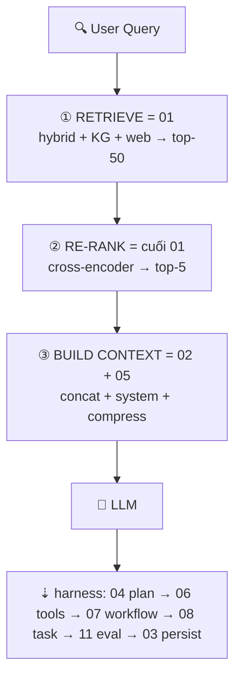

# ARCHITECTURE — Harness (01–15)

> Kiến trúc tổng của cụm `vi/harness/`. Tài liệu gốc tiếng Anh mirror ở `en/harness/`.
>
> * `README.md` — bản đồ: mỗi folder nằm ở đâu trong harness thật.
> * `ARCHITECTURE.md` (file này) — thiết kế tổng: phân tầng, luồng dữ liệu, contract, phụ thuộc, cách build/debug.
> * `../HARNESS_ENGINEERING.md` — lý thuyết đầy đủ: 7 components, SOLID, 10 commandments, case studies.

## 1. Harness là gì

Harness là **mọi thứ xung quanh LLM** biến một lần gọi đơn lẻ
`prompt → completion` thành hệ thống đáng tin cậy `request → verified outcome`.

Hai vòng lặp phân biệt rõ chủ sở hữu:

* **Inner loop** (harness runtime sở hữu, ví dụ Claude Code / opencode):
  `LLM → tool_call → observation → LLM → … → stop`.
* **Outer loop** (bạn sở hữu, loop engineer):
  `plan → execute → validate → fix → persist → evaluate`.

```
┌──────────────────────── VÒNG ĐỜI HARNESS THẬT ───────────────────────────────┐
│  User request                                                                │
│      ▼                                                                       │
│  ┌────────┐  ┌────────┐  ┌────────┐  ┌────────┐  ┌────────┐  ┌────────┐        │
│  │01 Retri│─▶│02 Build│─▶│04 Plan │─▶│05 Promp│─▶│06 Tools│─▶│ LLM    │        │
│  │eve     │  │Context │  │Decompo │  │Builder │  │Decide  │  │ call   │        │
│  └────────┘  └────────┘  └────────┘  └────────┘  └────────┘  └────┬───┘        │
│       ▲                                                        │              │
│       │                                                   tool outputs        │
│       │                                                        │              │
│       │         ┌────────┐  ┌────────┐  ┌────────┐  ┌────────▼───┐            │
│       │         │03 Updat│◀─│11 Evalu│◀─│07 Workf│◀─│08 Task     │            │
│       │         │e Memory│  │ate     │  │low     │  │Execute    │            │
│       │         └────────┘  └────────┘  └────────┘  └────────────┘            │
│       │              ▲            ▲            │                              │
│       │              │            │            ▼                              │
│       │         ┌────┴────────────┴─────┐  ┌────────┐  ┌────────┐             │
│       └─────────│09 Multi-Agent (mở    │  │10 Autom│  │Guardrai│             │
│                 │   rộng khi cần)      │  │ation   │  │ls+Perms│             │
│                 └──────────────────────┘  └────────┘  │ (mọi   │             │
│                                                       │ bước)  │             │
│                                                       └────────┘             │
└──────────────────────────────────────────────────────────────────────────────┘
```

## 2. Phân tầng: 7 components → 15 modules

Harness có 7 thành phần logic, chia thành 11 modules stage + 4 modules cross-cutting
để mỗi phần học và test độc lập.

| # | Thư mục | Component | Input → Output | Đọc khi nào |
|---|---|---|---|---|
| 01 | `01-retrieve-memory-knowledge/` | Memory (đọc) | query → ranked chunks (score) | Cần tìm thông tin: vector + BM25 hybrid, RRF fusion, rerank, GraphRAG |
| 02 | `02-build-context/` | Context | chunks + goal + history + files → `BuiltContext` trong token budget | Window, compression, routing, caching, hierarchy 5 tầng |
| 03 | `03-update-memory-store/` | Memory (ghi) | run result → versioned facts/patterns | Write-back, consolidation/dedupe, KB CRUD, event sourcing |
| 04 | `04-plan-decompose-task/` | Orchestration (plan) | goal → DAG `TaskNode` | Decomposition, Plan-and-Solve, ToT, ReWOO, ReAct, replanning |
| 05 | `05-prompt-builder/` | Guardrails (nắn input) | `BuiltContext` + template → prompt cuối | Template registry, few-shot, CoT, schema, chống injection |
| 06 | `06-decide-tools-mcp/` | Tools + Permissions | intent → tool call được duyệt → observation | Registry, intent classifier, MCP client, RBAC, executor (timeout/retry) |
| 07 | `07-workflow/` | Orchestration (run) | DAG → kết quả có bù lỗi | Sequential/parallel/DAG/HSM, saga, circuit breaker, tracing |
| 08 | `08-task/` | Orchestration (đơn vị việc) | định nghĩa 1 unit track được | Lifecycle, DAG deps, priority, budget, timeout/cancel. Mỏng nhất — lạc thì bắt đầu ở đây |
| 09 | `09-multi-agent/` | Orchestration (scale-out) | 1 task → N agents phối hợp | Roles, message protocol, shared memory. Chỉ khi 04+07 quá tải. Chi tiết sub-agent: `09-multi-agent/SUBAGENT.md` |
| 10 | `10-automation/` | Feedback (định kỳ) | lịch/event → run tự động | CI/CD, scheduler, code-gen, test automation, self-healing có guard cost |
| 11 | `11-evaluation/` | Feedback (đo) | run → pass/fail + metrics | Rubric, quality metrics, benchmark, LLM-judge, regression |
| 12 | `12-sandbox-execution/` | Cross-cutting: thực thi | untrusted code → kết quả cách ly | Threat model, blast radius, tiers: language → container → syscall filter |
| 13 | `13-trajectory-observability/` | Cross-cutting: quan sát | mọi bước → `TrajectoryEvent` stream | Event contract, session stream, fork/replay/resume, join keys |
| 14 | `14-compaction-context/` | Cross-cutting: context | context dài → context gọn còn đúng | Trigger 70% (không đợi 90%), pin set, summarization vs pruning, prompt compaction-safe |
| 15 | `15-approval-gates/` | Cross-cutting: kiểm soát | op rủi ro → human decision | Risk tier, gate payload, timeout-deny, pause/resume, audit |

Guardrails + Permissions **không phải stage** — bọc mọi mũi tên
(check input, approve tool, validate output).

## 3. Luồng end-to-end của một request

Ví dụ *"Fix login bug"*:

1. **Retrieve (01).** Embed query, hybrid-search vector DB + BM25, rerank top-k. Fallback khi rỗng.
2. **Build context (02).** Merge system + goal + chunks + summary + files hiện tại vào budget (vd 100k). Cắt ưu tiên thấp trước. Đánh dấu untrusted content.
3. **Plan (04) → Task graph (08).** Sinh DAG `reproduce → locate → patch → test`, mỗi node có id, input, budget, timeout, cờ approval.
4. **Build prompt (05).** Render từng task từ template có version, gắn few-shot, kèm output schema.
5. **Decide tools (06).** Intent classifier chọn `read_file`, `run_tests`, … Check permission (được ghi ngoài `src/` không?). Op nguy hiểm → pause xin approval (15).
6. **Execute workflow (07).** Chạy DAG: nối tiếp chỗ phụ thuộc, song song chỗ độc lập. Retry backoff, circuit-break khi fail liên tục, saga compensation khi thành công một phần.
7. **Inner tool loop (06 ↔ sandbox 12).** LLM gọi tools, harness chạy cách ly, trả observation. Memoize call trùng, cap size kết quả.
8. **Validate (11).** Syntax check, chạy test, chấm rubric LLM-judge, đo trajectory metrics (steps, tool precision, recovery). Fail → replan hoặc escalate.
9. **Persist (03).** Ghi cái đáng giữ: success pattern, fact mới, file summary (có version). Bỏ noise.
10. **Automate (10) / Scale-out (09) — optional.** Schedule regression hoặc fan-out reviewer/tester agents qua shared memory.

### 3.1. RAG nằm ở đầu lifecycle



RAG **không chạy một lần** — chạy lại mỗi task / mỗi vòng inner-loop khi query đổi
(replan ở `04` → retrieve lại ở `01`). Chỉ có RAG thì được chatbot một lần;
muốn agent end-to-end cần phần còn lại.

## 4. Ba contract dùng chung

Nếu 11 modules không share gì khác, hãy share 3 shapes này:

```typescript
// A. Trajectory event — source of truth duy nhất để debug (13 sản xuất, mọi module phát ra)
interface TrajectoryEvent {
  id: string;            // evt_01H…
  sessionId: string;
  parentTaskId?: string; // link tới 08-task
  ts: number;
  kind: "prompt" | "tool_call" | "tool_result" | "plan" | "eval" | "memory_write" | "approval";
  payload: unknown;
  tokens?: { in: number; out: number };
  latencyMs?: number;
}

// B. Context object — 02 build, 05 render
interface BuiltContext {
  system: string;        // identity, rules (không bao giờ cắt)
  goal: string;          // task hiện tại + definition of done
  retrieved: Chunk[];    // từ 01, kèm score
  history: string;       // summary đã nén, không phải raw log
  immediate: FileSnap[]; // files đang mở, diffs
  budget: { limit: number; used: number };
}

// C. Task node — 04 tạo, 07 chạy, 08 track
interface TaskNode {
  id: string;
  title: string;
  status: "pending" | "running" | "blocked" | "done" | "failed";
  idempotencyKey: string; // retry an toàn
  needsApproval: boolean;
  budget: { maxSteps: number; maxTokens: number; timeoutMs: number };
  deps: string[];
}
```

## 5. Mặt phẳng kiểm soát 12–15 (bọc mọi stage)

| Module | Câu hỏi | Cơ chế chính |
|---|---|---|
| 12 Sandbox | Code không tin cậy chạy ở đâu? | Tầng cách ly + 5 controls bắt buộc + ma trận theo role. Mọi `tool_call` ở 06 đều đi qua đây |
| 13 Trajectory | Ghi lại run thế nào để replay/audit? | Event contract + session stream (ghi bền vững + tail trực tiếp) + fork/replay/resume. Engine mẫu ở `03-update-memory-store/trajectory-fork-replay.md` |
| 14 Compaction | Run dài sống qua trần token thế nào? | Trigger 70% (không đợi 90%), pin set (system/goal không cắt), pruning + summarization, prompt compaction-safe |
| 15 Approval | Ai duyệt hành động không đảo ngược? | Risk tier gắn lúc plan (04), gate payload cho human, timeout-deny, pause/resume, audit trail |

## 6. Đọc, build, debug

* **Mới học:** `08 → 07 → 02 → 06 → 01 → 03 → 04 → 05 → 11 → 10 → 09`, rồi `12 → 13 → 14 → 15`.
* **Harness minimal:** `02 + 05 + 06 + 07 + 11` là đủ. Thêm `01/03` khi cần memory, `04/08` khi task phức tạp, `09/10` cuối cùng.
* **Debug run dở:** trajectory (`03/trajectory-fork-replay.md`) → `02` (sai context?) → `06` (sai tool?) → `11` (sai rubric?).

## 7. Docs đi kèm trong cụm này

| File | Thêm gì ngoài README module |
|---|---|
| `03-update-memory-store/trajectory-fork-replay.md` | Engine session event stream, fork/replay/resume |
| `06-decide-tools-mcp/code-mode-sdk.md` | Pattern code-mode vs JSON tool-call + sandbox sketch |
| `07-workflow/cordis-kernel-plugin.md` | Micro-kernel + plugin lifecycle, 4 runtime modes |
| `09-multi-agent/SUBAGENT.md` | Spec sub-agent: lifecycle, spawn API, permission thu hẹp, budget, gộp kết quả |
| `11-evaluation/minimal-benchmark-harness.md` | Harness isolation minimal để eval không bias |

## 8. Gap đã biết

Cross-cutting cũ đã có nhà (`12–15`). Còn lại chưa module nào sở hữu:
pipeline scrub PII/secret, tenant isolation, SLO cost-per-task.
Gap từng module nằm trong mục bổ sung của mỗi README.
