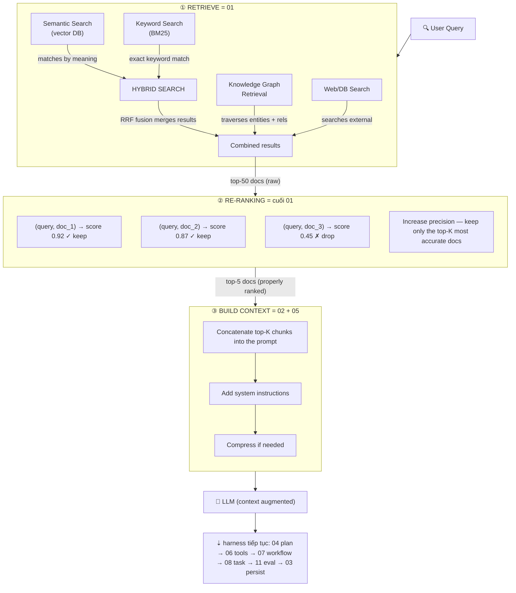

# Kiến Trúc Harness — Toàn Cảnh (01–15)

> Mỗi folder nằm ở đâu trong một harness thật? File README này là bản đồ.
> Lý thuyết đầy đủ ở `../HARNESS_ENGINEERING.md`; implementation ở `01/`–`15/`.
> Modules `01–11` là các stage pipeline; `12–15` là modules cross-cutting bọc mọi stage.

## 1. Harness Là Gì, Trong Một Sơ Đồ

Harness là **mọi thứ xung quanh LLM** biến một lần gọi đơn lẻ
`prompt → completion` thành một hệ thống đáng tin cậy
`request → verified outcome`.

```
┌──────────────────────── VÒNG ĐỜI HARNESS THẬT ───────────────────────────────┐
│                                                                              │
│  User request                                                                │
│      │                                                                       │
│      ▼                                                                       │
│  ┌────────┐  ┌────────┐  ┌────────┐  ┌────────┐  ┌────────┐  ┌────────┐        │
│  │01 Retri│─▶│02 Build│─▶│04 Plan │─▶│05 Promp│─▶│06 Tools│─▶│ LLM    │        │
│  │eve     │  │Context │  │Decompo │  │Builder │  │Decide  │  │ call   │        │
│  └────────┘  └────────┘  └────────┘  └────────┘  └────────┘  └────┬───┘        │
│       ▲                                                        │              │
│       │                                                   tool outputs        │
│       │                                                        │              │
│       │         ┌────────┐  ┌────────┐  ┌────────┐  ┌────────▼───┐            │
│       │         │03 Updat│◀─│11 Evalu│◀─│07 Workf│◀─│08 Task     │            │
│       │         │e Memory│  │ate     │  │low     │  │Execute    │            │
│       │         └────────┘  └────────┘  └────────┘  └────────────┘            │
│       │              ▲            ▲            │                              │
│       │              │            │            ▼                              │
│       │         ┌────┴────────────┴─────┐  ┌────────┐  ┌────────┐             │
│       └─────────│09 Multi-Agent (mở    │  │10 Autom│  │Guardrai│             │
│                 │   rộng khi cần)      │  │ation   │  │ls+Perms│             │
│                 └──────────────────────┘  └────────┘  │ (mọi   │             │
│                                                       │ bước)  │             │
│                                                       └────────┘             │
└──────────────────────────────────────────────────────────────────────────────┘
```

Inner loop (harness runtime sở hữu, ví dụ Claude Code / opencode):
`LLM → tool_call → observation → LLM → … → stop`.
Outer loop (bạn sở hữu, loop engineer):
`plan → execute → validate → fix → persist → evaluate`.

## 2. Map 7 Components → 15 Modules

Harness có 7 thành phần logic. Repo này chia thành 11 modules stage hands-on
cộng 4 modules cross-cutting để mỗi phần học và test độc lập được.

| # | Thư mục module | Component harness | Trả lời câu hỏi |
|---|----------------|-------------------|-----------------|
| 01 | `01-retrieve-memory-knowledge/` | Memory (đọc) | Agent nhớ gì cho relevant? Embedding, chunking, hybrid vector + BM25, rerank, các biến thể RAG. |
| 02 | `02-build-context/` | Context management | Nhồi gì vào token window, thứ tự nào, budget nào? Hierarchy 5 tầng, compression, routing, caching. |
| 03 | `03-update-memory-store/` | Memory (ghi) | Giữ lại gì sau task? Write-back, consolidation, versioning, audit. Đọc kèm: `trajectory-fork-replay.md`. |
| 04 | `04-plan-decompose-task/` | Orchestration (plan) | Chia mục tiêu lớn thành bước nhỏ verify được thế nào? Decomposition patterns, ReAct/ReWOO/ToT, replanning. |
| 05 | `05-prompt-builder/` | Guardrails (nắn input) | Ghép prompt cuối an toàn thế nào? Template, few-shot, CoT, schema enforcement, chống injection. |
| 06 | `06-decide-tools-mcp/` | Tools + Permissions | Agent được làm gì, qua tool nào? Registry, intent classification, MCP client, RBAC, sandbox. Đọc kèm: `code-mode-sdk.md`. |
| 07 | `07-workflow/` | Orchestration (run) | Bước chạy thứ tự nào, retry, bù lỗi ra sao? Sequential/parallel/DAG/HSM, saga, circuit breaker, tracing. Đọc kèm: `cordis-kernel-plugin.md`. |
| 08 | `08-task/` | Orchestration (đơn vị việc) | Một đơn vị track được là gì? Lifecycle, DAG deps, priority, budget, timeout/cancel. Module mỏng nhất — nếu lạc thì bắt đầu ở đây. |
| 09 | `09-multi-agent/` | Orchestration (scale-out) | Khi nào 1 agent thành 1 team? Role, protocol, shared memory, conflict resolution. Chỉ cần khi 04+07 quá tải. |
| 10 | `10-automation/` | Feedback (chạy định kỳ) | Cái gì chạy mà không cần human hỏi? CI/CD, scheduler, self-healing loop có guard iteration/cost. |
| 11 | `11-evaluation/` | Feedback (đo lường) | Có thực sự work không? Rubric, trajectory metrics, LLM-judge, regression, benchmark. Đọc kèm: `minimal-benchmark-harness.md`. |
| 12 | `12-sandbox-execution/` | **Cross-cutting: thực thi** | Code không tin cậy chạy ở đâu? Tầng cách ly, 5 controls bắt buộc, ma trận theo role. Nhà chính của khái niệm sandbox. |
| 13 | `13-trajectory-observability/` | **Cross-cutting: quan sát** | Mọi run ghi lại thế nào? Event contract, session stream, fork/replay/resume, join key. Bản đồ tới `03/.../trajectory-fork-replay.md` (engine). |
| 14 | `14-compaction-context/` | **Cross-cutting: context** | Run dài sống sót qua trần token thế nào? Policy 70%, pruning, contract memory, prompt compaction-safe. |
| 15 | `15-approval-gates/` | **Cross-cutting: kiểm soát** | Ai duyệt hành động không đảo ngược? Risk tier, gate payload, timeout-deny, pause/resume, audit. |

Guardrails + Permissions **không phải một stage** — chúng bọc mọi mũi tên
trong sơ đồ trên (check input, approve tool, validate output).

## 3. Lifecycle Của Một Request, End to End

Ví dụ request coding *"Fix login bug"*:

1. **Retrieve (01).** Embed query, hybrid-search vector DB + BM25,
   rerank top-k. Output: chunks có score. Có fallback khi rỗng.
2. **Build context (02).** Merge system instructions + task goal + chunks
   retrieved + conversation summary + files hiện tại vào token budget
   (ví dụ 100k). Cắt phần ưu tiên thấp trước. Đánh dấu untrusted content.
3. **Plan (04) → Task graph (08).** Sinh DAG task:
   `reproduce → locate → patch → test`. Mỗi task có id, input, budget,
   timeout, cờ approval.
4. **Build prompt (05).** Render prompt từng task từ template có version,
   gắn few-shot examples, kèm output schema.
5. **Decide tools (06).** Intent classifier chọn tools
   (`read_file`, `run_tests`, …). Check permission: task này có được ghi
   ngoài `src/` không? Op nguy hiểm → pause xin approval.
6. **Execute workflow (07).** Chạy DAG. Nối tiếp chỗ phụ thuộc, song song
   chỗ độc lập. Retry backoff, circuit-break khi fail liên tục, saga
   compensation khi thành công một phần.
7. **Inner tool loop.** LLM gọi tools, harness chạy trong sandbox, trả
   observation. Memoize call giống nhau, cap size kết quả.
8. **Validate (11).** Check syntax, chạy test, chấm rubric LLM-judge,
   đo trajectory metrics (số step, tool precision, recovery). Fail → replan
   hoặc escalate.
9. **Persist (03).** Ghi lại cái đáng giữ: success pattern, fact mới,
   summary file. Có version. Bỏ noise ephemeral.
10. **Automate (10) / Scale out (09) — optional.** Schedule regression, hoặc
    fan-out cho reviewer/tester agents dùng shared memory.

Mỗi bước phát ra **trajectory events** (xem §4), nên một run replay, fork,
audit lại được (`03-update-memory-store/trajectory-fork-replay.md`).

### 3.1. RAG Pipeline Nằm Ở Đâu

RAG pipeline kinh điển (retrieve → re-rank → build context → LLM) chính là
**phần đầu của lifecycle** — nó kết thúc ở lần gọi LLM đầu tiên, harness
tiếp tục từ đó:



| Stage RAG | Module harness | Ghi chú |
|-----------|----------------|---------|
| ① Retrieve (hybrid + KG + web, top-50) | `01-retrieve-memory-knowledge` | Embedding, chunking, hybrid + RRF fusion, biến thể GraphRAG, nguồn external |
| ② Re-ranking (cross-encoder, top-5) | Cuối `01` (đầu vào `02`) | Chỉ lọc precision — chưa có gì vào prompt |
| ③ Build context (concat + system + compress) | `02-build-context` (+ `05-prompt-builder` render) | Merge system/goal/chunks/history/immediate vào token budget, đánh dấu untrusted content |
| 🧠 LLM | Inner tool loop (`06` → `07` → `08`) | RAG kết thúc ở đây; vòng harness (plan → execute → validate → persist) tiếp quản |

Điểm mấu chốt: RAG **không chạy một lần**. Nó chạy lại mỗi task / mỗi vòng
inner-loop khi query đổi (replan ở `04` → retrieve lại ở `01`). Chỉ có RAG
thì được chatbot trả lời tốt một lần; muốn agent làm end-to-end thì cần phần
còn lại của lifecycle.

## 4. Ba Contract Dùng Chung

Nếu 11 modules không share gì khác, hãy share 3 shapes này:

**A. Trajectory event** — source of truth duy nhất để debug:

```typescript
interface TrajectoryEvent {
  id: string;            // evt_01H…
  sessionId: string;
  parentTaskId?: string; // link tới 08-task
  ts: number;
  kind: "prompt" | "tool_call" | "tool_result" | "plan" | "eval" | "memory_write" | "approval";
  payload: unknown;
  tokens?: { in: number; out: number };
  latencyMs?: number;
}
```

**B. Context object** — 02 build, 05 render:

```typescript
interface BuiltContext {
  system: string;        // identity, rules (không bao giờ cắt)
  goal: string;          // task hiện tại + definition of done
  retrieved: Chunk[];    // từ 01, kèm score
  history: string;       // summary đã nén, không phải raw log
  immediate: FileSnap[]; // files đang mở, diffs
  budget: { limit: number; used: number };
}
```

**C. Task node** — 04 tạo, 07 chạy, 08 track:

```typescript
interface TaskNode {
  id: string;
  title: string;
  status: "pending" | "running" | "blocked" | "done" | "failed";
  idempotencyKey: string; // retry an toàn
  needsApproval: boolean;
  budget: { maxSteps: number; maxTokens: number; timeoutMs: number };
  deps: string[];
}
```

## 5. Đọc Thư Mục Này Thế Nào

- **Mới học harness?** Đọc theo thứ tự: `08` → `07` → `02` → `06` →
  `01` → `03` → `04` → `05` → `11` → `10` → `09`, rồi cross-cutting:
  `12` → `13` → `14` → `15`.
- **Build harness minimal?** `02 + 05 + 06 + 07 + 11` là đủ.
  Thêm `01/03` khi cần memory, `04/08` khi task phức tạp, `09/10` cuối cùng.
- **Debug run dở?** Bắt đầu từ trajectory (`03/trajectory-fork-replay.md`),
  rồi check `02` (sai context?), `06` (sai tool?), `11` (sai rubric?).

## 6. Docs Đi Kèm

| File | Thêm gì ngoài README của module |
|------|----------------------------------|
| `03-update-memory-store/trajectory-fork-replay.md` | Session event stream, implementation fork/replay/resume |
| `06-decide-tools-mcp/code-mode-sdk.md` | Pattern Code-mode vs JSON tool-call + sandbox sketch |
| `07-workflow/cordis-kernel-plugin.md` | Micro-kernel + plugin lifecycle, 4 runtime modes |
| `11-evaluation/minimal-benchmark-harness.md` | Harness isolation minimal để eval capability không bias |
| `../HARNESS_ENGINEERING.md` | Lý thuyết đầy đủ: 7 components, SOLID, 10 commandments, case studies (SWE-agent, Anthropic, Claude Code leak, Cursor, DeepSeek) |

## 7. Gap Đã Biết (Welcome Contributions)

Các gap cross-cutting trước đây giờ đã có nhà: sandbox → `12`, trajectory → `13`,
compaction → `14`, approval → `15`. Còn lại chưa module nào sở hữu: pipeline
scrub PII/secret, tenant isolation, SLO cost-per-task. Gap từng module nằm trong
mục bổ sung của mỗi README.
