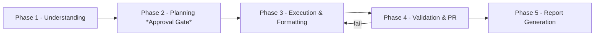

# .agents — AI-Assisted Engineering Framework

This directory contains the **workspace instruction framework** for the Horizon 2 UI (Angular 15) repository. It defines how GitHub Copilot (and other AI coding agents) must behave when handling developer requests.

## Directory Layout

| Path | Purpose |
| :--- | :--- |
| `copilot-instructions.md` | Entry point. Describes the 5-phase workflow, strict-mode contract, and hook reminders. |
| `agents/` | Copilot Agent definitions (e.g., `strict-rules.agent.md`). |
| `hooks/` | Phase-based hooks that must run in order (Understanding → Planning → Execution → Validation/PR → Report). `session.json` maps hooks to lifecycle events. |
| `knowledge/` | Repository-wide technical guidance (`core-engineering-guidelines.md` — Angular 15, SCSS, imports, security). |
| `skills/` | Workflow-specific instructions (Bug Fix, Feature Delivery, Refactor, Unit Test, Code Review, Jira Ticket Review) + cross-cutting hooks (Post Code Change, Pre PR, Report Generation, Angular Architecture, Styling Standards). |
| `report-templates/` | Markdown templates for all report types. |
| `reports/` | Generated report artifacts (`*.ctx.md`) — also used as context input for future tasks. |
| `workflows/` | CI workflows that enforce Phase 4 (lint/test/build) automatically on pull requests. |
| `scripts/` | Maintenance scripts (e.g., link validation for the framework itself). |
| `PULL_REQUEST_TEMPLATE.md` | Native GitHub PR template mirroring `report-templates/pull-request.md`. |
| `ISSUE_TEMPLATE/` | Native GitHub issue templates (bug report + feature request). |
| `dependabot.yml` | Automated dependency updates. |

## The 5-Phase Workflow

1. **Phase 1 — Understanding**: Load workflow skills, repository guidelines, and relevant report context.
2. **Phase 2 — Planning**: Present a draft plan and wait for developer approval (mandatory for non-trivial tasks).
3. **Phase 3 — Execution & Formatting**: Implement in focused increments, update tests, run `npm run lint` + `npm run format`.
4. **Phase 4 — Validation & PR**: Run `npm run build` + `npm run test`, review diffs, prepare PR with `SP0168-<ticket>: 
` commits.
5. **Phase 5 — Report Generation**: Save a `*.ctx.md` report to `reports/` — no task is complete without this artifact.

## Strict vs. Non-Strict Runs

- **Strict Mode (default)**: Execute all 5 hooks in order, load report context, enforce the planning gate, and always produce a report artifact.
- **Non-Strict Mode**: For trivial/no-code queries, report loading may be skipped; otherwise fall back to strict behavior.

## Validation & Maintenance

- Run `scripts/validate-links.sh` to verify every file path referenced across this framework still exists (prevents broken links like typos in `.agents/...` paths).
- Reports in `reports/` older than 30 days should be archived/deleted to keep the directory clean (git history preserves them).

## Adding a New Workflow

1. Create `skills/<workflow>/SKILL.md` following the `name`/`description` frontmatter convention.
2. Register it in the "Resource Mapping by Workflow" table in `hooks/phase-3-execution-formatting.hook.md`.
3. Add its report template under `report-templates/` and map it in `skills/report-generation/SKILL.md` + `hooks/phase-5-report-generation.hook.md`.