# Workspace Custom Instructions: Horizon 2 UI

---

**Priority — Read .github first**

When handling developer requests, Copilot must first read all files inside the `.github/` directory and choosing the right hooks that need to be made, strictly adhering to ## Automated Check Hook Reminders before making changes. Loading these files upfront ensures repository-wide rules, workflow mappings, and hooks are applied.

Copilot must load and apply that all of documents before implementing any code changes.

DO NOT SKIP any of the following files in `.github/hooks/`:

---

## Developer Workflow Orchestration 

This section is mandatory. Before making code changes, GitHub Copilot must follow these workflow phases in order and must not skip the planning/review step.

GitHub Copilot acts as a guide to assist the developer through these sequential phases when delivering changes:

```mermaid
flowchart TD
    Request[Developer Request]
    Decision{Request Type}

    Request --> Decision

    Decision -->|Jira Ticket Review| JiraReviewWF[Jira Review Workflow]
    Decision -->|Feature Delivery| FeatureWF[Feature Delivery Workflow]
    Decision -->|Bug Fix| BugFixWF[Bug Fix Workflow]
    Decision -->|Refactor| RefactorWF[Refactor Workflow]
    Decision -->|Unit Test| UnitTestWF[Unit Test Workflow]
    Decision -->|Code Review| CodeReviewWF[Code Review Workflow]

    subgraph Phase1["Phase 1 - Understanding (MCP w/ Fallback)"]
        LoadGuidelines[Load Guidelines & Core Rules]
        CheckJira{Jira MCP Available?}
        LoadJira[Fetch Jira Ticket via MCP]
        AskJira[Ask Dev for Ticket Summary]
        CheckFigma{Figma MCP Available?}
        LoadFigma[Fetch Figma Design via MCP]
        AskFigma[Ask Dev for Design Spec / Screenshot]
        LoadReportContext[Load Relevant Report Context]
        Investigation[Investigation]
        ApplyRules[Apply Stack Rules]

        LoadGuidelines --> CheckJira
        CheckJira -->|Yes| LoadJira
        CheckJira -->|No| AskJira
        LoadJira --> CheckFigma
        AskJira --> CheckFigma
        CheckFigma -->|Yes| LoadFigma
        CheckFigma -->|No| AskFigma
        LoadFigma --> LoadReportContext
        AskFigma --> LoadReportContext
        LoadReportContext --> Investigation
        Investigation --> ApplyRules
    end

    JiraReviewWF --> LoadGuidelines
    FeatureWF --> LoadGuidelines
    BugFixWF --> LoadGuidelines
    RefactorWF --> LoadGuidelines
    UnitTestWF --> LoadGuidelines
    CodeReviewWF --> LoadGuidelines

    subgraph Phase2["Phase 2 - Planning"]
        Plan[Draft Technical Design / Plan]
        Approval{Developer Approval Gate*}
        Refine[Refine Plan]

        Plan --> Approval
        Approval -->|Rejected| Refine
        Refine --> Plan
    end

    ApplyRules --> Plan

    subgraph Phase3["Phase 3 - Execution & Formatting"]
        TaskList[Create Task List]
        ExecuteTasks[Implement Code Changes]
        CheckFigmaV{Figma MCP Available?}
        VerifyDesign[Verify UI Against Figma Specs]
        ManualVerify[Verify UI Manually vs Design]
        WriteTests[Write/Update Unit Tests]
        FormatCode[Run npm run lint & format]

        TaskList --> ExecuteTasks
        ExecuteTasks --> CheckFigmaV
        CheckFigmaV -->|Yes| VerifyDesign
        CheckFigmaV -->|No| ManualVerify
        VerifyDesign --> WriteTests
        ManualVerify --> WriteTests
        WriteTests --> FormatCode
    end

    Approval -->|Approved| TaskList

    subgraph Phase4["Phase 4 - Validation & PR (AC + Build + Tests + Bitbucket w/ Fallback)"]
        CompileCheck[Run npm run build]
        TestCheck[Run npm run test]
        ACCheck[Verify Acceptance Criteria vs Jira Ticket]
        ValidationGate{Build OK & Tests OK & AC Met?}
        CheckBB{Bitbucket MCP Available?}
        CreateBranch[Create Bitbucket Branch]
        BitbucketPR[Create Bitbucket PR via MCP]
        PreparePR[Prepare PR Description Manually]
        DevCreatePR[Developer Creates PR in Bitbucket]
        Reviewer[Review Code Diffs]

        FormatCode --> CompileCheck
        CompileCheck --> TestCheck
        TestCheck --> ACCheck
        ACCheck --> ValidationGate
        ValidationGate -->|No| TaskList
        ValidationGate -->|Yes| CheckBB
        CheckBB -->|Yes| CreateBranch
        CheckBB -->|No| PreparePR
        CreateBranch --> BitbucketPR
        PreparePR --> DevCreatePR
        BitbucketPR --> Reviewer
        DevCreatePR --> Reviewer
    end

    subgraph Phase5["Phase 5 - Report Generation & Jira Sync (w/ Fallback)"]
        GenerateReport[Generate Final Report]
        ArchiveReport[Archive & Publish Report]
        CheckJiraS{Jira MCP Available?}
        SyncJira[Sync Jira: Status + Comment + PR Link]
        ManualJira[Provide Manual Jira Update Steps]

        GenerateReport --> ArchiveReport
        ArchiveReport --> CheckJiraS
        CheckJiraS -->|Yes| SyncJira
        CheckJiraS -->|No| ManualJira
    end

    Reviewer --> GenerateReport
```

> **Notes:**
> - `*` **Approval Gate** is mandatory for **non-trivial tasks** (multiple files, behavior changes, or significant implementation work). For trivial/no-code queries, Copilot presents the draft plan and may proceed without an explicit pause.
> - **Reviewer** (Review Code Diffs) runs for **all** workflows during Phase 4 before PR submission — not only for the Code Review workflow. It is an in-place check gate, not a separate pass.
> - **Jira Ticket Review**: if the review result is analysis-only (no code change), the workflow concludes after Phase 2 with a report (skip Phase 3-5 Jira sync).
> - **Phase 4 Validation Gate requires all three**: Build passes, Tests pass, AND all Jira ticket Acceptance Criteria are explicitly met (each AC traced to implementation/tests). Build+Test green alone is NOT sufficient to proceed.

### MCP Availability & Degradation Mode

Every MCP integration has an explicit `Available?` decision with a fallback. **No task ever blocks on a missing MCP connection.** The workflow degrades gracefully:

| Mode | Jira | Figma | Bitbucket | Behavior |
| :--- | :--- | :--- | :--- | :--- |
| **Full** | ✅ | ✅ | ✅ | Hoàn toàn tự động: fetch ticket + design, tạo PR, sync Jira |
| **Partial A** | ❌ | ✅ | ✅ | Hỏi dev paste ticket summary (AC, description) → phần còn lại tự động |
| **Partial B** | ✅ | ❌ | ✅ | Hỏi dev paste design/screenshot → Phase 3 verify thủ công bằng mắt |
| **Partial C** | ✅ | ✅ | ❌ | Chuẩn bị PR description sẵn → dev tự tạo PR trên Bitbucket |
| **Manual** | ❌ | ❌ | ❌ | Chạy như workflow gốc (pre-MCP): developer cung cấp toàn bộ context, Copilot hoàn thành 5 phases với thông tin thủ công |

**Quy tắc chung:**
1. Khi MCP không kết nối được, hỏi developer **một lần** để cung cấp phần thay thế (ticket summary / design spec / tạo PR). Không hỏi lặp lại.
2. Ghi rõ trong report: `MCP Status` — server nào dùng được, server nào fallback thủ công, lý do.
3. Fallback **không làm thay đổi thứ tự 5 phases** — chỉ thay đổi nguồn context và cách thực thi PR creation.
4. Khi Jira không kết nối được, Acceptance Criteria lấy từ dev-provided ticket summary; Phase 4 vẫn phải trace từng AC đến implementation/tests.

---

## Automated Check Hook Reminders

- **Workflow Orchestration Hooks**: Execute phase hooks in order from `.github/hooks/`:

[Priority] Strictly apply all that is mentioned in these hooks before making any code changes. The hooks are:

    1. `.github/hooks/phase-1-understanding.hook.md`
    2. `.github/hooks/phase-2-planning.hook.md`
    3. `.github/hooks/phase-3-execution-formatting.hook.md`
    4. `.github/hooks/phase-4-validation-pr.hook.md`
    5. `.github/hooks/phase-5-report-generation.hook.md`
- **Hook Index**: See `.github/hooks/README.md` for mapping and execution guidance.

- **After Code Modifications**: Remind the developer to check formatting, linting, and generate reports via [.github/skills/post-code-change/SKILL.md](./skills/post-code-change/SKILL.md).
- **Report Generation**: For all workflow types, follow [.github/skills/report-generation/SKILL.md](./skills/report-generation/SKILL.md) to generate structured reports saved to `.github/reports/`.
- **Before Committing & Pushing**: Remind the developer to execute compilation tests, run unit tests, finalize reports, and prepare branch info via [.github/skills/pre-pull-request/SKILL.md](./skills/pre-pull-request/SKILL.md).

---

## Strict Hook Mode (Always-On)

For every developer task, Copilot must:

1. Confirm strict mode is active.
2. Execute all 5 phase hooks in order; the Phase 2 approval gate is mandatory for non-trivial tasks, while trivial/no-code queries may proceed after presenting the draft plan.
3. Before planning, read the latest relevant report from `.github/reports/` (prefer matching ticket/component `*.ctx.md`) and carry forward open items/evidence.
4. Check MCP availability; use MCP context (Jira ticket / Figma design) when available, otherwise request the developer to provide the equivalent context manually. Never block on a missing server.
5. Provide a pre-implementation checklist mapped to each hook file.
6. Provide a final completion checklist mapped to each hook file.
7. Explicitly report planning gate outcome before implementation continues.
8. Phase 4 validation requires **Build OK + Tests OK + Acceptance Criteria Met** (each AC traced to implementation/tests). If any fails, return to Phase 3 for fixes, then re-run Phase 4 until all exit criteria pass.
9. Complete Phase 5 by generating and saving a workflow-aligned report in `.github/reports/` (including `MCP Status` and `Acceptance Criteria Traceability` sections) and syncing the Jira ticket (status + PR link) when Jira MCP is available; otherwise provide manual Jira update steps. No task is considered complete without these artifacts.

## Context Optimization (Non-Strict Runs)

When strict mode is not explicitly required, Copilot may reduce latency/token usage by loading report context selectively:

1. For non-trivial or code-change tasks, load the latest relevant report summary from `.github/reports/` before planning.
2. For trivial/no-code queries, report loading may be skipped.
3. If uncertainty exists about scope or risk, fall back to strict behavior and load the full relevant report context.