# Workspace Custom Instructions: Horizon 2 UI

---

**Priority — Strict 5-phase routing (phase-gated loading)**

Strict mode is the DEFAULT. When handling developer requests, Copilot must route
the workflow type first (Feature / Bug Fix / Refactor / Unit Test / Code Review /
Jira Ticket Review), then execute the phase matrix in `.github/hooks/session.json`
in order — full P1→P5 for code-delivery, P1+P5 for analysis-only.

Load ONLY what the current phase needs per the load index in
`.github/hooks/README.md` (one skill + knowledge + one template at a time).
Strict means no skipped gates — not preloading every file upfront.
Every code change ends with a Phase 5 report (template + stable content-hash +
`REPORTS.md` row + Jira sync or manual steps).

---

## Developer Workflow Orchestration 

This section is mandatory. Before making code changes, GitHub Copilot must follow these workflow phases in order and must not skip the planning/review step.

GitHub Copilot acts as a guide to assist the developer through these sequential phases when delivering changes:

```mermaid
flowchart TD
    Request[Developer Request]
    Decision{Request Type}

    Request --> Decision

    Decision -->|Jira Ticket Review| JiraReviewWF[Jira Review Workflow]
    Decision -->|Feature Delivery| FeatureWF[Feature Delivery Workflow]
    Decision -->|Bug Fix| BugFixWF[Bug Fix Workflow]
    Decision -->|Refactor| RefactorWF[Refactor Workflow]
    Decision -->|Unit Test| UnitTestWF[Unit Test Workflow]
    Decision -->|Code Review| CodeReviewWF[Code Review Workflow]

    subgraph Phase1["Phase 1 - Understanding (MCP w/ Fallback)"]
        LoadGuidelines[Load Guidelines & Core Rules]
        CheckJira{Jira MCP Available?}
        LoadJira[Fetch Jira Ticket via MCP]
        AskJira[Ask Dev for Ticket Summary]
        CheckFigma{Figma MCP Available?}
        LoadFigma[Fetch Figma Design via MCP]
        AskFigma[Ask Dev for Design Spec / Screenshot]
        LoadReportContext[Load Relevant Report Context]
        Investigation[Investigation]
        ContradictionScan[Identify Contradictions & Ambiguities]
        ApplyRules[Apply Stack Rules]

        LoadGuidelines --> CheckJira
        CheckJira -->|Yes| LoadJira
        CheckJira -->|No| AskJira
        LoadJira --> CheckFigma
        AskJira --> CheckFigma
        CheckFigma -->|Yes| LoadFigma
        CheckFigma -->|No| AskFigma
        LoadFigma --> LoadReportContext
        AskFigma --> LoadReportContext
        LoadReportContext --> Investigation
        Investigation --> ContradictionScan
        ContradictionScan --> ApplyRules
    end

    JiraReviewWF --> LoadGuidelines
    FeatureWF --> LoadGuidelines
    BugFixWF --> LoadGuidelines
    RefactorWF --> LoadGuidelines
    UnitTestWF --> LoadGuidelines
    CodeReviewWF --> LoadGuidelines

    ApplyRules --> RoutingCheck{Workflow Type?}
    RoutingCheck -->|Jira Ticket Review / Code Review| Phase5Direct[Proceed to Phase 5 — Analysis-Only]
    RoutingCheck -->|Feature Delivery / Bug Fix / Refactor / Unit Test| ContradictionGate

    subgraph Phase2["Phase 2 - Planning"]
        ContradictionGate{Contradictions Resolved?}
        Clarify[Clarify & Freeze Decisions with Developer]
        Clarified{Developer Clarified?}
        Blocked[Blocked: Waiting for Developer Clarification]
        Plan[Draft Technical Design / Plan]
        Approval{Developer Approval Gate*}
        Refine[Refine Plan]

        ContradictionGate -->|No| Clarify
        Clarify --> Clarified
        Clarified -->|No| Blocked
        Clarified -->|Yes| ContradictionGate
        Blocked --> Clarify
        ContradictionGate -->|Yes| Plan
        Plan --> Approval
        Approval -->|Rejected| Refine
        Refine --> Plan
    end

    subgraph Phase3["Phase 3 - Execution & Formatting"]
        TaskList[Create Task List]
        ExecuteTasks[Implement Code Changes]
        CheckFigmaV{Figma MCP Available?}
        VerifyDesign[Verify UI Against Figma Specs]
        ManualVerify[Verify UI Manually vs Design]
        WriteTests[Write/Update Unit Tests]
        FormatCode[Run npm run lint & format]

        TaskList --> ExecuteTasks
        ExecuteTasks --> CheckFigmaV
        CheckFigmaV -->|Yes| VerifyDesign
        CheckFigmaV -->|No| ManualVerify
        VerifyDesign --> WriteTests
        ManualVerify --> WriteTests
        WriteTests --> FormatCode
    end

    Approval -->|Approved| TaskList

    subgraph Phase4["Phase 4 - Validation & PR (AC + Contradictions + Build + Tests + Bitbucket w/ Fallback)"]
        CompileCheck[Run npm run build]
        TestCheck[Run npm run test]
        ACCheck[Verify Acceptance Criteria vs Jira Ticket]
        ContradictionCheck[Verify Frozen Contradiction Decisions]
        ValidationGate{Build OK & Tests OK & AC Met & Contradictions Applied?}
        CheckBB{Bitbucket MCP Available?}
        CreateBranch[Create Bitbucket Branch]
        BitbucketPR[Create Bitbucket PR via MCP]
        PreparePR[Prepare PR Description Manually]
        DevCreatePR[Developer Creates PR in Bitbucket]
        Reviewer[Review Code Diffs]

        FormatCode --> CompileCheck
        CompileCheck --> TestCheck
        TestCheck --> ACCheck
        ACCheck --> ContradictionCheck
        ContradictionCheck --> ValidationGate
        ValidationGate -->|No| TaskList
        ValidationGate -->|Yes| CheckBB
        CheckBB -->|Yes| CreateBranch
        CheckBB -->|No| PreparePR
        CreateBranch --> BitbucketPR
        PreparePR --> DevCreatePR
        BitbucketPR --> Reviewer
        DevCreatePR --> Reviewer
    end

    subgraph Phase5["Phase 5 - Report Generation & Jira Sync (w/ Fallback)"]
        GenerateReport[Generate Final Report]
        ArchiveReport[Archive & Publish Report]
        CheckJiraS{Jira MCP Available?}
        SyncJira[Sync Jira: Status + Comment + PR Link]
        ManualJira[Provide Manual Jira Update Steps]

        GenerateReport --> ArchiveReport
        ArchiveReport --> CheckJiraS
        CheckJiraS -->|Yes| SyncJira
        CheckJiraS -->|No| ManualJira
    end

    Reviewer --> GenerateReport
    Phase5Direct --> GenerateReport

    %% Visual styling
    classDef analysisOnly fill:#ffe082,stroke:#f57f17,stroke-width:2px
    classDef codeDelivery fill:#c8e6c9,stroke:#2e7d32,stroke-width:2px
    class JiraReviewWF,CodeReviewWF,Phase5Direct analysisOnly
    class FeatureWF,BugFixWF,RefactorWF,UnitTestWF codeDelivery
```

> **Notes:**
> - `*` **Approval Gate** is mandatory for **non-trivial tasks** (multiple files, behavior changes, or significant implementation work). For trivial/no-code queries, Copilot presents the draft plan and may proceed without an explicit pause.
> - **Contradiction Gate** runs before planning: if ticket/design/clarification inputs conflict, Copilot must list the conflicts, obtain developer decisions, and freeze the final interpretation before drafting implementation details.
> - **Analysis-only workflows** (Code Review, Jira Ticket Review): execute only Phase 1 + Phase 5. Skip Phases 2-4 entirely — no planning, no code changes, no build/test gates, no PR creation.
> - **Code-delivery workflows** (Feature Delivery, Bug Fix, Refactor, Unit Test): execute all 5 phases in order with the Phase 2 approval gate mandatory for non-trivial tasks.
> - The routing decision is driven by `session.json` → `workflow_phase_config.workflows.<type>.skip_phases`. An empty list means full 5-phase execution; a non-empty list means analysis-only (P1 + P5 only).
> - **Reviewer** (Review Code Diffs) runs for **all** workflows during Phase 4 before PR submission — not only for the Code Review workflow. It is an in-place check gate, not a separate pass.
> - **Phase 4 Validation Gate requires all four**: Build passes, Tests pass, all Jira ticket Acceptance Criteria are explicitly met, AND frozen contradiction decisions are applied (each item traced to implementation/tests). Build+Test green alone is NOT sufficient to proceed.

### MCP Availability & Degradation Mode

Every MCP integration has an explicit `Available?` decision with a fallback. **No task ever blocks on a missing MCP connection.** The workflow degrades gracefully:

| Mode | Jira | Figma | Bitbucket | Behavior |
| :--- | :--- | :--- | :--- | :--- |
| **Full** | ✅ | ✅ | ✅ | Fully automatic: fetch ticket + design, create PR, sync Jira |
| **Partial A** | ❌ | ✅ | ✅ | Ask dev to paste ticket summary (AC, description) → rest runs automatically |
| **Partial B** | ✅ | ❌ | ✅ | Ask dev to paste design/screenshot → Phase 3 verifies UI manually by eye |
| **Partial C** | ✅ | ✅ | ❌ | Prepare PR description in advance → dev creates PR manually on Bitbucket |
| **Manual** | ❌ | ❌ | ❌ | Run as pre-MCP workflow: developer provides all context, Copilot completes 5 phases with manual info |

**General rules:**
1. When an MCP server is unreachable, ask the developer **once** for the replacement (ticket summary / design spec / PR creation). Do not ask repeatedly.
2. Record in the report under `MCP Status` — which servers were usable, which fell back to manual, and why.
3. Fallback **does not change the 5-phase order** — it only changes the context source and how PR creation is executed.
4. When Jira is unreachable, Acceptance Criteria come from the dev-provided ticket summary; Phase 4 must still trace each AC to implementation/tests.

---

## Strict Mode (Default)

Strict mode is the default for all requests. The agent follows the full ordered
hooks, the Phase 2 approval gate, and the contradiction gate before
implementation begins. The `strict-rules` agent is the default agent.

## Quick Mode (Legacy Opt-In)

Quick mode is NOT the default. It applies only when the developer explicitly
prefixes the request with `quick:` (or invokes the adaptive-rules agent) for
trivial, low-risk work. It may use the leanest valid workflow but must still
respect repo rules, run lint/format, and escalate to strict mode whenever the
task becomes risky, unclear, or cross-cutting.

## Workflow Enforcement Summary

The definitive execution rules live in `.github/hooks/session.json` and `.github/hooks/README.md`. This file is intentionally concise and should not repeat the full policy text.

- **Code-delivery workflows** follow the phase sequence in `.github/hooks/README.md`.
- **Analysis-only review workflows** skip planning/execution/validation and move directly from Phase 1 to Phase 5.
- **Read relevant report context** from `.github/reports/` when it exists, especially for non-trivial or repeated work.
- **Blocking contradictions** must be resolved before implementation continues.
- **After code changes**, apply lint/format and validation, then generate the required report or PR notes when applicable.

The detailed hook references and specialized guidance remain in:

- `.github/hooks/README.md`
- `.github/hooks/phase-1-understanding.hook.md`
- `.github/hooks/phase-2-planning.hook.md`
- `.github/hooks/phase-3-execution-formatting.hook.md`
- `.github/hooks/phase-4-validation-pr.hook.md`
- `.github/hooks/phase-5-report-generation.hook.md`
- `.github/skills/post-code-change/SKILL.md`
- `.github/skills/report-generation/SKILL.md`
- `.github/skills/pre-pull-request/SKILL.md`